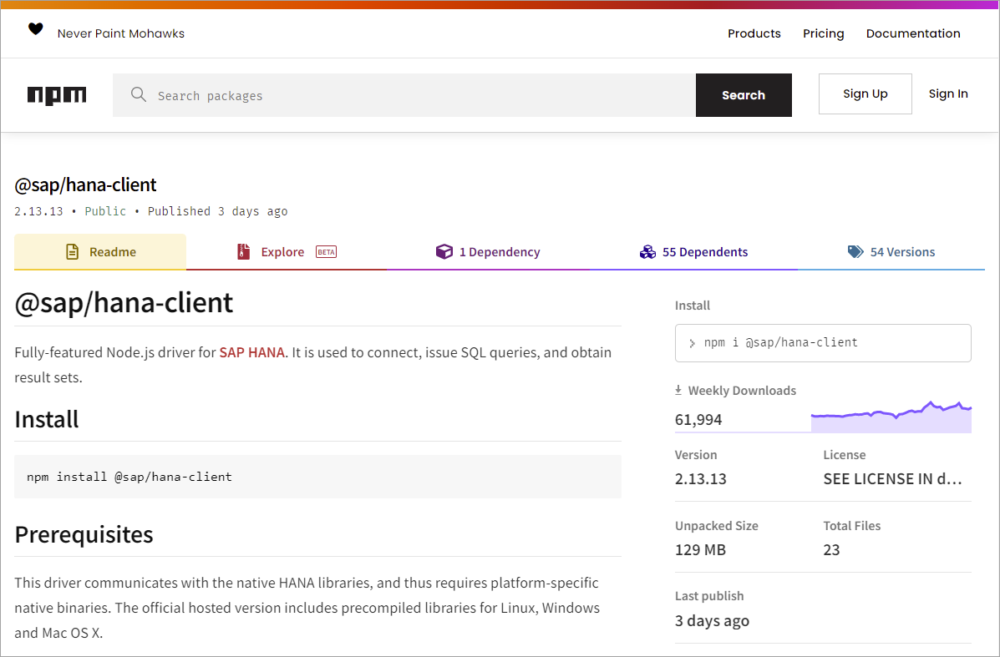
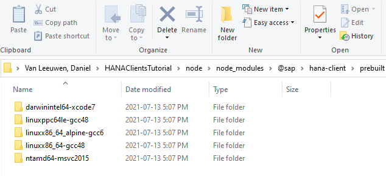
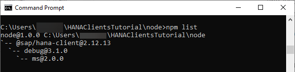
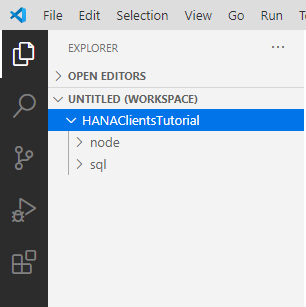

# Connect Using the SAP HANA Node.js Interface
<!-- description --> Create and debug a Node.js application that connects to SAP HANA using the SAP HANA client.

## Prerequisites
 - You have completed the first 3 tutorials in this mission.

## You will learn
  - How to install Node.js and the SAP HANA client Node.js driver
  - How to create a Node.js application that queries a SAP HANA database
  - How to use both the synchronous and asynchronous driver interfaces

## Intro
Node.js provides a JavaScript runtime outside of the browser and uses an asynchronous event driven programming model.  For more details, see [Introduction to Node.js](https://nodejs.dev/en/learn).  

---

### Install Node.js


Ensure you have Node.js installed and check its version. Enter the following command:

```Shell
node -v  
```  

If Node.js is installed, the currently installed version is returned, such as v18.16.0.

If Node.js is not installed, download the long-term support (LTS) version of Node.js from [Download Node.js](https://nodejs.org/en/download/).

>If an install for Node.js is not provided on Linux, you may choose to install it via a package manager. For more details, please navigate to [this link](https://nodejs.org/en/download/package-manager/).

---

>During the installation, there is no need to install tools for native modules.  
>
>

---

>The SAP HANA client provides a 32-bit and a 64-bit install, as does Node.js.  The Node.js driver provided with the SAP HANA client is available for 64-bit only.  For further details on supported versions, see SAP Note [3165810 - SAP HANA Client Supported Platforms](https://launchpad.support.sap.com/#/notes/3165810).

---

> Another option is to use a docker image that contains [Node.js](https://github.com/nodejs/docker-node#docker-run) as shown below.
>
>```Shell
>docker run -it --name=nodealpine node:alpine /bin/bash
>```


### Install SAP HANA client for Node.js from NPM

Node.js packages are available using [NPM](https://www.npmjs.com/), which is the standard package manager for Node.js.  

1. Enter `hana client`, and click **Search**.

      

    The page for the SAP HANA Node.js package on npm is shown below.

      

     It contains additional sample code, a weekly download counter, information about previous versions and the command to install the package using the npm command line interface (`cli`).

2. Create a folder named `node` and enter the newly created directory.

    ```Shell (Microsoft Windows)
    mkdir %HOMEPATH%\HANAClientsTutorial\node
    cd %HOMEPATH%\HANAClientsTutorial\node
    ```


    ```Shell (Linux or Mac)
    mkdir $HOME/HANAClientsTutorial/node
    cd $HOME/HANAClientsTutorial/node
    ```

3. Initialize the project and install the `hana-client` driver from NPM.

    ```Shell
    npm init -y
    npm install @sap/hana-client
    ```

    >The `hana-client` driver contains native libraries as shown below.

    >

    >When installed using NPM, the native libraries for all available platforms are downloaded.  The following environment variable can be used to remove the other platforms reducing the size of the project.  For additional details, see [Node.js Environment Variables](https://help.sap.com/docs/SAP_HANA_CLIENT/f1b440ded6144a54ada97ff95dac7adf/2dbfa39ecc364a65a6ab0fea9c8c8bd9.html).

    >```Shell (Microsoft Windows)
    set HDB_NODE_PLATFORM_CLEAN=1
    npm uninstall @sap/hana-client
    npm install @sap/hana-client
    >```
    >
    >```Shell (Linux or Mac)
    export HDB_NODE_PLATFORM_CLEAN=1
    npm uninstall @sap/hana-client
    npm install @sap/hana-client
    >```
    >
    >---

    >The hana-client driver is also available from the HANA client install folder.  The install location was set during the install.

    >```Shell (Microsoft Windows)
    cd C:\SAP\hdbclient\node
    npm install
    cd %HOMEPATH%\HANAClientsTutorial\node
    npm install C:\SAP\hdbclient\node
    >```

    >If you encounter an error about permissions, on Microsoft Windows, run or open the command prompt as an administrator, or use `sudo` on Linux or Mac.

4. The following command lists the Node.js modules that are now installed locally into the `HANAClientsTutorial\node` folder.  

    ```Shell
    npm list
    ```

    

> Some Tips

>At this point, the SAP HANA client module has been installed into the `HANAClientsTutorials\node\node_modules` folder and added as a dependency in the `packages.json` file.  The following is some extra optional information on NPM.  

> ---

>Node.js modules can also be installed globally. To see the list of Node.js modules installed globally enter the following command.  

>The depth parameter can be used to specify the number of levels to show when displaying module dependencies.  By setting depth=x, a tree-structure is outputted that shows modules that are x levels below the top-level module.

>```Shell
>npm list -g
>npm list -g --depth=0
>```  

>Command line help for NPM is available.  A few examples of this are shown below.

>```Shell
>npm help
>npm help list
>```  

>Additional information can be found out for a module, such as the debug module, via the info command.

>```Shell
>npm info @sap/hana-client
>```  

>The following commands can be used to view the latest available version of a package, remove a package, add a specific version of a package and then update it to the latest version.

>```Shell
>npm view @sap/hana-client version
>npm uninstall @sap/hana-client
>npm install @sap/hana-client@2.12.25
>npm list @sap/hana-client
>npm update @sap/hana-client
>npm list @sap/hana-client
>```


### Create a synchronous Node.js application that queries SAP HANA

1. Open a file named `nodeQuery.js` in an editor.

    ```Shell (Microsoft Windows)
    notepad nodeQuery.js
    ```

    Substitute `pico` below for your preferred text editor.  

    ```Shell (Linux or Mac)
    pico nodeQuery.js
    ```

2. Add the code below to `nodeQuery.js`.  Note that the values for host, port, user name and password are provided by the previously configured `hdbuserstore` key USER1UserKey. Save the file when finished.

    ```JavaScript
    'use strict';
    const { PerformanceObserver, performance } = require('perf_hooks');
    var util = require('util');
    var hana = require('@sap/hana-client');

    var connOptions = {
        //Option 1, retrieve the connection parameters from the hdbuserstore
        serverNode: '@USER1UserKey',  //host, port, uid, and pwd retrieved from hdbuserstore

        //Option 2, specify the connection parameters
        //serverNode: 'host:port',
        //UID: 'USER1',
        //PWD: 'Password1',

        //Additional parameters
        //As of 2.7 trace info can be directed to stdout or stderr
        //traceFile: 'stdout',
        //traceOptions: 'sql=warning',

        //As of SAP HANA Client 2.6, connections on port 443 enable encryption by default (HANA Cloud).
        //encrypt: 'true',  //Must be set to true when connecting to HANA as a Service
        sslValidateCertificate: 'false',  //Must be set to false when connecting to an SAP HANA, express edition instance that uses a self-signed certificate.

        //For encrypted connections, the default crypto provider is mscrypto on Windows or openSSL on Linux or macos
        //To use the SAP crypto provider, uncomment the below line.
        //sslCryptoProvider: 'commoncrypto',

        //As of SAP HANA Client 2.6 for OpenSSL connections, the following settings can be ignored as root certificates are read from the default OS location.
        //ssltruststore: '/home/dan/.ssl/trust.pem', //Used to specify where the trust store is located
        //Alternatively provide the contents of the certificate directly (DigiCertGlobalRootCA.pem)
        //DigiCert Global Root CA: https://cacerts.digicert.com/DigiCertGlobalRootCA.crt.pem used for SAP HANA cloud
        //on-premise cert can be retrieved using openssl s_client -connect localhost:39015
        //This option is not supported with the mscrypto provider (the default provider on Windows)
        //ssltruststore: '-----BEGIN CERTIFICATE-----MIIDrzCCApegAwIBAgIQCDvgVpBCRrGhdWrJWZHHSjANBgkqhkiG9w0BAQUFADBhMQswCQYDVQQGEwJVUzEVMBMGA1UEChMMRGlnaUNlcnQgSW5jMRkwFwYDVQQLExB3d3cuZGlnaWNlcnQuY29tMSAwHgYDVQQDExdEaWdpQ2VydCBHbG9iYWwgUm9vdCBDQTAeFw0wNjExMTAwMDAwMDBaFw0zMTExMTAwMDAwMDBaMGExCzAJBgNVBAYTAlVTMRUwEwYDVQQKEwxEaWdpQ2VydCBJbmMxGTAXBgNVBAsTEHd3dy5kaWdpY2VydC5jb20xIDAeBgNVBAMTF0RpZ2lDZXJ0IEdsb2JhbCBSb290IENBMIIBIjANBgkqhkiG9w0BAQEFAAOCAQ8AMIIBCgKCAQEA4jvhEXLeqKTTo1eqUKKPC3eQyaKl7hLOllsBCSDMAZOnTjC3U/dDxGkAV53ijSLdhwZAAIEJzs4bg7/fzTtxRuLWZscFs3YnFo97nh6Vfe63SKMI2tavegw5BmV/Sl0fvBf4q77uKNd0f3p4mVmFaG5cIzJLv07A6Fpt43C/dxC//AH2hdmoRBBYMql1GNXRor5H4idq9Joz+EkIYIvUX7Q6hL+hqkpMfT7PT19sdl6gSzeRntwi5m3OFBqOasv+zbMUZBfHWymeMr/y7vrTC0LUq7dBMtoM1O/4gdW7jVg/tRvoSSiicNoxBN33shbyTApOB6jtSj1etX+jkMOvJwIDAQABo2MwYTAOBgNVHQ8BAf8EBAMCAYYwDwYDVR0TAQH/BAUwAwEB/zAdBgNVHQ4EFgQUA95QNVbRTLtm8KPiGxvDl7I90VUwHwYDVR0jBBgwFoAUA95QNVbRTLtm8KPiGxvDl7I90VUwDQYJKoZIhvcNAQEFBQADggEBAMucN6pIExIK+t1EnE9SsPTfrgT1eXkIoyQY/EsrhMAtudXH/vTBH1jLuG2cenTnmCmrEbXjcKChzUyImZOMkXDiqw8cvpOp/2PV5Adg06O/nVsJ8dWO41P0jmP6P6fbtGbfYmbW0W5BjfIttep3Sp+dWOIrWcBAI+0tKIJFPnlUkiaY4IBIqDfv8NZ5YBberOgOzW6sRBc4L0na4UU+Krk2U886UAb3LujEV0lsYSEY1QSteDwsOoBrp+uvFRTp2InBuThs4pFsiv9kuXclVzDAGySj4dzp30d8tbQkCAUw7C29C79Fv1C5qfPrmAESrciIxpg0X40KPMbp1ZWVbd4=-----END CERTIFICATE-----'
    };

    //Synchronous  example querying a table
    var connection = hana.createConnection();

    //As of 2.9, tracing can be directed to a callback
    /*
    var traceCB = function (buf) {
        console.log(buf);
    };
    connection.onTrace("sql=error,api=debug,OutBufferSize=64k", traceCB);  
    */

    connection.connect(connOptions);

    //connection.onTrace("", null);  //disables callback tracing for the rest of the program

    var sql = 'SELECT TITLE, FIRSTNAME, NAME FROM HOTEL.CUSTOMER;';
    var t0 = performance.now();
    var result = connection.exec(sql);
    console.log(util.inspect(result, { colors: false }));
    var t1 = performance.now();
    console.log("time in ms " +  (t1 - t0));
    connection.disconnect();
    ```  

3. Run the app.  

    ```Shell
    node nodeQuery.js
    ```

    

    Note the above app makes use of some of the SAP HANA client Node.js driver methods, such as [connect](https://help.sap.com/docs/SAP_HANA_CLIENT/f1b440ded6144a54ada97ff95dac7adf/d7226e57dbd943aa9d8cd0b840da3e3e.html), [exec](https://help.sap.com/docs/SAP_HANA_CLIENT/f1b440ded6144a54ada97ff95dac7adf/ef5564058b1747ce99fd3d1e03266b39.html) and [disconnect](https://help.sap.com/docs/SAP_HANA_CLIENT/f1b440ded6144a54ada97ff95dac7adf/fdafeb1d881947bb99abd53623996b70.html).

    Notice in the documentation that the above methods support being called in a synchronous or asynchronous manner.  Two examples showing the drivers methods being used asynchronously are shown in the next two steps.

4. To enable debug logging of the SAP  HANA Node.js client, enter the following command and then rerun the app.

    ```Shell (Microsoft Windows)
    set DEBUG=*
    node nodeQuery.js
    ```  

    ```Shell (Linux or Mac)
    export DEBUG=*
    node nodeQuery.js
    ```    

    

    The value of the environment variable DEBUG can be seen and removed with the commands below.

    ```Shell (Microsoft Windows)
    set DEBUG
    set DEBUG=
    set DEBUG
    ```  

    ```Shell (Linux or Mac)
    printenv | grep DEBUG
    unset DEBUG
    printenv | grep DEBUG
    ```

### Create a synchronous app that uses a connection pool
Connection pooling can improve performance when making multiple, brief connections to the SAP HANA database.  The following sample makes two connections one after another without using a connection pool and then using a connection pool.  It demonstrates how the time taken to make a connection with a connection retrieved from a pool is significantly shorter.

1. Open a file named `nodeQueryConnectionPool.js` in an editor.

    ```Shell (Microsoft Windows)
    notepad nodeQueryConnectionPool.js
    ```

    Substitute `pico` below for your preferred text editor.  

    ```Shell (Linux or Mac)
    pico nodeQueryConnectionPool.js
    ```

2. Add the code below to `nodeQueryConnectionPool.js`.  Note that the values for host, port, user name and password are provided by the previously configured `hdbuserstore` key USER1UserKey. Save the file when finished.


    ```JavaScript
    'use strict';
    const { PerformanceObserver, performance } = require('perf_hooks');
    var util = require('util');
    var hana = require('@sap/hana-client');

    var connOptions = {
        //Option 1, retrieve the connection parameters from the hdbuserstore
        serverNode: '@USER1UserKey'  //host, port, uid, and pwd retrieved from hdbuserstore

        //Option 2, specify the connection parameters
        //serverNode: 'host:port',
        //UID: 'USER1',
        //PWD: 'Password1',
    };

    var poolProperties = {
        poolCapacity: 10,  //max # of connections in the pool waiting to be used
        maxConnectedOrPooled: 20, //max # of connections in the pool + the # of connections in use
        pingCheck: false,
        allowSwitchUser: true,  //requires SAP HANA Client 2.17
        maxPooledIdleTime: 3600, //1 hour (in seconds)
    }

    var pool = null;

    queryTable(false, "1st Run");
    queryTable(false, "2nd Run");
    queryTable(true, "1st Run");
    queryTable(true, "2nd Run");
    queryTable(true, "3rd Run", true); //change user
    console.log("Connections in use :" + pool.getInUseCount());
    console.log("Connections in the pool :" + pool.getPooledCount());

    //Creates two connections either using connection pooling or not
    //Displays timing information
    function queryTable(usePool, run, user2) {
        var t0 = performance.now()
        var connection = null;
        if (usePool) { //use the connection pool
            var t0 = performance.now();
            if (pool === null) {
                pool = hana.createPool(connOptions, poolProperties); //create a connection pool
            }
            if (user2) { //example of changing the user
                connection = pool.getConnection('USER2','Password3'); //Requires 2.17 of the SAP HANA Client
            }
            else {
                connection = pool.getConnection(); //get a connection from the pool
            }
            var t1 = performance.now();
        }
        else { //don't use the connection pool
            connection = hana.createConnection();
            connection.connect(connOptions);
            var t1 = performance.now();
        }

        var t2 = performance.now();
        var sql = 'select CURRENT_USER FROM DUMMY;';
        var result = connection.exec(sql);
        var t3 = performance.now();

        var t4 = performance.now();
        console.log(util.inspect(result, { colors: false }));
        var t5 = performance.now();

        var t6 = performance.now();
        connection.disconnect(); //returns connection to the pool
        var t7 = performance.now();

        console.log("Connection Pool Enabled: " + usePool + " " + run);
        console.log("=====================================");
        console.log("Connection time in ms: " +  (t1 - t0));
        console.log("Query time in ms        " +  (t3 - t2));
        console.log("Display time in ms:     " +  (t5 - t4));
        console.log("Disconnect time in ms:   " +  (t7 - t6));
        console.log("Total time in ms:      " +  (t7 - t0) + "\n");
    }
    ```

3. Run the app.  

    ```Shell
    node nodeQueryConnectionPool.js
    ```

    Notice below that the time taken to establish a connection is approx 900 ms which but becomes almost instantaneous when the connection pool is used or about 85 ms when a connection from the pool requires changing the user.

    

    See [Node.js Connection Pooling](https://help.sap.com/docs/SAP_HANA_CLIENT/f1b440ded6144a54ada97ff95dac7adf/e252ff9b2cb44dd9925901e39025ce77.html) for additional details.  The example above uses a new API that was added in the 2.17 release.


### Create an asynchronous app that uses callbacks

Asynchronous programming enables non-blocking code execution which is demonstrated in the below example.

1. Open a file named `nodeQueryCallback.js` in an editor.

    ```Shell (Microsoft Windows)
    notepad nodeQueryCallback.js
    ```

    Substitute `pico` below for your preferred text editor.  

    ```Shell (Linux or Mac)
    pico nodeQueryCallback.js
    ```

2. Add the code below to `nodeQueryCallback.js`.  Note that the values for host, port, user name and password are provided by the previously configured `hdbuserstore` key USER1UserKey. Save the file when finished.


    ```JavaScript
    'use strict';
    var util = require('util');
    var hana = require('@sap/hana-client');

    var connOptions = {
        //Option 1, retrieve the connection parameters from the hdbuserstore
        serverNode: '@USER1UserKey',  //host, port, uid, and pwd retrieved from hdbuserstore

        //Option 2, specify the connection parameters
        //serverNode: 'host:port',
        //UID: 'USER1',
        //PWD: 'Password1',

        sslValidateCertificate: 'false',  //Must be set to false when connecting to an SAP HANA, express edition instance that uses a self-signed certificate.
    };

    //Asynchronous example calling a stored procedure with callbacks
    var connection = hana.createConnection();

    connection.connect(connOptions, function(err) {
        if (err) {
            return console.error(err);
        }
        //Prepared statement example
        const statement = connection.prepare('CALL HOTEL.SHOW_RESERVATIONS(?,?)');
        const parameters = [11, '2020-12-24'];
        var results = statement.execQuery(parameters, function(err, results) {
            if (err) {
                return console.error(err);
            }
            processResults(results, function(err) {
                if (err) {
                    return console.error(err);
                }
                results.close(function(err) {
                    if (err) {
                        return console.error(err);
                    }
                    statement.drop(function(err) {
                        if (err) {
                            return console.error(err);
                        }
                        return connection.disconnect(function(err) {
                            if (err) {
                                return console.error(err);
                            }
                        });
                    });
                });
            });
        });
    });

    function processResults(results, cb) {
        results.next(function (err, hasValues) {
            if (err) {
                return console.error(err);
            }
            if (hasValues) {
                results.getValues(function (err, row) {
                    console.log(util.inspect(row, { colors: false }));
                    processResults(results, cb);
                });
            }
            else {
                return cb();
            }
        });
    }
    ```  

4. Run the app.  

    ```Shell
    node nodeQueryCallback.js
    ```

    

    Notice that asynchronous method calls use callback functions.


### Create an asynchronous app that uses promises

The Node.js driver for the SAP HANA client added support for promises in the 2.11 release.  The following example demonstrates this.  Notice that there is less nesting of code then the previous example.

1. Open a file named `nodeQueryPromise.js` in an editor.

    ```Shell (Microsoft Windows)
    notepad nodeQueryPromise.js
    ```

    Substitute `pico` below for your preferred text editor.  

    ```Shell (Linux or Mac)
    pico nodeQueryPromise.js
    ```

2. Add the code below to `nodeQueryPromise.js`.  Note that the values for host, port, user name and password are provided by the previously configured `hdbuserstore` key USER1UserKey. Save the file when finished.
 

    ```JavaScript
    'use strict';
    var util = require('util');
    var hana = require('@sap/hana-client');
    var PromiseModule = require('@sap/hana-client/extension/Promise.js');

    var connOptions = {
        //Option 1, retrieve the connection parameters from the hdbuserstore
        serverNode: '@USER1UserKey',  //host, port, uid, and pwd retrieved from hdbuserstore

        //Option 2, specify the connection parameters
        //serverNode: 'host:port',
        //UID: 'USER1',
        //PWD: 'Password1',

        sslValidateCertificate: 'false',  //Must be set to false when connecting to an SAP HANA, express edition instance that uses a self-signed certificate.
    };

    //Asynchronous example calling a stored procedure that uses the promise module
    var connection = hana.createConnection();
    var statement;

    PromiseModule.connect(connection, connOptions)
        .then(() => {
             //Prepared statement example
             return PromiseModule.prepare(connection, 'CALL HOTEL.SHOW_RESERVATIONS(?,?)');
        })
        .then((stmt) => {
            statement = stmt;
            const parameters = [11, '2020-12-24'];
            return PromiseModule.executeQuery(stmt, parameters);
        })
        .then((results) => {
            return processResults(results);
        })
        .then((results) => {
            return PromiseModule.close(results);
        })
        .then(() => {
            PromiseModule.drop(statement);
        })
        .then(() => {
            PromiseModule.disconnect(connection);
        })
        .catch(err =>  {
            console.error(err);
        });

    function processResults(results) {
        return new Promise((resolve, reject) => {
        var done = false;
            PromiseModule.next(results)
                .then((hasValues) => {
                    if (hasValues) {
                        return PromiseModule.getValues(results);
                    }
                    else {
                        done = true;
                    }
                })
                .then((values) => {
                    if (done) {
                        resolve(results);
                    }
                    else {
                        console.log(util.inspect(values, { colors: false }));
                        return processResults(results);
                    }
                })
                .catch (err => {
                    reject(err);
                });
        })
    }
    ```  

4. Run the app.  

    ```Shell
    node nodeQueryPromise.js
    ```

    

    The above code makes use of the [promise module](https://help.sap.com/docs/SAP_HANA_CLIENT/f1b440ded6144a54ada97ff95dac7adf/dfca4b049d844fa8b44bb7bf3e163e2a.html).  Additional details on promises can be found at [Using Promises](https://developer.mozilla.org/en-US/docs/Web/JavaScript/Guide/Using_promises).

### Debug the application


Visual Studio Code can run and debug a Node.js application.  It is a lightweight but powerful source code editor which is available on Windows, macOS and Linux.

1. If required, download [Visual Studio Code](https://code.visualstudio.com/Download).

2. In Visual Studio Code, choose **File | Add Folder to Workspace** and then add the `HANAClientsTutorial` folder.

    

3. Open the file `nodeQuery.js`.

4. Place a breakpoint inside the `connection.exec` callback.  Select **Run | Start Debugging | Node.js**.  

    Notice that the debug view becomes active.  

    Notice that the program stops running at the breakpoint that was set. Observe the variable values in the leftmost pane.  Step through code.

    


### Use TypeScript

[TypeScript](https://www.typescriptlang.org/) is a superset of JavaScript that provides optional types, compile-time checking, and code completion when using a tool such as Visual Studio Code.  The following step provides an example of using TypeScript with the SAP HANA Client Node.js interface.

1. Examine the interface file which is located at `C:\SAP\hdbclient\node\lib\index.d.ts` in SAP HANA Client versions 2.16 and higher.

    

    Notice that it contains definitions for the methods of the SAP HANA Client Node.js interface.  The method `setClientInfo` will be highlighted in substep 6.

2. Open a file named `nodeQueryTS.js` in an editor.

    ```Shell (Microsoft Windows)
    notepad nodeQueryTS.ts
    ```

    Substitute `pico` below for your preferred text editor.  

    ```Shell (Linux or Mac)
    pico nodeQueryTS.ts
    ```

3. Add the code below to `nodeQueryTS.js`.  Note that the values for host, port, user name and password are provided by the previously configured `hdbuserstore` key USER1UserKey.  

    ```JavaScript
    "use strict";
    import * as hana from '@sap/hana-client';

    var connection: hana.Connection = hana.createConnection();

    var connOptions: hana.ConnectionOptions = {
        serverNode: '@USER1UserKey',  //host, port, uid, and pwd retrieved from hdbuserstore
        //serverNode: '123456-7890-400a-8bbd-41097dfd15ae.hana0.prod-us10.hanacloud.ondemand.com:443',
        //UID: 'USER1',
        //PWD: 'Password1'
    };

    connection.connect(connOptions);
    connection.setClientInfo("CURRENT_YEAR", 2023);  //should be "2023"

    console.log("Year session value is " + connection.getClientInfo("CURRENT_YEAR"));

    var sql1: string = "SELECT TITLE, FIRSTNAME, NAME FROM HOTEL.CUSTOMER WHERE FIRSTNAME LIKE ?";

    var statement: hana.Statement = connection.prepare(sql1);
    var result1: hana.ResultSet = statement.executeQuery(['M%']);
    var moreData: boolean = result1.next();
    while (moreData) {
        var row : {[key: string]: string} = result1.getValues();
        console.log(row);
        moreData = result1.next();
    }
    connection.disconnect();
    ```

4. Check if TypeScript is already installed and if not install it.

    ```Shell
    tsc -version
    ```

    If the TypeScript is installed, a version value will be returned.

    

    If TypeScript is not installed, it can be installed globally with the below command.

    ```Shell
    npm install -g typescript
    ```

5. Add the types module.

    First check the Node.js version, determine what modules are in the current project, and what are the available versions of `@types/node`.

    ```Shell
    node -v
    npm list
    npm info @types/node
    ```

    

    Install the @types/node module which provides type definitions for Node.js.

    ```Shell
    npm install @types/node
    ```

    >The major version of Node.js and the `@types/node` versions should match.  If you need to uninstall `@types/node` and install a different version, an example is shown below of the commands to do so.

    >```Shell
    >npm uninstall @types/node
    >npm install @types/node@18.15.11
    >```

6. Run the TypeScript compiler and notice that it finds an error.

    ```Shell
    tsc nodeQueryTS.ts
    ```

    

7. Open Visual Studio Code.  Notice that it also shows the error.

    

8. On a new line enter `connection.s` and notice that code completion is provided for the client interface methods.

    

    Further details on using TypeScript within Visual Studio Code can be found at [TypeScript tutorial in Visual Studio Code](https://code.visualstudio.com/docs/typescript/typescript-tutorial).

9. Correct the error, compile, and run the app.  The error can be corrected by changing 2023 to "2023".

    ```Shell
    tsc nodeQuery.TS.ts
    node nodeQueryTS.js
    ```

    


### Knowledge check

Congratulations! You have created and debugged a Node.js application that connects to and queries an SAP HANA database.


---
