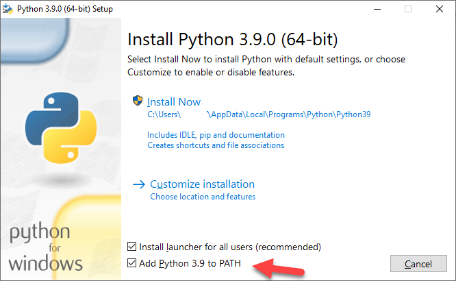
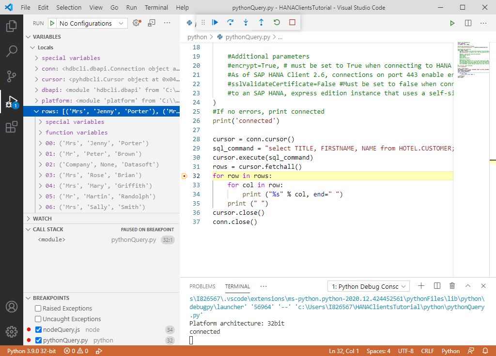

## Prerequisites
 - Have completed the first 3 tutorials in this mission

## Details
### You will learn
  - How to install Python and the SAP HANA client Python driver
  - How to create and debug a Python application that queries a SAP HANA database

  In the 2019 Stack Overflow's annual developer survey, Python ranked 4th in the [Most Popular Technologies](https://insights.stackoverflow.com/survey/2019#technology) section.  For further information on Python see [Introduction to Python 3](https://realpython.com/python-introduction/).

  The [SAP HANA client for Python](https://help.sap.com/viewer/f1b440ded6144a54ada97ff95dac7adf/latest/en-US/f3b8fabf34324302b123297cdbe710f0.html) supports Python 3.4+ and Python 2.7.  

  The following steps will create a simple Python app that can connect to and query an SAP HANA database.  

---

[ACCORDION-BEGIN [Step 1: ](Install Python)]

The first step is to check if Python is installed. Enter the commands below.

```Command Prompt
python --version
python3 --version
```
If Python is installed, the command will return a value such as Python 3.7.4.  Use whichever command returns a Python 3.4 or greater version number.   

If Python is not installed, it can be downloaded from [Python downloads](https://www.python.org/downloads/).

>On Windows, be sure to download the 64-bit version of Python, since the 32-bit version is not supported by SAP's Python client.  On Windows, the 64-bit version will have a file name like python-3.8.2-amd64.exe.  


Check the box that says *Add Python 3.x to PATH* as shown below to ensure that the interpreter will be placed in your path.   



You should now be able to open a new Command Prompt and verify that Python is installed.

[DONE]
[ACCORDION-END]

[ACCORDION-BEGIN [Step 2: ](Install the SAP HANA client for Python using pip and PyPI)]

The standard package installer for Python is [pip](https://pypi.org/project/pip/).  The below commands will check the version of pip and attempt to upgrade it to the latest available version.

```Command Prompt
pip --version
pip3 --version
pip install --upgrade pip
```

>On Linux or Mac, if you encounter permission issues, one approach to resolve is to use `sudo` before the command.


The repository that contains Python packages is [`PyPI`](https://pypi.org/) and includes a package for the SAP HANA client for Python.

  

To check if the SAP HANA Python client is already installed, execute the following command. The current installed version of the `hdbcli` package and the latest available version will be shown.

```Command Prompt
pip search hdbcli
```

This will return the installed version which might be 2.4.151 and the latest available version from `PyPI` which might be 2.4.182.  

Run the following command to install the SAP HANA client for Python.

```Command Prompt
pip install hdbcli
```

>If an error is displayed that mentions "No matching distribution found for `hdbcli`", an alternate method is to install it from the SAP HANA client install folder as shown below.
>
> ```Command Prompt
> cd C:\SAP\hdbclient
> pip install hdbcli-2.4.182.zip
> ```
>

> To upgrade to the latest available version, enter the command below.
> ```
> pip install --no-cache-dir --upgrade hdbcli
> ```
>
> To uninstall `hdbcli`, run the following command.
> ```
> pip uninstall hdbcli
> ```

> A specific version can be installed using the below command.
>
> ```
> pip install hdbcli==2.4.167
> ```


[DONE]
[ACCORDION-END]

[ACCORDION-BEGIN [Step 3: ](Create a Python application which queries SAP HANA)]


In a command prompt, create a folder named python, enter the newly created directory, create a file named pythonQuery.py, and open the file in notepad.

```Windows Command Prompt
mkdir %HOMEPATH%\HANAClientsTutorial\python
cd %HOMEPATH%\HANAClientsTutorial\python
echo.> pythonQuery.py
notepad pythonQuery.py
```

Substitute `kate` below for your preferred text editor.  

```Mac or Linux
mkdir $HOME/HANAClientsTutorial/python
cd $HOME/HANAClientsTutorial/python
touch pythonQuery.py
kate pythonQuery.py
```

Add the code below to pythonQuery.py.

```Python
#Import your dependencies
import platform
from hdbcli import dbapi

#verify that this is a 64 bit version of Python
print ("Platform architecture: " + platform.architecture()[0])

#Initialize your connection
conn = dbapi.connect(
    #address='10.7.168.11',
    #port='39015',
    #user='User1',
    #password='Password1',
    key='USER1UserKey', # address, port, user and password are retreived from the hdbuserstore
    encrypt=True, # must be set to True when connecting to HANA Cloud
    sslValidateCertificate=False # True HC, False for HANA Express.
)
#If no errors, print connected
print('connected')

cursor = conn.cursor()
sql_command = "select TITLE, FIRSTNAME, NAME from HOTEL.CUSTOMER;"
cursor.execute(sql_command)
rows = cursor.fetchall()
for row in rows:
    for col in row:
        print ("%s," % col)
    print ("\n")
cursor.close()
conn.close()
```

Note that the address, port, UID and PWD will be retrieved from the `hdbuserstore`.   

Run the app.

```Command Prompt
python pythonQuery.py
```


The code in pythonQuery.py uses [PEP 249 -- Python Database API Specification](https://www.python.org/dev/peps/pep-0249/) which defines a set of methods that provide a consistent database interface, independent of the actual database being used.   For further examples of accessing a database from Python see [Python and SQL](https://www.python-course.eu/sql_python.php) and [Python MySQL](https://www.w3schools.com/python/python_mysql_insert.asp).  For information specific to the SAP HANA Python client, see [Python Application Programming](https://help.sap.com/viewer/f1b440ded6144a54ada97ff95dac7adf/latest/en-US/f3b8fabf34324302b123297cdbe710f0.html).

[DONE]
[ACCORDION-END]

[ACCORDION-BEGIN [Step 4: ](Debug the application)]

Visual Studio Code provides a plugins for Python and can be used to debug an application.  [Download Visual Studio Code.](https://code.visualstudio.com/Download)

In Visual Studio Code, choose File, select Add Folder to Workspace and then add the `HANAClientsTutorial` folder.


Open the file pythonQuery.py.


Visual Studio Code will recognize the `py` file extension and will suggest plugins to install.

Place a breakpoint at line 28. Then select Run, Start Debugging.

Select Python File from the debug configuration options.  

Notice that the program stops running at the breakpoint that was set.

Observe the variable values in the leftmost pane.  Step through code.

  

Congratulations, you have now created and debugged a Python application that connects to and queries an SAP HANA database.  


[VALIDATE_1]
[ACCORDION-END]


---
