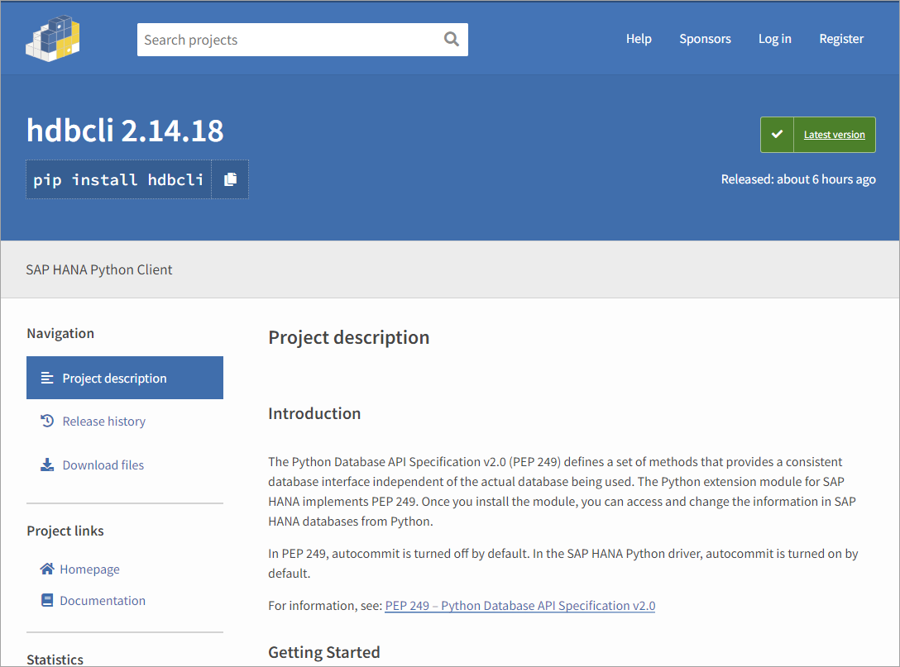
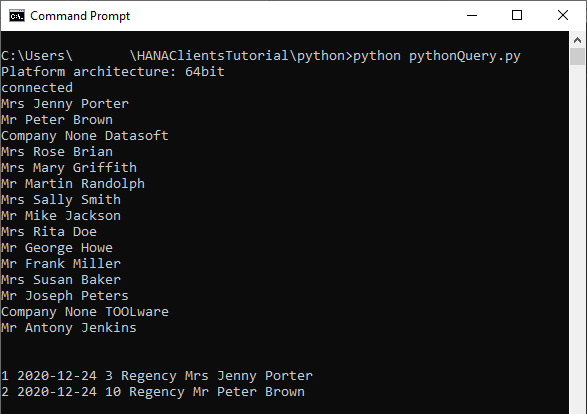
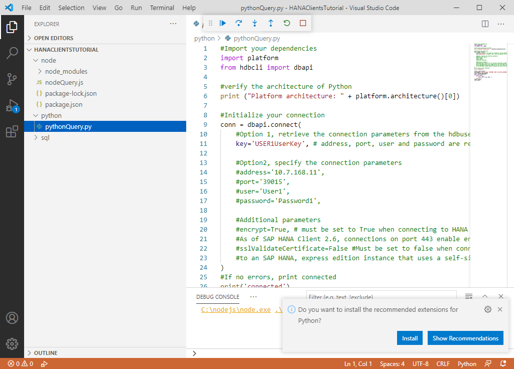

## Prerequisites
 - You have completed the first 3 tutorials in this mission.

## Details
### You will learn
- How to install Python and the SAP HANA client Python driver
- How to create and debug a Python application that queries a SAP HANA database

In the 2020 Stack Overflow's annual developer survey, Python ranked 4th in the [Most Popular Technologies](https://insights.stackoverflow.com/survey/2020#most-popular-technologies) section.  For further information on Python, see [Introduction to Python 3](https://realpython.com/python-introduction/).

The [SAP HANA client for Python](https://help.sap.com/viewer/f1b440ded6144a54ada97ff95dac7adf/latest/en-US/f3b8fabf34324302b123297cdbe710f0.html) supports Python 3.4+ and  Python 2.7.  For further details see SAP note [3006307 - SAP HANA Client Supported Platforms for 2.7](https://launchpad.support.sap.com/#/notes/3006307).  

The following steps create a simple Python app that can connect to and query an SAP HANA database.  

---

[ACCORDION-BEGIN [Step 1: ](Install Python)]

The first step is to check if Python is installed.

Enter the commands below.

```Shell
python --version
python3 --version
```
If Python is installed, the command will return a value such as Python 3.9.0.  Use whichever command returns a Python 3.4 or greater version number.   

If Python is not installed, it can be downloaded from [Python downloads](https://www.python.org/downloads/).

Check the box that says **Add Python 3.x to PATH** as shown below to ensure that the interpreter will be placed in your path.   


You should now be able to open a new shell and verify that Python is installed.

[DONE]
[ACCORDION-END]

[ACCORDION-BEGIN [Step 2: ](Install SAP HANA client for Python using pip and PyPI)]

The standard package installer for Python is [pip](https://pypi.org/project/pip/).  The following commands will check the version of pip and attempt to upgrade it to the latest available version.  Again, use the pip or pip3 command that returns a version 3.4 or greater of Python.

```Shell
pip --version
pip3 --version
pip install --upgrade pip
```

>On Linux or Mac, if you encounter permission issues, one way to solve the issue is to use `sudo` before the command.


The repository that contains Python packages is [PyPI](https://pypi.org/) and includes a package for the SAP HANA client for Python.

  

Run the following command to download and install the SAP HANA client for Python from PyPI:

```Shell
pip install hdbcli
```

>If an error is displayed that mentions "No matching distribution found for `hdbcli`, an alternate method is to install it from the SAP HANA client install folder as shown below.
>
> ```Shell
> cd C:\SAP\hdbclient
> pip install hdbcli-2.8.16.zip
> ```

> ---

> To upgrade to the latest available version, enter the following command:
> ```Shell
> pip install --no-cache-dir --upgrade hdbcli
> ```

> ---

> To uninstall `hdbcli`, run the following command:
> ```Shell
> pip uninstall hdbcli
> ```

> ---

> A specific version can be installed using the following command.
>
> ```Shell
> pip install hdbcli==2.4.167
> ```


[DONE]
[ACCORDION-END]

[ACCORDION-BEGIN [Step 3: ](Create Python application that queries SAP HANA)]

1. In a shell, create a folder named `python`, enter the newly created directory, and open a file name `pythonQuery.py` in an editor.

    ```Shell (Microsoft Windows)
    mkdir %HOMEPATH%\HANAClientsTutorial\python
    cd %HOMEPATH%\HANAClientsTutorial\python
    notepad pythonQuery.py
    ```

    Substitute `pico` below for your preferred text editor.  

    ```Shell (Linux or Mac)
    mkdir -p $HOME/HANAClientsTutorial/python
    cd $HOME/HANAClientsTutorial/python
    pico pythonQuery.py
    ```

2. Add the code below to `pythonQuery.py`.

    ```Python
    #Import your dependencies
    import platform
    from hdbcli import dbapi

    #verify the architecture of Python
    print ("Platform architecture: " + platform.architecture()[0])

    #Initialize your connection
    conn = dbapi.connect(
        #Option 1, retrieve the connection parameters from the hdbuserstore
        key='USER1UserKey', # address, port, user and password are retrieved from the hdbuserstore

        #Option2, specify the connection parameters
        #address='10.7.168.11',
        #port='39015',
        #user='User1',
        #password='Password1',

        #Additional parameters
        #encrypt=True, # must be set to True when connecting to HANA as a Service
        #As of SAP HANA Client 2.6, connections on port 443 enable encryption by default (HANA Cloud)
        #sslValidateCertificate=False #Must be set to false when connecting
        #to an SAP HANA, express edition instance that uses a self-signed certificate.
    )
    #If no errors, print connected
    print('connected')

    cursor = conn.cursor()
    sql_command = "select TITLE, FIRSTNAME, NAME from HOTEL.CUSTOMER;"
    cursor.execute(sql_command)
    rows = cursor.fetchall()
    for row in rows:
        for col in row:
            print ("%s" % col, end=" ")
        print (" ")
    cursor.close()
    conn.close()
    ```

    Note that the address, port, UID and PWD will be retrieved from the `hdbuserstore`.   

3. Run the app.

    ```Shell
    python pythonQuery.py
    ```

    You may replace `python` with `python3` if the above command doesn't work.

    

The code in `pythonQuery.py` uses [PEP 249 -- Python Database API Specification](https://www.python.org/dev/peps/pep-0249/), which defines a set of methods that provide a consistent database interface, independent of the actual database being used.   

  - For further examples of accessing a database from Python, see [Python and SQL](https://www.python-course.eu/sql_python.php) and [Python MySQL](https://www.w3schools.com/python/python_mysql_insert.asp).  

  - For information on the SAP HANA Python client, see [Python Application Programming](https://help.sap.com/viewer/f1b440ded6144a54ada97ff95dac7adf/latest/en-US/f3b8fabf34324302b123297cdbe710f0.html).

  - For further details on secure connections from Python to SAP HANA see [Connect to SAP HANA with a Secure Connection from Python](hana-python-secure-connection) and [Secure connection from Python to SAP HANA](https://blogs.sap.com/2020/05/07/secure-connection-from-python-to-sap-hana/).

[DONE]
[ACCORDION-END]

[ACCORDION-BEGIN [Step 4: ](Debug the application)]

Visual Studio Code provides plugins for Python and can be used to debug an application.  

1. If you have not already done so, download [Visual Studio Code](https://code.visualstudio.com/Download).

2. If you have not already done so, in Visual Studio Code, choose **File | Add Folder to Workspace**, and then add the `HANAClientsTutorial` folder.

    

3. Open the file `pythonQuery.py`.

    

    Visual Studio Code will recognize the `py` file extension and will suggest installing the Python extension.  Click **Install**.

4. Place a breakpoint on line the line `for row in rows:`.

5. Select **Run | Start Debugging | Python File Debug the currently active Python file**.

    Notice that the program stops running at the breakpoint that was set.

    Observe the variable values in the leftmost pane.  Step through code.

      

Congratulations! You have now created and debugged a Python application that connects to and queries an SAP HANA database.  


[VALIDATE_1]
[ACCORDION-END]


---
