# Routing queries to a read only replica

<!-- description --> This tutorial demonstrates how read only queries can be routed to a synchronous replica.  The option to add a replica to an SAP HANA Cloud instance requires a productive (non free tier) instance.

## Prerequisites

- An SAP HANA Cloud QRC 1 2026 (or newer) instance that supports adding a replica 
- A 2.28 (QRC 1 2026) or newer version of the SAP HANA Client

## You will learn

- How to add a synchronous replica
- How to direct a SQL query to a replica using a hint
- How to connect to a replica so that read only queries can be executed without using hints
- How to check where a statement was executed
- Workload class settings related to replicas
- Additional settings that affect routing

## Intro

A replica is used to provide an additional copy of your instance that is kept up to date through replication.  This replica instance can then be used to quickly replace the source instance with the replica automatically or using the manual takeover action providing higher availability.  

By sending read only workloads to the replica, this can offload workloads from the source node and provide better utilization.

The following are some additional sources of information on this topic:

- [Instance Replication](https://help.sap.com/docs/hana-cloud/sap-hana-cloud-administration-guide/instance-replication)
- [Active/Active (Read-Enabled) Replicas](https://help.sap.com/docs/hana-cloud-database/sap-hana-cloud-sap-hana-database-administration-guide/active-active-read-enabled)
- [Client Support for Active/Active (Read Enabled)](https://help.sap.com/docs/SAP_HANA_CLIENT/f1b440ded6144a54ada97ff95dac7adf/c4c65c8be4ba4ef9b07a029928f322f0.html)

---

### Add a replica

The following steps demonstrate how a replica can be added to an SAP HANA Cloud instance.

1. In SAP HANA Cloud Central, open the manage configuration wizard.  

    

2. Under Availability Zone, select Add Replica and choose synchronous as the replication mode.  

    

3. Once the changes have been saved and the instance has completed the update, it will indicate that the replica is available for read operations.  The Show Resource Usage for drop down will now additionally have an option for the Replica.

    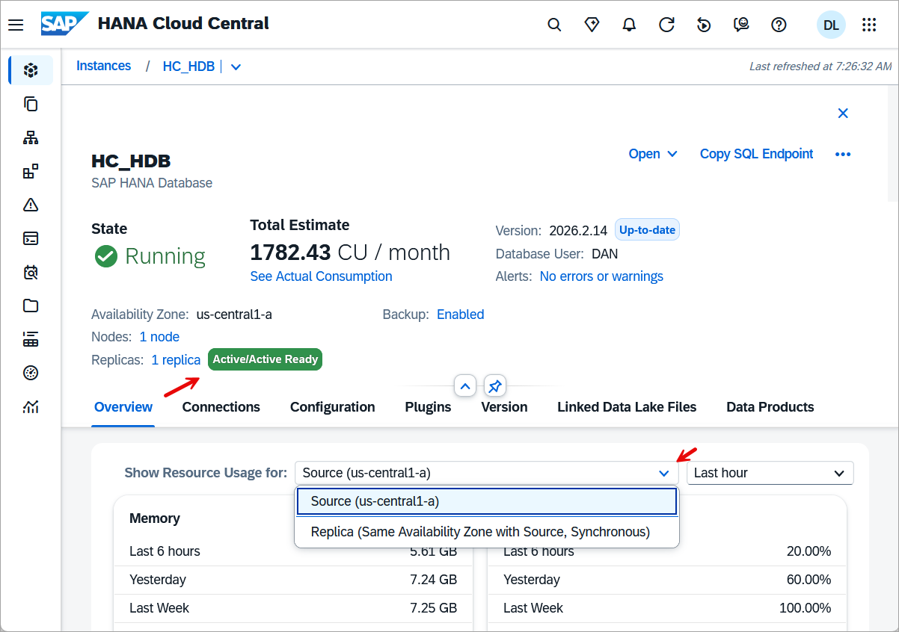

4. Once the replica has been added, it is then possible, if needed for testing, to perform a manual takeover so that the replica becomes the source node.  This step is shown for illustrative purposes only and does not need to be completed.

    

### Hint based routing

Individual read only queries can be routed to the replica.  There are some conditions such as the isolation level must be read committed.  Further details can be found at [Hint-Based Statement Routing for Active/Active (Read Enabled)](https://help.sap.com/docs/SAP_HANA_CLIENT/f1b440ded6144a54ada97ff95dac7adf/a6aa1cc4e070420c97e31fb1afd2ad3d.html).  The following steps attempt to demonstrate this.

1. Verify the version of the SAP HANA client which needs to be 2.28 or higher by executing the below SQL and that the isolation level is [read committed](https://help.sap.com/docs/hana-cloud-database/sap-hana-cloud-sap-hana-database-sql-reference-guide/set-transaction-statement-transaction-management).

    ```SQL
    SELECT CLIENT_VERSION, CLIENT_APPLICATION, * FROM M_CONNECTIONS WHERE CONNECTION_ID = CURRENT_CONNECTION;
    SELECT ISOLATION_LEVEL FROM M_TRANSACTIONS WHERE CONNECTION_ID = CURRENT_CONNECTION;
    --SET TRANSACTION ISOLATION LEVEL SERIALIZABLE;
    --SET TRANSACTION ISOLATION LEVEL READ COMMITTED;
    ```

    

    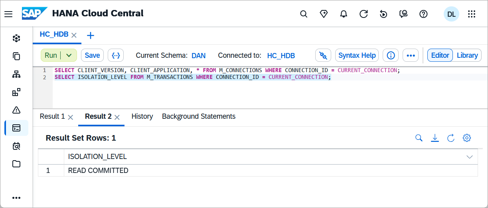

2. Execute the below SQL to create and populate a table named MYTABLE.

    ```SQL
    CREATE TABLE MYTABLE (C1 INT GENERATED BY DEFAULT AS IDENTITY, T1 TIMESTAMP);
    INSERT INTO MYTABLE(T1) VALUES(CURRENT_TIMESTAMP);
    SELECT * FROM MYTABLE;
    ```

    This table and its contents will be available on both the source and replica.

3. Execute the below SQL to perform a query against the source node and the replica node.  Notice that the second SQL statement uses a hint to direct the query to be executed on the replica.

    ```SQL
    SELECT * FROM M_VOLUMES;
    SELECT C1 AS QUERY_ON_PRIMARY, STATEMENT_EXECUTION_HOST() FROM MYTABLE;
    SELECT C1 AS QUERY_ON_REPLICA, STATEMENT_EXECUTION_HOST() FROM MYTABLE WITH HINT (RESULT_LAG('hana_sr'));
    ```

    The source and replica can change so it is important to check the M_VOLUMES monitoring view.

    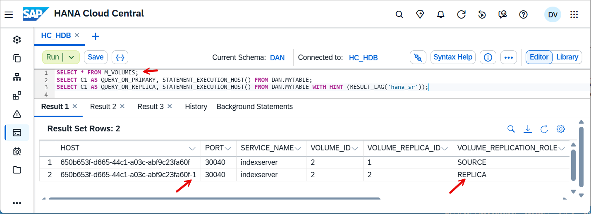

     Notice below that the suffix (-1) of the execution host for the replica is different from the source.  

    

    Further details on hint based routing can be found at [Hints for Active/Active (Read-Enabled)](https://help.sap.com/docs/hana-cloud-database/sap-hana-cloud-sap-hana-database-sql-reference-guide/hint-details?locale=en-US#loio4ba9edce1f2347a0b9fcda99879c17a1__section_HintsforActiveActive).

4. Examine the M_SQL_PLAN_CACHE view of the source and replica.  Views prefixed with M_ are monitoring views.  The view [M_SQL_PLAN_CACHE](https://help.sap.com/docs/hana-cloud-database/sap-hana-cloud-sap-hana-database-sql-reference-guide/m-sql-plan-cache-system-view?locale=en-US) provides execution plan statistics.  _SYS_VR_REPLICA is a schema prefix used to access monitoring views that reside on a replica node.

    ```SQL
    SELECT HOST, STATEMENT_STRING, USER_NAME, LAST_EXECUTION_TIMESTAMP FROM SYS.M_SQL_PLAN_CACHE WHERE 
    STATEMENT_STRING LIKE '%MYTABLE%' ORDER BY LAST_EXECUTION_TIMESTAMP DESC;
    --Notice that both statements appear but only the first one is executed

    SELECT HOST, STATEMENT_STRING, USER_NAME, LAST_EXECUTION_TIMESTAMP FROM _SYS_VR_REPLICA.M_SQL_PLAN_CACHE WHERE 
    STATEMENT_STRING LIKE '%MYTABLE%' ORDER BY LAST_EXECUTION_TIMESTAMP DESC;
    --Notice that only the statement routed to the replica appears with this query

    --ALTER SYSTEM CLEAR SQL PLAN CACHE;
    ```

    

5. It is also possible to view the details of executed statements using the SQL Statements app which can be accessed from the instance details page.

    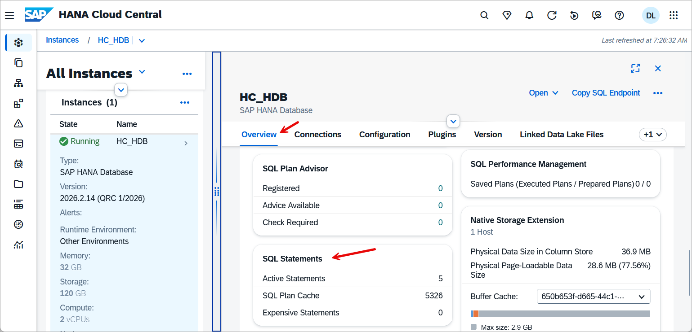

    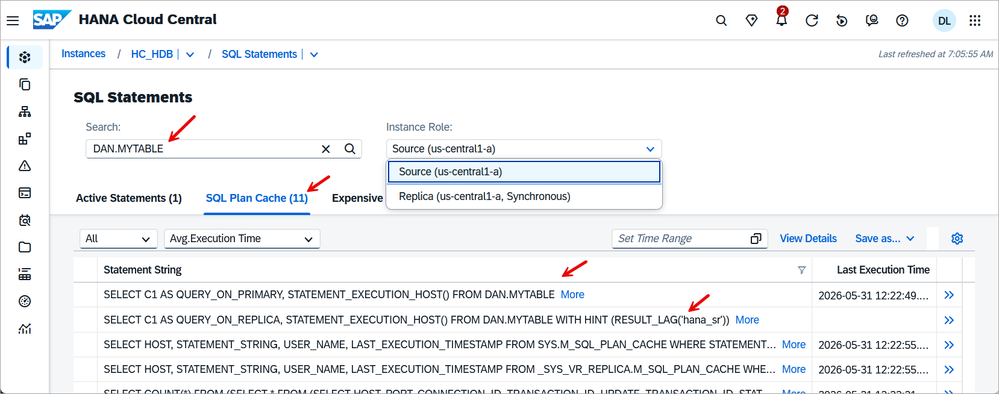

6. Execute the following SQL to create two stored procedures, one that can be routed to a replica and one that cannot.

    ```SQL
    CREATE OR REPLACE PROCEDURE QUERY_PROC()
    LANGUAGE SQLSCRIPT 
    READS SQL DATA 
    AS
    BEGIN
        SELECT COUNT(*), STATEMENT_EXECUTION_HOST() FROM MYTABLE;
    END;

    CREATE OR REPLACE PROCEDURE INSERT_PROC()
    LANGUAGE SQLSCRIPT AS
    BEGIN
        INSERT INTO MYTABLE(T1) VALUES(CURRENT_TIMESTAMP);
        SELECT COUNT(*), STATEMENT_EXECUTION_HOST() FROM MYTABLE;
    END;
    ```

    Notice above that the first procedure contains the declaration READS SQL DATA which indicates that it does not modify the schema or data while the second stored procedure does insert data into the table.  Further details on the syntax is available at [CREATE PROCEDURE Statement](https://help.sap.com/docs/HANA_CLOUD_DATABASE_CN/1bb35593d1e54ce48b4f8ce071594d5e/20d467407519101484f190f545d54b24.html?locale=en-US).

7. Execute the two stored procedures and examine where they are executed.

     ```SQL
    CALL QUERY_PROC() WITH HINT (RESULT_LAG('hana_sr'));
    ```

    

    ```SQL
    CALL INSERT_PROC() WITH HINT (RESULT_LAG('hana_sr'));
    ```

    

    Notice above that the INSERT_PROC was requested to be run on the replica but instead it was run on the source node.

### Directly connect to a replica

A connection can be made directly to the replica so that individual statements do not need to include a hint statement.  To do so use the connection parameter replicationRole with a value of REPLICA.

1. Within the SQL Console, this parameter can be provided as shown below using the advanced options.

    

    

    Execute the below SQL.

    ```SQL
    SELECT C1 AS QUERY_ON_REPLICA, STATEMENT_EXECUTION_HOST() FROM MYTABLE;
    INSERT INTO MYTABLE(T1) VALUES(CURRENT_TIMESTAMP);
    ```

    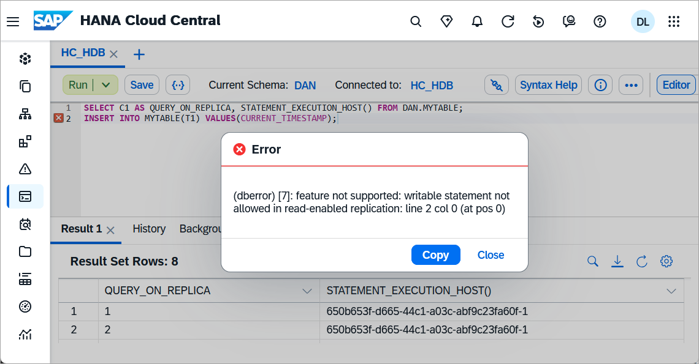

    Notice that when directly connected to a replica, an error is returned if a non read operation is attempted.

2. The below example uses [hdbsql](https://help.sap.com/docs/SAP_HANA_CLIENT/f1b440ded6144a54ada97ff95dac7adf/c2a6d9cbbb5710148afea455ba5746c0.html) which is an interactive command line tool for executing SQL that is part of the SAP HANA Client to connect directly to the replica.

    ```Shell
    hdbsql -Z replicationRole=REPLICA -A -n 650b653f-d665-44c1-a03c-abf9c23fa60f.hana.prod-us30.hanacloud.ondemand.com:443 -u YOUR_NAME -p Password1
    ```

    

### Monitoring

The usage monitor app can be used to view metrics such as CPU or memory of the source and replica.

1. Change the SQL Console connection back to the source node as the below SQL creates a new table and inserts data which must be executed on the source node.

    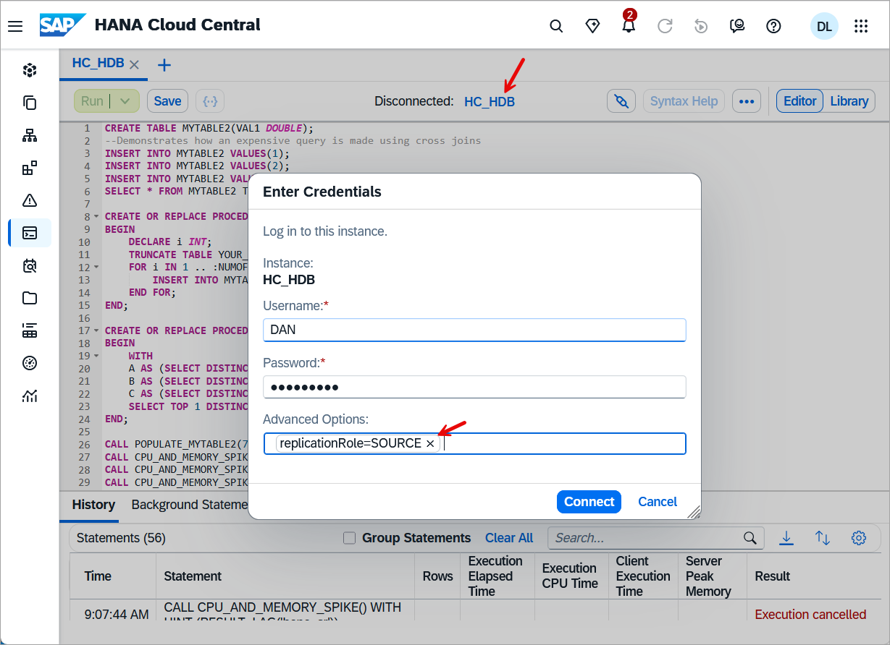

2. Execute the below to cause a brief spike in CPU usage on the replica and then view the CPU metric in the usage monitor.

    ```SQL
    CREATE TABLE MYTABLE2(VAL1 DOUBLE);
    --Demonstrates how an expensive query is made using cross joins
    INSERT INTO MYTABLE2 VALUES(1);
    INSERT INTO MYTABLE2 VALUES(2);
    INSERT INTO MYTABLE2 VALUES(3);
    SELECT * FROM MYTABLE2 T1, MYTABLE2 T2, MYTABLE2 T3;

    CREATE OR REPLACE PROCEDURE POPULATE_MYTABLE2(NUMOFROWS INT) LANGUAGE SQLSCRIPT AS
    BEGIN
        DECLARE i INT;
        TRUNCATE TABLE MYTABLE2;
        FOR i IN 1 .. :NUMOFROWS DO
            INSERT INTO MYTABLE2 VALUES(RAND_SECURE());
        END FOR;
    END;

    CREATE OR REPLACE PROCEDURE CPU_AND_MEMORY_SPIKE() LANGUAGE SQLSCRIPT READS SQL DATA  AS
    BEGIN
        WITH 
        A AS (SELECT DISTINCT VAL1 AS A1 FROM MYTABLE2 ORDER BY VAL1 DESC),
        B AS (SELECT DISTINCT VAL1 AS B1 FROM MYTABLE2 ORDER BY VAL1 ASC),
        C AS (SELECT DISTINCT VAL1 AS C1 FROM MYTABLE2 ORDER BY VAL1 DESC)
        SELECT TOP 1 DISTINCT A1 + B1 + C1 FROM A, B, C;
    END;

    CALL POPULATE_MYTABLE2(750);
    CALL CPU_AND_MEMORY_SPIKE() WITH HINT (RESULT_LAG('hana_sr'));  --takes about 12 seconds to run
    CALL CPU_AND_MEMORY_SPIKE() WITH HINT (RESULT_LAG('hana_sr'));
    CALL CPU_AND_MEMORY_SPIKE() WITH HINT (RESULT_LAG('hana_sr'));
    CALL CPU_AND_MEMORY_SPIKE() WITH HINT (RESULT_LAG('hana_sr'));
    CALL CPU_AND_MEMORY_SPIKE() WITH HINT (RESULT_LAG('hana_sr'));
    ```

3. On the instance details page, select the usage monitor app by selecting either the Memory or Compute and expand the replica section to view the usage.  Notice below that we can see the usage is occurring in the replica.

    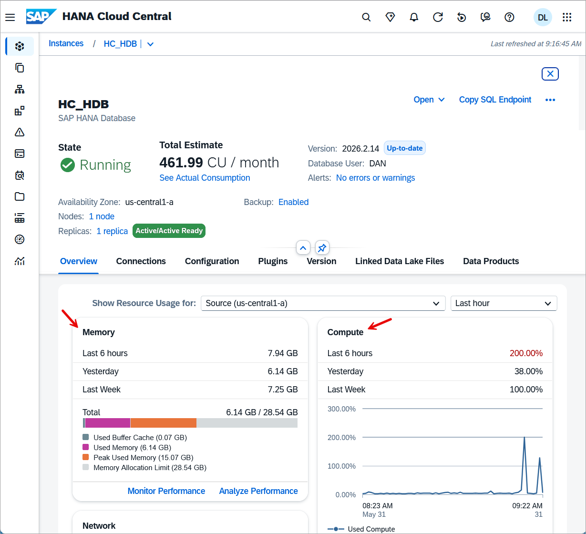

    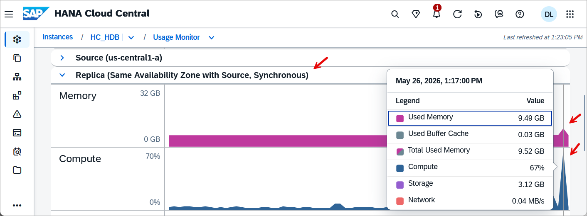

### Workload classes and replicas

The following example demonstrates creating a workload class that enables queries run from the SQL Console with your user name  to have a timeout of 2 seconds when run against the source node but to have a timeout of 4 seconds when run against the replica.

1. Execute the below SQL

    ```SQL
    CREATE WORKLOAD CLASS "WLC_TIMEOUT_SOURCE";
    CREATE WORKLOAD CLASS "WLC_TIMEOUT_REPLICA";

    ALTER WORKLOAD CLASS "WLC_TIMEOUT_SOURCE" SET 'STATEMENT TIMEOUT' = '2';
    ALTER WORKLOAD CLASS "WLC_TIMEOUT_REPLICA" SET 'STATEMENT TIMEOUT' = '4';

    SELECT USER_NAME, CLIENT_APPLICATION FROM M_CONNECTIONS WHERE CONNECTION_ID = CURRENT_CONNECTION;
    CREATE WORKLOAD MAPPING "WLM_SOURCE" WORKLOAD CLASS "WLC_TIMEOUT_SOURCE" SET 'USER NAME' = 'YOUR_NAME', 'APPLICATION NAME' = 'SAP_HANARuntimeTools_HRA', 'VOLUME REPLICATION ROLE' = 'SOURCE';
    CREATE WORKLOAD MAPPING "WLM_REPLICA" WORKLOAD CLASS "WLC_TIMEOUT_REPLICA" SET 'USER NAME' = 'YOUR_NAME', 'APPLICATION NAME' = 'SAP_HANARuntimeTools_HRA', 'VOLUME REPLICATION ROLE' = 'REPLICA';

    --DROP WORKLOAD MAPPING "WLM_SOURCE";
    --DROP WORKLOAD MAPPING "WLM_REPLICA";

    ALTER WORKLOAD CLASS "WLC_TIMEOUT_SOURCE" ENABLE;
    ALTER WORKLOAD CLASS "WLC_TIMEOUT_REPLICA" ENABLE;

    SELECT * FROM WORKLOAD_CLASSES;
    SELECT * FROM WORKLOAD_MAPPINGS;
    ```

2. Now that the workload classes have been created and mapped, try them out by executing the SQL below.

    ```SQL
    CREATE OR REPLACE PROCEDURE SLOW_PROCEDURE(IN WAIT_TIME INTEGER) LANGUAGE SQLSCRIPT READS SQL DATA  AS
    BEGIN
        USING SQLSCRIPT_SYNC AS SYNCLIB;
        
        DECLARE V_START_TIME TIMESTAMP;
        DECLARE V_END_TIME TIMESTAMP;
        DECLARE V_DURATION_SEC BIGINT;

        V_START_TIME = CURRENT_TIMESTAMP;
        CALL SYNCLIB:SLEEP_SECONDS(WAIT_TIME);  --waits for the specified number of seconds
        V_END_TIME = CURRENT_TIMESTAMP;
        V_DURATION_SEC = SECONDS_BETWEEN(V_START_TIME, V_END_TIME);
        SELECT TOP 1 C1, V_DURATION_SEC, STATEMENT_EXECUTION_HOST() FROM DAN.MYTABLE WITH HINT (RESULT_LAG('hana_sr'));
    END;

    CALL SLOW_PROCEDURE(1); --succeeds
    CALL SLOW_PROCEDURE(3); --fails as the limit is 2 seconds for primary
    CALL SLOW_PROCEDURE(3) WITH HINT (RESULT_LAG('hana_sr'));  --succeeds
    CALL SLOW_PROCEDURE(5) WITH HINT (RESULT_LAG('hana_sr'));  --fails as the limit is 4 seconds for the replica
    ```

    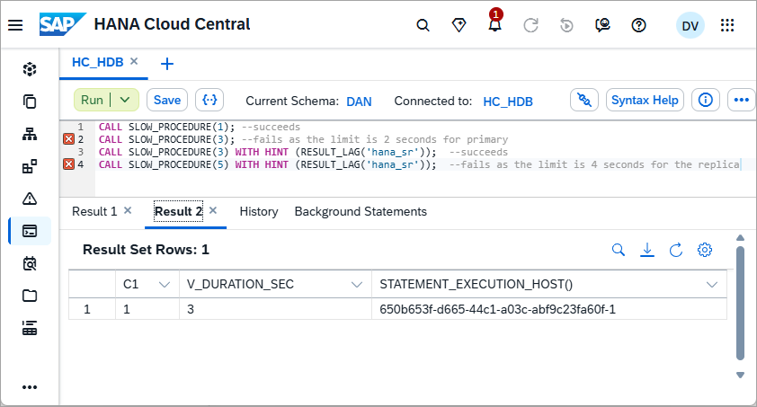

3. The workload classes and mappings can also be examined and edited graphically on the instance overview using the Workload Management App.

    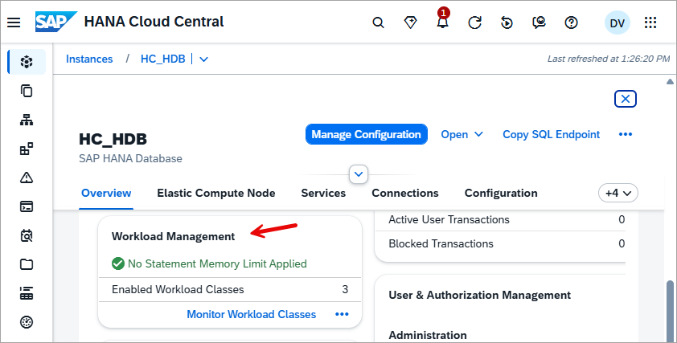

    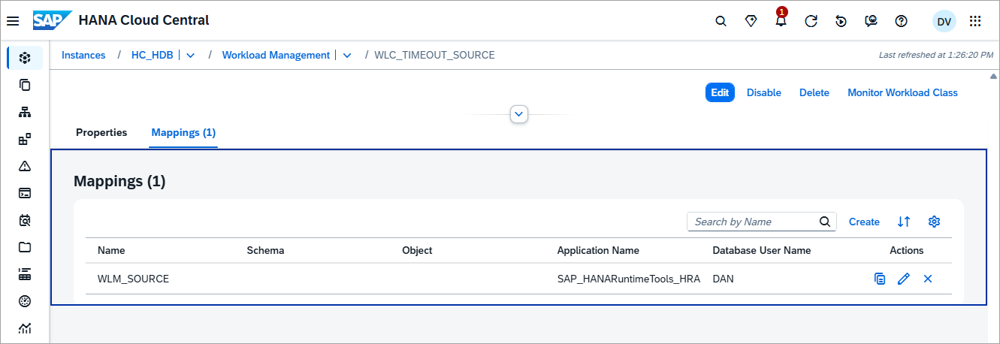

### Additional considerations

If you are using hint based routing, the statement needs to be prepared before it is executed for the hint to be considered.  Some tools such as the SQL Console and HDBSQL always prepare statements before executing them.  For applications that do not do this, there is a setting called [routeDirectExecute](https://help.sap.com/docs/SAP_HANA_CLIENT/f1b440ded6144a54ada97ff95dac7adf/4fe9978ebac44f35b9369ef5a4a26f4c.html) that can be enabled.  A further example using this setting in a Node.js application is shown in step 7 of the tutorial [Use an Elastic Compute Node (ECN) for Scheduled Workloads](hana-cloud-ecn).

### Knowledge check

Congratulations, you have now directed read only queries to a replica which can improve utilization of SAP HANA Cloud instances.

---
