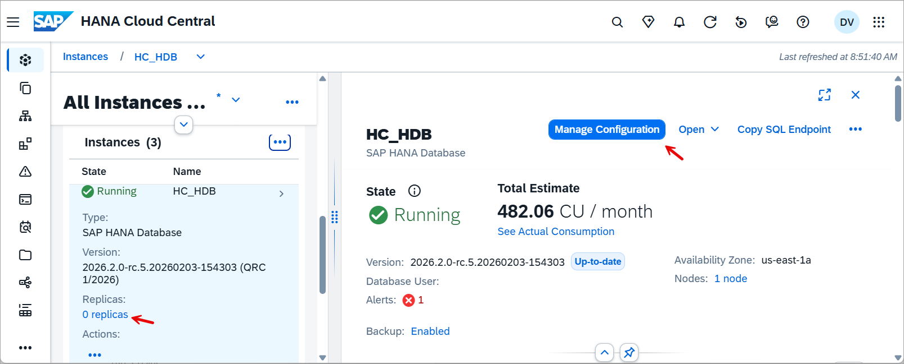
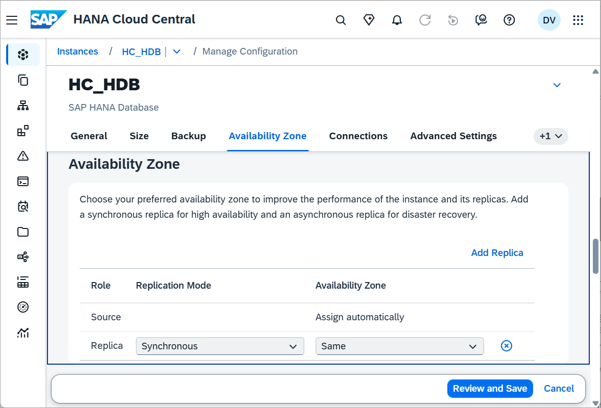
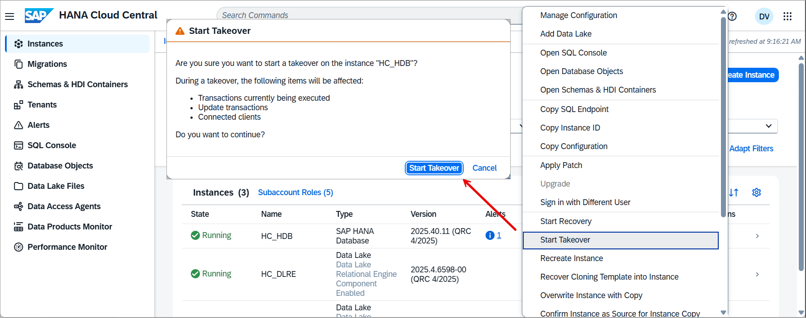
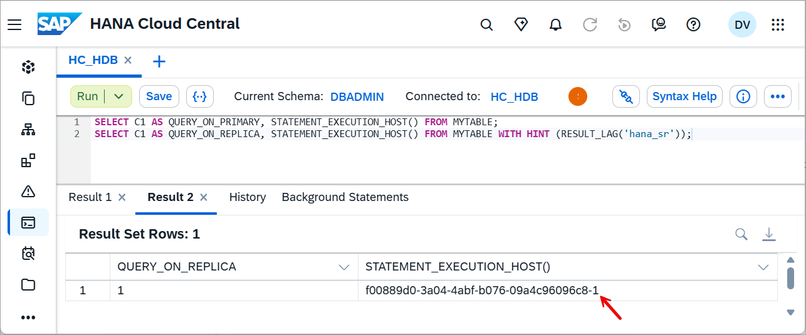
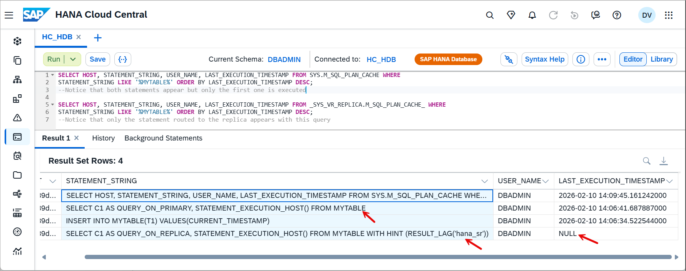
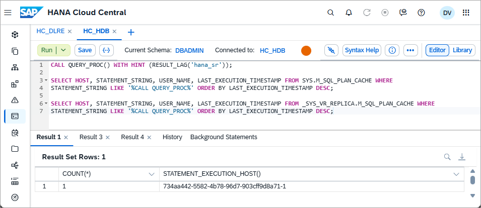
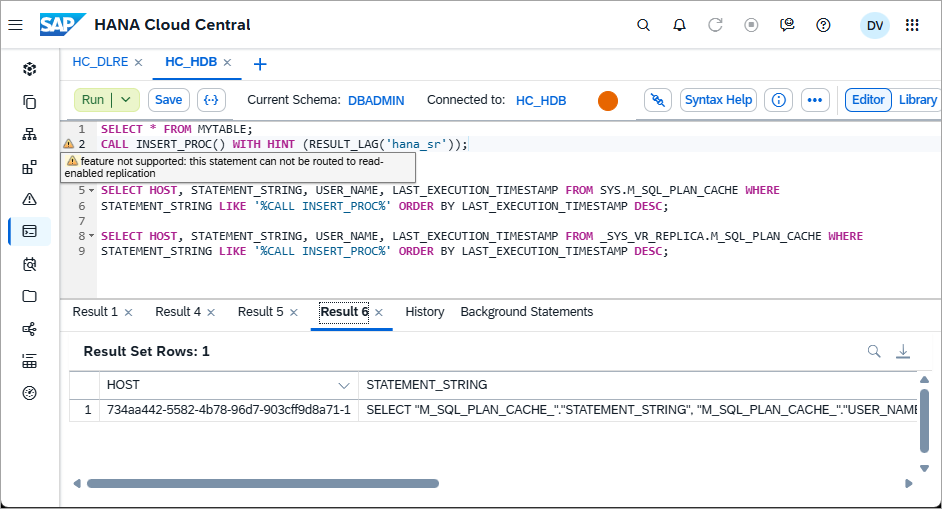
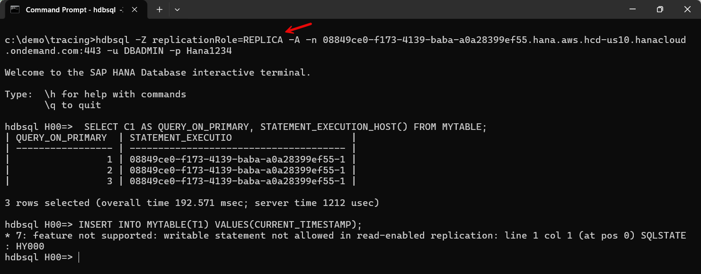
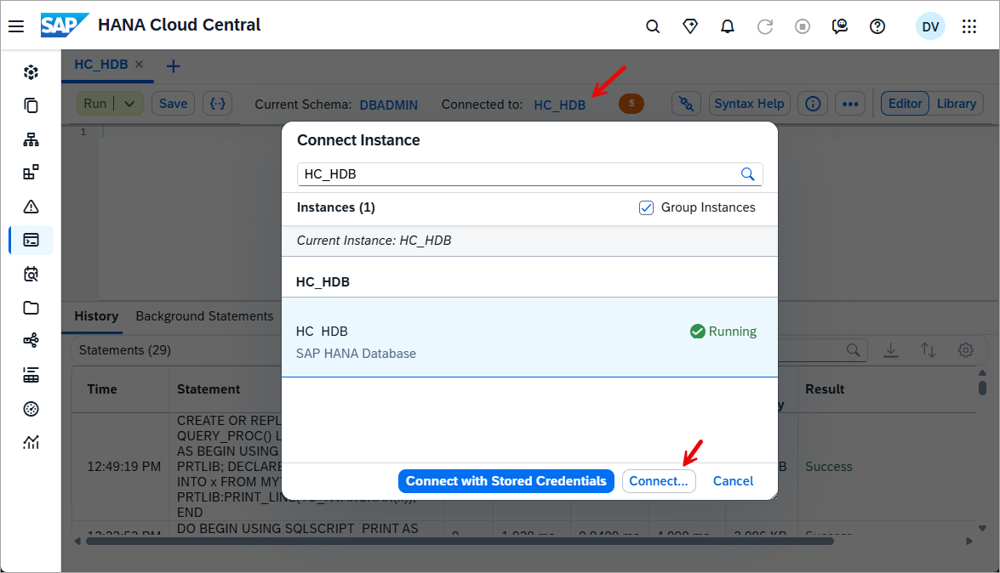
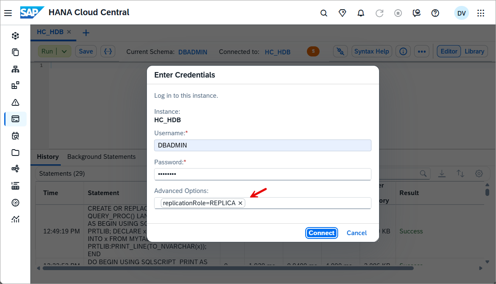

# Routing queries to a read only replica

<!-- description --> This tutorial demonstrates how read only queries can be routed to a replica.  The option to add a replica to an SAP HANA Cloud instance requires a productive (non free tier) instance.

## Prerequisites

- An SAP HANA Cloud QRC 1 2026 (or newer) instance that supports adding a replica
- A 2.28 (QRC 1 2026) or newer version of the SAP HANA Client

## You will learn

- How to add a synchronous replica
- How to direct a SQL query to a replica using a hint
- How to connect to a replica so that read only queries can be executed without using hints
- Additional settings that affect routing

## Intro

A replica is used to provide an additional copy of your instance that is kept up to date through replication.  This instance can then be used to quickly replace the source instance with the replica using the takeover action performed in SAP HANA Cloud Central.  By sending read only workloads to the replica, this can offload workloads from the source node and provide better utilization.

The following are some additional sources of information on this topic:

- [Instance Replication](https://help.sap.com/docs/hana-cloud/sap-hana-cloud-administration-guide/instance-replication)
- [Active/Active (Read-Enabled) Replicas](https://help.sap.com/docs/hana-cloud-database/sap-hana-cloud-sap-hana-database-administration-guide/active-active-read-enabled)
- [Client Support for Active/Active (Read Enabled)](https://help.sap.com/docs/SAP_HANA_CLIENT/f1b440ded6144a54ada97ff95dac7adf/c4c65c8be4ba4ef9b07a029928f322f0.html)

---

### Add a replica

The following steps demonstrate how a replica can be added to an SAP HANA Cloud instance.

1. In SAP HANA Cloud Central, open the manage configuration wizard.  

    

2. Under the availability zone section, select add replica and choose synchronous as the replication mode.  

    

3. Once the replica has been added, it is then possible, if needed, to perform a takeover so that the replica becomes the source node.  This step is shown for illustrative purposes only and does not need to be completed.

    

### Hint based routing

Individual read only queries can be routed to the replica.  There are some conditions such as the isolation level must be read commited.  Further details can be found at [Hint-Based Statement Routing for Active/Active (Read Enabled)](https://help.sap.com/docs/SAP_HANA_CLIENT/f1b440ded6144a54ada97ff95dac7adf/a6aa1cc4e070420c97e31fb1afd2ad3d.html).  The following steps attempt to demonstrate this.

1. Verify the version of the SAP HANA client which needs to be 2.28 or higher by executing the below SQL.

    ```SQL
    SELECT CLIENT_VERSION, CLIENT_APPLICATION, * FROM M_CONNECTIONS WHERE CONNECTION_ID = CURRENT_CONNECTION;
    ```

2. Execute the below SQL to create and populate a table named MYTABLE.

    ```SQL
    CREATE TABLE MYTABLE (C1 INT GENERATED BY DEFAULT AS IDENTITY, T1 TIMESTAMP);
    INSERT INTO MYTABLE(T1) VALUES(CURRENT_TIMESTAMP);
    ```

    This table and its contents will be available on both the source and replica instances.

3. Execute the below SQL to perform a query against the source node and the replica node.

    ```SQL
    SELECT C1 AS QUERY_ON_PRIMARY, STATEMENT_EXECUTION_HOST() FROM MYTABLE;
    SELECT C1 AS QUERY_ON_REPLICA, STATEMENT_EXECUTION_HOST() FROM MYTABLE WITH HINT (RESULT_LAG('hana_sr'));
    ```

    

    Notice above that the suffix (-1) of the execution host for the replica is different from the source.

4. Examine the M_SQL_PLAN_CACHE table of the source and replica.

    ```SQL
    SELECT HOST, STATEMENT_STRING, USER_NAME, LAST_EXECUTION_TIMESTAMP FROM SYS.M_SQL_PLAN_CACHE WHERE 
    STATEMENT_STRING LIKE '%MYTABLE%' ORDER BY LAST_EXECUTION_TIMESTAMP DESC;
    --Notice that both statements appear but only the first one is executed

    SELECT HOST, STATEMENT_STRING, USER_NAME, LAST_EXECUTION_TIMESTAMP FROM _SYS_VR_REPLICA.M_SQL_PLAN_CACHE WHERE 
    STATEMENT_STRING LIKE '%MYTABLE%' ORDER BY LAST_EXECUTION_TIMESTAMP DESC;
    --Notice that only the statement routed to the replica appears with this query

    --ALTER SYSTEM CLEAR SQL PLAN CACHE;
    ```

    

5. Execute the following SQL to create two stored procedures, one that can be routed to a replica and one that cannot.

    ```SQL
    CREATE OR REPLACE PROCEDURE QUERY_PROC()
    LANGUAGE SQLSCRIPT 
    READS SQL DATA 
    AS
    BEGIN
        SELECT COUNT(*), STATEMENT_EXECUTION_HOST() FROM MYTABLE;
    END;

    CREATE OR REPLACE PROCEDURE INSERT_PROC()
    LANGUAGE SQLSCRIPT AS
    BEGIN
        INSERT INTO MYTABLE(T1) VALUES(CURRENT_TIMESTAMP);
    END;
    ```

    Notice above that the first procedure contains the declaration READS SQL DATA which indicates that it does not modify the schema or data while the second stored procedure does modify the tables data.  Further details on the syntax is available at [CREATE PROCEDURE Statement](https://help.sap.com/docs/HANA_CLOUD_DATABASE_CN/1bb35593d1e54ce48b4f8ce071594d5e/20d467407519101484f190f545d54b24.html?locale=en-US).

6. Execute the two stored procedures and examine where they are executed.

    ```SQL
    CALL QUERY_PROC() WITH HINT (RESULT_LAG('hana_sr'));
    
    SELECT HOST, STATEMENT_STRING, USER_NAME, LAST_EXECUTION_TIMESTAMP FROM SYS.M_SQL_PLAN_CACHE WHERE 
    STATEMENT_STRING LIKE '%CALL QUERY_PROC%' ORDER BY LAST_EXECUTION_TIMESTAMP DESC;
    
    SELECT HOST, STATEMENT_STRING, USER_NAME, LAST_EXECUTION_TIMESTAMP FROM _SYS_VR_REPLICA.M_SQL_PLAN_CACHE WHERE 
    STATEMENT_STRING LIKE '%CALL QUERY_PROC%' ORDER BY LAST_EXECUTION_TIMESTAMP DESC;
    ```

    

    ```SQL
    SELECT * FROM MYTABLE;
    CALL INSERT_PROC() WITH HINT (RESULT_LAG('hana_sr'));
    SELECT * FROM MYTABLE;

    SELECT HOST, STATEMENT_STRING, USER_NAME, LAST_EXECUTION_TIMESTAMP FROM SYS.M_SQL_PLAN_CACHE WHERE 
    STATEMENT_STRING LIKE '%CALL INSERT_PROC%' ORDER BY LAST_EXECUTION_TIMESTAMP DESC;
    
    SELECT HOST, STATEMENT_STRING, USER_NAME, LAST_EXECUTION_TIMESTAMP FROM _SYS_VR_REPLICA.M_SQL_PLAN_CACHE WHERE 
    STATEMENT_STRING LIKE '%CALL INSERT_PROC%' ORDER BY LAST_EXECUTION_TIMESTAMP DESC;
    ```

    

### Directly connect to a replica

A connection can be made directly to the replica so that individual statements do not need to include a hint statement.  To do so use the connection parameter replicationRole with a value of REPLICA.

```Shell
hdbsql -Z replicationRole=REPLICA -A -n 08849ce0-f173-4139-baba-a0a28399ef55.hana.aws.hcd-us10.hanacloud.ondemand.com:443 -u DBADMIN -p myPassword
```

```SQL
SELECT C1 AS QUERY_ON_PRIMARY, STATEMENT_EXECUTION_HOST() FROM MYTABLE;
INSERT INTO MYTABLE(T1) VALUES(CURRENT_TIMESTAMP);
```



Within the SQL Console, this parameter can be provided as shown below using the advanced options.





### Additional considerations

If you are using hint based routing, the statement needs to be prepared before it is executed for the hint to be considered.  Some tools such as the SQL Console and HDBSQL always prepare statements before executing them.  For applications that do not do this, there is a setting called [routeDirectExecute](https://help.sap.com/docs/SAP_HANA_CLIENT/f1b440ded6144a54ada97ff95dac7adf/4fe9978ebac44f35b9369ef5a4a26f4c.html) that can be enabled.  A further example using this setting in a Node.js application is shown in step 7 of the tutorial [Use an Elastic Compute Node (ECN) for Scheduled Workloads](hana-cloud-ecn).

### Knowledge check

Congratulations, you have now directed read only queries to a replica which can improve utilization of SAP HANA Cloud instances.

---
