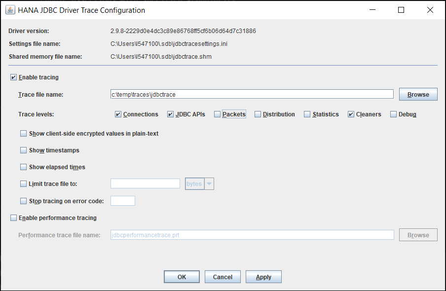

## Prerequisites
 - You have completed the first 3 tutorials in this mission.

## Details
### You will learn
  - How to enable tracing using `hdbsqldbc_cons` or environment variables
  - How to record trace details to a file, `stdout`, or `stderr`

Trace files can help SAP Support diagnose unexpected behavior.

Tracing can be configured using executables included with the SAP HANA Client installation.  [SQLDBC](https://help.sap.com/viewer/f1b440ded6144a54ada97ff95dac7adf/latest/en-US/0c20691739094593855ece908b4a3cde.html)-based interfaces use `hdbsqldbc_cons`, except for [ODBC](https://help.sap.com/viewer/f1b440ded6144a54ada97ff95dac7adf/latest/en-US/35368f78f6884b019caee12c125b255a.html), which uses `hdbodbc_cons`.  For [JDBC](https://help.sap.com/viewer/f1b440ded6144a54ada97ff95dac7adf/latest/en-US/4033f8e603504c0faf305ab77627af03.html), use `ngdbc.jar`.   

Trace settings can also be configured using environment variables.  

---

[ACCORDION-BEGIN [Step 1: ](Enable Tracing)]

1. Enter the following command to see the current trace settings:  

    ```Shell
    hdbsqldbc_cons SHOW ALL
    ```

      

    > `hdbsqldbc_cons` utility can be found in the `sap/hdbclient` folder.  


2. To specify the file location for the trace file and enable tracing of SQL statements, enter the following commands:

    ```Shell (Microsoft Windows)
    hdbsqldbc_cons TRACE SQL ON LEVEL DEBUG
    mkdir c:\temp\traces
    hdbsqldbc_cons TRACE FILENAME c:\temp\traces\SQLDBC-%p.txt
    ```

    ```Shell (Linux or Mac)
    hdbsqldbc_cons TRACE SQL ON LEVEL DEBUG
    mkdir /tmp/traces
    hdbsqldbc_cons TRACE FILENAME /tmp/traces/SQLDBC-%p.txt
    ```

    The %p will be replaced with the process ID of the traced application. Including %p in the file name ensures that each process can write its own trace file.

    Trace categories:  

    - SQL
    - DEBUG
    - PACKET
    - DISTRIBUTION

    Trace levels:  

    - DEBUG
    - INFO
    - WARNING
    - ERROR
    - FATAL  

    For more information, see [SQLDBC Tracing and Trace Options](https://help.sap.com/viewer/f1b440ded6144a54ada97ff95dac7adf/latest/en-US/57e04b844d9f40d0bd5ca90f72629255.html).

3. Run the following command to connect to HDBSQL and query for the status.  Since tracing is enabled, a trace file will be generated and can be used to see which SQL statements are called by `\s`.

    ```Shell
    hdbsql -U User1UserKey "\s"
    ```

4. Find and open the generated trace file.  Remember to replace #### to match the trace file name you wish to open.

    ```Shell (Microsoft Windows)
    cd c:\temp\traces
    dir SQLDBC*.txt /od
    notepad SQLDBC-####.txt
    ```

    ```Shell (Linux or Mac)
    cd /tmp/traces
    ls -lt
    pico SQLDBC-####.txt
    ```
    

    Notice that the trace settings are shown at the top of the file.  

    ```
    libSQLDBCHDB 2.7.17.1607722875
    SYSTEM: Microsoft Windows / X64
    BUILD AT: 2020-12-21 18:56:04
    BRANCH: unknown
    APPLICATION: C:\SAP\hdbclient\hdbsql.exe
    HOST: W-R90XC65K
    OS USER: dan
    CURRENT DIRECTORY: C:\Users\dan\HANAClientsTutorial
    TRACE FILE NAME: c:\temp\traces\SQLDBC-35724.txt
    PROCESS ID: 35724
    TRACE FILE WRAP COUNT: 0

    ---
    Enabled Traces:

    SQL Trace: Level DEBUG
    Distribution Trace: Level DEBUG
    ```

    If the trace settings change while tracing is enabled, the Enabled Traces section will appear again in the trace file.  

    >If you are experiencing issues with SQLDBC tracing, consult  [Troubleshooting SQLDBC Tracing](https://help.sap.com/viewer/f1b440ded6144a54ada97ff95dac7adf/latest/en-US/a1327e58f7c44d9e83972e6ea818dbe9.html).

5.  Search through the trace file and notice the SQL statements that were executed.

    ```
    ::EXECUTE WITH COMMIT SQLCURS_1 2020-12-28 07:11:09.717000 [0x000000000319c260]
SQL COMMAND : SELECT VERSION FROM SYS.M_DATABASE
    ...
    ::EXECUTE WITH COMMIT SQLCURS_1 2020-12-28 07:11:09.729000 [0x000000000319c260]
SQL COMMAND : SELECT B.HOST || ':' || SQL_PORT FROM PUBLIC.M_CONNECTIONS A JOIN SYS.M_SERVICES B   ON A.HOST = B.HOST and A.port = B.port   WHERE OWN = 'TRUE'
    ```


6. To turn off tracing for all categories, run the following command:

    ```Shell
    hdbsqldbc_cons TRACE OFF
    ```

[DONE]
[ACCORDION-END]

[ACCORDION-BEGIN [Step 2: ](Additional Trace Settings)]

The following are some additional options for tracing.

1.  The FLUSH setting, when turned on, can reduce I/O activity.  If you are investigating a crash, it should be turned on to ensure that all the trace information is recorded.

    ```Shell
    hdbsqldbc_cons TRACE FLUSH ON
    ```

2.  Note that tracing should be turned off when not in use, as it does have a performance, memory and disk size impact.  The following are some additional options to limit the trace file size to 100 KB (plus an archive file) and to turn on tracing only when a specific error code occurs.  Error code 10 occurs when invalid credentials are used.

    ```Shell
    hdbsqldbc_cons TRACE SIZE 100K
    hdbsqldbc_cons TRACE ONLY ON ERROR 10
    ```

3.  In situations where `hdbsqldbc_cons` is not accessible, perhaps because a driver was installed directly using npm or pip, trace settings can be set using environment variables.

    ```Shell (Windows)
    set HDB_SQLDBC_TRACEFILE=c:\temp\traces\SQLDBC-%p.txt
    set HDB_SQLDBC_TRACEOPTS=SQL=DEBUG,FLUSH
    ```

    ```Shell (Linux or Mac)
    export HDB_SQLDBC_TRACEFILE=/tmp/traces/SQLDBC-%p.txt
    export HDB_SQLDBC_TRACEOPTS=SQL=DEBUG,FLUSH
    ```

    Trace settings in environment variables take precedence over those set using `hdbsqldbc_cons`.

    The environment variable values can be seen and removed with the following commands.  The first and last commands display what the environment variable is set to. The middle command removes the value of the environment variable.

    ```Shell (Windows)
    set HDB_SQLDBC_TRACEFILE
    set HDB_SQLDBC_TRACEFILE=
    set HDB_SQLDBC_TRACEFILE

    set HDB_SQLDBC_TRACEOPTS
    set HDB_SQLDBC_TRACEOPTS=
    set HDB_SQLDBC_TRACEOPTS
    ```

    ```Shell (Linux or Mac)
    printenv | grep HDB_SQLDBC_TRACE
    unset HDB_SQLDBC_TRACEFILE
    unset HDB_SQLDBC_TRACEOPTS
    printenv | grep HDB_SQLDBC_TRACE
    ```

    

4.  As of version 2.7, trace information can be directed to `stdout` or `stderr`.  The following are a few examples.

    ```Shell
    hdbsql -U User1UserKey -Z traceFile=stdout -Z traceOptions=sql=warning "SELECT * FROM HOTEL.CUSTOMER"
    ```

    ```Shell
    set HDB_SQLDBC_TRACEOPTS=SQL=WARN
    set HDB_SQLDBC_TRACEFILE=stdout
    hdbsql -U User1UserKey "SELECT * FROM HOTEL.CUSTOMER"
    set HDB_SQLDBC_TRACEOPTS=
    set HDB_SQLDBC_TRACEFILE=
    ```

[DONE]
[ACCORDION-END]


[ACCORDION-BEGIN [Step 3: ](Tracing a JDBC Connection)]

Java must be installed in order to complete the following steps. To check if it is installed, run the following commands:
```Shell
java -version
javac -version
```

1. To show the current JDBC tracing configuration, run the following command:

    ```Shell
    java -jar c:\sap\hdbclient\ngdbc.jar SHOW
    ```

    Alternatively the trace settings can be viewed and set using a GUI.

    ```Shell
    java -jar c:\sap\hdbclient\ngdbc.jar
    ```

    

2. Turn on the tracing for SQL statements using either the GUI or the commands below:

    ```Shell
    java -jar c:\sap\hdbclient\ngdbc.jar TRACE ON
    java -jar c:\sap\hdbclient\ngdbc.jar TRACE FILENAME c:\temp\traces\jdbctrace
    java -jar c:\sap\hdbclient\ngdbc.jar TRACE API ON
    ```

    >The different command-line option keywords can be found at [JDBC Tracing and Trace Options](https://help.sap.com/viewer/f1b440ded6144a54ada97ff95dac7adf/latest/en-US/4033f8e603504c0faf305ab77627af03.html).

3.  Execute a query which will generate a trace file.

    ```Shell
    java -jar c:\sap\hdbclient\ngdbc.jar -k User1UserKey -o encrypt=True -o validatecertificate=false -c "SELECT * FROM HOTEL.CUSTOMER"
    ```

4.  Examine the trace file.

    ```
    <html><head><meta http-equiv="Content-Type" content="text/html; charset=utf-8"></head><body><PRE><PLAINTEXT>
    Java version:   11
    ClassLoader:    jdk.internal.loader.ClassLoaders$AppClassLoader@30946e09
    Process ID:     7984
    Driver version: package com.sap.db.jdbc, Java Platform API Specification, version 1.8, SAP HANA JDBC Driver, SAP SE, 2.7.9-e7d7d91fad7f2973ba232a4bff888b86d102c42b

    Trace configuration:
      Levels:                                       API
      Show plain-text client-side encrypted values: Disabled
      Show timestamps:                              Disabled
      Show elapsed times:                           Disabled
      Trace file size:                              Unlimited
      Stop on error:                                Disabled

    ---- Thread 1060b431 main
    com.sap.db.jdbc.Driver@2ac273d3.connect("jdbc:sap://localhost:30015", {encrypt=True, key=***, validatecertificate=false})
    => com.sap.db.jdbc.HanaConnectionClean@78a2da20[ID:203274]
    com.sap.db.jdbc.HanaConnectionClean@78a2da20[ID:203274].createStatement()
    => com.sap.db.jdbc.HanaStatement@47d9a273
    com.sap.db.jdbc.HanaStatement@47d9a273.execute("SELECT * FROM HOTEL.CUSTOMER")
    ```

5.  Finally, tracing information can be sent to `stdout` or `stderr` as shown below.

    ```shell
    java -jar c:\sap\hdbclient\ngdbc.jar -k User1UserKey -o traceFile=stdout -o traceOptions=CONNECTIONS -c "SELECT * FROM HOTEL.CUSTOMER"
    ```


Congratulations, you have now configured tracing with the SAP HANA Client interfaces!

[VALIDATE_1]
[ACCORDION-END]


---
