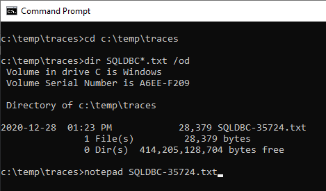
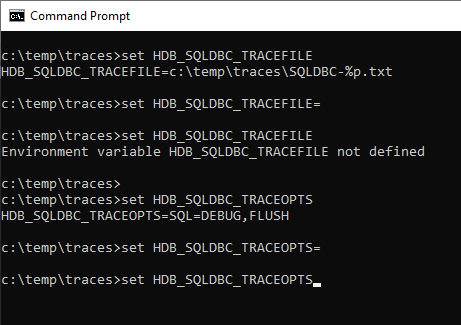

# Trace an SAP HANA Client Connection
<!-- description --> Enable trace settings for applications using SAP HANA Client interfaces.

## Prerequisites
 - You have completed the first 3 tutorials in this mission.

## You will learn
  - How to enable tracing using `hdbsqldbc_cons`, environment variables, or connection parameters
  - How to direct trace details to a file, `stdout`, `stderr`, or to a callback

## Intro
Trace files can help SAP Support diagnose unexpected behavior.

Tracing can be configured using executables included with the SAP HANA Client installation.  [SQLDBC](https://help.sap.com/docs/SAP_HANA_CLIENT/f1b440ded6144a54ada97ff95dac7adf/0c20691739094593855ece908b4a3cde.html)-based interfaces use `hdbsqldbc_cons`, except for [ODBC](https://help.sap.com/docs/SAP_HANA_CLIENT/f1b440ded6144a54ada97ff95dac7adf/35368f78f6884b019caee12c125b255a.html), which uses `hdbodbc_cons`.  For [JDBC](https://help.sap.com/docs/SAP_HANA_CLIENT/f1b440ded6144a54ada97ff95dac7adf/4033f8e603504c0faf305ab77627af03.html), use `ngdbc.jar`.   

Trace settings can also be configured using environment variables, or via connection parameters.  

---

### Enable Tracing


1. Enter the following command to see the current trace settings:  

    ```Shell
    hdbsqldbc_cons SHOW ALL
    ```

      

    > `hdbsqldbc_cons` utility can be found in the `sap/hdbclient` folder.  


2. To enable tracing of SQL statements at the INFO level, to enable tracing of TIMING info, and to specify the trace file location and name, enter the following commands:

    ```Shell (Microsoft Windows)
    hdbsqldbc_cons TRACE SQL ON LEVEL INFO
    hdbsqldbc_cons TRACE TIMING ON
    mkdir c:\temp\traces
    hdbsqldbc_cons TRACE FILENAME c:\temp\traces\SQLDBC-%p.txt
    ```

    ```Shell (Linux or Mac)
    hdbsqldbc_cons TRACE SQL ON LEVEL INFO
    hdbsqldbc_cons TRACE TIMING ON
    mkdir /tmp/traces
    hdbsqldbc_cons TRACE FILENAME /tmp/traces/SQLDBC-%p.txt
    ```

    The `%p` will be replaced with the process ID of the traced application. Including `%p` in the file name ensures that each process can write its own trace file.

    >The next step provides an example of sending the trace output to `stdout` or `stderr`.  Another option for Node.js applications is to specify a callback to receive the trace output to using the `onTrace` method which is shown in the tutorial [Connect Using the SAP HANA Node.js Interface](hana-clients-node)

    Example trace categories include:  

    - API
    - SQL
    - TIMING

    Some trace categories such as SQL also have severity levels:  

    - DEBUG
    - INFO
    - WARNING
    - ERROR
    - FATAL  

    For more information, see [SQLDBC Tracing](https://help.sap.com/docs/SAP_HANA_CLIENT/f1b440ded6144a54ada97ff95dac7adf/57e04b844d9f40d0bd5ca90f72629255.html).

    To see the current settings run:

    ```Shell
    hdbsqldbc_cons SHOW ALL
    ```

    

3. Run the following command to connect to HDBSQL and query for the status.  Since tracing is enabled, a trace file will be generated and can be used to see which SQL statements are called by `\s`.

    ```Shell
    hdbsql -U User1UserKey "\s"
    ```

4. Find and open the generated trace file.  Remember to replace #### to match the trace file name you wish to open.

    ```Shell (Microsoft Windows)
    cd c:\temp\traces
    dir SQLDBC*.txt /od
    notepad SQLDBC-####.txt
    ```

    ```Shell (Linux or Mac)
    cd /tmp/traces
    ls -lt
    pico SQLDBC-####.txt
    ```
    

    Notice that the trace settings are shown at the top of the file.  

    ```
    libSQLDBCHDB 2.16.18.1676320318
    SYSTEM: Microsoft Windows / X64
    BUILD AT: 2023-02-13 20:43:00
    BRANCH: unknown
    BUILD MODE: rel
    APPLICATION: C:\SAP\hdbclient\hdbsql.exe
    HOST: W-R90XC65K
    OS USER: I826567
    CURRENT DIRECTORY: c:\temp\traces
    TRACE FILE NAME: c:\temp\traces\SQLDBC-55652.txt
    PROCESS ID: 55652
    TRACE FILE WRAP COUNT: 0

    ---
    Enabled Traces:

    SQL Trace: Level INFO
    Distribution Trace: Level INFO
    Timing Trace

    ---
    ```

    If the trace settings change while tracing is enabled, the Enabled Traces section will appear again in the trace file.  

    >If you are experiencing issues with SQLDBC tracing, consult  [Troubleshooting SQLDBC Tracing](https://help.sap.com/docs/SAP_HANA_CLIENT/f1b440ded6144a54ada97ff95dac7adf/a1327e58f7c44d9e83972e6ea818dbe9.html).

5.  Search through the trace file and notice the SQL statements that were executed.

    ```
    ::PREPARE SQLCURS_1 2023-04-07 12:46:38.497000 [0x000002540c111af0]
    SQL COMMAND: SELECT VERSION FROM SYS.M_DATABASE
    ```


6. To turn off tracing for all categories, run the following command:

    ```Shell
    hdbsqldbc_cons TRACE OFF
    ```


### Additional Trace Settings


The following are some additional options for tracing.

1.  The FLUSH setting, when turned on, can reduce I/O activity.  If you are investigating a crash, it should be turned on to ensure that all the trace information is recorded.

    ```Shell
    hdbsqldbc_cons TRACE FLUSH ON
    ```

2.  Note that tracing should be turned off when not in use, as it does impact performance, memory and disk size.  The following are some additional options to limit the trace file size to 100 KB (plus an archive file) and to turn on tracing only when a specific error code occurs.  Error code 10 occurs when invalid credentials are used.

    ```Shell
    hdbsqldbc_cons TRACE SIZE 100K
    hdbsqldbc_cons TRACE ONLY ON ERROR 10
    ```

3.  In situations where `hdbsqldbc_cons` is not accessible, perhaps because a driver was installed directly using npm or pip, trace settings can be set using environment variables.

    ```Shell (Windows)
    set HDB_SQLDBC_TRACEFILE=c:\temp\traces\SQLDBC-%p.txt
    set HDB_SQLDBC_TRACEOPTS=SQL=INFO,FLUSH
    ```

    ```Shell (Linux or Mac)
    export HDB_SQLDBC_TRACEFILE=/tmp/traces/SQLDBC-%p.txt
    export HDB_SQLDBC_TRACEOPTS=SQL=INFO,FLUSH
    ```

    Trace settings in environment variables take precedence over those set using `hdbsqldbc_cons`.

    The environment variable values can be seen and removed with the following commands.  The first and last commands display what the environment variable is set to. The middle command removes the value of the environment variable.

    ```Shell (Windows)
    set HDB_SQLDBC_TRACEFILE
    set HDB_SQLDBC_TRACEFILE=
    set HDB_SQLDBC_TRACEFILE

    set HDB_SQLDBC_TRACEOPTS
    set HDB_SQLDBC_TRACEOPTS=
    set HDB_SQLDBC_TRACEOPTS
    ```

    ```Shell (Linux or Mac)
    printenv | grep HDB_SQLDBC_TRACE
    unset HDB_SQLDBC_TRACEFILE
    unset HDB_SQLDBC_TRACEOPTS
    printenv | grep HDB_SQLDBC_TRACE
    ```

    

4.  Trace information can be directed to `stdout` or `stderr`.  See below for a few examples.

    ```Shell
    hdbsql -U User1UserKey -Z traceFile=stdout -Z traceOptions=sql=warning "SELECT * FROM HOTEL.CUSTOMER"
    ```

    ```Shell
    set HDB_SQLDBC_TRACEOPTS=SQL=WARN
    set HDB_SQLDBC_TRACEFILE=stdout
    hdbsql -U User1UserKey "SELECT * FROM HOTEL.CUSTOMER"
    set HDB_SQLDBC_TRACEOPTS=
    set HDB_SQLDBC_TRACEFILE=
    ```

5.  Tracing can also be enabled in an application's connection properties.  For further details see `traceFile` and `traceOptions` in [SQLDBC Connection Properties](https://help.sap.com/docs/SAP_HANA_CLIENT/f1b440ded6144a54ada97ff95dac7adf/f6fb06ffe4484f6fa61f10082b11663d.html).

### Tracing a JDBC Connection

Java must be installed in order to complete the following steps. To check if it is installed, run the following commands:
```Shell
java -version
javac -version
```

1. To show the current JDBC tracing configuration, run the following command:

    ```Shell (Windows)
    java -jar C:\SAP\hdbclient\ngdbc.jar SHOW
    ```

    ```Shell (Linux or Mac)
    java -jar ~/sap/hdbclient/ngdbc.jar SHOW
    ```

    Alternatively, the trace settings can be viewed and set using a GUI.

    ```Shell (Windows)
    java -jar C:\SAP\hdbclient\ngdbc.jar
    ```


    ```Shell (Linux or Mac)
    java -jar ~/sap/hdbclient/ngdbc.jar
    ```


    


2. Turn on the tracing for SQL statements using either the GUI or the commands below:

    ```Shell (Windows)
    java -jar C:\SAP\hdbclient\ngdbc.jar TRACE ON
    java -jar C:\SAP\hdbclient\ngdbc.jar TRACE FILENAME C:\temp\traces\jdbctrace
    java -jar C:\SAP\hdbclient\ngdbc.jar TRACE API ON
    ```


    ```Shell (Linux and Mac)
    java -jar ~/sap/hdbclient/ngdbc.jar TRACE ON
    java -jar ~/sap/hdbclient/ngdbc.jar TRACE FILENAME ~/tmp/traces/jdbctrace
    java -jar ~/sap/hdbclient/ngdbc.jar TRACE API ON
    ```

    >The different command-line option keywords can be found at [JDBC Tracing and Trace Options](https://help.sap.com/docs/SAP_HANA_CLIENT/f1b440ded6144a54ada97ff95dac7adf/4033f8e603504c0faf305ab77627af03.html).

3.  Execute a query which will generate a trace file.

    ```Shell 
    java -jar c:\sap\hdbclient\ngdbc.jar -k USER1UserKey -o encrypt=True -o validatecertificate=false -c "SELECT * FROM HOTEL.CUSTOMER"
    ```

4.  Examine the trace file by using the `cat` command (Linux or Mac) or the `type` command on Windows.


    ```
    <html><head><meta http-equiv="Content-Type" content="text/html; charset=utf-8"></head><body><PRE><PLAINTEXT>
    Java version:   11
    ClassLoader:    jdk.internal.loader.ClassLoaders$AppClassLoader@30946e09
    Process ID:     47584
    Driver version: package com.sap.db.jdbc, JDBC, version 4.2, SAP HANA JDBC Driver, SAP SE, 2.16.9-62f3b9598d4106abb5cce5562c88d3abecca5580

    Trace configuration:
    Levels:                                       API,PACKET,CONNECTIONS,CLEANERS
    Show plain-text client-side encrypted values: Disabled
    Show timestamps:                              Disabled
    Show elapsed times:                           Disabled
    Trace file size:                              Unlimited
    Stop on error:                                Disabled

    ...

    com.sap.db.jdbc.HanaConnectionClean@731f8236[ID:202968].createStatement()
    => com.sap.db.jdbc.HanaStatement@117159c0
    com.sap.db.jdbc.HanaStatement@117159c0.execute("SELECT * FROM HOTEL.CUSTOMER")
    ```

5.  Tracing information can be sent to `stdout` or `stderr` as shown below.

    ```Shell (Windows)
    java -jar c:\sap\hdbclient\ngdbc.jar -k User1UserKey -o traceFile=stdout -o traceOptions=CONNECTIONS -c "SELECT * FROM HOTEL.CUSTOMER"
    ```

    ```Shell (Linux or Mac)
    java -jar ~/sap/hdbclient/ngdbc.jar -k USER1UserKey -o traceFile=stdout -o traceOptions=CONNECTIONS -c "SELECT * FROM HOTEL.CUSTOMER"
    ```


6.  Tracing can also be enabled via the connection parameters.  For further details see [Trace a JDBC Connection Using a Connection String](https://help.sap.com/docs/SAP_HANA_CLIENT/f1b440ded6144a54ada97ff95dac7adf/250544c4c9f74855862a40a78d4ee3b5.html).

### Knowledge check

Congratulations, you have now configured tracing with the SAP HANA client!


---
