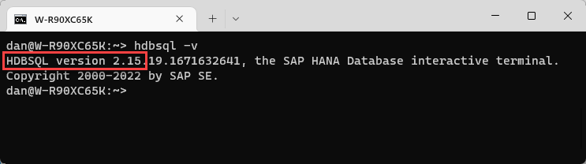
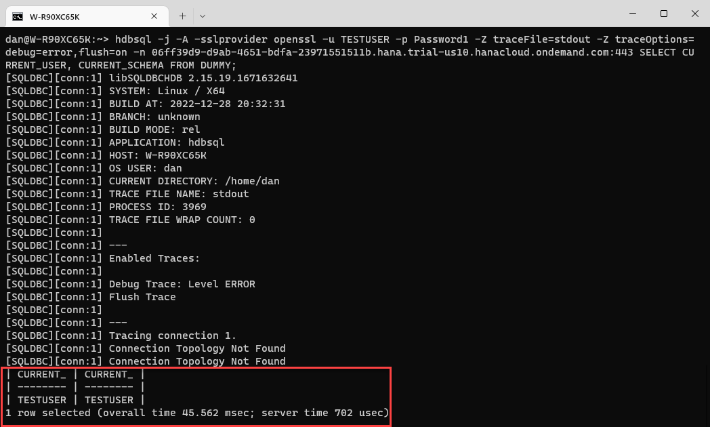
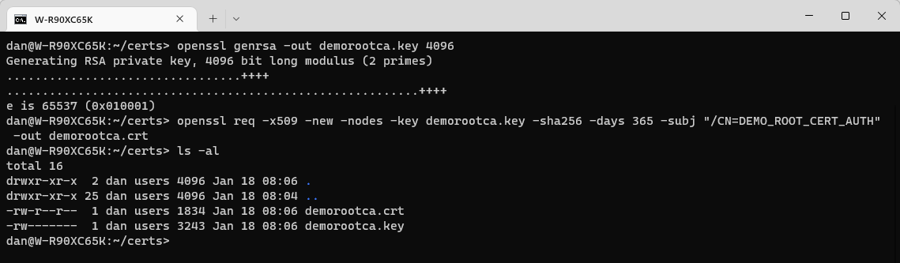
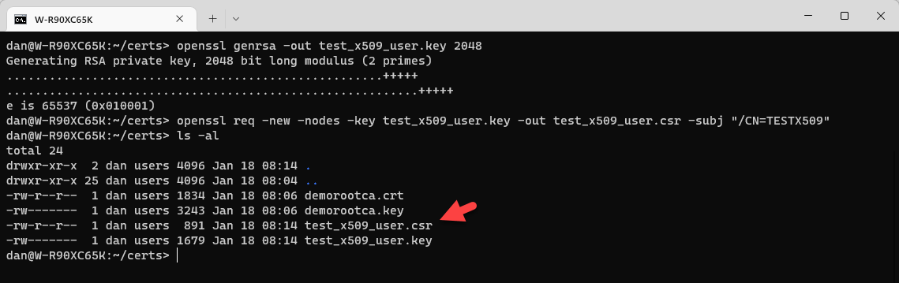
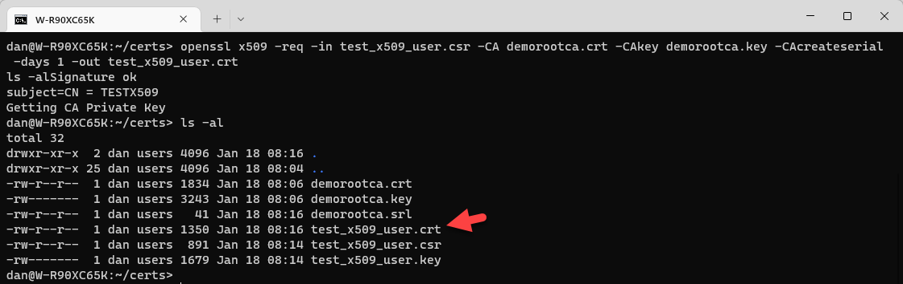
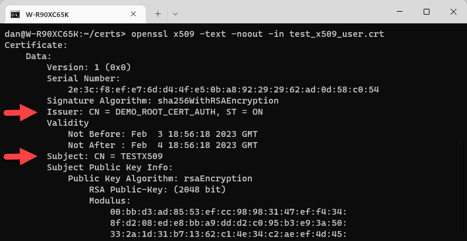

# Authenticate to SAP HANA Cloud using X.509
<!-- description --> Complete the provided steps to configure an SAP HANA Cloud, SAP HANA database instance to accept a login using an X.509 certificate.  Examples will be provided to connect from HDBSQL and a Node.js application on Microsoft Windows, Linux, or macOS.

## Prerequisites
 - Access to and administrative rights to an SAP HANA Cloud instance such as a free-tier or trial account
 - The SAP HANA Client installed on Microsoft Windows, Linux, or macOS
 - An installation of Node.js

## You will learn
  - How to create a client X.509 certificate for a non productive or demo system
  - How to configure SAP HANA Cloud to accept authentication requests using X.509
  - How to use the client certificate in HDBSQL and in a Node.js application for authentication to SAP HANA

## Intro
As described at [User Authentication Mechanisms](https://help.sap.com/docs/HANA_CLOUD_DATABASE/c82f8d6a84c147f8b78bf6416dae7290/41e72ea5aef34cca84f128508244a73b.html), there are multiple methods to authenticate a user when connecting to an SAP HANA Cloud database.  A very common mechanism is a user name and password.  This tutorial demonstrates [X.509 Certificate-Based User Authentication](https://help.sap.com/docs/HANA_CLOUD_DATABASE/c82f8d6a84c147f8b78bf6416dae7290/2b335f7eec6a450095f110ea961d77cc.html).  

X.509 certificates can be generated with a user supplied validity period, in addition to not being prone to phishing attacks. They can also be used in single sign-on environments and for technical users.  A self-signed certificate authority will be created and used to sign a client certificate.  An SAP HANA instance will be configured to trust certificates signed by the certificate authority.  On authentication, the provided client certificate is matched to a database user.

---

### Setup
The SAP HANA Client can use different [cryptographic service providers](https://help.sap.com/docs/SAP_HANA_PLATFORM/b3ee5778bc2e4a089d3299b82ec762a7/2e7af7fcb38f4ac6a21d17440277bd52.html) on the operating systems shown below.  

**Note**: these steps will vary slightly depending on the operating system and security library used.

|Operating System|Security Library|X.509 Support|
|:--------------|:---------------|:-------------|
|Microsoft Windows| SAP Cryptographic Library | Yes |
|Microsoft Windows| MSCrypto | No |
|Linux| OpenSSL | Yes | 
|Linux| SAP Cryptographic Library | Yes | 
|macOS| LibreSSL | Yes |
|macOS| SAP Cryptographic Library | Yes |


Before proceeding, ensure that basic connectivity is working with a user name and password.  The steps below check the version of the SAP HANA Client, creates a test user, and attempts to connect using basic authentication with mscrypto or OpenSSL.  The SQL commands can be run by an admin user such as DBADMIN in the SAP HANA database explorer or hdbsql.

1. Check the version of SAP HANA Client on your machine.  

    ```Shell
    hdbsql -v 
    ```

    

2. Go to HANA Cloud Central and open a SQL console for your SAP HANA instance.
   
    

    Execute the following SQL to create a user to attempt to connect with.

    ```SQL
    CREATE USER TESTUSER PASSWORD Password1 NO FORCE_FIRST_PASSWORD_CHANGE SET USERGROUP DEFAULT;
    ```

    

3. Attempt to connect with hdbsql using basic authentication. Be sure to replace the SQL endpoint value with the SQL endpoint of your HANA instance.

    ```Shell (Microsoft Windows)
    hdbsql -j -A -sslprovider mscrypto -u TESTUSER -p Password1 -Z traceFile=stdout -Z traceOptions=debug=warning,flush=on -n xxxxxxxx-xxxx-xxxx-xxxx-xxxxxxxxxxxx.hana.trial-us10.hanacloud.ondemand.com:443 "SELECT CURRENT_USER, CURRENT_SCHEMA FROM DUMMY;"
    ```


    ```Shell (Linux or Mac)
    hdbsql -j -A -sslprovider openssl -u TESTUSER -p Password1 -Z traceFile=stdout -Z traceOptions=debug=warning,flush=on -n xxxxxxxx-xxxx-xxxx-xxxx-xxxxxxxxxxxx.hana.trial-us10.hanacloud.ondemand.com:443 "SELECT CURRENT_USER, CURRENT_SCHEMA FROM DUMMY;"
    ```

    


### Create a demo certificate authority
Perform the following steps in your selected environment.  The result will be a directory named `certs` containing a private key and a public certificate for a new certificate authority.  In a non-demo environment, a trusted certification authority could be used instead.  

Any environment with SAP HANA Client installed and that contains a recent OpenSSL version should work.  
 
>This tutorial used a Git Bash shell on Microsoft Windows.  On Windows, a forward slash may need to be entered twice, such as `-subj "//CN=DEMO_ROOT_CERT_AUTH"`.

1. Verify that OpenSSL is installed.

    ```Shell
    openssl version
    ```

    If OpenSSL is installed a value such as "OpenSSL 3.1.1 30 May 2023" will be shown.

    >LibreSSL will appear instead of OpenSSL when using macOS.

2. Create a folder where the generated certificates will be stored.  Create a private key and public certificate for a self-signed certificate authority.

    ```Shell
    mkdir ~/certs
    cd ~/certs
    openssl genrsa -out demorootca.key 4096
    openssl req -x509 -new -nodes -key demorootca.key -sha256 -days 365 -subj "/CN=DEMO_ROOT_CERT_AUTH/ST=ON" -out demorootca.crt
    ls -al
    ```

    

    Further details on OpenSSL commands can be found at [OpenSSL commands](https://www.openssl.org/docs/man1.1.1/man1/). 


### Create a client certificate

1. Create a private user key and a certificate signing request.

    ```Shell
    openssl genrsa -out test_x509_user.key 2048
    openssl req -new -nodes -key test_x509_user.key -out test_x509_user.csr -subj "/CN=TESTX509"
    ls -al
    ```

    


2. Create a client certificate that has been signed by the certificate authority.

    ```Shell (Linux or Mac)
    openssl x509 -req -in test_x509_user.csr -CA demorootca.crt -CAkey demorootca.key -CAcreateserial -days 1 -out test_x509_user.crt
    ls -al
    ```


    ```Windows
    openssl x509 -req -in test_x509_user.csr -CA demorootca.crt -CAkey demorootca.key -CAcreateserial -days 1 -out test_x509_user.crt
    ls -al
    ```

    


3. Perform the following steps in your selected environment to verify that the user certificate has been signed by the certificate authority.

    ```Shell
    openssl verify -CAfile demorootca.crt test_x509_user.crt
    ```

4. Display the client certificate using openssl and by examining the certificate once imported into SAP HANA.

    Use openSSL to display the certificate.
    
    ```Shell
    openssl x509 -text -noout -in test_x509_user.crt
    ```

    

    You can view the contents of the certificate in a notepad editor by using the following command:


    ```Shell
    notepad test_x509_user.crt
    ```


    Open the SQL Console for your SAP HANA database instance. Import the certificate into SAP HANA and view the certificate by executing the following.

    ```SQL
    CREATE CERTIFICATE X509_USER_CERT FROM '-----BEGIN CERTIFICATE-----
    MIIDuDCCAaACFD8uRrS2MgGqakcJZ6bPOyl7f5NfMA0GCSqGSIb3DQEBCwUAMB4x
    ...
    eHDFB5AyicWtbXoqVohrcv1QIG9S5eFP3ub5ijruUatC0UTVRyWMLjZtvDY=
    -----END CERTIFICATE-----';
    SELECT CERTIFICATE_NAME, SUBJECT_DISTINGUISHED_NAME, ISSUER_DISTINGUISHED_NAME, ISSUER_COMMON_NAME FROM CERTIFICATES WHERE CERTIFICATE_NAME='X509_USER_CERT';
    --DROP CERTIFICATE X509_USER_CERT;  --This cert is only imported so we can view it.  It can be dropped at any time 
    ```

    

    Notice that the value of the ISSUER_DISTINGUISHED_NAME is slightly different than what was specified when the certificate authority was originally created.  The State or ST value is shown as SP.  Additional details on this can be found at [SAP Note: 2094102 - Certificate DName attributes mapping between RFC 2256 and the CommonCryptoLib](https://launchpad.support.sap.com/#/notes/2094102).  This becomes important in step 6 when an X.509 certificate provider is created.


### Create a PEM and Personal Security Environment (PSE) file for the SAP HANA Client

The details of the client certificate needed for authentication will be stored in a [PEM](https://en.wikipedia.org/wiki/Privacy-Enhanced_Mail) file when using OpenSSL or a Personal Security Environment (PSE) file when using SAP CommonCryptoLib.  A PSE can either be file based or be an object in the SAP HANA database.  The SAP HANA Client needs to be able to access certificate details when connecting to the database and hence needs the certificate details to be stored in a file.

```Shell (Linux or Mac)
cat test_x509_user.key test_x509_user.crt demorootca.crt > test_x509_user.pem
```

>The below step is only required when SAP CommonCryptoLib is used.
```Shell
sapgenpse import_p8 -p ~/certs/test_x509_user.pse -x "" ~/certs/test_x509_user.pem
```

Additional details on sapgenpse can be found by entering `sapgenpse -h or sapgenpse import_p8 -h`.


### Add the demorootca.crt to the CERTIFICATES table

To view the contents of the `demorootca.crt` file, execute the following command.

```Shell
cat demorootca.crt
```

In the SAP HANA Cloud Central SQL Console, execute the following SQL to create a certificate from the self-signed certificate authority.  


```SQL
CREATE CERTIFICATE DEMOROOTCA_CERT FROM '';  --Past the contents of the demorootca.crt file
--It may also be of interest to import the test_x509_user.crt file and view its contents with the query below.
SELECT CERTIFICATE_NAME, SUBJECT_DISTINGUISHED_NAME, ISSUER_DISTINGUISHED_NAME, ISSUER_COMMON_NAME  FROM CERTIFICATES WHERE CERTIFICATE_NAME = 'DEMOROOTCA_CERT';
```


Further details can be found at [CREATE CERTIFICATE Statement](https://help.sap.com/docs/HANA_CLOUD_DATABASE/c1d3f60099654ecfb3fe36ac93c121bb/ba87935fc4a84f4eb805d5eba9a7b480.html).

### Create an X.509 provider and Personal Security Environment (PSE)
Execute the following queries in SAP HANA SQL Console in HANA Cloud Central.  


```SQL
CREATE X509 PROVIDER DEMO_X509_PROVIDER WITH ISSUER 'SP=ON, CN=DEMO_ROOT_CERT_AUTH';
SELECT * FROM X509_PROVIDERS;
CREATE PSE X509_PSE;
SELECT * FROM PSES;
ALTER PSE X509_PSE ADD CERTIFICATE DEMOROOTCA_CERT;
SELECT * FROM PSE_CERTIFICATES;
SET PSE X509_PSE PURPOSE X509 FOR PROVIDER DEMO_X509_PROVIDER;
SELECT * FROM PSES;
```

There must be a match between the issuer value in the X509 provider and the ISSUER_DISTINGUISHED_NAME of the client certificate.  The needed value was shown at the end of step 3.

Further details can be found at [CREATE X509 PROVIDER Statement](https://help.sap.com/docs/HANA_CLOUD_DATABASE/c1d3f60099654ecfb3fe36ac93c121bb/3b3163d6ad0f4eb9bd73c7c060f49649.html) and [CREATE PSE statement](https://help.sap.com/docs/HANA_CLOUD_DATABASE/c1d3f60099654ecfb3fe36ac93c121bb/4d80bf63fc374a7f99be94d8ce70a07a.html).  

### Create a database user
Execute the following SQL statement to create a database user.


```SQL
CREATE USER TESTX509_TECHNICAL WITH IDENTITY 'CN=TESTX509' FOR X509 PROVIDER DEMO_X509_PROVIDER SET USERGROUP DEFAULT;
```


The above is known as an explicit mapping.  The common name, or CN value, in the user matches to CN value in the client certificate.  It is also possible to use matching rules specified on the provider.  

Further details can be found at [CREATE USER Statement](https://help.sap.com/docs/HANA_CLOUD_DATABASE/c1d3f60099654ecfb3fe36ac93c121bb/20d5ddb075191014b594f7b11ff08ee2.html).

### Connect from a Linux or macOS Client with HDBSQL using X.509 and OpenSSL
Use hdbsql to connect to a HANA instance using a certificate.  Adjust the location of the test_x509_user.pem and the host and port values accordingly.

```Shell (Linux or Mac)
hdbsql -j -A -sslprovider openssl -Z authenticationMethods=x509 -Z authenticationX509=test_x509_user.pem -Z traceFile=stdout -Z traceOptions=debug=error,flush=on -n xxxxxxxx-xxxx-xxxx-xxxx-xxxxxxxxxxxx.hana.trial-us10.hanacloud.ondemand.com:443  "SELECT CURRENT_USER, CURRENT_SCHEMA FROM DUMMY;"
```


Some of the used connection options are summarized in the table below.  Further details can be found at [SAP HANA HDBSQL Options](https://help.sap.com/docs/SAP_HANA_CLIENT/f1b440ded6144a54ada97ff95dac7adf/c24d054bbb571014b253ac5d6943b5bd.html) and [SQLDBC Connection Properties](https://help.sap.com/docs/SAP_HANA_CLIENT/f1b440ded6144a54ada97ff95dac7adf/f6fb06ffe4484f6fa61f10082b11663d.html)  

|hdbsql Option |Description|
|:--------------|:---------------|
| j | switch the page by page scroll output off |
| A | switch to aligned output mode |
| sslprovider | Specifies the crypto provider to use such as commoncrypto, OpenSSL, mscrypto |
| Z | sets SQLDBC connect options | 
| authenticationMethods | A comma-separated list of authentication methods to be used by the client |
| authenticationX509 | A string containing the X509 certificate or the name of a file containing the X509 certificate |

### Connect from a Linux, macOS, or Microsoft Windows Client with HDBSQL using X.509 and SAP Cryptographic Library (CommonCryptoLib)

1. A few steps are required to enable the usage of CommonCryptoLib such as the setting of an environment variable named SECUDIR to the location of the SAP HANA Client install and the creation of a personal security environment file that contains the root certificate of the SAP HANA Cloud database. Follow the steps documented in the tutorial [Create a User, Tables and Import Data Using SAP HANA HDBSQL](hana-clients-hdbsql) (in a note in substep step 1) to use commoncrtypo.

2. Connect using CommonCryptoLib.

    Notice that the changes are to the parameters sslprovider and the pse is used rather than the pem for the authenticationX509 parameter. Adjust the location of the test_x509_user.pse if necessary and be sure to replace the placeholder SQL endpoint with the SQL endpoint of your instance.

    ```Shell
    hdbsql -j -A -sslprovider commoncrypto -Z authenticationMethods=x509 -Z authenticationX509=~/certs/test_x509_user.pse -Z traceFile=stdout -Z traceOptions=debug=error,flush=on -n xxxxxxxx-xxxx-xxxx-xxxx-xxxxxxxxxxxx.hana.trial-us10.hanacloud.ondemand.com:443  "SELECT CURRENT_USER, CURRENT_SCHEMA FROM DUMMY;"
    ```

    >When using macOS, you may need to specify the full path to the PSE file instead of using ~.

    

### Connect from a Node.js app using X.509 and OpenSSL or CommonCryptoLib

1. Create a folder named `nodeX509OpenSSL` and enter the newly created directory.

    ```Shell (Microsoft Windows)
    mkdir %HOMEPATH%\HANAClientsTutorial\nodeX509OpenSSL
    cd %HOMEPATH%\HANAClientsTutorial\nodeX509OpenSSL
    ```


    ```Shell (Linux or Mac)
    mkdir $HOME/HANAClientsTutorial/nodeX509OpenSSL
    cd $HOME/HANAClientsTutorial/nodeX509OpenSSL
    ```

2. Initialize the project and install the `hana-client` driver from NPM.

    ```Shell
    npm init -y
    npm install @sap/hana-client
    ```

3. Open a file named `nodeQuery.js` in an editor.

    Substitute `pico` or notepad below for your preferred text editor.  

    ```Shell (Microsoft Windows)
    notepad nodeQuery.js
    ```

    ```Shell (Linux or Mac)
    pico nodeQuery.js
    ```


4. Add the code below to `nodeQuery.js`.  

    ```JavaScript
    'use strict';
    var util = require('util');
    var hana = require('@sap/hana-client');

    var connOptions = {
        //Option 1, retrieve the connection parameters from the hdbuserstore
        serverNode: '@X509UserKey',  //host, port, authenticationMethod, and pem retrieved from hdbuserstore

        //Option 2, specify the connection parameters rather than use the values from a key
        //serverNode: 'host:port',
        //authenticationX509: '~/certs/test_x509_user.pem', //.pem if using OpenSSL and .pse  if using commoncrypto
        //authenticationX509: 'C:\\Users\\xxx\\certs\\test_x509_user.pse',  //Microsoft Windows


        //sslValidateCertificate: 'false',  //Must be set to false when connecting to an on-premise instance that uses a self-signed certificate.
        //traceFile: 'stdout',
        //traceOptions: 'debug=error,flush=on',
        sslCryptoProvider: 'openssl',  //openssl or commoncrypto
        authenticationMethods: 'x509'
    };

    var connection = hana.createConnection();

    connection.connect(connOptions);

    var sql = 'select CURRENT_USER FROM DUMMY;';
    var result = connection.exec(sql);
    console.log(util.inspect(result, { colors: false }));
    connection.disconnect();
    ```

    >If you are using commoncrypto, be sure to replace the contents of `sslCryptoProvider` with `commoncrypto`.  
          
    >The values for host, port, and pem can be retrieved from an `hdbuserstore` key, such as X509UserKey, or they can be specified in the application. Be sure to replace the placeholder SQL endpoint with the SQL endpoint of your instance.
    >
    >```Shell
    >hdbuserstore SetX509 X509UserKey xxxxxxxx-xxxx-xxxx-xxxx-xxxxxxxxxxxx.hana.trial-us10.hanacloud.ondemand.com:443 ~/certs/test_x509_user.pem
    >hdbuserstore list
    >```
    > 

5. Run the app 

    ```Shell
    node nodeQuery.js
    ```

    
    

6. Should you wish to use SAP CommonCryptoLib, make sure the changes in the previous step to set were completed and then change the parameter sslCryptoProvider from openssl to commoncrypto and the authenticationX509 parameter to point to the pse file.

### Cleanup (optional)

You may execute the following statements to undo the steps in this tutorial.

```SQL
DROP USER TESTX509_TECHNICAL;
DROP PSE X509_PSE;
DROP CERTIFICATE DEMOROOTCA_CERT;
DROP X509 PROVIDER DEMO_X509_PROVIDER;
```


```Shell (Microsoft Windows)
cd %HOMEPATH%/certs
del * /Q
```


```Shell (Linux or Mac)
cd ~/certs
rm *
```


### Knowledge check

Congratulations! You have now used an X.509 client certificate when connecting to an SAP HANA Cloud database.


---
