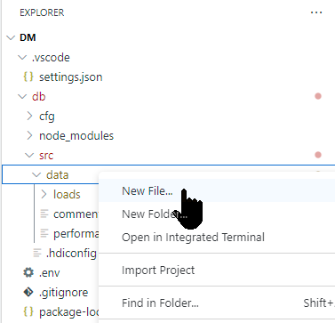
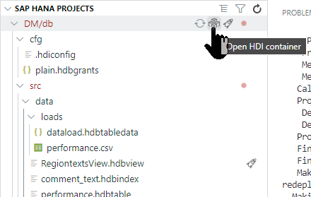

## Prerequisites
- You have access to SAP HANA Cloud.
- You have created an SAP HANA Database Project [as explained in this tutorial](hana-cloud-create-db-project).

## Details
### You will learn
  - How to create a plain schema, with a table and user to simulate a replicated schema
  - How to create a user-provided service to access a database in SAP HANA Cloud
  - How to grant permissions to the technical users in your HDI container to access the database

This tutorial is meant to be an example of cross-container access. Simple data models and loading mechanisms were chosen to simulate a schema replicated using tools such as SAP Landscape Transformation or an ABAP schema.

For more information on this process and additional syntax options, refer to the [official documentation on SAP Help](https://help.sap.com/viewer/4505d0bdaf4948449b7f7379d24d0f0d/latest/en-US/a260b05631a24a759bba932aa6d81b64.html).

If you are looking for the steps for an on-premise SAP HANA instance with XS Advanced, such as SAP HANA, express edition, [refer to this tutorial](xsa-create-user-provided-anonymous-service).

A video version of this tutorial is also available:

<iframe width="560" height="315" src="https://www.youtube.com/embed/ItEvMHWGak0" frameborder="0" allow="accelerometer; autoplay; clipboard-write; encrypted-media; gyroscope; picture-in-picture" allowfullscreen></iframe>

---

[ACCORDION-BEGIN [Step 1: ](Create a plain schema)]

1. Return to the SAP BTP cockpit and the HANA Cloud Management screen. Choose **Open SAP HANA Database Explorer** from the **Actions** column.

    !

2. The Database Explorer will open in another browser tab and the DB entry for your DBADMIN user will be selected. Choose **Open SQL Console** from the context menu

    !

3. Use the following code to create a schema and a user. You will also create a simple table to use as an example for cross-container access.

    You will create a SQL role and assign it to the user `PLUSR` with the permissions granted manually before. This user will be used for the connection between the HDI container and the plain schema, and will grant the role to the HDI container technical user.

    ```sql
    CREATE SCHEMA "PLAIN";
    CREATE USER PLUSR PASSWORD "HanaRocks01" SET USERGROUP DEFAULT;
	  ALTER USER PLUSR DISABLE PASSWORD LIFETIME;

    CREATE ROW TABLE "PLAIN"."REGIONS" (	REGION NVARCHAR(5), 	DESCRIPTION NVARCHAR(100) );

    CREATE ROLE CCROLE;
    grant  SELECT, UPDATE, INSERT, DELETE, EXECUTE, SELECT METADATA ON SCHEMA "PLAIN" TO CCROLE with grant option;
    grant  CCROLE to PLUSR with admin option;

    ```

4. Use the green play button or press **`F8`** to execute the statement.

    !

> ## What is going on?
>
>&nbsp;
>You have created a plain schema in your SAP HANA database. When you [created a database module in SAP Business Application Studio](hana-cloud-create-db-project), an HDI container was automatically generated.
>&nbsp;
>
> 
>
>&nbsp;
>
> But ultimately these are both just schemas within the same HANA Cloud Database instance. We can communicate between the HDI Container Schema and the classic Schema using synonyms.


[DONE]
[ACCORDION-END]

[ACCORDION-BEGIN [Step 2: ](Load data)]

1. Download this CSV file `https://raw.githubusercontent.com/SAPDocuments/Tutorials/master/tutorials/hana-cloud-access-cross-container-schema/plain.csv` into your local computer.

2. Use the search help to locate schema `PLAIN`.

    !

3. Click on **Tables**. Right-click on the `REGIONS` table and select **Import Data**

    !

4. Choose **Import Data** and press **Step 2**

    !

5. Choose **Local** as the Import Source. **Browse** for the file you have just downloaded. Press **Step 3**.

    !

6. Keep `PLAIN` and `REGIONS` as the target and click **Step 4**

    !

7. Keep the default table mapping and click **Step 5**

    !

8. Click **Review**

    !

9. Use **Import Into Database** to load the records

    !

10. You should see the wizard has imported 4 records

    !

11. Right-click on the table and choose **Open Data** to see the records loaded into the table.

    !

[DONE]
[ACCORDION-END]


[ACCORDION-BEGIN [Step 3: ](Create a user-provided service)]

You now have a schema with a table and data in it. You have also created a user called `PLUSR` with permissions to perform basic operations on that schema. You will now create a user-provided service to access the schema through the user `PLUSR` from your HANA DB Project in the Business Application Studio.

1.  Return to the SAP Business Application Studio and the project which you created in previous tutorials in this group. Open a new Terminal

    !

2. Issue this command from the Terminal

    ```ssh
    cf cups CC_ACCESS -p "{\"user\":\"PLUSR\",\"password\":\"HanaRocks01\",\"tags\":[\"hana\"] , \"schema\" : \"PLAIN\" }"
    ```

    !

3. Use  **add database connection** option in the SAP HANA PROJECTS view.

    !

4. In the **Add Database Connection** wizard that opens, please select **Existing User-Provided service instance** as the **Connection Type** and then choose `CC_ACCESS` as the User-Provided service instance we just created. Press **Add**

    !

5. From the SAP HANA PROJECTS view, you should see that the User Provided Service is now part of the Database Connections of your project.

    !

[DONE]
[ACCORDION-END]

[ACCORDION-BEGIN [Step 4: ](Grant permissions to technical users)]

You will now create an artifact that grants access to the two technical users of your HDI container. These are not real users, but technical ones.

1. Create a new file under `db`.

    !

2. Call it `cfg/plain.hdbgrants`

    !

3. And use the following code in it:

    ```json
    {
      "CC_ACCESS": {
        "object_owner" : {
          "roles" : ["CCROLE" ]
        },
        "application_user" : {
          "roles" : ["CCROLE" ]
        }
      }
    }
    ```

4. **Save the file**.


[DONE]
[ACCORDION-END]

[ACCORDION-BEGIN [Step 5: ](Create synonyms)]

1. You can now create a synonym to access the table in the plain schema. Create a new file in `db\src\data`

    !

2. Call it `regions.hdbsynonym`.

    !

3. Add a new record with name `REGIONS`, object name `REGIONS` and schema `PLAIN`

    !


4. **Deploy** the entire **db** module.

    !


[DONE]
[ACCORDION-END]

[ACCORDION-BEGIN [Step 6: ](Create a view)]

1. You can now use the table in the classic schema with other objects created in your HDI container.  In `data` folder, create a new database artifact

    !

2. Choose `hdbview` and call it `RegiontextsView`

    !

3. Paste the following code into the view.

    ```sql
    VIEW "RegionTextsView"
    	(REGION, DESCRIPTION )
    	as select REGION, DESCRIPTION
    	from REGIONS
    ```

4. **Save and Deploy**.

5. Return to the Database Explorer and your HDI Container.

    !

6. Right-click on the view and choose **Open Data**. Paste the generated SQL statement in the box below to complete the validation.

    !

[VALIDATE_1]
[ACCORDION-END]

[ACCORDION-BEGIN [Step 7: ](Troubleshooting insufficient privileges)]

**Error**: Insufficient privilege: Detailed info for this error can be found with `guid` <GUID>

You can see what is missing by executing the following statement in a SQL console connected to the database

```sql
 call SYS.GET_INSUFFICIENT_PRIVILEGE_ERROR_DETAILS ('<GUID>', ?)
```

This procedure will show the session user name, the technical user (HDI object owner) executing the statement, the privilege (e.g., `SELECT`) and some flags starting with `IS_MISSING`. A `TRUE` value under one of those flags indicates missing authorizations.

Make sure the user in the user provided service has permissions for `SELECT` and `SELECT METADATA` with grant option.

[DONE]
[ACCORDION-END]

---
