# Take Action Following a SAP HANA Cloud Database Alert with SAP Automation Pilot
<!-- description --> Learn how the SAP Automation Pilot can be used together with the SAP Alert Notification service for SAP BTP to react to a SAP HANA database alert.

## Prerequisites
 - Have completed the tutorial [Alerts in SAP HANA Database and Data Lake](hana-cloud-alerts) that covers alerts and the Alert Notification service.
 - Access to the SAP Business Technology Platform (BTP) that includes the SAP HANA Cloud, SAP Alert Notification service, and the SAP Automation Pilot.  These services are available in the free tier.
 - An SAP HANA Cloud instance deployed to the Cloud Foundry runtime.

## You will learn
  - How to setup and become familiar with the SAP Automation Pilot
  - How to create a catalog, an input, and a custom command with multiple executors that will request a storage resize of a SAP HANA database instance
  - How to trigger a SAP Automation Pilot command from the Alert Notification service

## Intro
A SAP HANA Cloud database or a data lake Relational Engine instance have a set of built-in alerts that when triggered, are sent to the SAP Alert Notification service (ANS).  This service, in addition to being able to forward details of the alert to various channels (email, Microsoft Teams, Slack, etc.), can trigger a [SAP Automation Pilot](https://discovery-center.cloud.sap/serviceCatalog/automation-pilot?region=all) command.  In this tutorial, a command will be created to attempt to resolve a disk use alert.

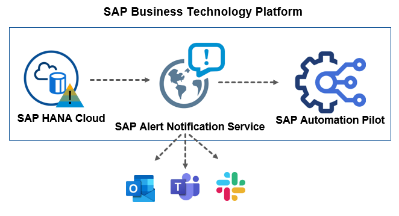

SAP Automation Pilot includes [provided commands](https://help.sap.com/viewer/de3900c419f5492a8802274c17e07049/Cloud/en-US/5bbe7dba99d24caeafddf7fa62dc63b9.html) for various services in the BTP, a [scheduler](https://help.sap.com/viewer/de3900c419f5492a8802274c17e07049/Cloud/en-US/96863a2380d24ba4bab0145bbd78e411.html), and the ability to create new commands.  Examples of the provided commands for a SAP HANA Cloud, SAP HANA database include start, stop, and restart and for Cloud Foundry include `GetCfServiceInstance` and `UpdateCfServiceInstance`.  Commands can be created using a BASH script, Python, Node.js or Perl as described at [Execute Script](https://help.sap.com/viewer/de3900c419f5492a8802274c17e07049/Cloud/en-US/d0854dbb80d84946bb57791db94b7e20.html).

This tutorial will demonstrate the integration between a triggered database alert, SAP Alert Notification service, SAP Automation Pilot, and concludes with an example of requesting a storage resize of a SAP HANA database instance based on a disk usage alert.


---

### Get started with the SAP Automation Pilot service


The following steps demonstrate how to subscribe to the SAP Automation Pilot service and explore some basic concepts such as commands, inputs, and executions.  

1. In the SAP BTP Cockpit, at the subaccount level, in one of the [supported regions](https://help.sap.com/viewer/de3900c419f5492a8802274c17e07049/Cloud/en-US/4536e41c57aa442095ccbac977965f26.html), select **Service Marketplace**, then from the Automation Pilot tile select **Create** to create a subscription to the SAP Automation Pilot service.

    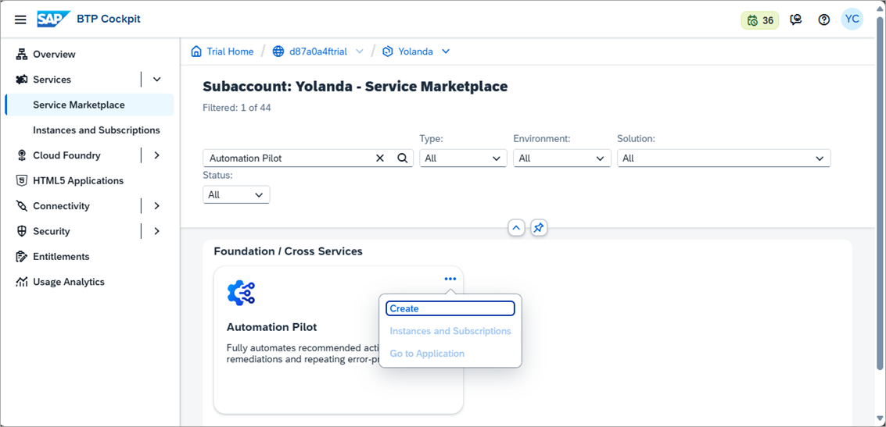

    >If the Automation Pilot service does not appear, it may be that the entitlement needs to be added to the subaccount.  To do so, navigate to the subaccount, select **Entitlements**, **Configure Entitlements**, **Add Service Plans**, select **Automation Pilot**, and add a plan such as free or standard.

    > 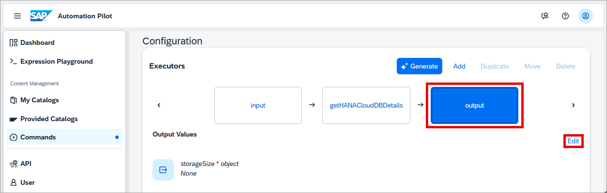

    > ---

    > The SAP Automation Pilot subscription can be located in a different global account or sub account from the SAP Alert Notification service and the SAP HANA Cloud database.

    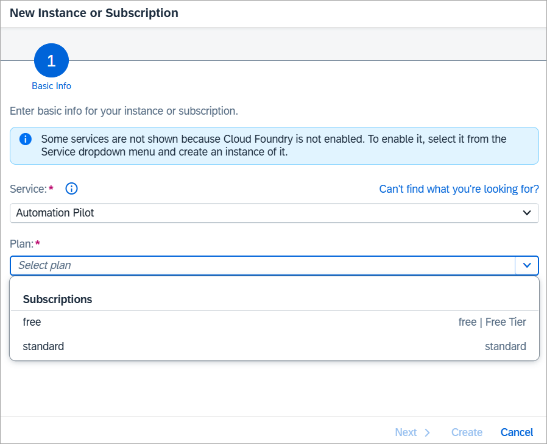

2. Under **Users**, select your user and assign the role `AutomationPilot_Admin`.

    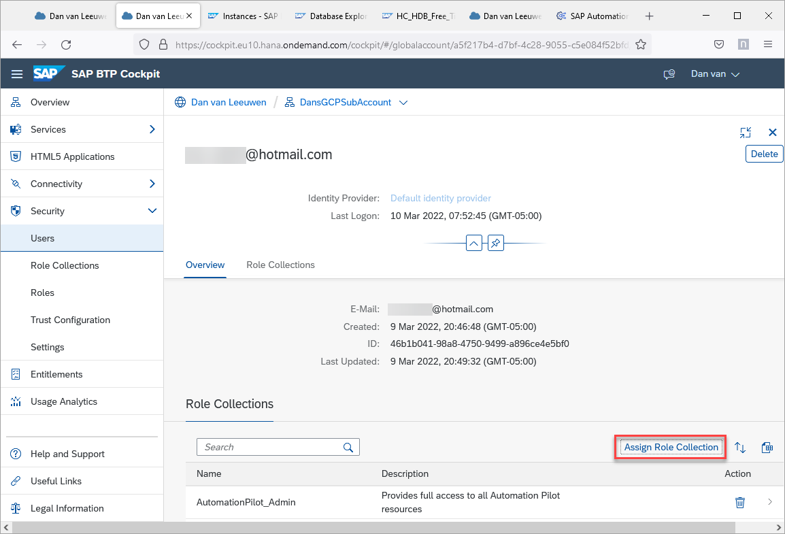

    For additional details, see [Permissions and Roles](https://help.sap.com/viewer/de3900c419f5492a8802274c17e07049/Cloud/en-US/e4b6193a71354aa5854c2c5dc1f4325f.html).

3. Once the SAP Automation Pilot service has been created, open its application.  

    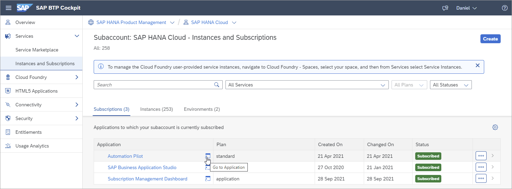

    > If you receive a permission error, you may need to log out and log in again for the role assigned in the previous step to take effect.

4. Notice the two sections for catalogs (My Catalogs and Provided Catalogs) containing provided commands and inputs including ones for Cloud Foundry and database lifecycle management.

    Provided catalogs are groups of commands and inputs that are provided by the SAP Automation Pilot.  Those in My Catalogs are catalogs that are user-created and contain the commands and inputs they create.  Catalogs provide a way to group a collection of related commands and inputs.

    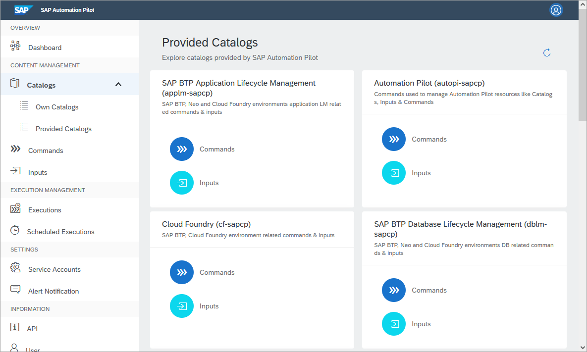

    >Commands can also be scheduled.  One example may be to schedule the starting and stopping of a database instance.  

5. It is possible to create commands using BASH, Node.js, Python or Perl.  A provided example command is included for each type as shown below.

    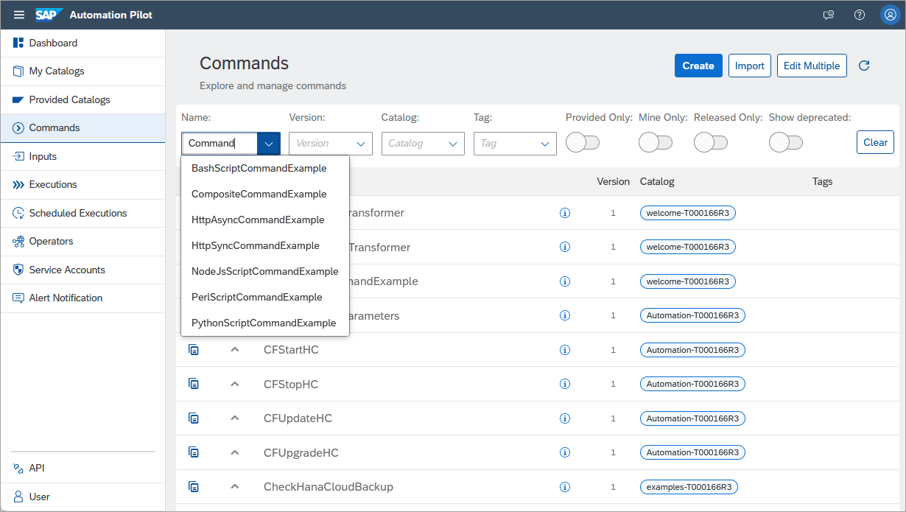

6. Each command example inherits from the base `ExecuteScript`.

    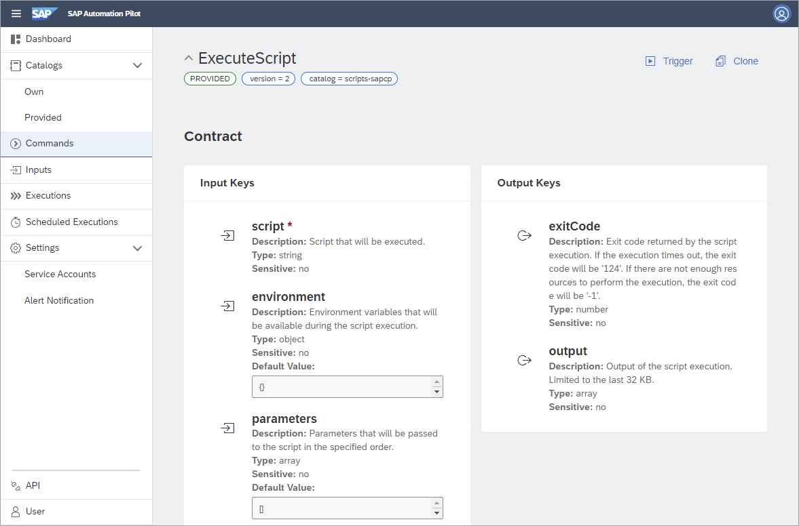

    Notice that there are a set of input keys and output keys.

7. Open the input **`WelcomeScriptInput`** which is used by the previously mentioned command examples.

    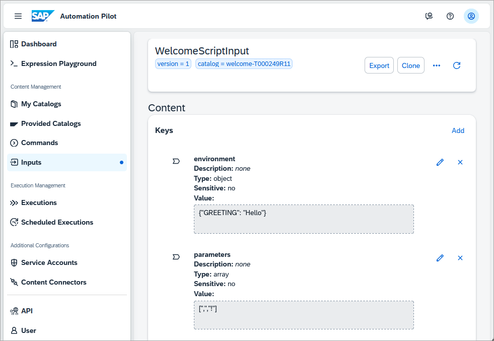

    Examine the description of the input keys and their types.

8. Open the command **`PythonScriptCommandExample`**.  

    Scroll down to the **Configuration** section, select input and notice that it has as an additional value `WelcomeScriptInput` shown in the previous step with an alias of  `scriptInput`.

    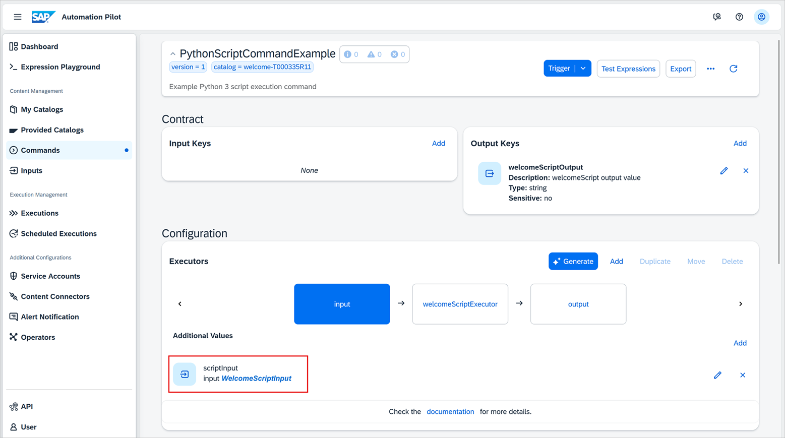

9.  Select **`welcomeScriptExecutor`**.

    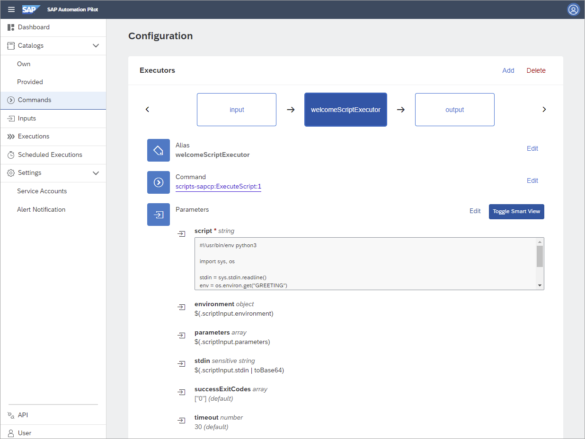

    Notice that it contains the below script and that the parameters, environment, and `stdin` have their values set from the input `WelcomeScriptInput` using its alias name of `scriptInput`.

    ```Python
    #!/usr/bin/env python3

    import sys, os

    stdin = sys.stdin.readline()
    env = os.environ.get("GREETING")
    (arg1, arg2) = sys.argv[1:3]

    print(f"{env}{arg1} {stdin}{arg2}")
    ```

10. Trigger the command.  

    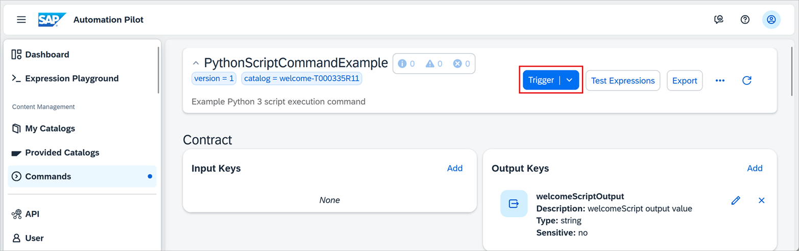

11. Executed commands can be viewed under the Executions tab. Options to filter Executions include ID, Owner, Status, and Start periods.

    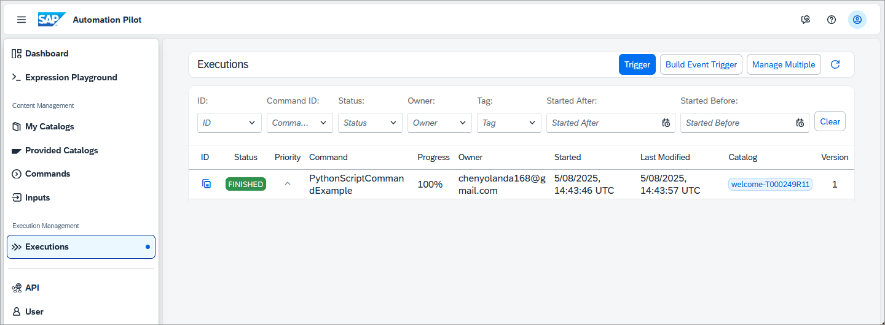

12. Under Output Values, click `Show` to view the output of the successfully run command.
    
    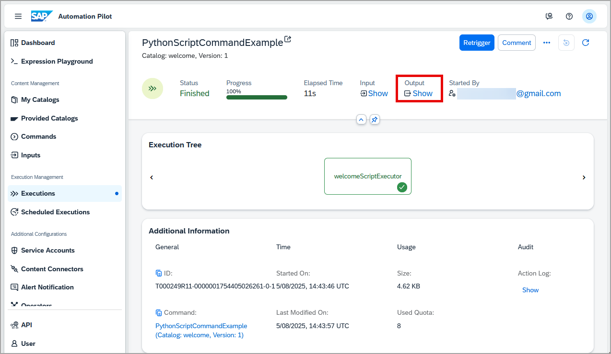

    The output will appear in a pop-up.  
    
    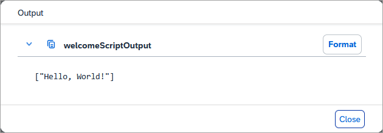

    This value is coming from the output of the `welcomeScriptExecutor` whose base command `ExecuteScript` has a parameter named output.

    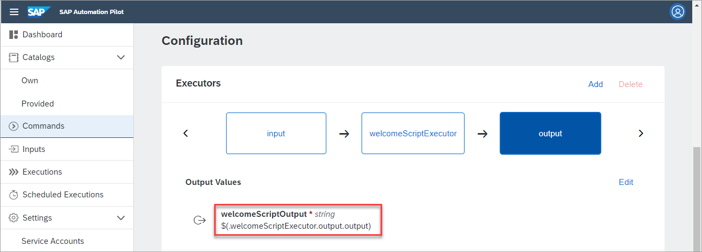

At this point, you should now have a subscription to the SAP Automation Pilot service and be familiar with some basic concepts of the service such as commands, inputs, and executions.


### Create a catalog, an input, and a command


This step will create a catalog that contains a command and an input.  The input will have a user name and password for the SAP Business Technology Platform, and the command when completed, will retrieve the details of a SAP HANA Cloud instance that sent a database alert such a `HDBDiskUsage` alert.

1. Create a new catalog.

    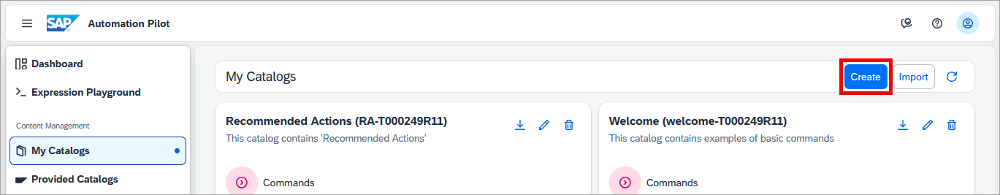

    Specify the values below.

    | Label | Value |
    | -------- | ----- |
    | Name | `ResizeHCDB` |
    | Display name | `Resize SAP HANA Cloud Database` |

2. Create an input named `BTPTechnicalUser` in the just created catalog.

    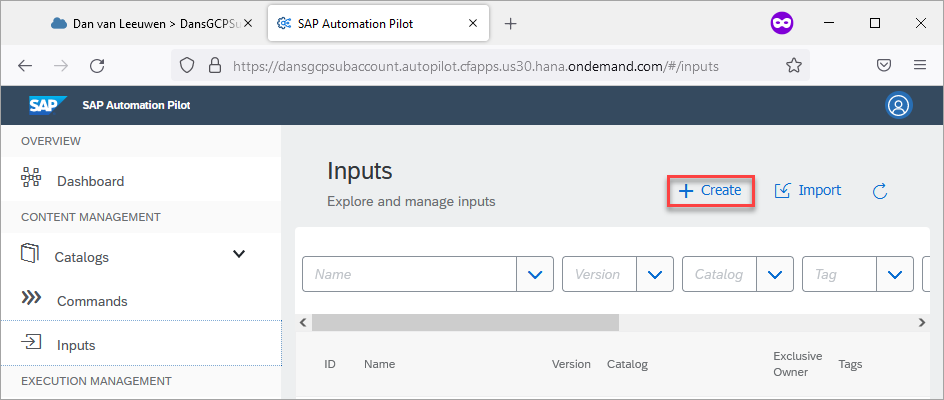

3. Add two keys to the input.

    | Key Name | Type | Sensitive | Value |
    | -------- | ----- | --- | --- |
    | user | String | no | BTP user that is a member of the space where the SAP HANA Cloud database instance exists |
    | password | String | yes | password of the BTP user |


    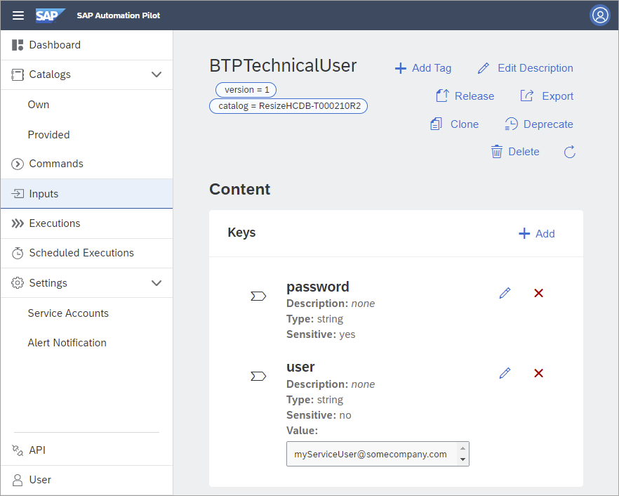

    >Note these credentials will be used by a Cloud Foundry command to return the details of a SAP HANA database service.  Ensure the user can log in successfully to a site such as [SAP Community](https://community.sap.com/) and **not** have two-factor authentication enabled.  The user should appear under the members list at the space level in the BTP Cockpit and have the role space developer.  Additional details on creating a technical user can be found at [Creating a Technical User for Cloud Platform Integration](https://blogs.sap.com/2018/08/17/creating-a-technical-user-for-cloud-platform-integration/).

    >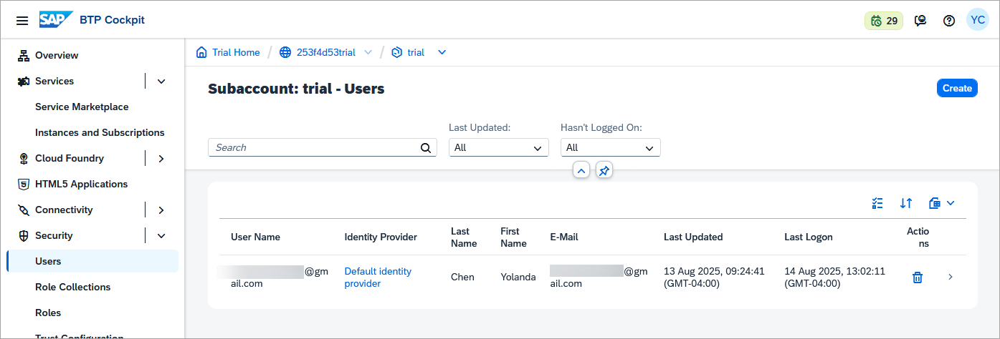

4. Create a command named `ResizeHANACloudStorage` in the previously created catalog and add the following input keys to the command under the section Contract.

    | Key Name | Type | Sensitive |
    | -------- | ----- | --- |
    | `alertJSON` | object | no |
    | `password` | String | yes |
    | `user` | String | no |

    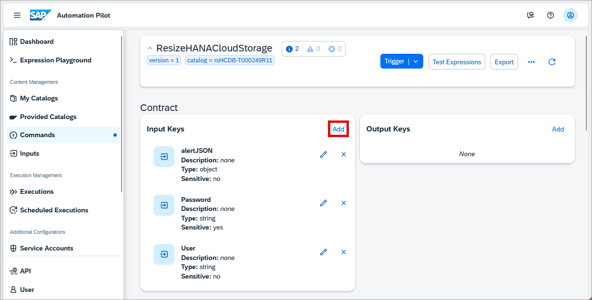

    The values for these keys will be set in step 3 when a trigger from an alert is created for this command.  

5. In the command `ResizeHANACloudStorage`, add an output key under the section Contract.

    | Key Name | Type | Sensitive |
    | -------- | ----- | --- |
    | `storageSize` | object | no |


6. Under Configuration, add an executor.  

    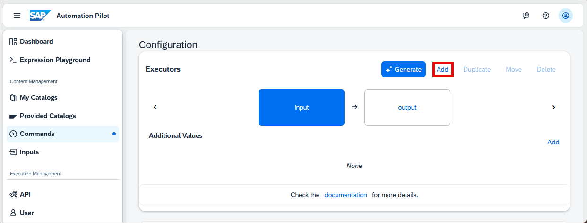

    Select **Here**.

    Specify the values below.

    | Label | Value |
    | -------- | ----- |
    | Command | `cf-sapcp:GetCfServiceInstance:1` |
    | Alias | `getHANACloudDBDetails` |
    | Automap Parameters | `true` |

    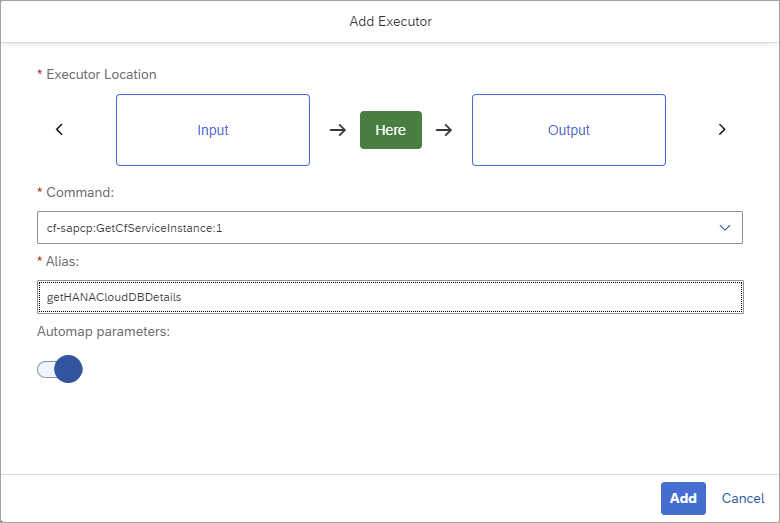

    > :1 indicates that this is version 1 of the command.

7. Select the newly created executor.

    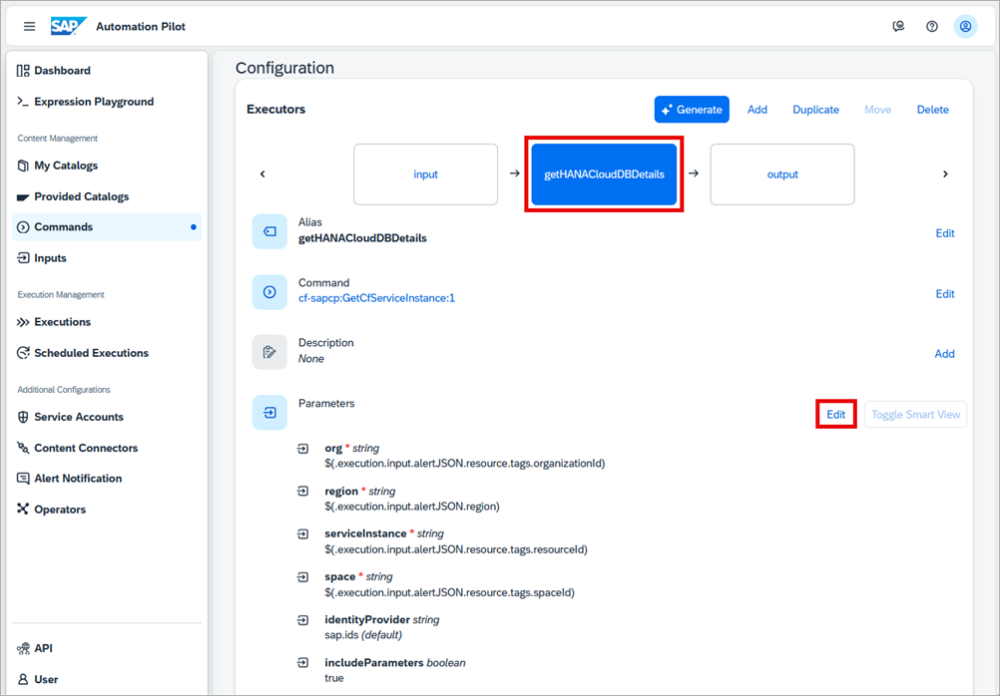

    Notice that it has a set of input parameters that will need to be set.  These values will come from the JSON data of the alert and the previously created input named `BTPTechnicalUser`.  As `automap parameters` was enabled, the values for user and password have been set from the command's input keys.

    Edit the parameters of `getHANACloudDBDetails`.

    Specify the following values.

    | Parameter Name | Value  |
    | -------- | ----- |
    | org | `$(.execution.input.alertJSON.resource.tags.organizationId)` |
    | region | `$(.execution.input.alertJSON.region)` |
    | serviceInstance | `$(.execution.input.alertJSON.resource.tags.resourceId)` |
    | space | `$(.execution.input.alertJSON.resource.tags.spaceId)` |
    | includeParameters | `true` |

    > For additional details on the use of the $(...) used above, see [Dynamic Expression](https://help.sap.com/viewer/de3900c419f5492a8802274c17e07049/Cloud/en-US/22621f87e7574f9e9fd1b1b95fe7a61d.html).

8. Select the **output**, then select **Edit**.  

    

    Specify the output key named `storageSize` to be `$(.getHANACloudDBDetails.output.parameters)`

9. Trigger the execution.

    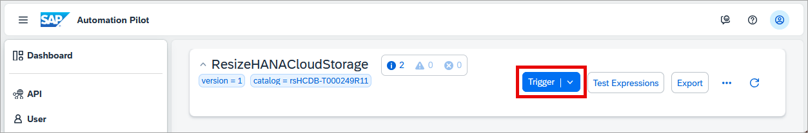

    In the trigger command dialog, under Inputs, enter `BTPTechnicalUser`.

    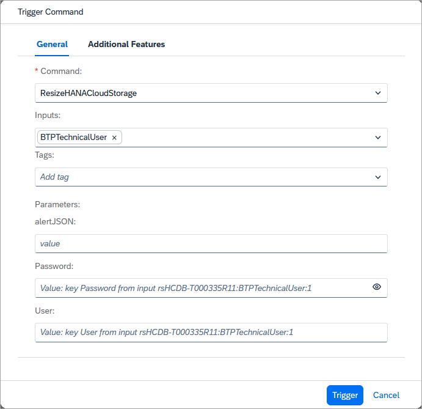

    Notice that the execution fails as the input parameters to specify which SAP HANA database instance we wish to get details about are missing.  These values will be provided in the next step.

    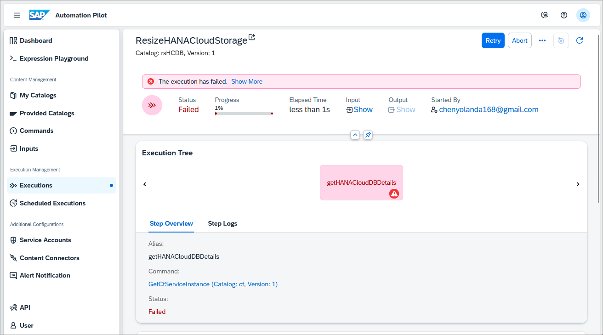


### Trigger a command from a SAP Alert Notification service alert


This step will configure the SAP Alert Notification service to invoke the previously created command when a database alert is received.  

1. Create a new service account named `AutoPi` with **Execute** permission and **Basic** Authentication.

    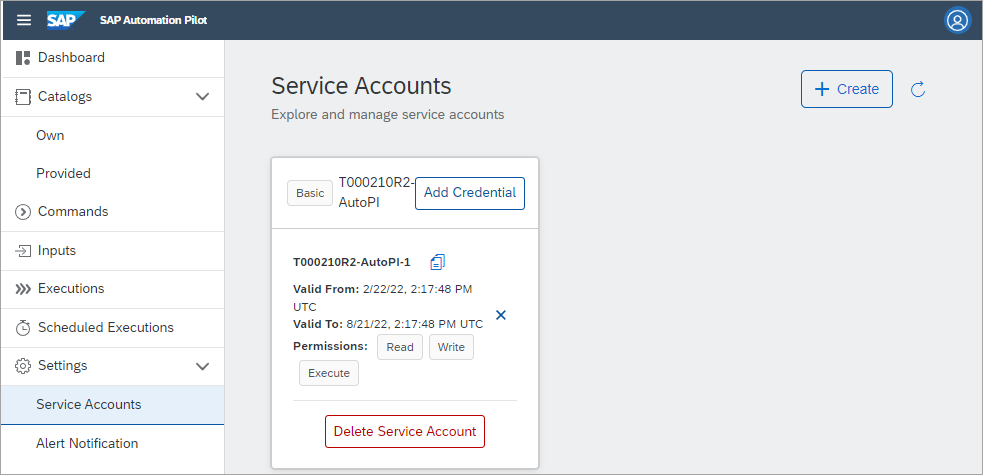

    **Save the username and password** as they will be required in sub-step 3.

    This username and password can be used by another service such as the SAP Alert Notification service to trigger an execution of a command.

2. Under Executions select Build Event Trigger.  

    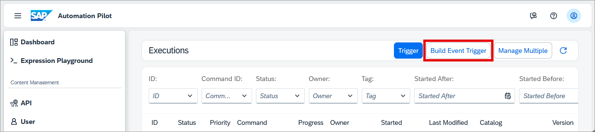

    Specify the following values.

    | Tab Name | Label | Value |
    | -------- | ----- | --- |
    | General | Trigger Type | `Alert Notification` |
    | General | Command | `ResizeHANACloudStorage` |
    | General | Input References | `BTPTechnicalUser` |
    | Mapping | Map Event to Command Input Key | `alertJSON` |

    **Before pressing the Close button**, copy and save the Event Trigger URL as this value is not available once closed.

    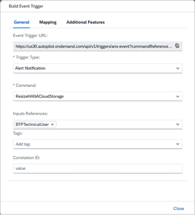

3. Open the SAP Alert Notification service UI and create a new action to call the previously created trigger.

    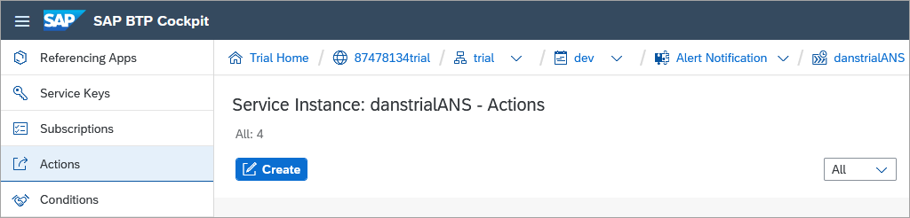

    Provide the following values.  

    | Label | Value |
    | -------- | ----- |
    | Action Type | `SAP Automation Pilot` |
    | Name | `Auto_Pilot_Resize_Command` |
    | Automation Pilot URL | *value from **sub-step 2*** |
    | Username | *value from **sub-step 1*** |
    | Password | *value from **sub-step 1*** |

4. Create three new conditions that will be used to match a create event of a high test alert.

    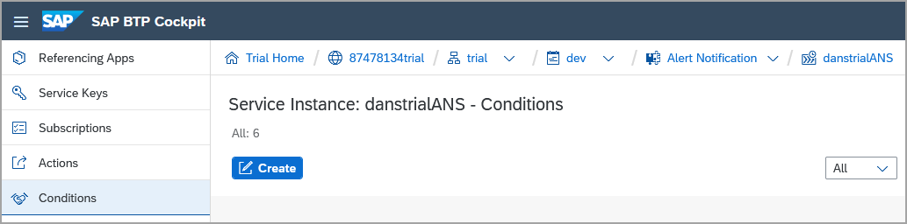

    Provide the following values.  

    | Label | Value |
    | -------- | ----- |
    | Name | `HANA-Test-Alert` |
    | Condition | `eventType` Is Equal To `HDBTestAlert` |

    | Label | Value |
    | -------- | ----- |
    | Name | `Severity-ERROR` |
    | Condition | `severity` Is Equal To `ERROR` |

    | Label | Value |
    | -------- | ----- |
    | Name | `ANS-Status-CREATE` |
    | Condition | `tags.ans:status` Is Equal To `CREATE` |

    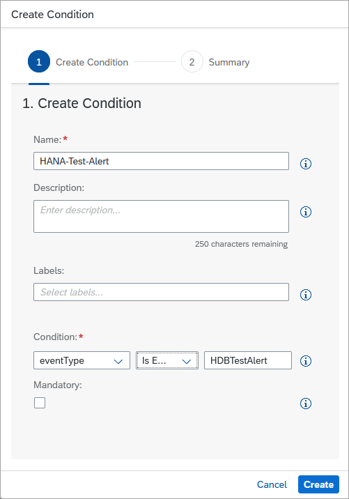


5. Update the conditions and action of an Alert Notification service subscription, such as the one created in step 5 of the [Alerts in SAP HANA Database and Data Lake](hana-cloud-alerts) tutorial to use the newly created conditions and action.

    <!-- border -->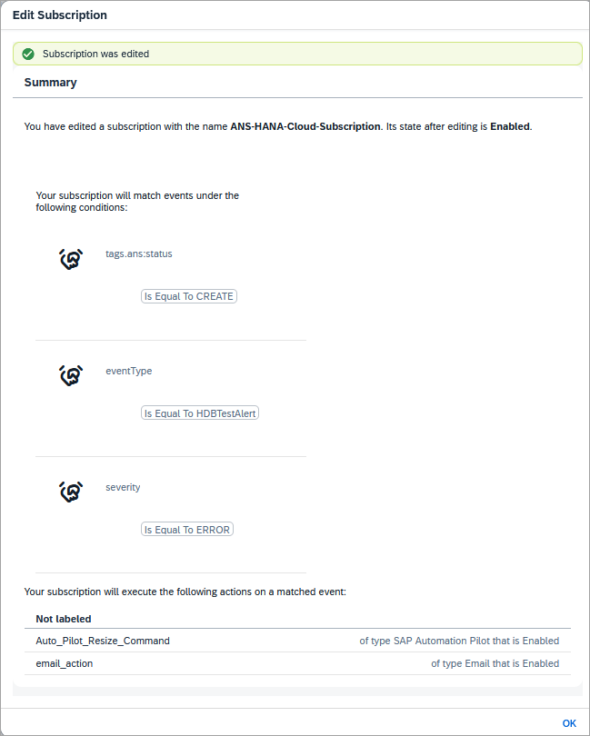

    >For the purpose of this example, the condition matches `HDBTestAlert` rather than `HDBDiskUsage` to make it easy to trigger.  More details can be found at [HDB Test Alert](https://help.sap.com/viewer/5967a369d4b74f7a9c2b91f5df8e6ab6/Cloud/en-US/8e2f22048df24d1b81cb2c05ce637958.html).

    >---

    >Note that multiple alerts will be triggered.  For example, alerts are sent with a status of  CREATE, UPDATE, or CLOSE.  Some alerts have different thresholds or severity values such as ERROR, WARNING, or NOTICE.  See also [Alerts in SAP HANA Cloud](https://help.sap.com/docs/HANA_CLOUD_DATABASE/f9c5015e72e04fffa14d7d4f7267d897/8eca57e7e82e4b788246b6d9db020937.html).


6. In the SAP HANA database explorer, trigger the test alert.

    ```SQL
    CALL _SYS_STATISTICS.Trigger_Test_Alert(?, 4, 'High test alert');  
    ```

    An alert will appear in the SAP HANA Cockpit and a notification will be sent to the SAP Alert Notification service.  In the SAP Alert Notification service, the previously edited subscription will trigger the command in the SAP Automation Pilot.

7. Open **Executions** in the SAP Automation Pilot.  Notice that this time, the execution succeeded.  Select the just run execution.  

    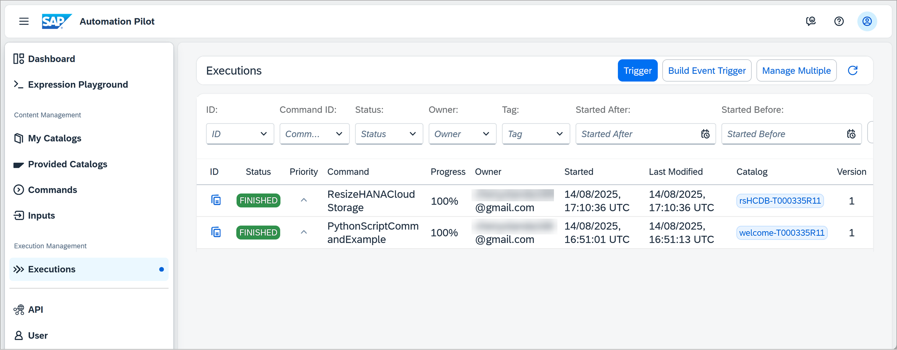

    Examine the input and output values and notice that the input contains the JSON payload from the alert.  

    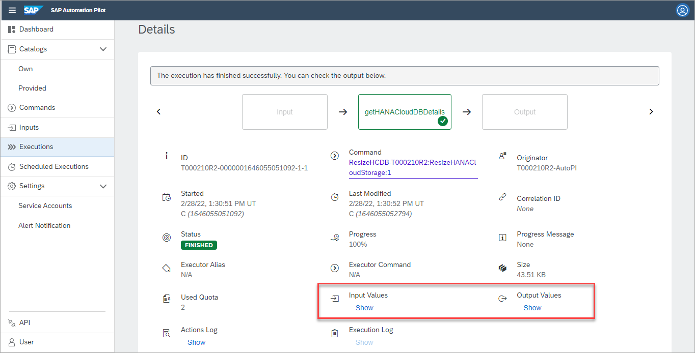

    As subset of input is shown below.

    ```JSON
    {
        "eventType": "HDBTestAlert",
        "severity": "ERROR",
        "category": "ALERT",
        "subject": "Statistics server test alert",
        "body": "Test alert for testing statistics server alert handling. This alert can only be triggered by calling the procedure _SYS_STATISTICS.Trigger_Test_Alert.\nHigh test alert",
        "region": "cf-us10",
        "regionType": "sap-cp",
        "resource": {
            "resourceName": "HC_HDB_Trial",
            "resourceType": "hana-cloud-hdb",
            "tags": {
                "organizationId": "f3894582-...",
                "resourceId": "296ff33c-...",
                "spaceId": "d1e245ad-...",
            }
        }
    }
    ```

    The output contains the details of the SAP HANA Cloud database in which the alert came from including the current storage size of the database instance.

    A subset of the output is shown below.

    ```JSON[17]
    {
    "data": {
        "edition": "cloud",
        "enabledservices": {
            "scriptserver": false
        },
        "extensionservices": [
            {
                "enabled": false,
                "name": "ConnectivityProxy",
                "whitelistIPs": [
                    "0.0.0.0/0"
                ]
            }
        ],
        "memory": 30,
        "storage": 120,
        "updateStrategy": "withRestart",
        "vcpu": 3,
        "whitelistIPs": [
            "0.0.0.0/0"
        ] },
    }
    ```


### Increase the storage size of a SAP HANA Cloud database using a command


This step will add an executor to calculate a new storage size for the SAP HANA instance based on its current size and will then use a provided command to request the SAP HANA Cloud database to increase its storage size.  

>Note that a trial or free-tier instance does not provide an option of changing the storage size of the provisioned SAP HANA Cloud database.

>---

>This example is for demonstration purposes only.  Consult the [SAP HANA Cloud Capacity Unit Estimator](https://hcsizingestimator.cfapps.eu10.hana.ondemand.com/) for further details on how the storage size affects capacity units.  It is not possible to decrease the storage size.  For additional details see [Managing SAP HANA Database Instances](https://help.sap.com/docs/HANA_CLOUD/9ae9104a46f74a6583ce5182e7fb20cb/649092e9d9be41c59930179ce4f3d59e.html).


1. In the SAP Automation Pilot, open the command `ResizeHANACloudStorage ` and add an executor.

    Select the **Here** before the output and specify the values below.

    | Label | Value |
    | -------- | ----- |
    | Command | `scripts-sapcp:ExecuteScript:2` |
    | Alias | `calculateNewStorageSize` |
    | Automap Parameters | `true` |

2. Select the newly created executor and choose to edit its parameters.

    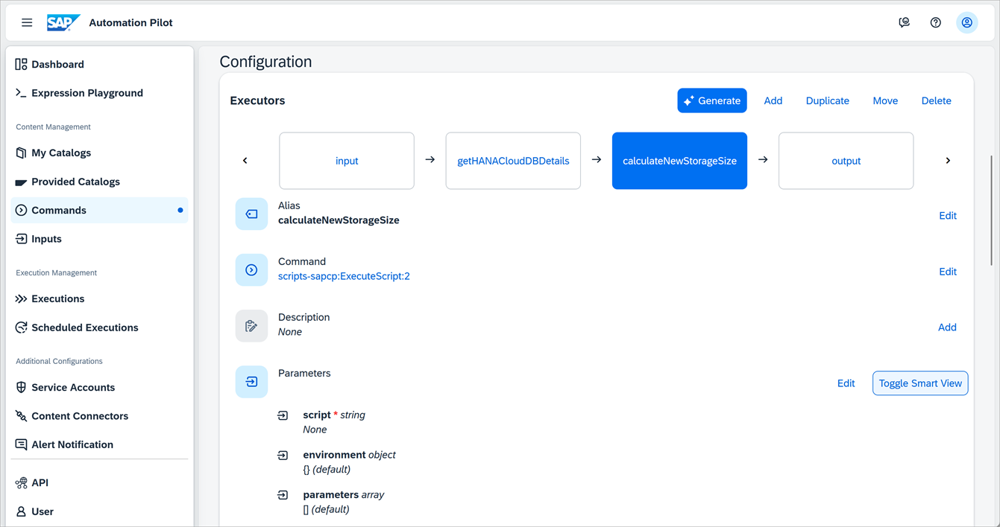

    Specify the following for the script.

    ```Python
    #!/usr/bin/env python3

    import json
    import sys

    input = sys.stdin.read()
    parameters = json.loads(input)
    #If you wish to test this without actually doing the resize, change +40 to -1
    storageParameter = {'data': {'storage': parameters['data']['storage'] + 40}}

    print(json.dumps(storageParameter))
    ```

    Under **STDIN**, specify `$(.getHANACloudDBDetails.output.parameters)`.

    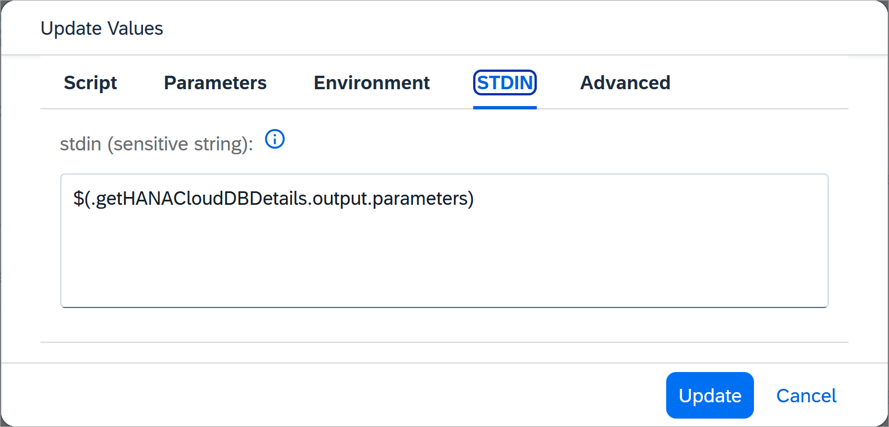

    With the above changes, the command will take (as its input through STDIN) the JSON data passed from the alert containing the current storage size of the SAP HANA database instance. It will also write out a JSON string that indicates a new size.

3. Select **output**, click on **Edit**, and then set it's value to `$(.calculateNewStorageSize.output.output[0])`.

4. Optionally, in the SAP HANA database explorer, trigger the test alert.

    ```SQL
    CALL _SYS_STATISTICS.Trigger_Test_Alert(?, 4, 'High test alert');  
    ```

    When the execution completes, the output should contain the JSON input for the new storage size.

    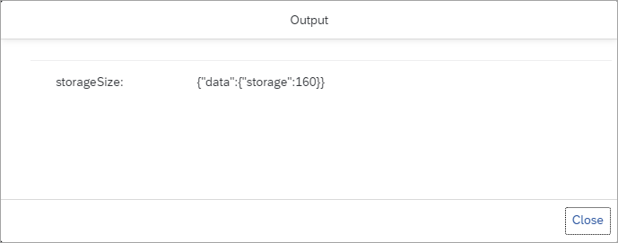

    >For additional examples of updates that can be made see [Using the Cloud Foundry CLI with SAP HANA Cloud](https://help.sap.com/viewer/9ae9104a46f74a6583ce5182e7fb20cb/hanacloud/en-US/921f3e46247947779d69b8c85c9b9985.html).

5. Open the command `ResizeHANACloudStorage` and add an executor.

    Select **Here** before the output and specify the values below.

    | Label | Value |
    | -------- | ----- |
    | Command | `cf-sapcp:UpdateCfServiceInstance:1` |
    | Alias | `resizeHANADBStorageSize` |
    | Automap Parameters | `true` |

6. Select the newly created executor and choose to edit its parameters.

    Specify the following values.

    | Parameter Name | Value |
    | -------- | ----- |
    | org | `$(.execution.input.alertJSON.resource.tags.organizationId)` |
    | region | `$(.execution.input.alertJSON.region)` |
    | serviceInstance | `$(.execution.input.alertJSON.resource.tags.resourceId)` |
    | space | `$(.execution.input.alertJSON.resource.tags.spaceId)` |
    | deadline | `30` |
    | parameters | `$(.calculateNewStorageSize.output.output[0])` |

7. In the SAP HANA database explorer, trigger the test alert.

    ```SQL
    CALL _SYS_STATISTICS.Trigger_Test_Alert(?, 4, 'High test alert');  
    ```

8. Examine the completed execution. Click **Show** to view the output value. 

    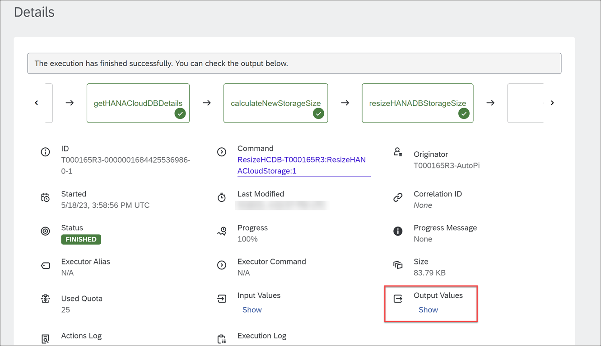
    
    The new storage size is displayed.

    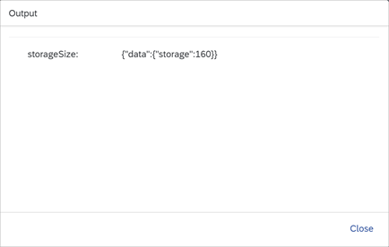

9. The updated storage size will also be visible in SAP HANA Cloud Central.

    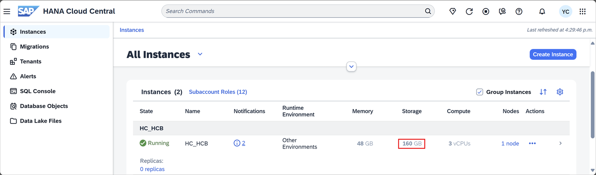

    >Note that there may be restrictions on how often an instance can have its storage resized within a period of time. There may be downtime required.  For additional details see [Change the Size of a SAP HANA Database Instance Using the CLI](https://help.sap.com/viewer/9ae9104a46f74a6583ce5182e7fb20cb/hanacloud/en-US/5f4823c45d654d1da28682f03f58ccf7.html).

10. Now that the test of this command was successful using the `HDBTestAlert`, disable the action in the subscription in the SAP Alert Notification service *or* change the condition in the subscription to use `HDBDiskUsage`.    
Additional details on this alert can be found at [HDB Disk Usage](https://help.sap.com/viewer/5967a369d4b74f7a9c2b91f5df8e6ab6/Cloud/en-US/807a9f0021354fcc856cbf29cb4f7f18.html).  By default, the disk usage alert will create an alert with severity ERROR on 98 % disk usage, which then triggers a storage increase of 40 GB.

    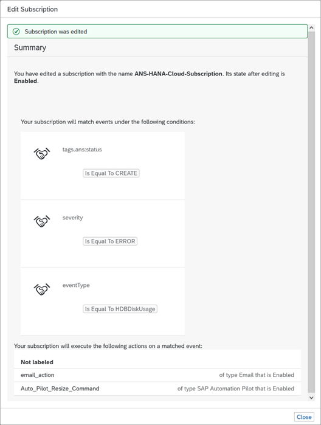

### Knowledge check

Congratulations! You have now created a command in SAP Automation Pilot that can be  used to take action to resolve the alert that triggered the execution of the command.  


---
