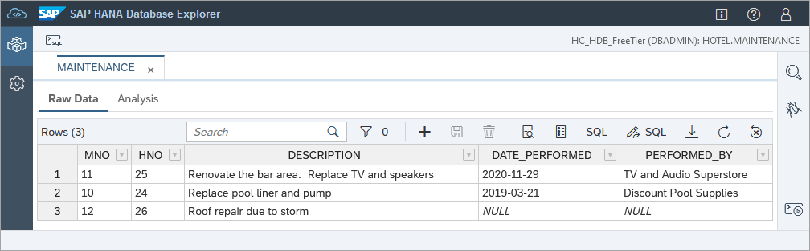
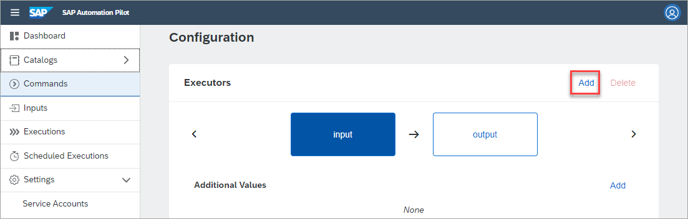
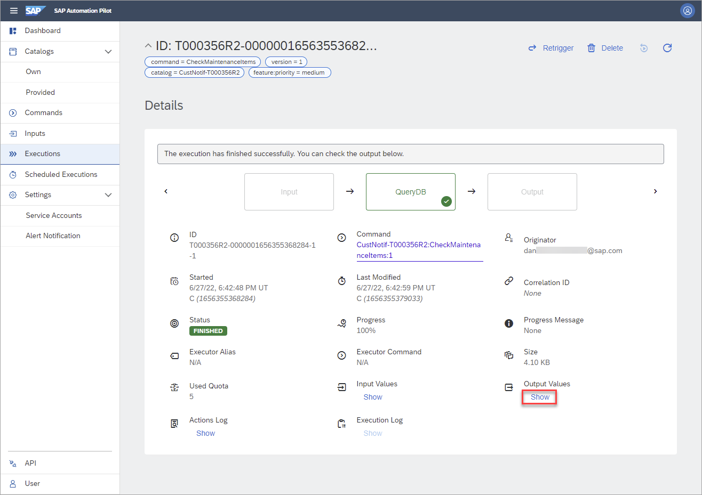
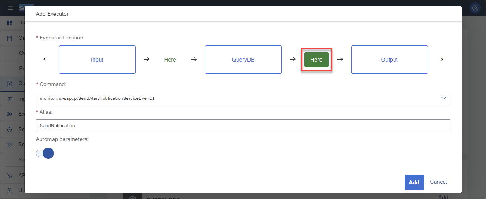
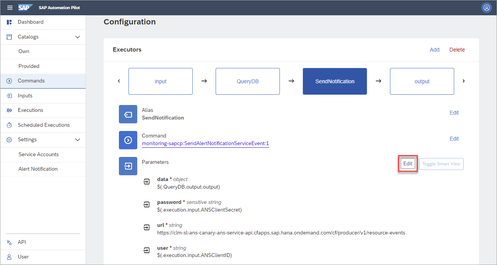
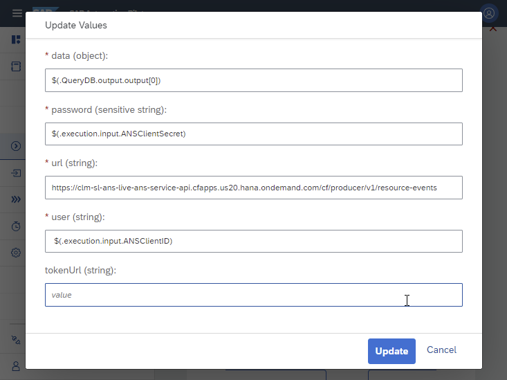
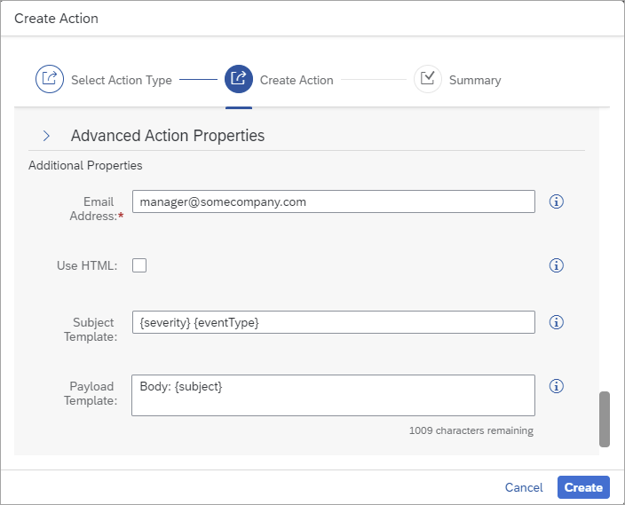
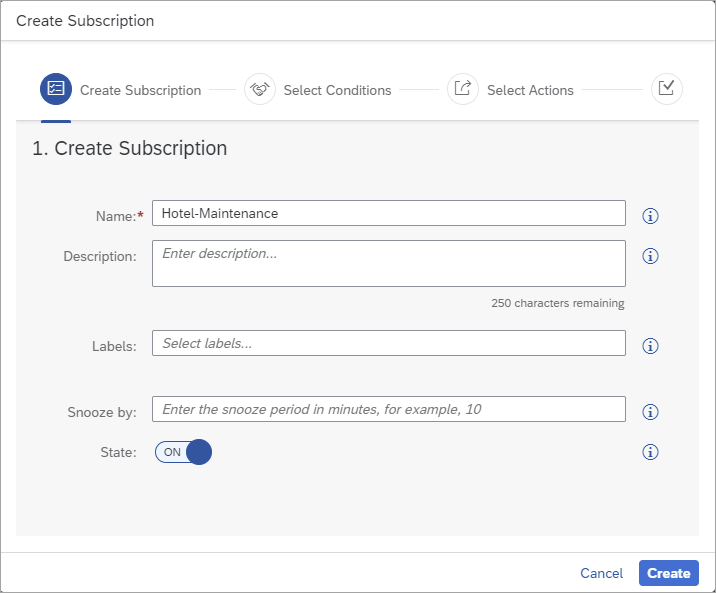

# Execute SQL Commands and Create Custom Notifications with SAP Automation Pilot and SAP Alert Notification Service
<!-- description --> Learn an approach to schedule SQL statements which are run against an SAP HANA Cloud database and send an email based on the results of the execution.

## Prerequisites
  - Access to the SAP Business Technology Platform (BTP) that includes SAP HANA Cloud, SAP Alert Notification Service, and SAP Automation Pilot.  These services are available in the SAP BTP free tier.

## You will learn
  - How to create a command in SAP Automation Pilot which connects to and queries an SAP HANA Cloud database instance
  - How to perform queries using the provided `ExecuteHanaCloudSqlStatement`
  - How to perform queries using `hdbcli`, the SAP HANA client driver for Python
  - How to conditionally send a notification (email) with the results of the query using the SAP Alert Notification Service
  - How to schedule an SAP Automation Pilot command

## Intro
SAP HANA Cloud provides built-in alerts for items such as long running statements, table row counts, expiring database passwords, or low disk space.  This tutorial will demonstrate an approach that can be used to create a notification for use cases not covered by the built-in alerts.  The hotel dataset described in the tutorial [Create Database Objects with SAP HANA Database Explorer](hana-dbx-create-schema) contains a maintenance table where work items are described.  



An SAP Automation Pilot command will be created to check if any maintenance items are unassigned, and if so, an email will be generated.  The final step in the tutorial will demonstrate how to schedule the command to run once a week.


>If you do not already have the `HOTEL.MAINTENANCE` table in an SAP HANA Cloud database, please create it now by following the first 2 steps in the [Create Database Objects with SAP HANA Database Explorer](hana-dbx-create-schema) tutorial.
>
>---
>
>If you do not have a subscription to the SAP Automation Pilot service, step 1 of the tutorial [Take Action Following a SAP HANA Cloud Database Alert with SAP Automation Pilot](hana-cloud-alerts-autopilot) provides details on how to so.  
>
>---
>
>If you do not have an instance of the SAP Alert Notification service, see step 5 of the tutorial [Alerts in SAP HANA Database and Data Lake](hana-cloud-alerts).


---

### Create an SAP Automation Pilot command


This step will create a catalog, an input, and a command in the SAP Automation Pilot.  The command in subsequent steps will execute SQL against the database to determine if there are any unassigned maintenance items.  

1. In the SAP Automation Pilot, create a new catalog.

    

    Specify the values below.

    | Label | Value |
    | -------- | ----- |
    | Name | `CustNotif` |
    | Display name | `Custom Notifications` |
    | Description | `A user catalog which will hold inputs and commands demonstrating how to perform a custom notification` |

2. Create an input to store the connection details for an SAP HANA Cloud database.  

    

    Specify the values below.

    | Label | Value |
    | -------- | ----- |
    | Catalog | `Custom Notifications` |
    | Name | `SAPHANADB` |
    | Description | `Contains the details to connect to a specific SAP HANA Cloud database` |

3. Add the following keys to the input.

    

    | Key Name | Type | Sensitive | Description | Value |
    | -------- | ----- | --- | --- | --- |
    | host | String | no | Host value for a SAP HANA Cloud database | *Copy the SQL Endpoint from SAP HANA Cloud Central and remove :443* |
    | port | String | no | Port value for a SAP HANA Cloud database | `443` |
    | user | String | no | The user ID to connect the database | `USER1` |
    | password | String | yes | The password to connect the database | `Password1` |

    >Storing values in an input enables the values to be reused across different commands. If a value needs to be updated, it only has to be updated in one place.

4. Create a command.

    

    Specify the values below.

    | Label | Value |
    | -------- | ----- |
    | Catalog | `Custom Notifications` |
    | Name | `CheckMaintenanceItems` |
    | Description | `Perform a check to see if there are any unassigned maintenance items` |

5. In the newly created command, select input and add an [additional value](https://help.sap.com/docs/AUTOMATION_PILOT/de3900c419f5492a8802274c17e07049/f70c599222084a13a13cbd69263d3f44.html) which is the `SAPHANADB` input.

    

    Specify the values below.

    | Label | Value |
    | -------- | ----- |
    | Alias | `scriptInput` |
    | Value Type | `Input` |
    | Input | `SAPHANADB` |

    >An alternative method of passing parameters to the command uses the input keys in the contract section.  This is shown in step 4.

6. Add an output key.

    

    Specify the values below.

    | Label | Value |
    | -------- | ----- |
    | Name | `checkResult` |
    | Type | `string` |
    | Sensitive | `No` |    
    | Description | `JSON string of the result` |

7. Under Configuration, add an executor.  

    

    Click on **Here** and specify the values below.

    

    | Label | Value |
    | -------- | ----- |
    | Command | `scripts-sapcp:ExecuteScript:2` |
    | Alias | `QueryDB` |
    | Automap Parameters | `true` |

    > :2 indicates that this is version 2 of the command.

    > `Automap parameters` is not used in this tutorial, so its value can be enabled or disabled.

8. Select `QueryDB` and then press the edit parameters button.

    

    Paste in the following code for the script parameter.  

    ```Python
    #!/usr/bin/env python3

    print("Hello from QueryDB!")
    ```

9. Select the output and choose Edit.

    

    Set the value to be `$(.QueryDB.output.output[0])`.

    This will take the result printed in the `QueryDB` executor and set it to the output of the command.

    > For additional details on the use of the `$(...)` used above, see [Dynamic Expression](https://help.sap.com/viewer/de3900c419f5492a8802274c17e07049/Cloud/en-US/22621f87e7574f9e9fd1b1b95fe7a61d.html).

10. Trigger the execution.

    

    Additional inputs are not needed.

    

    After a few seconds, the output can be seen.

    

    

    >A quick way to return to the command after executing it is to click on the link shown below.

    >

At this point, a command has been created and executed.  In the next two steps, two different techniques of executing SQL against an SAP HANA Cloud database will be shown.  


### Perform a query using the ExecuteHanaCloudSqlStatement command


This step will add an additional executor to the command that can connect to a SAP HANA Cloud database and execute a query.

1. Under Configuration, add an executor.  

    

    Click on Here and specify the values below.

    

    | Label | Value |
    | -------- | ----- |
    | Command | `sql-sapcp:ExecuteHanaCloudSqlStatement:1` |
    | Alias | `SQLStatement` |
    | Automap Parameters | `true` |

2. Select `SQLStatement` and then press the edit parameters button.

    

    Set the Connection URL to be `jdbc:sap://$(.scriptInput.host):$(.scriptInput.port)`.

3.  Under Statement, specify the SQL below.

    ```SQL
    SELECT H.NAME, M.DESCRIPTION FROM HOTEL.MAINTENANCE M, HOTEL.HOTEL H WHERE M.HNO = H.HNO;
    ```

    

4. Under Authentication specify the values below.

    

    | Key | Value |
    | -------- | ----- |
    | Type | `Basic Authentication` |
    | User | `$(.scriptInput.user)` |
    | Password | `$(.scriptInput.password)` |

    Notice that the user or password inputs provide autocompletion after `$(.` is entered.

    

5. Under Advanced specify the values below.

    

    | Key | Value |
    | -------- | ----- |
    | Result Row Format: | `Object` |
    | Result Transformer | `toArray[0]` |


6. Select `QueryDB`. Then press the edit parameters button.

    

    Paste in the following code for the script parameter replacing the previous content.  

    

    ```Python
    #!/usr/bin/env python3

    import sys, json

    input = sys.stdin.readline()
    rows = json.loads(input)
    print(rows)
    ```

    Under STDIN, specify `$(.scriptInput.password)` so that the output of the previous step can be accessed in the Python code.

    


7. Trigger the execution.  Additional inputs are not needed.

    

    The output can be seen below.

    

The above step demonstrates how the provided [SQL Statement](https://help.sap.com/docs/AUTOMATION_PILOT/de3900c419f5492a8802274c17e07049/024ff1ff1c46465f838c6faf655a9f0a.html) command can be used. Its output was passed into a Python command, where the result could be further processed. The next step is an example to execute SQL statements directly in the Python command.   


### Perform a query using hdbcli in a Python script


This step will demonstrate how SQL queries can be made directly in Python rather than using a separate executor.

1. Optionally delete the executor `SQLStatement`.

2. Select `QueryDB` and then press the edit parameters button.

    

    Paste in the following code for the script parameter replacing the previous content.  

    ```Python
    #!/usr/bin/env python3

    import sys, os
    from hdbcli import dbapi

    #Note:  We cannot directly access input keys such as $(.execution.input.user) or additional parameter values $(.scriptInput.user) in a Python script
    host = os.environ.get("host")
    port = os.environ.get("port")
    user = os.environ.get("user")
    password = sys.stdin.readline()

    conn = dbapi.connect(
        address=host,
        port=port,
        user=user,
        password=password
    )

    cursor = conn.cursor()
    cursor.execute("SELECT count(*) AS UNASSIGNED_ITEMS FROM HOTEL.MAINTENANCE WHERE PERFORMED_BY IS NULL;")
    rows = cursor.fetchall()
    numOfUnassignedItems = 0
    for row in rows:
        numOfUnassignedItems = row[0]
    cursor.close()
    print("There are " + str(numOfUnassignedItems) + " unassigned maintenance items.")
    ```

    The provided executor [ExecuteScript](https://help.sap.com/docs/AUTOMATION_PILOT/de3900c419f5492a8802274c17e07049/d0854dbb80d84946bb57791db94b7e20.html) supports various languages and when Python is used, it includes the `hdbcli` which is the [Python driver for SAP HANA](hana-clients-python)  which is used to connect to and query an SAP HANA Cloud database.

3. In the next two sub-steps, connection details for the SAP HANA Cloud instance will be passed into the executor.  Under environment, specify the values below.

    | Key | Value |
    | -------- | ----- |
    | host | `$(.scriptInput.host)` |
    | port | `$(.scriptInput.port)` |
    | user | `$(.scriptInput.user)` |

    

    >Additional value keys or input keys cannot be directly referenced in a Python script and hence they need to be passed in through alternative means such as environment variables or `stdin`.  Step 3 makes use of input keys.

4. Under STDIN, replace the previous value with `$(.scriptInput.password)`

    

    >Passing the password through STDIN is more secure.

5. Trigger the execution.  Additional inputs are not needed.

    

    The output can be seen below.

    

    A command has now been successfully created that can execute SQL against an SAP HANA Cloud database using the Python SAP HANA Client.  With this method, the query and the logic to process the result can be done in one executor.


### Forward results to the SAP Alert Notification Service


A second executer will be added in this step.  It will take the output returned from `QueryDB` and forward it to the SAP Alert Notification Service.  


1. In the SAP Alert Notification Service, create a basic service key named `BasicANSServiceKey`.  The service key will provide the URL and credentials for the SAP Automation Pilot to send notifications to the SAP Alert Notification Service.

    

    ```JSON
    {
	    "type": "BASIC"
    }
    ```

2. In the SAP Automation Pilot, create an input named `ANSUserInput`.

    

    Specify the values below.

    | Label | Value |
    | -------- | ----- |
    | Catalog | `Custom Notifications` |
    | Name | `ANSUserInput` |
    | Description | `Basic credentials (client_id and secret_key) used to access the SAP Automation Pilot` |

3. Add two keys to the input.

    

    | Key Name | Type | Sensitive | Description | Value |
    | -------- | ----- | --- | --- | --- |
    | `client_id` | String | no | value from a BASIC ANS service key | copy value from service key created in sub-step 1 |
    | `client_secret` | String | yes | value from a BASIC ANS service key | copy value from service key created in created in sub-step 1 |

4. Create two input keys for the command and map them to the previously created input keys.

    

    | Key Name | Type | Sensitive | Default Value Source | Input | Input Key |
    | -------- | ----- | -------- | -------------------- |------ | --------- |
    | `ANSClientID` | String | no | Input Key | `ANSUserInput` | `client_id` |
    | `ANSClientSecret` | String | yes | Input Key | `ANSUserInput` | `client_secret` |

5. Add a second executor.  

    

     Place the executor between `QueryDB` and output.  This executor will send notifications to the SAP Automation Pilot.

    

    Specify the values below.

    | Label | Value |
    | ----- | ----- |
    | Command | `monitoring-sapcp:SendAlertNotificationServiceEvent:1` |
    | Alias | `SendNotification` |
    | Automap Parameters | `true` |

6. Edit the parameters of the just added executor.

    

    

    Specify the values below.

    | Label | Value |
    | ----- | ----- |
    | data | `$(.QueryDB.output.output[0])` |
    | password | `$(.execution.input.ANSClientSecret)` |
    | url  | *value from ANS service key* `/cf/producer/v1/resource-events` |
    | user | `$(.execution.input.ANSClientID)` |

7. Trigger the command which will fail.   Additional inputs are not needed.

    

    Examine the reason for the failure.  

    

    The SAP Alert Notification Service is expecting the input data to be a JSON document rather than the string "There are 1 unassigned maintenance items".  Additional details can be found at [Producing Custom Events](https://help.sap.com/docs/AUTOMATION_PILOT/de3900c419f5492a8802274c17e07049/6124b87d6e0249be9ffbc5a091123f97.html) and [Cloud Foundry Producer API (Model View)](https://api.sap.com/api/cf_producer_api/schema).

8. Edit the parameters of the `QueryDB` executor.

    Replace the script with the content below. This will generate a JSON string in the correct format for the SAP Alert Notification Service producer API.  

    ```Python
    #!/usr/bin/env python3

    import sys, os
    from hdbcli import dbapi

    ANSData1 = '{"eventType":"Unassigned_Maint_EVENT","resource":{"resourceName":"unknown","resourceType":"unknown"},"severity":"'
    ANSData2 = '","category":"NOTIFICATION","subject":"Reminder that there are '
    ANSData3 = ' unassigned maintenance items","body":"somebodytext","tags":{"ans:detailsLink":"somedetailslink"}}'

    #Note:  We cannot directly access input keys such as $(.execution.input.user) or additional parameter values $(.scriptInput.user) in a Python script
    host = os.environ.get("host")
    port = os.environ.get("port")
    user = os.environ.get("user")
    password = sys.stdin.readline()

    conn = dbapi.connect(
        address=host,
        port=port,
        user=user,
        password=password
    )

    cursor = conn.cursor()
    cursor.execute("SELECT count(*) AS UNASSIGNED_ITEMS FROM HOTEL.MAINTENANCE WHERE PERFORMED_BY IS NULL;")
    rows = cursor.fetchall()
    severity = "INFO"
    numOfUnassignedItems = 0
    for row in rows:
        numOfUnassignedItems = row[0]
        severity = "WARNING"
    cursor.close()
    print(ANSData1 + severity + ANSData2 + str(numOfUnassignedItems)  + ANSData3)
    print(numOfUnassignedItems)  #used in the next step as a condition (count does not equal 0)
    ```

9. Trigger the command again.  Notice that this time it succeeds.

    

    The next step will create a subscription in the SAP Alert Notification Service that will be triggered by the just sent JSON and can then perform an action such as send an email.


### Send a notification when there are unassigned maintenance items


The following instructions use the SAP Alert Notification Service to send an email when there are unassigned maintenance items.

1. In the SAP Alert Notification Service, create a condition.

    

    Specify the values below.

    | Label | Value |
    | ----- | ----- |
    | Name | `Unassigned-Maintenance-Items` |
    | Condition | `eventType` is Equal To `Unassigned_Maint_EVENT` |
    | Description | `There are items in the table HOTEL.MAINTENANCE that are not assigned.` |  

    

    >A further condition could be added to send an email only when the severity equals WARNING.  When the severity is INFO, there were no unassigned maintenance items.  

    >---

    >An additional approach would be to apply a condition on `SendNotification` to indicate that it should only execute if the number of unassigned maintenance items does not equal to 0.

    >

2. Create an action.

    

3. Specify the type of action to be Email.

    

    See also [Managing Actions](https://help.sap.com/viewer/5967a369d4b74f7a9c2b91f5df8e6ab6/Cloud/en-US/8a7e092eebc74b3ea01d506265e8c8f8.html) for details on other available action types.

4. Provide the Name `email-manager`.

    

     Scroll to the Additional Properties section.

    

    Specify the values below.

    | Label | Value |
    | ----- | ----- |
    | Email Address | *your email address* |
    | Subject Template | `{severity} {eventType}` |
    | Payload Template | `Body: {subject}` |

5. A confirmation token will be sent to the email address.  Click on the provided link or copy confirmation token and use it to confirm the action as shown in the next sub-step.

    

6. Click on **`email-manager`** to open it.

    

    Press the Confirm Action button.

    

    Enter the confirmation token and notice that the action is now enabled.

    

7. Create a subscription.

    

    Provide a value for the name and press the Create button.

    

8. Assign the condition and action to the subscription.

    

9. In the SAP Automation Pilot, trigger the command and notice that an email is now sent.

    


### Scheduling commands


In this step, the command will be scheduled to run once a week.  

1. In the SAP Automation Pilot, select Scheduled Executions and press the Schedule button.

    

    Specify the values below.

    | Label | Value |
    | -------- | ----- |
    | Command | `CheckMaintenanceItems` |
    | Schedule | `Weekly`|
    | Weekdays | `Monday`|
    | Hours | `12`|
    | Minutes | `0`|

    

    Additional details can be found at [Scheduled Execution](https://help.sap.com/docs/AUTOMATION_PILOT/de3900c419f5492a8802274c17e07049/96863a2380d24ba4bab0145bbd78e411.html).

2. Provided commands such as `StopHanaCloudInstance` and `StartHanaCloudIntance` can also be scheduled perhaps to shut down and restart a development SAP HANA Cloud instance on weekends.  The `StopHanaCloudInstance` command is shown below.

    

### Knowledge check

Congratulations! You have now used the SAP Automation Pilot to schedule a query against an SAP HANA Cloud database and to send a notification that reflects the result of the query.


---
