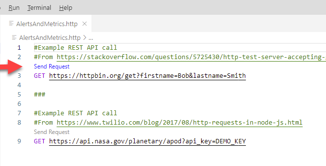
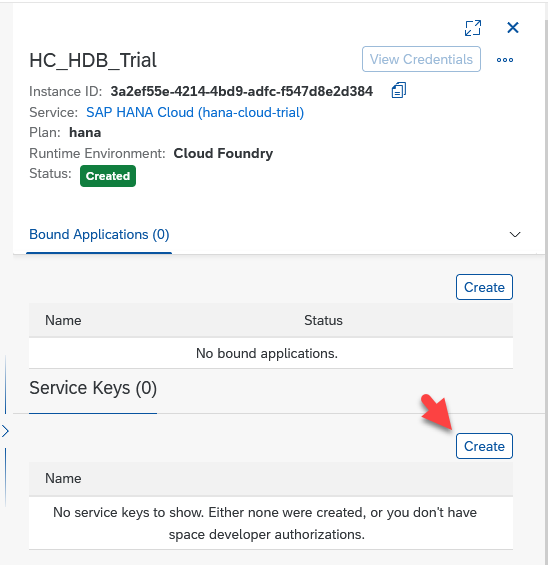

## Prerequisites
 - Access to an SAP HANA Cloud trial or production instance with a version of 2021 QRC 3 or higher.
 - A tool such as the REST Client extension for Visual Studio Code enabling the calling of a REST AP.

## Details
### You will learn
  - An overview of alerts and metrics
  - How to use the REST API to access alerts and metrics

Alerts can inform you of potential issues that should be addressed or investigated.  Metrics provide measurements for a given time or interval that can aid in troubleshooting or root-cause analysis of issues.  As an example, after receiving an alert of type `HDBLongRunningStatement`, a follow up step may be to investigate metric values such as `HDBCPU` and `HDBMemoryUsed` in the period around the time that the alert occurred.

The REST API provides a simple and easy to consume method to enable access to alerts and metrics from applications.

---

[ACCORDION-BEGIN [Step 1: ](Get started with the REST Client extension for Visual Studio Code)]

There are multiple tools that enable making calls to a REST API such as Postman, browser extensions, libraries in programming languages such as [requests](https://realpython.com/api-integration-in-python/#rest-and-python-consuming-apis) in Python or [https](https://nodejs.dev/learn/making-http-requests-with-nodejs) in Node.js.  Feel free to use the tool of your choice.  This tutorial will be using the [REST Client](https://marketplace.visualstudio.com/items?itemName=humao.rest-client) extension for Visual Studio Code.

1. Create a folder and a text file that will contain REST API calls.

    ```Shell (Microsoft Windows)
    mkdir %HOMEPATH%\AlertsAndMetricsTutorial
    cd %HOMEPATH%\AlertsAndMetricsTutorial
    notepad AlertsAndMetrics.http
    ```

2. Paste the following into the opened file and save it.

    ```HTTP
    #Example REST API call
    #From https://stackoverflow.com/questions/5725430/http-test-server-accepting-get-post-requests and
    GET https://httpbin.org/get?firstname=Bob&lastname=Smith

    ###

    #Example REST API call
    #From https://www.twilio.com/blog/2017/08/http-requests-in-node-js.html
    GET https://api.nasa.gov/planetary/apod?api_key=DEMO_KEY

    ###

    #Pet Store
    #From https://petstore.swagger.io/#/pet/findPetsByStatus
    GET https://petstore.swagger.io/v2/pet/findByStatus?status=available

    ###
    ```

    >Note above that # is used as a single line comment character and ### is used to separate REST API calls.

3. If required, download [Visual Studio Code](https://code.visualstudio.com/Download).

4. Start Visual Studio Code.

    

5. Add the REST Client extension from Marketplace after opening the extensions view.

    !

6. Choose File > Open Folder, to open the previously created folder.  

    Then open the file `AlertsAndMetrics.http`.

    

7. Try calling the sample REST APIs by clicking on the blue text `Send Request`.  

    !

    The results should appear in another pane.  An example result is shown below.

    

    Notice that the URL includes the URL parameters `firstname` and `lastname`.  The first parameter is indicated with a ?, while the subsequent parameters are indicated by an &.

[DONE]
[ACCORDION-END]

[ACCORDION-BEGIN [Step 2: ](Request a bearer token to enable access to the REST APIs)]

The following steps are required to create a bearer token that will be used in subsequent steps that make REST API calls to access alerts and metrics using the REST API.  The bearer token is generated by a login request and can be understood as "give access to the bearer of this token".  Additional details can be found at [User Account and Authorization Service](https://docs.cloudfoundry.org/api/uaa/version/75.7.0/index.html#token) for Cloud Foundry.

1. In the SAP BTP Cockpit, navigate to the instances section, select your SAP HANA Cloud instance.

    

    Create a service key if one does not exist.

    !

    When creating a service key, a JSON file or parameters section is not needed and can be left empty.

2. View the created service key.  The next step will require the `host`, `clientid`, `clientsecret`, and `url` fields.

    

3. Replace the contents of AlertsAndMetrics.http file with the contents below.  Highlighted values are to be updated with details from your service key.

    ```HTTP[4, 9, 12, 15, ]
    #REST Client variables -------------------

    #From first part of host.  Example shown below
    @serviceInstance = 3a2ef55e-4214-4bd9-adfc-f547d8e2d384

    @oauth = oauth/token?grant_type=client_credentials

    #From the url field.  Example value shown below
    @uaa_url = https://79d1acd2trial.authentication.us10.hana.ondemand.com

    #From the clientid field.  Example value shown below.
    @clientid = sb-3a2ef55e-4214-4bd9-adfc-f547d8e2d384-89aa!b24182|hct-us10-apigateway-hana-cloud!b7169

    #From the clientsecret field.  Example value shown below.
    @clientsecret = 05Zmy6084dtzX8iUuO4+1ce0C/c=

    #Generated by the request bearer token call.  Copy the access_token value from the result without the quotes
    @bearer =

    #Authorization REST API call --------------------

    #Request Bearer Token
    GET {{uaa_url}}/{{oauth}}
    Authorization: Basic {{clientid}}:{{clientsecret}}

    ###
    ```

4. Execute the Request Bearer Token call using the Send Request link.  Copy the returned `access_token` value to the bearer variable on line 18 of the file AlertsAndMetrics.http.

    

[DONE]
[ACCORDION-END]

[ACCORDION-BEGIN [Step 3: ](Retrieve triggered alerts)]

The following instructions will show a few examples of how to view the list of triggered SAP HANA Cloud, SAP HANA database alerts.  If there are no alerts returned, the tutorial, [Alerts in SAP HANA Database and Data Lake](hana-cloud-alerts) provides examples of how to generate a few alerts including a test alert.

1. Add the following variables to the end of the REST Client variables section of the `AlertsAndMetrics.http` file and update the highlighted value from your service key.

    ```HTTP[4]
    @gateway_url = https://api.gateway.orchestration

    #From host, part after instanceID.hana
    @host = trial-us10.hanacloud.ondemand.com
    ```

2. Add the following calls to the bottom of the REST API calls section of the `AlertsAndMetrics.http` file.

    ```HTTP
    #Alerts REST API calls --------------------------

    #Get the triggered alerts (events) for a specific instance
    GET {{gateway_url}}.{{host}}/alerts/v1/serviceInstances/{{serviceInstance}}/events?alertState=All&severity=NOTICE,WARNING,ERROR
    Authorization: Bearer {{bearer}}

    ###

    #Get the triggered alerts (events) for a specific instance for a specific time period
    GET {{gateway_url}}.{{host}}/alerts/v1/serviceInstances/{{serviceInstance}}/events?alertState=All&severity=NOTICE,WARNING,ERROR&startTimestamp=2021-09-13T15:04:05Z&endTimestamp=2021-09-14T15:04:05Z
    Authorization: Bearer {{bearer}}

    ###
    ```

3. Try out the events calls.

    

    For additional details on the alerts REST API, see [APIs for Alerts](https://help.sap.com/viewer/f9c5015e72e04fffa14d7d4f7267d897/latest/en-US/81d5c960888741cc8875ab225c540f0a.html).

[DONE]
[ACCORDION-END]

[ACCORDION-BEGIN [Step 3: ](Access database metrics)]

The following instructions will show a few examples of how to view metrics through a REST API in SAP HANA Cloud, SAP HANA database.

1. Add the following calls to the bottom of the REST API calls section of the `AlertsAndMetrics.http` file.

    ```HTTP
    #Metrics REST API calls -------------------------

    #Get the list of the available metrics (definitions)
    GET {{gateway_url}}.{{host}}/metrics/v1/serviceInstances/{{serviceInstance}}/definitions
    Authorization: Bearer {{bearer}}

    ###    

    #Get the metric HDBMemoryUsed (values)
    GET {{gateway_url}}.{{host}}/metrics/v1/serviceInstances/{{serviceInstance}}/values?names=HDBMemoryUsed
    Authorization: Bearer {{bearer}}

    ###

    #Get the metric HDBMemoryUsed for a time range (values)
    GET {{gateway_url}}.{{host}}/metrics/v1/serviceInstances/{{serviceInstance}}/values?names=HDBMemoryUsed&startTimestamp=2021-09-06T13:00:00Z&endTimestamp=2021-09-06T13:03:00Z
    Authorization: Bearer {{bearer}}

    ###
    ```

2. Try out the definitions call to get a list of the available metrics

    !

    A few of the returned values are explained below:  

    * `resourceType` whose value is hana-cloud-hdb indicates that this entry applies to an SAP HANA Cloud, SAP HANA database.

    *  `type` can be a gauge such `HDBMemoryUsed`, or a delta such as `HDBCSUnloadCount`.  A
     gauge reflects the current value of a metric at a specific time while a delta represents a value within an interval.

    * `unit` such as %, ms (milliseconds), bytes, or an empty value for a count.

    * `interval` or frequency that the metric is collected.

    * `retention` time (7 days) is shown in seconds.  Note that if a start and end time are not specified, the default is to return values from the last hour.

    * `count` is shown at the end of the JSON request.  In this case there were 48 metrics available.

3. Try out the values call to see the values for a specific metric.

    

    As seen above the memory used at 13:02 was approximately 4.98 GB.  Of note is that these metrics are recorded for multiple services.  In the above example port 30040 corresponds to the index server service.

    

    >Metrics can also be accessed via SQL queries.  For additional details see [`M_LOAD_HISTORY_SERVICE` System View](https://help.sap.com/viewer/c1d3f60099654ecfb3fe36ac93c121bb/latest/en-US/261022b7e22b4de9b04f931b78c4c6b4.html).  Note that when accessing metrics via SQL queries, the database must be accessible as the data is stored in the tenant database.  When accessing metrics via the REST API, the metrics data is stored outside of the tenant database.

For additional details on the metrics REST API, see [APIs for Metrics](https://help.sap.com/viewer/f9c5015e72e04fffa14d7d4f7267d897/latest/en-US/c20295e8e76345da98f2c374a94bda3c.html).  


Congratulations! You have now seen how to use a REST API to access alerts and metrics from an SAP HANA Cloud, SAP HANA database.

[VALIDATE_1]
[ACCORDION-END]

---
