## Prerequisites
 - Access to an SAP HANA Cloud trial or production instance with a version of 2021 QRC 2 or higher.

## Details
### You will learn
  - An overview of alerts
  - How to configure, trigger, and access alerts
  - How to use the SAP BTP Alert Notification Service (ANS) to be notified of alerts

Alerts can inform you of potential issues before they occur, such as when the number of rows in a SAP HANA database table is approaching 2 billion, or of an issue currently occurring, such as a user in a data lake is locked out.  You can find details of SAP HANA database alerts which have been raised by looking at the SAP HANA cockpit Alerts app. This is known as a pull approach.

Alternatively, alert details can be pushed to several configured channels such as email, Slack, or Microsoft Teams.

---

[ACCORDION-BEGIN [Step 1: ](Examine SAP HANA Cloud, HANA Database alert definitions)]

In this step, the SAP HANA cockpit will be used to examine three alert definitions.

1. Open the SAP HANA Cockpit.

    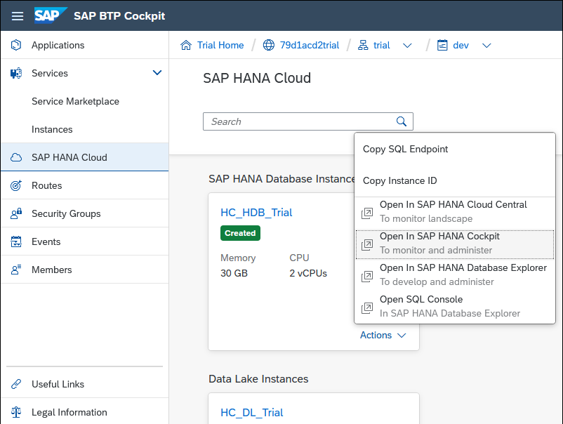

2. Open the Alert Definitions app.

    

3. The three alerts that will be triggered in step 2 of this tutorial are shown below.

      

    Notice that alerts have a name, ID, description, category, and a suggested user action such as an SAP Note.

    

    The categories are shown below.

    | SAP HANA Database Categories |
    | ----------- |
    | Other |
    | Availability |
    | Memory |
    | Disk |
    | Configuration |
    | Sessions/Transactions |
    | Backup |
    | Diagnosis Files |
    | Security |

4. Alerts may have severity and threshold levels.

    | Severity |
    | ----------- |
    | High |
    | Medium |
    | Low |
    | Information |    

    As an example, long-running statements (ID 39), has its threshold values set to 10 minutes for Medium, 5 minutes for Low, and 2 minutes for Info.

    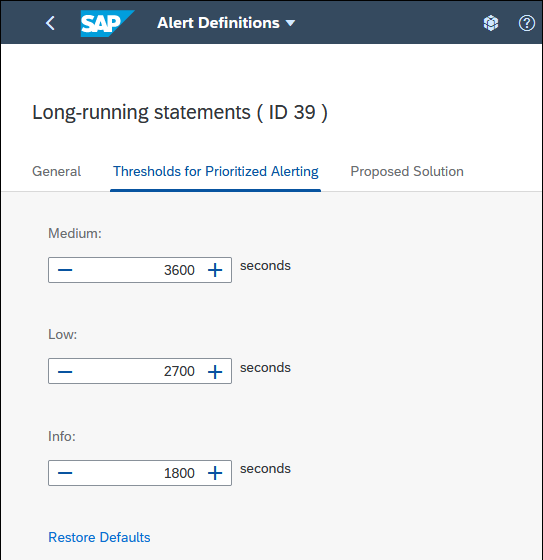

5. Alert checks are scheduled to run at a specified interval and can be enabled or disabled.  For example, record count of non-partitioned column-store tables ( ID 17 ), has an interval value of 1 hour which means that this check is performed each hour and is currently enabled.

    

    Note that the check for an alert can be manually triggered by pressing the **Check Now** button.

6. Alerts also have a retention period.  Once triggered, depending on their type, they will remain for a set duration such as 14 or 42 days.

  For additional details, consult [How Alerts are Generated](https://help.sap.com/viewer/f9c5015e72e04fffa14d7d4f7267d897/latest/en-US/8eca57e7e82e4b788246b6d9db020937.html) and
  the topic [Alerts](https://help.sap.com/viewer/9630e508caef4578b34db22014998dba/cloud/en-US/923f1c8f200b44708e7ee68876d5fe2b.html) in the document SAP HANA Cloud Database Administration with SAP HANA Cockpit.

[DONE]
[ACCORDION-END]

[ACCORDION-BEGIN [Step 2: ](Trigger alerts in a SAP HANA database)]

The following instructions demonstrate a few examples of triggering alerts in an SAP HANA database.      
> Ensure these actions are performed on a non-production system such as a trial account or only use the test alert.

1. Open the SAP HANA database explorer.

    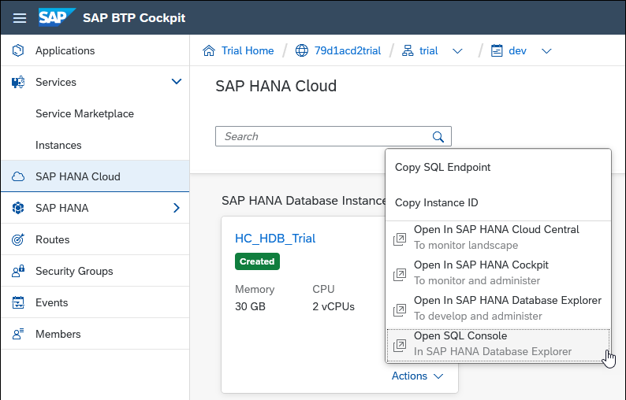

2. Execute the following SQL to trigger a high (indicated by the parameter value of 4) severity test alert.

    ```SQL
    CALL _SYS_STATISTICS.Trigger_Test_Alert(?, 4, 'High test alert');  
    ```

    > The alert will be viewed in SAP HANA Cockpit in step 3.

3. Execute the following SQL to trigger long-running statements (ID 39) at each threshold assuming the thresholds were set to 1, 2 and 3 minutes with an interval time set to 1 minute.

    ```SQL
    DO BEGIN
      -- Wait for a few seconds
      USING SQLSCRIPT_SYNC AS SYNCLIB;
      CALL SYNCLIB:SLEEP_SECONDS( 300 );  --runs for 5 minutes
      -- Now execute a query
      SELECT * FROM M_TABLES;
    END;
    ```

    > Long running statements can be run as a background activity which will continue even if the machine the SAP HANA database explorer is running on loses internet connectivity or the tab is closed.  
    >
    >
    >
    For additional details on the database explorer see the tutorial [Get Started with the SAP HANA Database Explorer](group.hana-cloud-get-started).

4. The alert record count of non-partitioned column-store tables (ID 17) can be triggered by executing the following SQL.  

    ```SQL
    --The default threshold for 'Record count of non-partitioned column-store tables' is 300 million
    -- This SQL may take a minute or two to run
    -- Create a table and insert more than 300 million rows into it
    DO BEGIN
           DECLARE i INT;
           CREATE TABLE MYTABLE(MYVALUE INT);
           INSERT INTO MYTABLE VALUES(1);
           INSERT INTO MYTABLE VALUES(2);
           INSERT INTO MYTABLE VALUES(3);
           INSERT INTO MYTABLE VALUES(4);
           INSERT INTO MYTABLE VALUES(5);
           FOR i IN 1 .. 26 DO
                  INSERT INTO MYTABLE (SELECT * FROM MYTABLE);
           END FOR;
           SELECT COUNT(*) FROM MYTABLE;
    END;
    SELECT TOP 100 * FROM MYTABLE;

    -- To resolve, partition the table
    -- ALTER TABLE MYTABLE PARTITION BY HASH(MYVALUE) PARTITIONS 5;

    -- Clean up
    -- DROP TABLE MYTABLE;
    ```

    As the default interval time for this check by default is set to 1 hour, it can be manually trigged by pressing the Check Now button in the alert definitions app within the SAP HANA cockpit.

    

    > Note that two other alerts may also be triggered by the above SQL; table growth of non-partitioned column-store tables and  record count of column-store table partitions.

5. The Database Overview in the SAP HANA cockpit will indicate if a medium or high alert was triggered.  The refresh interval can be set to control how often the contents of the page are updated.

    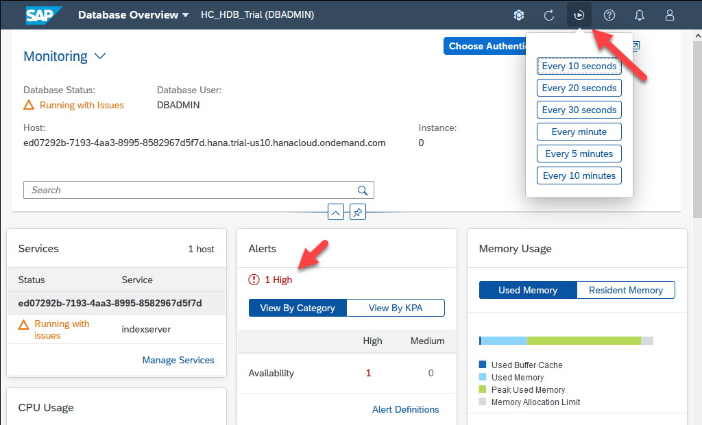

[DONE]
[ACCORDION-END]

[ACCORDION-BEGIN [Step 3: ](View SAP HANA database alerts using the alerts app)]
The following instructions will show how to view a triggered SAP HANA database alert in the alerts app in the SAP HANA cockpit.

1. After the long-running statement completes, open the alerts app to view the triggered alerts.  

    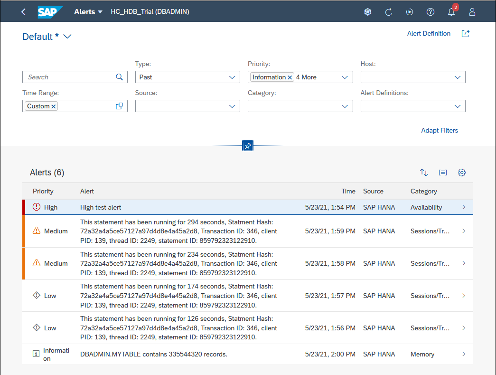

    > Current alerts are alerts that were triggered by the last scheduled run of the alert definition.  You may need to select **Past** from the Type drop down.

    >---

    > Alerts can be sorted and grouped.

    > 

    >---

    > Details about a SQL statement from a long-running statement alert can be found out with the following query.

    >```SQL
    SELECT * FROM M_SQL_PLAN_CACHE WHERE STATEMENT_HASH='XXXXXXXXXXXXXXXXXXXXX';
    >```

    >


2. The test alert will resolve itself after 5 minutes or can be removed (indicated by the parameter value of 0) from the Alerts tile by executing the following statement.

    ```SQL
    CALL _SYS_STATISTICS.Trigger_Test_Alert(?, 0, 'Resolve test alert');
    ```

    Additional details on the test alert are available at [SAP Note 3004477 - Usage of statistics server test alert (ID 999)](https://launchpad.support.sap.com/#/notes/3004477).

[DONE]
[ACCORDION-END]

[ACCORDION-BEGIN [Step 4: ](Trigger an alert in SAP HANA Cloud data lake)]
The following instructions show one example of triggering an alert in a data lake.  The alert will be triggered when a user becomes locked out because an incorrect password was provided too many times.     

1. In a SAP HANA database explorer that is connected to a data lake, execute the following SQL to create a login policy and a new user.

    ```SQL
    CREATE LOGIN POLICY lp max_failed_login_attempts=3;
    GRANT CONNECT TO user2 IDENTIFIED BY 'Password2';
    GRANT SELECT ANY TABLE TO user2;
    GRANT SET ANY CUSTOMER PUBLIC OPTION to user2;
    ALTER USER user2 LOGIN POLICY lp;
    ```

2. Create a new connection to the data lake using user2 but with an incorrect password.

    First choose **Properties** for the existing connection and copy the host value.

    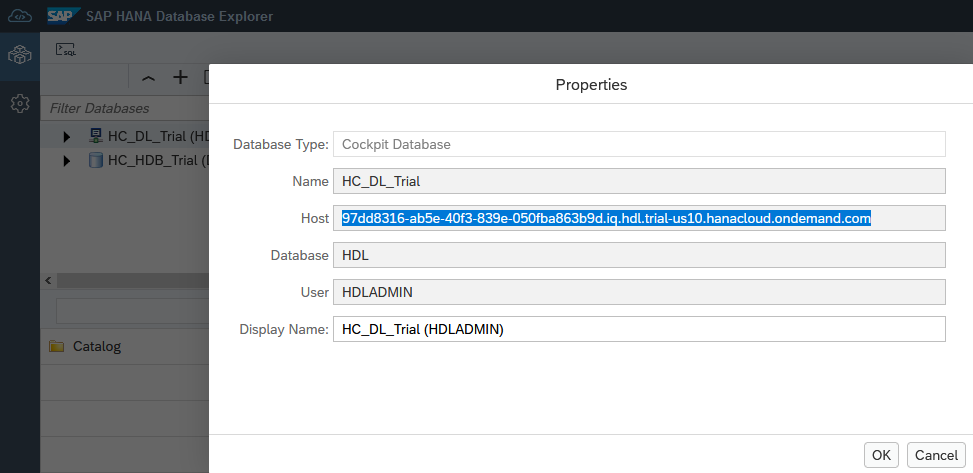

    Create a new connection using the copied host, port 443, user2 and an incorrect password.

    

    After pressing OK an attempt will be made to connect to the data lake.  After three failed attempts with the incorrect password, user2 will become locked.  This can be seen in the SAP HANA cockpit.

    

    The alert can pushed to a channel such as a specified email address which will be shown in step 5.

3. The user can be unlocked using the following SQL or via the UI in the SAP HANA cockpit.

    ```SQL
    ALTER USER user2 RESET LOGIN POLICY;
    --DROP USER user2;
    --DROP LOGIN POLICY lp;
    ```

[DONE]
[ACCORDION-END]


[ACCORDION-BEGIN [Step 5: ](Set up email notification when an alert occurs)]
The Business Technology Platform (BTP) includes a service called the Alert Notification Service (ANS) that provides a common way for other services or applications running in the BTP to send out notifications such as an email, a post to a Microsoft Teams or Slack channel, the creation of a ticket in `ServiceNow`, or a webhook to send events to any Internet REST endpoint.  The SAP HANA Cloud database and data lake pass on events to (ANS) when an alert is triggered.  


For an overview of ANS and information about the different service plans including free tier, see [SAP Alert Notification Service for SAP BTP](https://discovery-center.cloud.sap/serviceCatalog/alert-notification-service?tab=feature&region=all&service_plan=standard) in the SAP Discovery center and watch the associated video [SAP Alert Notification service for SAP BTP - Overview](https://www.youtube.com/watch?v=_DInhi4Skn4).

In this step, ANS will be configured to act on the incoming notifications by sending an email with the details of the alert.  First, an instance of the alert notification service will be created.  Then, two conditions will be created; one that matches notifications sent from an SAP HANA database and one for the data lake.  An email action will also be created that describes who to send an email to and what content to include in the email when one of the conditions occurs.  Finally, a subscription will be created that will use the two conditions and the action.  Having the conditions and actions separate from the subscription enables them to be reused in multiple subscriptions.   

1. Create an instance of the Alert Notification Service in the SAP BTP Cockpit.

    

    > The Alert Notification Service must be in the same cloud foundry org and space as the SAP HANA Cloud instances that it will be receiving notifications from.

2. Provide a name for the alert notification service instance and press the **Create** button.

    

3. Once the instance has been created, click on **Manage Instance**.

    

4. Create a condition for SAP HANA database alerts by selecting **Conditions** and then pressing **Create**.

    

5. Specify the condition details and press **Create**.

    

    > Alternatively, a condition `resource.resourceType` set to equal `hana-cloud-hdb` could be used.

    > ---

    > Note that the Mandatory checkbox is left unchecked.  This means that this condition can be `ORed` with one or more other non mandatory conditions.

    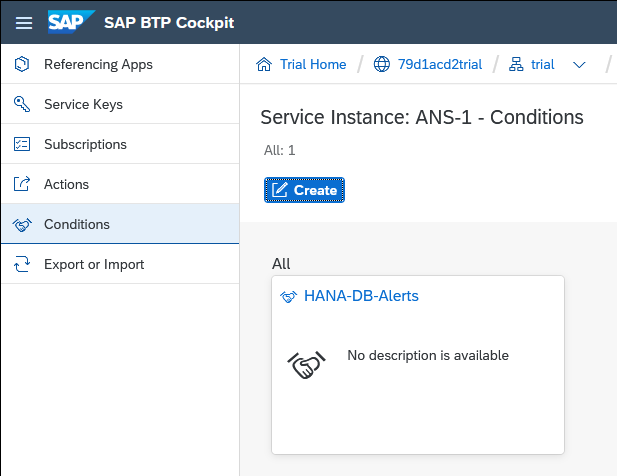

6. Create another condition for data lake alerts.  Specify the condition details and press **Create**.

    

7. Create an action by selecting **Actions** and the pressing **Create**.

    

8. Specify the type of action to be **Email**.

    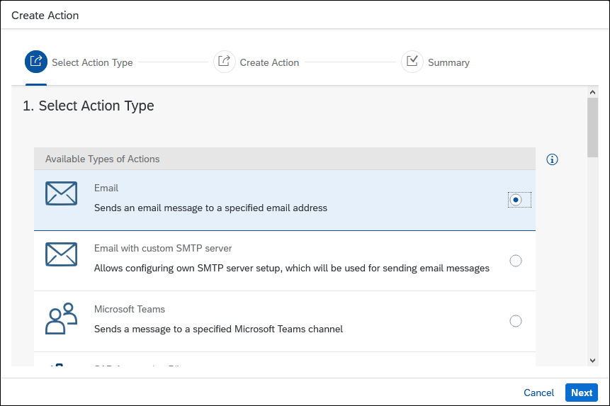

    See also [Managing Actions](https://help.sap.com/viewer/5967a369d4b74f7a9c2b91f5df8e6ab6/Cloud/en-US/8a7e092eebc74b3ea01d506265e8c8f8.html) for details on other available action types.

9. Provide a **Name** and then scroll to the additional properties section.

    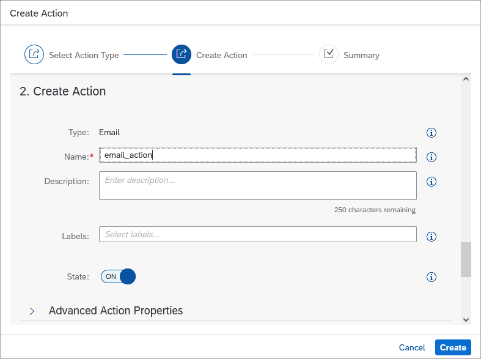

    In the **Additional Properties** section, provide values for **Email Address**, **Subject Template** and **Payload Template**.

    

    &nbsp;
    ```Subject Template
    {severity} {resource.resourceType} {eventType} {tags.ans:status} occurred on {resource.resourceName}
    ```

    ```Payload Template
    AlertID: {tags.hanaAlertRuleId}
    Body: {body}
    Recommended Action: {tags.ans:recommendedAction}
    Instance Details: {resource.tags.*}
    ```

    > It is also possible to leave the subject and payload template fields empty.  In this case, a default template will be used.

    Details on the available tags for each alert are provided at [Built-In Events](https://help.sap.com/viewer/5967a369d4b74f7a9c2b91f5df8e6ab6/Cloud/en-US/2ef9c72833df4f2690f071c47f50f5af.html).  

    

10. A confirmation token will be sent to the email address.  Click on the provided link or copy that value and use it to confirm the action as shown in the next sub-step.

    

11. Click on **`email_action`** to open it.

    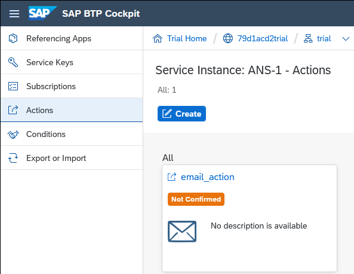

    Press the **Confirm Action** button.

    

    Enter the confirmation token.

    

12. Create a subscription by selecting **Subscriptions** and pressing **Create**.

    

    Provide a **Name** and press the **Create** button.

    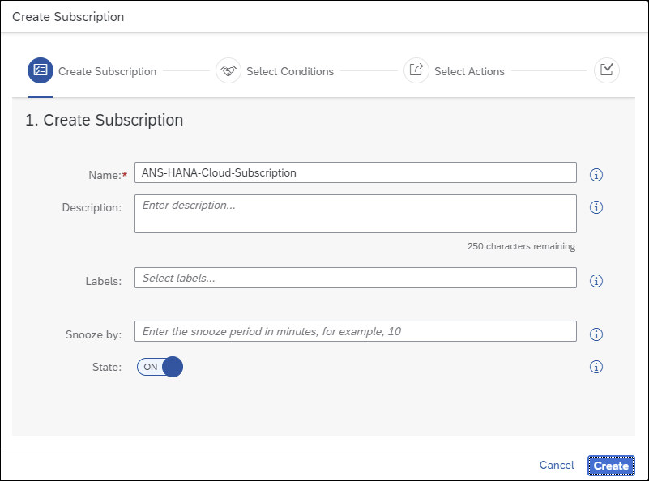

13. Assign the conditions to the subscription by including the two previously created conditions and pressing the **Assign** button.

    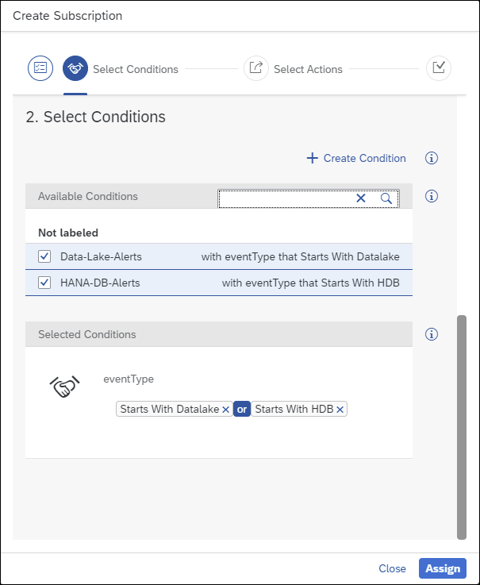

    > Another example is to specify the instance ID of a specific production server to monitor and to only send an alert when the alert first occurs (create state).
    >
    > 

14. Assign the action to the subscription by including the previously created action and pressing the **Assign** button.

    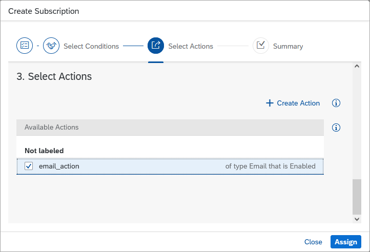

15. Completed subscription.

    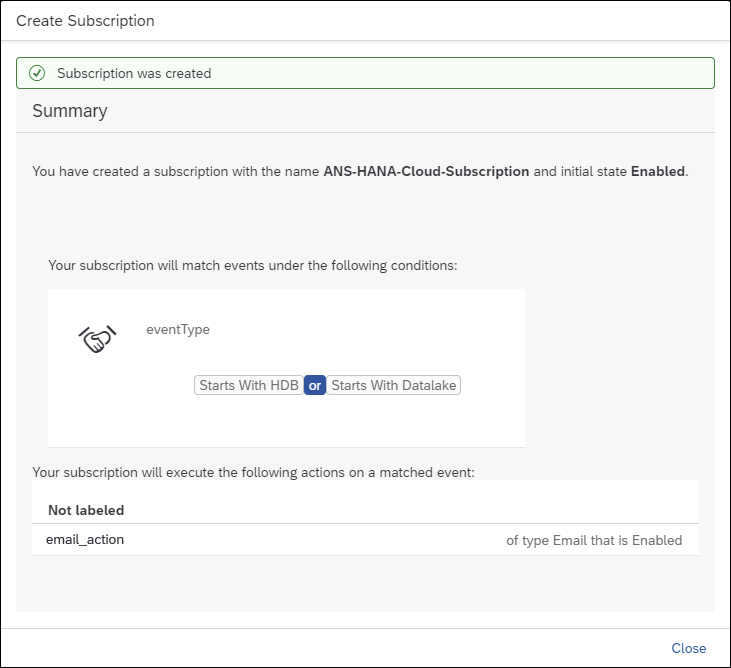

16. Repeating the actions in step 2 and 4 should now send emails like the ones shown below.

    Test Alert

    

    Test Alert (default template)

    

    > Notice that the `ans:status` is CLOSE. Events can have a status of CREATE, UPDATE or CLOSE.

    Long-Running Statement

    

    Record count of non-partitioned column-store tables

    

    Locked user

    

[DONE]
[ACCORDION-END]

[ACCORDION-BEGIN [Step 6: ](Set up notification with a Microsoft Teams channel)]

This step will briefly show an example of how to receive a notification in Microsoft Teams.

1.  In Microsoft Teams, search for **Incoming Webhook** in Apps.

    

2.  Choose to add the app to a team.

    

3.  Specify a name for the webhook, optionally upload an image, and press **Create**.

    

    After pressing create, copy the provided URL and press **Done**.

    

    A notification will appear in the channel that the connector has been added.

    

4. Similar to the previous step where an ANS action was created for email, create one for Microsoft Teams in the SAP BTP Cockpit.

    

    Provide the webhook URL.

    

5. Assign the action to a subscription.

    

6. After triggering an alert, the Microsoft Teams channel will show the notification.

    


[DONE]
[ACCORDION-END]

[ACCORDION-BEGIN [Step 7: ](Set up notification with a Slack channel)]

This step will briefly show an example of how to receive a notification in Slack.

1. In a browser open [api.slack.com](https://api.slack.com/), click on **Create a custom app**, and then choose **from scratch**.

    Provide an app name, a workspace, and press **Create App**.

    

2. Choose to add **Incoming Webhooks**.

    

3. After activating incoming webhooks, click on **Add New Webhook to Workspace**.

    Specify the Slack channel that will be used to post to and click **Allow**.

    

    Copy the provided Webhook URL.

4. Similar to the step where an ANS action was created for email, create one for Slack in the SAP BTP Cockpit.

    

    Provide the webhook URL.

    

    An example of a payload template.

    ```JSON
    [{
		"type": "section",
		"text": {
			"type": "mrkdwn",
			"text": "* {severity} {eventType} {tags.ans:status} on {resource.resourceName}*"
		}
  	},
  	{
  		"type": "divider"
  	},
  	{
  		"type": "section",
  		"text": {
  			"type": "mrkdwn",
  			"text": ":pencil2: Subject: {subject}"
  		}
  	},
  	{
  		"type": "section",
  		"text": {
  			"type": "mrkdwn",
  			"text": ":scroll: Body: {body}"
  		}
  	},
  	{
  		"type": "section",
  		"text": {
  			"type": "mrkdwn",
  			"text": " :medical_symbol: Recommended Action: {tags.ans:recommendedAction}"
  		}
  	}]
    ```

5. Assign the action to a subscription.

    

6. After triggering an alert, the Slack channel will show the notification.

    

Congratulations! You have now configured alerts, triggered and viewed them via the SAP HANA cockpit and  received them via email, Microsoft Teams, and Slack using the Alert Notification Service (ANS).  

[VALIDATE_1]
[ACCORDION-END]

---
