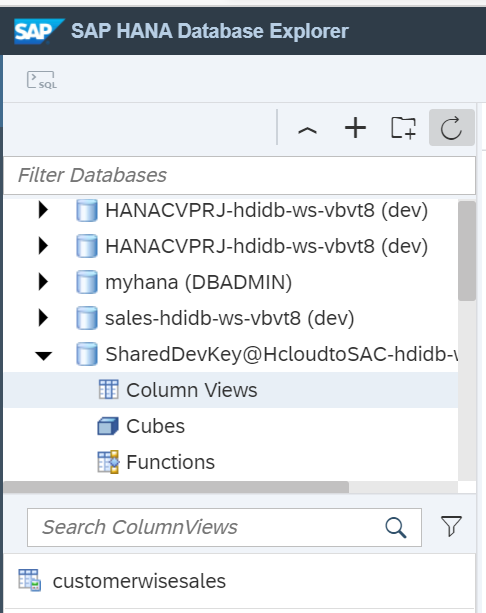

# Create Calculation View in SAP HANA Cloud
<!-- description --> Create your own calculation views in SAP HANA Cloud, SAP HANA database with SAP Business Application Studio.

## Prerequisites
 - You have [Set Up a BTP Account for Tutorials](group.btp-setup). Follow the instructions to get an account, and then to set up entitlements and service instances for the following BTP services.
    - **SAP Business Application Studio**
    - **SAP Analytics Cloud trial**

  ## You will learn
- How SAP HANA modeling is performed using SAP Business Application Studio
- How to create and use HDI containers


## Intro
In this tutorial, you will learn about the creation of a calculation view in SAP HANA Cloud. The created calculation view is later consumed in SAP Analytics Cloud using Live Data Connection to create a story for detailed data analysis.


---


### Start SAP Business Application Studio and create Dev Space

1.  Login to your BTP trial subaccount, navigate to subscriptions and select SAP Business Application Studio.

    <!-- border -->

    This will open the dev spaces.

2.  Click **Create Dev Space**.

    <!-- border -->

3.  Select SAP HANA Native Application for the Dev Space type and specify a name.

    We have provided the name as `HANADevSpace`.

    <!-- border -->

4. Click **Create Dev Space**.

    In a minute, the Dev Space will get created. You need to start the Dev Space, which will by default be in stopped state.

    <!-- border -->

    After starting, the state of the Dev Space changes to Running.

    <!-- border -->


### Launch the studio and log into Cloud Foundry

1. Click on the Dev Space name to launch SAP Business Application Studio.

    <!-- border -->

    After launching SAP Business Application Studio, you need to log in to Cloud Foundry.

2. To log in, click **View > find command** and enter `CF`. From the available options, select **Login to Cloud Foundry**.

    <!-- border -->

3. Specify your Cloud Foundry endpoint.

    <!-- border -->

4. Enter your e-mail address.

    <!-- border -->

5. Select the space from the CF Subaccount. This will set the CF Organization and Space for the application we are building

    <!-- border -->

6. A confirmation message will be shown at the bottom of the screen.

    <!-- border -->


### Create SAP HANA database project

You will start the creation of the project now.

1. Select **File > Project from Template**, which shows the list of available templates to create applications using BAS.

    <!-- border -->

2. For this scenario, select SAP HANA Database project and then click **Start**.

    <!-- border -->

3. Specify a name to the project

    <!-- border -->

4. Leave the basic properties as is (for example, module name is `db`).

    <!-- border -->

5. Leave the namespace and schema fields empty. Check 'Yes' for the binding the database module to a Cloud Foundry service instance property.

    <!-- border -->

6. Leave default values for HDI Container service and then click **Finish**.

    <!-- border -->

    The SAP HANA database project generation will start.

    <!-- border -->

    Now you will be able to see the project in the Explorer section of SAP Business Application Studio.

    <!-- border -->


### Create SAP HANA tables

1. Click **View > find command**, type `HANA` and then select the option **Create SAP HANA Database Artifact**.

    <!-- border -->

2. Select the source folder in the project to create the artifact and choose the artifact type as `Table (hdbtable)`.

    Name the table `customers`.

    <!-- border -->

3. Include the following code for the table definition:

    ```SQL
    COLUMN TABLE "customers"(custid integer, custname varchar(40), custcountry varchar(3), custregion varchar(4));
    ```

    <!-- border -->

4. Click  button on the top-right corner to deploy the table.

    <!-- border -->

5. Similarly, you can create another table called `sales` by simply right-clicking the source folder and selecting the option new file.

    Enter the name `sales.hdbtable`.

    <!-- border -->

6. Add the following definition to the sales.hdbtable file.

    ```SQL
    COLUMN TABLE "sales" ( sid integer, pid varchar(5), sdate date, samt integer, custid integer )
    ```

7. Click <!-- border -->  button on the top-right corner to deploy the sales table.

  <!-- border -->


### Insert data into tables


1. Click the SAP HANA projects in explorer, then click  the database explorer  icon.

    <!-- border -->

    This opens SAP HANA Database Explorer in a new window where you can see the details of the HDI container.

    <!-- border -->

3. Select the tables folder in the HDI Container to see the customers and sales tables that you created.

    <!-- border -->

4. Click the customers table. This shows the table definition.

    <!-- border -->

5. Click open data and then click  to insert a few sample records into the table.

    <!-- border -->

6. Follow similar steps to insert a few sample records into the sales table.

    <!-- border -->

Now you can go back to the project in SAP Business Application Studio to create a CUBE calculation view.


### Create calculation view


1. Select the source folder in the project to create the calculation view and choose the artifact type as Calculation View.

    Then, specify for the name `customerwisesales`, and then click **Create**.

    <!-- border -->

2. Open the file `customerwisesales.hdbcalculationview`.

    <!-- border -->

3. Add a Join node into the canvas.

    <!-- border -->

4. Click the following icon:

    <!-- border -->

    Search for customers and sales tables and add them to the join node.

    <!-- border -->

    After adding both the tables, the join node looks like the following.

    <!-- border -->

6. Double-click the join node.

    <!-- border -->

7. Drag the `CUSTID` field of the customers table onto the `CUSTID` field of the sales table. This will add a join condition between the tables.

    <!-- border -->

8. Navigate to the mapping tab of the join node and map the fields from both customers and sales into output columns.

    <!-- border -->

9. Link the join node to the aggregation node by using the following button:

    

    It looks like this.

    <!-- border -->

10. Double-click the aggregation node. Move all the columns from the join node to the output columns.

    <!-- border -->

11. Double-click the semantics node in the calculation view. Select `CUSTID` and `SID` fields and mark them as attributes.

    <!-- border -->

12. Maintain all the other semantics as needed.

13. Click the <!-- border -->  button to deploy the calculation view.

    <!-- border -->

15. Navigate to the database explorer. Select the HDI container and choose column view. This shows the calculation view.

    <!-- border -->

16. Select the calculation view and click **Open Data**. This presents the data from the calculation view.

    <!-- border -->

17. You can go to the **Analysis** tab to view the data in the form of graphs, charts and other elements.

    Here the country wise sales is shown in a donut chart.

    <!-- border -->


### Test yourself


---
