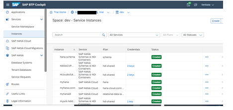
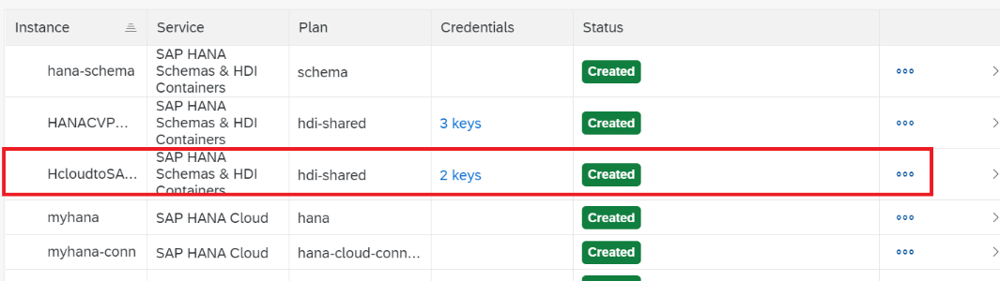
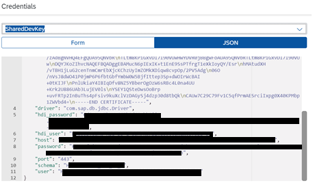
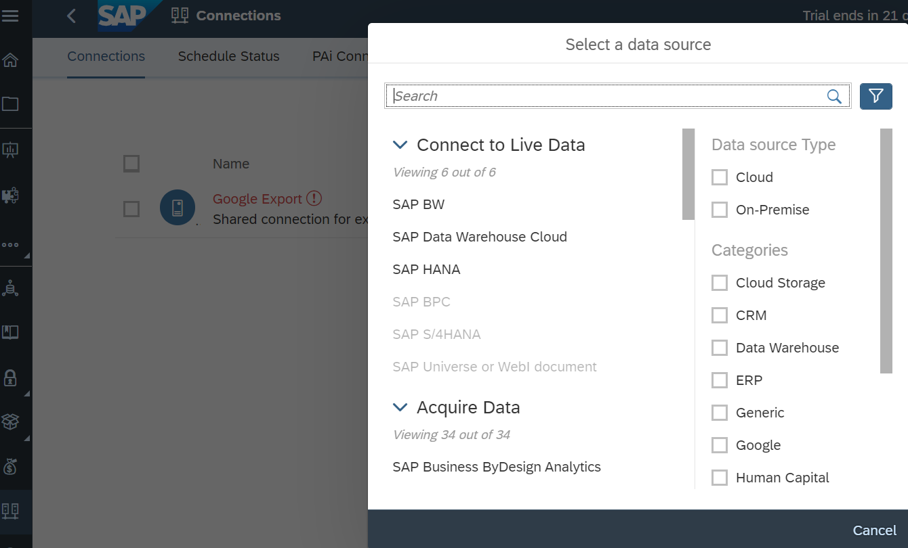
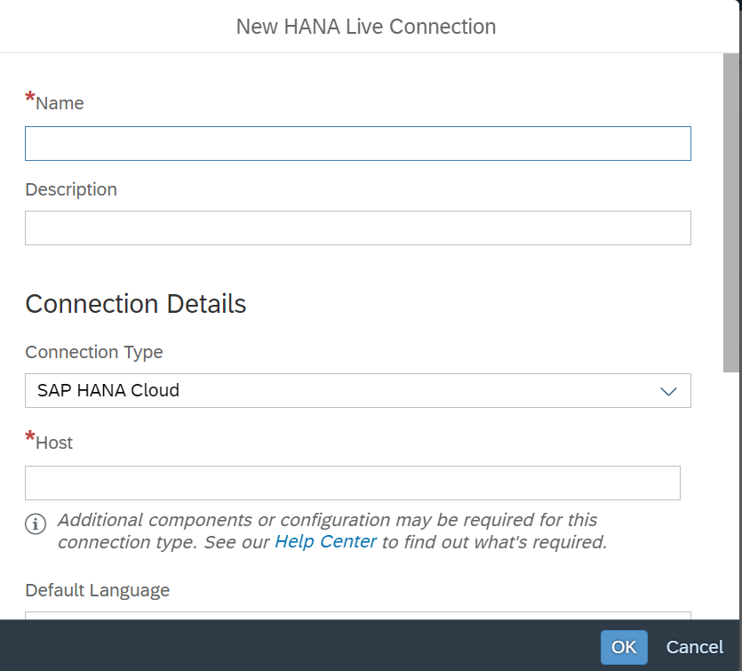
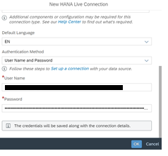
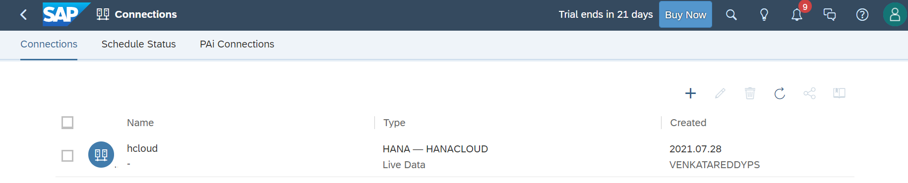

# Create a Live Data Connection in SAP Analytics Cloud
<!-- description --> Create a Live Data Connection in SAP Analytics Cloud to consume the calculation view built on SAP HANA Cloud.

## Prerequisites
 - You have [Set Up a BTP Account for Tutorials](group.btp-setup). Follow the instructions to get an account, and then to set up entitlements and service instances for the following BTP services.
    - **SAP Business Application Studio**
    - **SAP Analytics Cloud trial**

  ## You will learn
- Understand the setup of SAP HANA Cloud Live Data Connection in SAP Analytics Cloud

## Intro
In this tutorial, you will learn about the creation of a Live Data Connection. The Live data Connection in SAP Analytics Cloud enables you to consume the calculation view created on top of SAP HANA Cloud as a data source to create visualizations.

---
### Create connection between SAP HANA Cloud and SAP Analytics Cloud

1. Navigate to SAP BTP trial and select the dev space and then choose the instances. Here you will get to see the application instances.

    <!-- border -->

2. Select the application that you have deployed in BAS.

    <!-- border -->

3. Click on the keys, to see the credentials to be used for establishing live connection in SAP Analytics Cloud.

    <!-- border -->
  Using the schema details one can create a generic credentials set (like reporting user) which can later be used in SAP Analytics Cloud.

4. Go to SAP Analytics Cloud trial, click on connections then click on the + icon to create a live data connection setting.
  Select connect to Live data then choose SAP HANA.

    <!-- border -->

5. Provide a name to HANA Live connection. Select the connection type as SAP HANA Cloud.

    <!-- border -->

6. Provide the hostname, language key, username, password details (The details are obtained from HANA application under deployed instances section of BTP trial) and click OK.

    <!-- border -->

7. This creates the HANA Live data connection setting.

    <!-- border -->
  Next step is to create a Live data model based on the calculation view you have created.

### Test yourself

---
