# Create Live Data Model and a Story
<!-- description --> Live Data Model is created SAP Analytics Cloud and consume it to create a story for data analysis.

## Prerequisites
 - You have a SAP Analytics cloud trial Account.
    - **SAP Analytics Cloud trial**

  ## You will learn
- How to create Live Data model in SAP Analytics Cloud.
- How to create stories in SAP Analytics Cloud.

## Intro
In this tutorial, you will learn about the creation of a Live Data Model in SAP Analytics Cloud. The created Live Data Model is later consumed in a story as a data source for detailed data analysis.

### Create Live Data Model in SAP Analytics Cloud

1. To create a Live Data Model, navigate to the modeler section in SAP Analytics Cloud. Select Modeler.

    <!-- border -->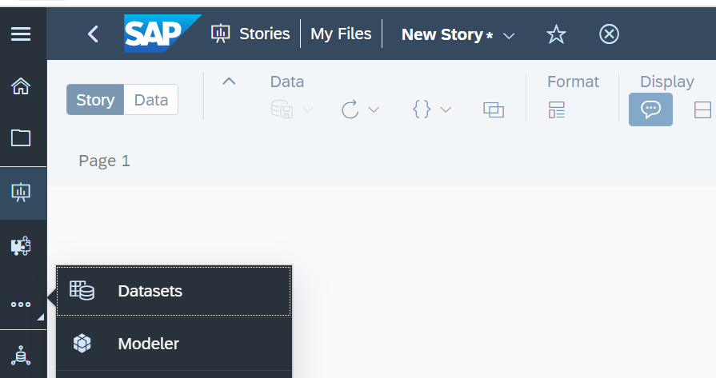

2. Under the modeler, select the option live data model.

    <!-- border -->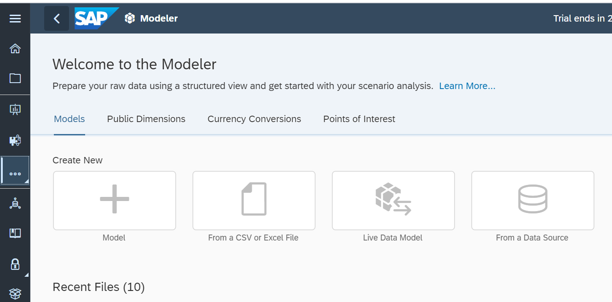

3. Select the system type as SAP HANA and the connection that you have created previously.

    <!-- border -->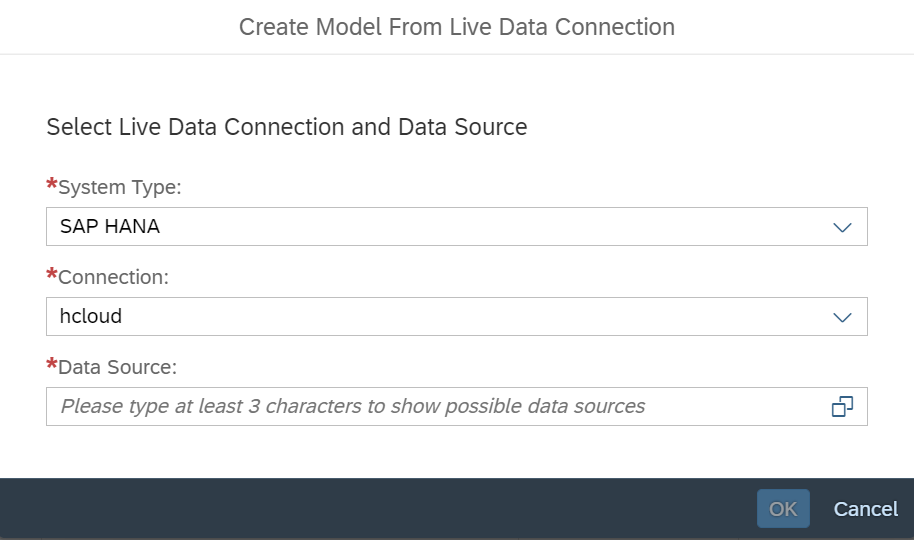

4. Type first three letters of the CV in the data sources section. This will show the calculation view that you have created previously in BAS.

    <!-- border -->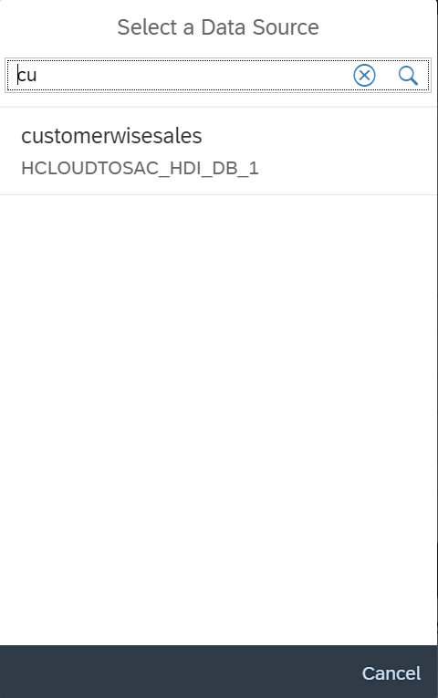

5. Select the calculation view and click OK.

    <!-- border -->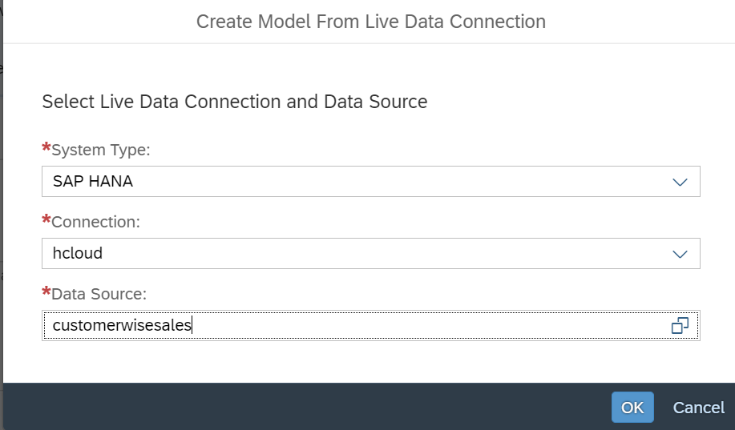

6. This will show all the measures and attributes that are part of the model.

    <!-- border -->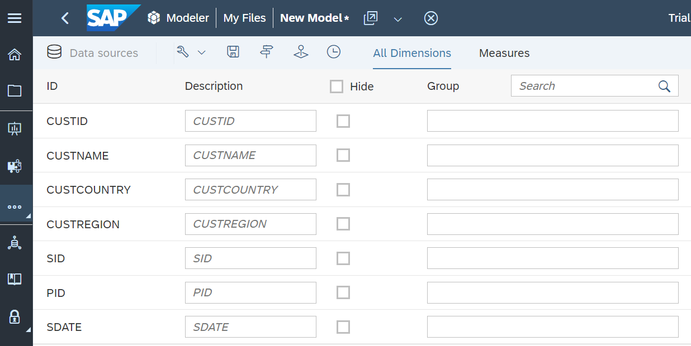

7. Click on SAVE button to save the model. Specify a name to the model and then hit save.

    <!-- border -->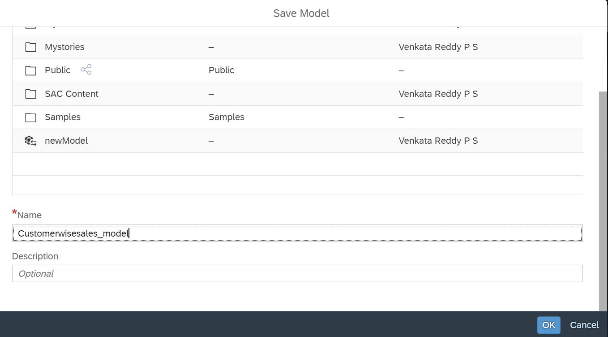

### Create story in SAP Analytics Cloud

1. From the home screen of SAC, select stories and click canvas type of stories under create new.

    <!-- border -->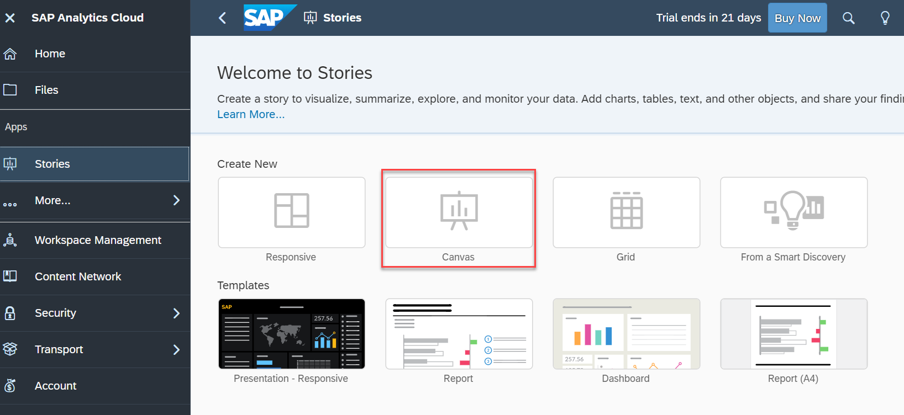

2. This will open the new story. click add data button.

    <!-- border -->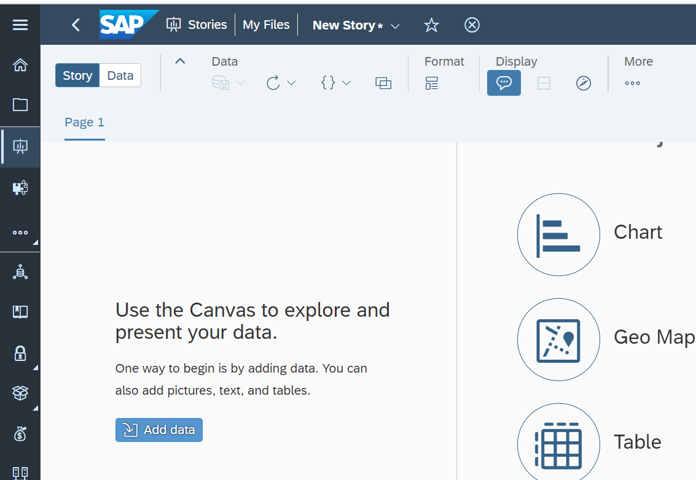

3. Select data from a model in the next window, this will navigate you to the list of models that are available.

    <!-- border -->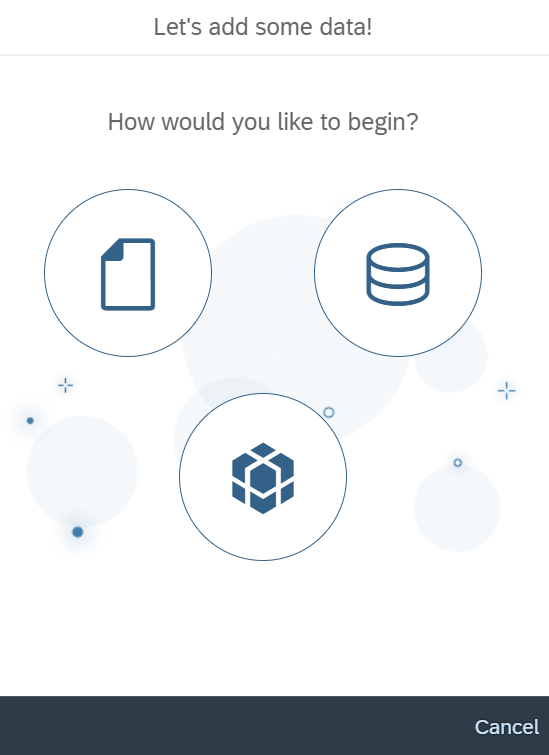

4. Select the model that you have created in the previous steps.

    <!-- border -->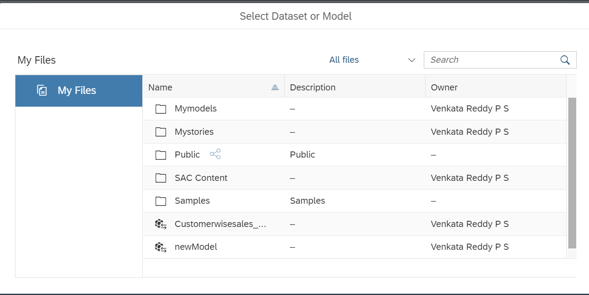

5. This will bring you to the data analysis section where you can analyze the data from the model.

    <!-- border -->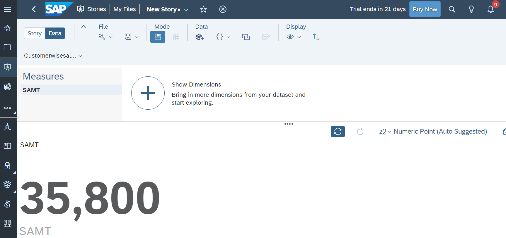

 6. Select the Story tab again and add a numeric point chart to display total sales amount, bar graph to show sales amount variation with respect to the products and a donut chart to show customer wise sales amount. After adding the charts, navigate to the styling section in SAC to add custom styles and colors to the charts and other objects in the story.

    <!-- border -->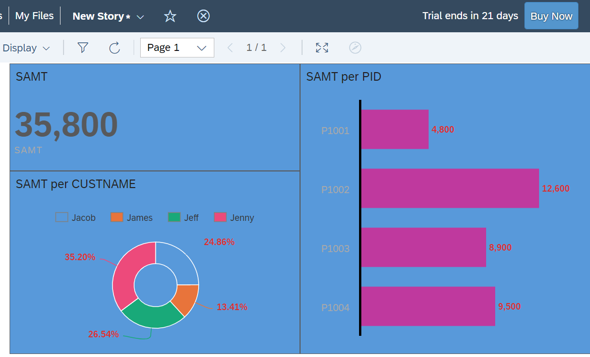

### Test yourself

---

#### Tutorials for further learning

[HANA Academy tutorials](https://www.youtube.com/playlist?list=PLkzo92owKnVzONfsNdQNmpPQvUT54UUAL)

---
