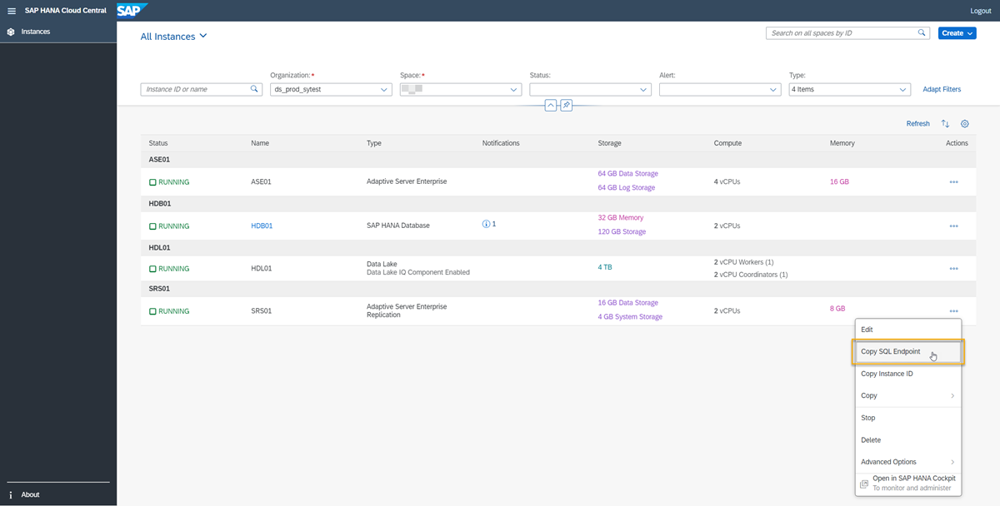

## Details
### You will learn
- How to prepare your system to run a test script using SAP HANA Cloud, SAP ASE replication
- About interfaces files


In this tutorial, you will learn about the prerequisites and basic set up of your instances in SAP HANA Cloud. This will allow you to use scripts to set up and test the data replication from one SAP ASE instance within SAP HANA Cloud to another using SAP HANA Cloud, SAP Adaptive Server Enterprise replication, the replication server component of SAP HANA Cloud. You will walk through the necessary steps in each of the following tutorials.

The scripts given in this tutorial will help you to test SAP ASE replication in SAP HANA Cloud for the first time. You can also customize the scripts to help automate the process of setting up replication servers in your organization. This is especially helpful when you are managing multiple replication servers.

> ### Disclaimer
>
> Within this group of tutorials, the phrase **"replication server"** is used to refer to **"SAP HANA Cloud, SAP Adaptive Server Enterprise replication"** unless mentioned otherwise.


---

[ACCORDION-BEGIN [Step 1: ](Prepare system to run script)]

There are a few pre-requisites to being able to run these scripts:

- Provision and have **two running instances** of SAP HANA Cloud, SAP Adaptive Server Enterprise.
- Provision and have **a running instance** of SAP HANA Cloud, SAP Adaptive Server Enterprise replication.
- The Connections option for all instances should be set to **Allow all IP addresses**. You can set this up either when you provision new instances, or you can edit existing instances to allow all IP addresses.
- To set up a connection, you will need the **SQL Endpoint** of each instance.

> ### SQL Endpoint of an instance
>
> This information can be found in SAP HANA Cloud Central. To obtain it, open **SAP BTP Cockpit** and click on **Manage SAP HANA Cloud**. There, click on the three dots on the right side of the row for each SAP ASE instance and from the drop-down, select **Copy SQL Endpoint**. This is the **host name** that you need to enter in the interfaces file to connect with your client.
>
!

[DONE]
[ACCORDION-END]

[ACCORDION-BEGIN [Step 2: ](Collect instance information from interfaces file)]

> ### About the OS used in this tutorial
>
> This tutorial describes the steps needed if you are working on a Linux machine with the [Client SDK](https://launchpad.support.sap.com/#/softwarecenter/template/products/%20_APP=00200682500000001943&_EVENT=DISPHIER&HEADER=Y&FUNCTIONBAR=N&EVENT=TREE&NE=NAVIGATE&ENR=73555000100900005328&V=MAINT&TA=ACTUAL&PAGE=SEARCH/SDK%20FOR%20SAP%20ASE%2020.0) installed, but the scripts should work in any operating system.

Just as you know from SAP Replication Server on-premise, you will need an **interfaces file** to connect to your instances. Details for both SAP ASE instances in SAP HANA Cloud, as well as to the replication server in SAP HANA Cloud should all be included in the file.  

You can see an example of the interfaces file structure here:

`[INSTANCE NAME]
query tcp ether [SQL ENDPOINT] [PORT] ssl="CN=hanacloud.ondemand.com"`

You need one entry like above for each SAP ASE database instances and the replication server you will use. Here is a complete example of how an interfaces file looks like in this scenario:

```Shell/Bash
Test_ASE_3_25
query tcp ether 916d3701-7e05-48f5-be1c-dfee64f24c75.ase.hxtp.prod-us21.hanacloud.ondemand.com 443 ssl="CN=hanacloud.ondemand.com"

Test_SRS_3_25
query tcp ether d34e568c-4dde-43c3-90fe-587cd2858c7c.srs.hxtp.prod-us21.hanacloud.ondemand.com 443 ssl="CN=hanacloud.ondemand.com"

Test_ASE2_3_31_21
query tcp ether c4a4b627-0c7f-4521-9d4b-c61e8cce9a88.ase.hxtp.prod-us21.hanacloud.ondemand.com 443 ssl="CN=hanacloud.ondemand.com"
```

Now you know the prerequisites and necessary preparations to get started. Learn in the next tutorial how to create the script.


[DONE]
[ACCORDION-END]


[ACCORDION-BEGIN [Step 3: ](Test yourself)]


[VALIDATE_7]
[ACCORDION-END]

---
