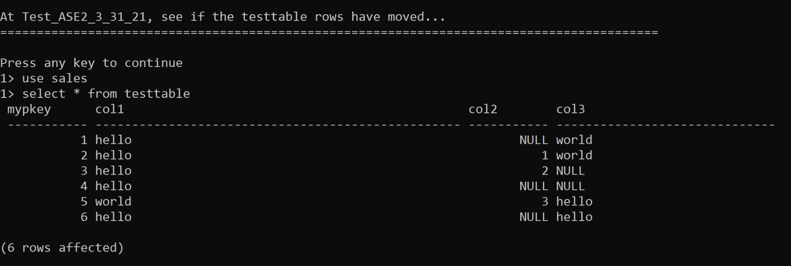
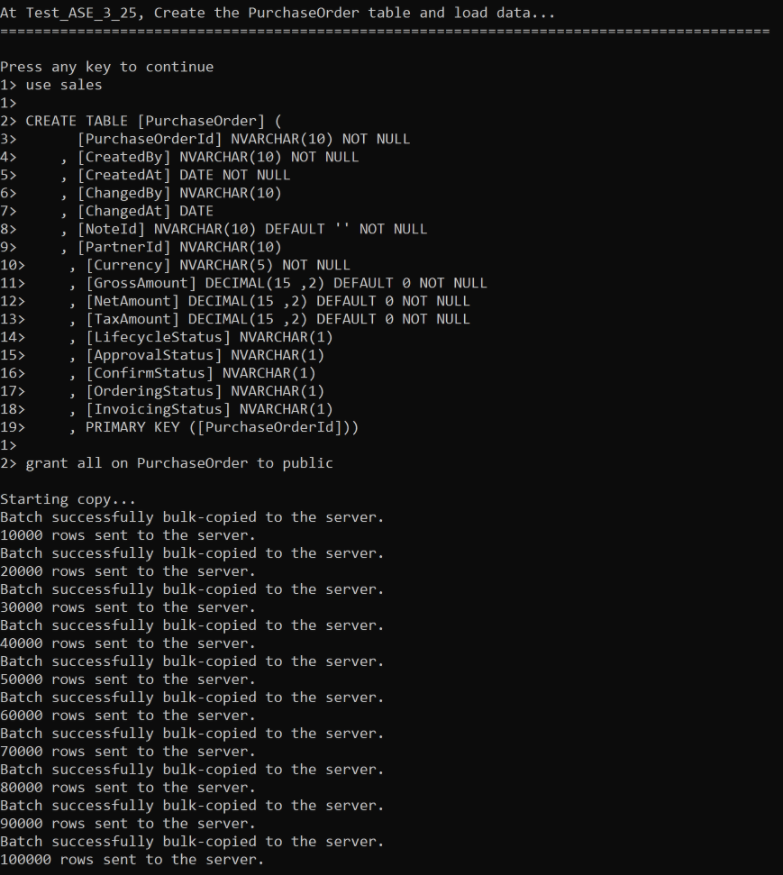

## Prerequisites
- You have completed the [tutorial](hana-cloud-ase-replication-scripts-2) on how to adjust sample scripts to suit your SAP HANA Cloud landscape.

## Details
### You will learn
- How to create a table in the SAP HANA Cloud, SAP ASE database
- How to check for replication of a table
- How to use **`bcp.fmt`** file to set up the table contents


Now that you have adjusted the example script to include specific details of your landscape, you can run the script to test the connection and data replication capabilities of your SAP HANA Cloud, SAP Adaptive Server Enterprise replication.

In this tutorial, you will walk through creating two tables in your source SAP ASE database in SAP HANA Cloud and confirming that these tables have been replicated on your target SAP ASE database in SAP HANA Cloud.

To run the scripts, make sure you are connecting with your preferred supported tool or programming interface.

> ### Disclaimer
>
> Within this group of tutorials, the phrase **"replication server"** is used to refer to **"SAP HANA Cloud, SAP Adaptive Server Enterprise replication"** unless mentioned otherwise.


---

[ACCORDION-BEGIN [Step 1: ](Create a table in the source database)]

First, create a small table called **`testtable`** in your source SAP ASE database in SAP HANA Cloud. Please keep in mind that we're using placeholders for the name, host addresses, and passwords of the source and target SAP ASE databases, as well as for the replication server.

```Shell/Bash
# echo
# echo
# echo At $ASE_1, create a table testtable...
# echo ==========================================================================================
# echo
# echo
isql -U aseadmin -P $ASE_1_PASSWORD -J utf8 -S $ASE_1 -e -w1000 <<EOF
use sales
go
create table testtable (
mypkey int primary key,
col1 char(50) not null,
col2 int null, col3 varchar(30)
null)
go
grant all on testtable to public
go
insert into testtable values (1, "hello", null, "world")
insert into testtable values (2, "hello", 1, "world")
insert into testtable values (3, "hello", 2, null)
insert into testtable values (4, "hello", null, null)
insert into testtable values (5, "world", 3, "hello")
insert into testtable values (6, "hello", null, "hello")
select * from testtable
go
EOF
```


[DONE]
[ACCORDION-END]

[ACCORDION-BEGIN [Step 2: ](Check for replication of table)]

Now, test your target SAP ASE database in SAP HANA Cloud to see if the **`testtable`** rows have been replicated.

```Shell/Bash
# echo
# echo
# echo At $ASE_2, see if the testtable rows have moved...
# echo ==========================================================================================
# echo
# echo
isql -U aseadmin -P $ASE_2_PASSWORD -J utf8 -S $ASE_2 -e -w1000 <<EOF
use sales
go
select * from testtable
go
EOF
```

The results after you run your script should look like this:

!

!


[DONE]
[ACCORDION-END]


[ACCORDION-BEGIN [Step 3: ](Query the progress of replication)]

You can also query the progress of replication. To do this, use a larger table named `PurchaseOrder` and load it with 100,000 rows.

```Shell/Bash
# echo
# echo
# echo At $ASE_1, Create the PurchaseOrder table and load data...
# echo ==========================================================================================
# echo
# echo
isql -U aseadmin -P $ASE_1_PASSWORD -J utf8 -S $ASE_1 -e -w1000 <<EOF
use sales
go
CREATE TABLE [PurchaseOrder] (
      [PurchaseOrderId] NVARCHAR(10) NOT NULL
    , [CreatedBy] NVARCHAR(10) NOT NULL
    , [CreatedAt] DATE NOT NULL
    , [ChangedBy] NVARCHAR(10)
    , [ChangedAt] DATE
    , [NoteId] NVARCHAR(10) DEFAULT '' NOT NULL
    , [PartnerId] NVARCHAR(10)
    , [Currency] NVARCHAR(5) NOT NULL
    , [GrossAmount] DECIMAL(15 ,2) DEFAULT 0 NOT NULL
    , [NetAmount] DECIMAL(15 ,2) DEFAULT 0 NOT NULL
    , [TaxAmount] DECIMAL(15 ,2) DEFAULT 0 NOT NULL
    , [LifecycleStatus] NVARCHAR(1)
    , [ApprovalStatus] NVARCHAR(1)
    , [ConfirmStatus] NVARCHAR(1)
    , [OrderingStatus] NVARCHAR(1)
    , [InvoicingStatus] NVARCHAR(1)
    , PRIMARY KEY ([PurchaseOrderId]))
go
grant all on PurchaseOrder to public
go
EOF

bcp sales..PurchaseOrder in PurchaseOrder.csv -Y -b 10000 -S $ASE_1 -U aseadmin -P $ASE_1_PASSWORD -f bcp.fmt
```


[DONE]
[ACCORDION-END]

[ACCORDION-BEGIN [Step 4: ](Use bcp.fmt file to set up the table contents)]

In this example, we used a `bcp.fmt` [file](https://help.sap.com/viewer/da6c1d172bef4597a78dc5e81a9bb947/LATEST/en-US/a80af36ebc2b1014adabde105795cc5b.html) to help set up this table, as shown below:

```Shell/Bash
bcp.fmt

10.0
16
1	SYBCHAR	1	30	"\","	1	PurchaseOrderId
2	SYBCHAR	1	30	"\","	2	CreatedBy
3	SYBCHAR	1	30	"\","	3	CreatedAt
4	SYBCHAR	1	30	"\","	4	ChangedBy
5	SYBCHAR	1	30	"\","	5	ChangedAt
6	SYBCHAR	0	30	","	    6	NoteId
7	SYBCHAR	1	30	"\","	7	PartnerId
8	SYBCHAR	1	15	"\","	8	Currency
9	SYBCHAR	1	30	"\","	9	GrossAmount
10	SYBCHAR	1	30	"\","	10	NetAmount
11	SYBCHAR	1	30	"\","	11	TaxAmount
12	SYBCHAR	1	3	"\","	12	LifecycleStatus
13	SYBCHAR	1	3	"\","	13	ApprovalStatus
14	SYBCHAR	1	3	"\","	14	ConfirmStatus
15	SYBCHAR	1	3	"\","	15	OrderingStatus
16	SYBCHAR	1	3	"\"\n"	16	InvoicingStatus
```


[DONE]
[ACCORDION-END]

[ACCORDION-BEGIN [Step 5: ](Query the status of replication)]

Finally, query the status of the replication.

```Shell/Bash
   # echo At $ASE_2, see if the PurchaseOrder rows have moved...
   # echo ==========================================================================================
   # echo
   # echo
   isql -U aseadmin -P $ASE_2_PASSWORD -J utf8 -S $ASE_2 -e -w1000 <<EOF
use sales
go
select count(*) as [PurchaseOrderCount] from PurchaseOrder
go
EOF
```

The results should look like this:

!

In this tutorial, you have seen how to test the replication server using a script. Learn in the next tutorial how to restore the SAP HANA Cloud, SAP ASE databases back to its initial state.


[DONE]
[ACCORDION-END]

[ACCORDION-BEGIN [Step 6: ](Test yourself)]


[VALIDATE_1]
[ACCORDION-END]

---
