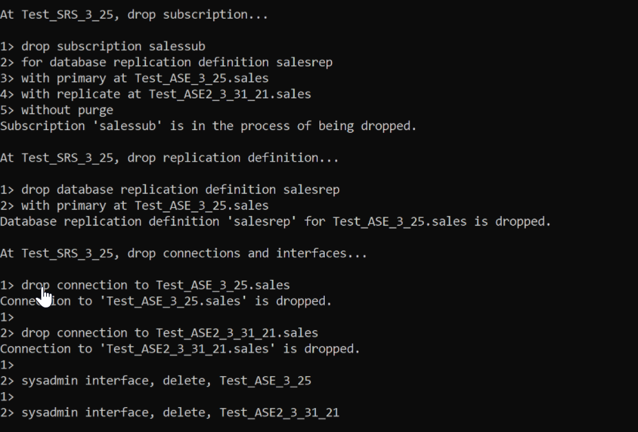
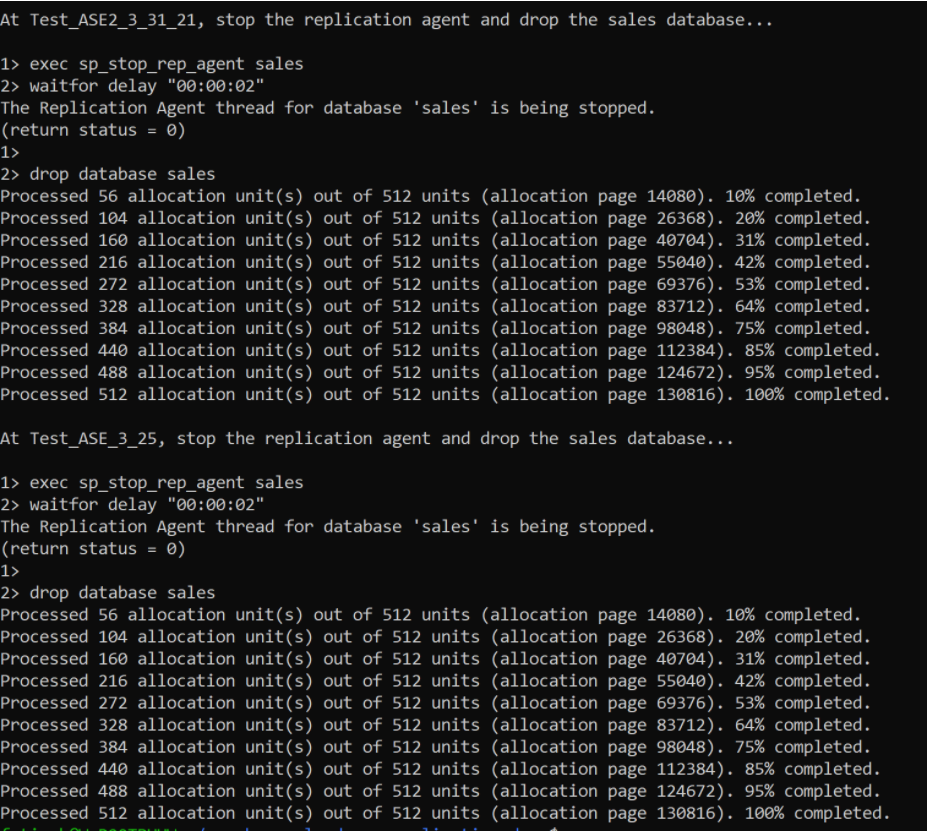

## Prerequisites
- You have completed the [tutorial](hana-cloud-ase-replication-scripts-3) on how to run a test script on SAP HANA Cloud, SAP ASE replication.

## Details
### You will learn
- How to restore the SAP HANA Cloud, SAP ASE databases to their initial state using a **`teardown`** script
- How to drop instance information from the replication server


As the last step of this tutorial, you will learn how to restore your SAP Adaptive Server Enterprise databases and replication server in SAP HANA Cloud to their initial state, as if you had not run any tests or created any tables.

> ### Disclaimer
>
> Within this group of tutorials, the phrase **"replication server"** is used to refer to **"SAP HANA Cloud, SAP Adaptive Server Enterprise replication"** unless mentioned otherwise.


---

[ACCORDION-BEGIN [Step 1: ](Restore databases using teardown script)]

A separate script, known as the **`Teardown`** [script](https://help.sap.com/viewer/efe56ad3cad0467d837c8ff1ac6ba75c/16.0.4.0/en-US/cac94cfe67ac48beaeba385a249b38d2.html), can be used to undo any changes made in previous steps. The goal is to restore both SAP ASE databases and your replication server in SAP HANA Cloud to their initial state, as if you had not run the previous tests. As shown below, this script must include instance names and passwords just as with the replication script. Just look out for the same placeholders we used in the previous tutorials, and make sure to replace them with real names, host addresses, and passwords from your landscape.

```Shell/Bash
# ------------------------------------------------------------------------------
# Set variables
# ------------------------------------------------------------------------------
# ASE_1 should be the name of the source SAP ASE database as listed in your interfaces file
ASE_1=
# ASE_2 should be the name of the target SAP ASE database as listed in your interfaces file
ASE_2=
# ASE_R should be the name of the replication server as listed in your interfaces file
ASE_R=
PASSWORD=
ASE_1_PASSWORD=$PASSWORD
ASE_2_PASSWORD=$PASSWORD
ASE_R_PASSWORD=$PASSWORD
```


[DONE]
[ACCORDION-END]

[ACCORDION-BEGIN [Step 2: ](Drop subscription from replication server)]

The `teardown` script should then drop the subscription, replication definition, connections, and interfaces from the replication server. You can see this in the script given below:

```Shell/Bash
echo
echo At $ASE_R, drop subscription...
echo
isql -U repadmin -P $ASE_R_PASSWORD -J utf8 -S $ASE_R -e -w 1000 <<EOF
drop subscription DBNAMEsub
for database replication definition DBNAMErep
with primary at $ASE_1.DBNAME
with replicate at $ASE_2.DBNAME
without purge
go
EOF

sleep 4

echo
echo At $ASE_R, drop replication definition...
echo
isql -U repadmin -P $ASE_R_PASSWORD -J utf8 -S $ASE_R -e -w 1000 <<EOF
drop database replication definition DBNAMErep
with primary at $ASE_1.DBNAME
go
EOF

sleep 2

echo
echo At $ASE_R, drop connections and interfaces...
echo
isql -U repadmin -P $ASE_R_PASSWORD -J utf8 -S $ASE_R -e -w 1000 <<EOF
drop connection to $ASE_1.DBNAME
go
drop connection to $ASE_2.DBNAME
go
sysadmin interface, delete, $ASE_1
go
sysadmin interface, delete, $ASE_2
go
EOF
```
The output of running the `teardown` script should look like this:

!

!

#### Troubleshoot:

You may run into an error that requires you to increase the size of your default data cache. If this is the case, connect to your SAP HANA Cloud, SAP Adaptive Server Enterprise database instances, and run the following command.

```Shell/Bash
sp_cacheconfig 'default data cache', '512M'
```


[DONE]
[ACCORDION-END]


[ACCORDION-BEGIN [Step 3: ](Test yourself)]

With the help of this tutorial group, you have seen how to use and adjust scripts to set up, connect, test, and finally wipe your instances of SAP HANA Cloud, SAP Adaptive Server Enterprise and SAP HANA Cloud, SAP Adaptive Server Enterprise replication.

You can also build on these scripts to automate your set up process, whether you wish to run simple tests or even set up your production environment.


> ### Related Content
>
> For more learning materials on **SAP HANA Cloud**, [click here](https://community.sap.com/topics/hana-cloud). Follow our tag in the [**SAP Community**](https://blogs.sap.com/tags/73554900100800002881/) to stay up-to-date on the latest updates and newest content!


[VALIDATE_7]
[ACCORDION-END]


---
