# Executing SAP HANA Cloud Tasks from the Command Line
<!-- description --> Learn how to execute administrative tasks from the command line which can be more efficient and less error prone when performing repetitive tasks.

## Prerequisites
- An SAP BTP account
- An SAP HANA Cloud instance
- SAP HANA Cloud Clients

## You will learn
  - How to execute SQL commands against an SAP HANA Cloud instance using hdbsql or dbisql from the command line
  - An overview of two different runtimes that SAP HANA Cloud can be provisioned into
  - How to use the BTP, CF, and service manager command line interfaces (CLIs) with an SAP HANA Cloud instance

---

SAP HANA Cloud Central can be used to perform many administrative tasks for SAP HANA Cloud instances within a graphical interface such as creating, deleting, starting, stopping, updating, upgrading, cloning, or running diagnostic checks. 

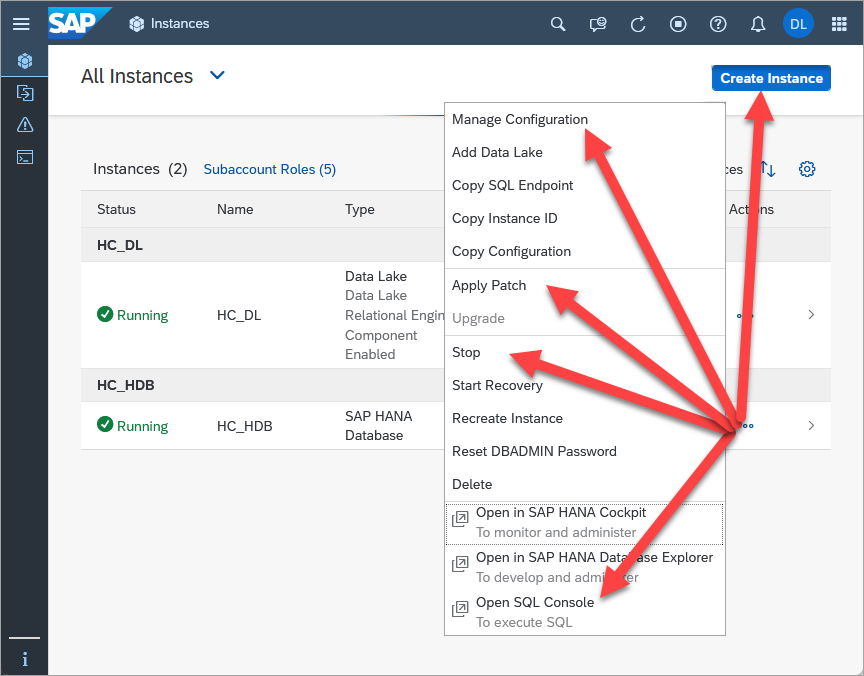

A text-based interface can be faster, more efficient, and less error prone when performing repetitive tasks.  This tutorial will provide examples of performing administrative tasks using the command line.

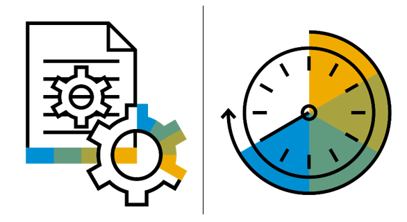

> Access help from the SAP community or provide feedback on this tutorial by navigating to the "Feedback" link located on the top right of this page.

### Executing SQL Statements from a shell

[hdbsql](https://help.sap.com/docs/SAP_HANA_CLIENT/f1b440ded6144a54ada97ff95dac7adf/c22c67c3bb571014afebeb4a76c3d95d.html) is a command line tool that is included in the [SAP HANA Client](https://help.sap.com/docs/SAP_HANA_CLIENT) which can be used to run SQL statements from a shell or script.

Additional details on how to install the SAP HANA Client and on using `hdbsql` can be found in the tutorial mission [Use Clients to Query an SAP HANA Database](mission.hana-cloud-clients).  

The example shown below uses HANA_Configuration_Overview_SHC which is one of the many queries included in the [SAP Note: 1969700 - SQL Statement Collection for SAP HANA](https://me.sap.com/notes/1969700).  Note that the entries with the suffix _SHC are for SAP HANA Cloud, SAP HANA databases.


1. Open the SAP Note, download the zip file, and unzip its contents.  It contains many diagnostic queries for an SAP HANA database.  The download section shown below is near the bottom of the SAP Note.

    

    The HANA_Configuration_Overview_SHC.txt diagnostic query will be used.

    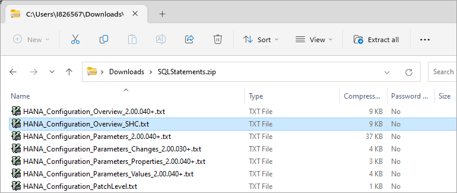

2. Create a hdbuserstore key that contains the SQL endpoint (host:port), user, and password needed to connect to the SAP HANA database instance.

    ```Shell
    hdbuserstore Set AdminUserKey <SQL ENDPOINT> DBADMIN <PASSWORD>
    ```
    The list of keys can be seen with the command below.

    ```Shell
    hdbuserstore List
    ```

3. Run the command.

    ```Shell
    hdbsql -A -o results.txt -U AdminUserKey -I HANA_Configuration_Overview_SHC.txt
    type results.txt
    ```

    An example of the result is shown below.

    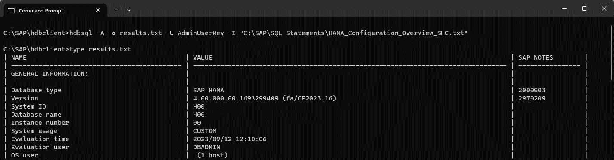

4. Review the options used.

    * `-A` provides an aligned output
    * `-o` results.txt writes the output to a file named `results.txt`
    * `-U AdminUserKey` instructs hdbsql to retrieve the host, port, user name and password from the user store.  This is helpful when running scripts as the credentials are not included in the command line
    * `-I HANA_Configuration_Overview_SHC.txt` specifies the SQL to be executed

5. Should you wish to run a diagnostic script against an SAP HANA Cloud, data lake Relational Engine use `dbisql`.

    Instructions to install the data lake client and use `dbisql` are in the tutorial mission [Use Clients to Query a Data Lake Relational Engine](group.hana-cloud-clients-data-lake).

6. Create a file named `diagnosticQuery.sql` and add the contents below.  For additional details see [sa_conn_info System Procedure](https://help.sap.com/docs/hana-cloud-data-lake/sql-reference-for-data-lake-relational-engine/sa-conn-info-system-procedure-for-data-lake-relational-engine).

    ```SQL
    CALL sa_conn_info();
    ```

    Execute the SQL.

    ```Shell Microsoft Windows
    dbisql -c "uid=<USER_ID>;pwd=<PASSWORD>;host=<SQL ENDPOINT>;ENC=TLS(tls_type=rsa;direct=yes)" diagnosticQuery.sql
    ```

    ```Shell Linux
    dbisql -c 'uid=<USER_ID>;pwd=<PASSWORD>;host=<SQL ENDPOINT>;ENC=TLS(tls_type=rsa;direct=yes)' diagnosticQuery.sql
    ```

    An example of the result is shown below.

    


### SAP HANA Cloud runtimes
The SAP Business Technology Platform (SAP BTP) provides multiple [runtimes](https://help.sap.com/docs/btp/sap-business-technology-platform/environments) in which services can be run.  This becomes important when attempting to interact with the service from a command line interface (CLI) as there are different CLIs for each runtime environment.

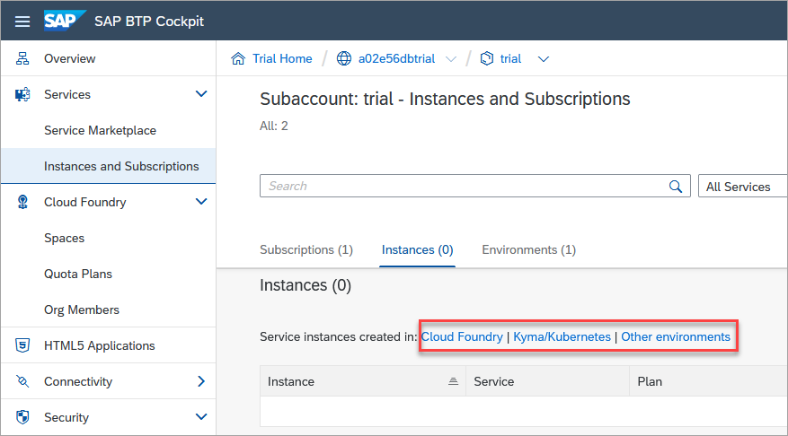

Further details can be found at [Consuming SAP BTP Services from Various Environments](https://help.sap.com/docs/service-manager/sap-service-manager/consuming-sap-btp-services-from-various-environments).

1. SAP HANA Cloud instances can be deployed to either the subaccount (other environment) or to a Cloud Foundry space.  The screenshot below shows an instance deployed to each location.

    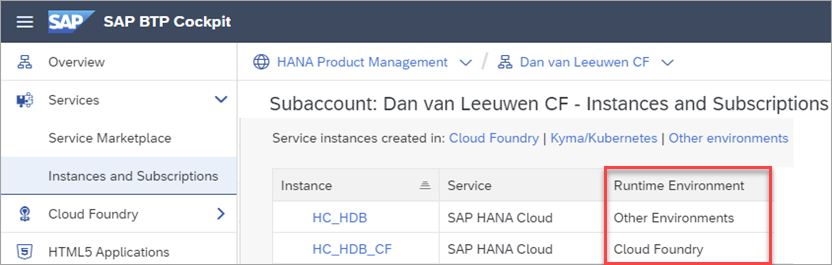

2. When a service is created,  if it supports multiple runtime environments, the runtime environment can be specified as shown below.

    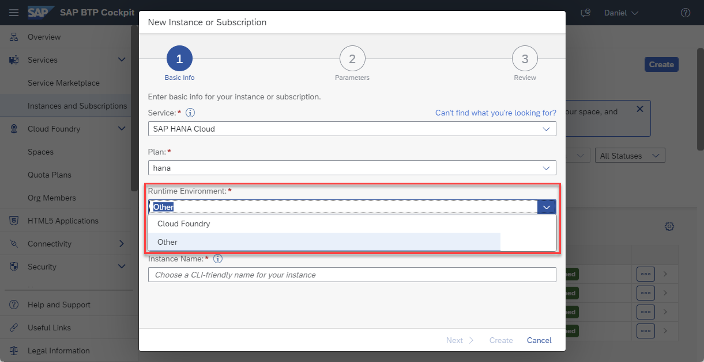

3. When creating an instance using the multi-environment edition of SAP HANA Cloud Central, the instance is provisioned into the subaccount (Other).  

    When creating an instance using the Cloud Foundry edition of SAP HANA Cloud Central, the instance is provisioned in the Cloud Foundry environment.

    You can also choose to copy the JSON parameters that the multi-environment edition wizard generates and then use the SAP BTP wizard (or one of the CLIs shown in the next section) to provision the instance in your environment of choice.

    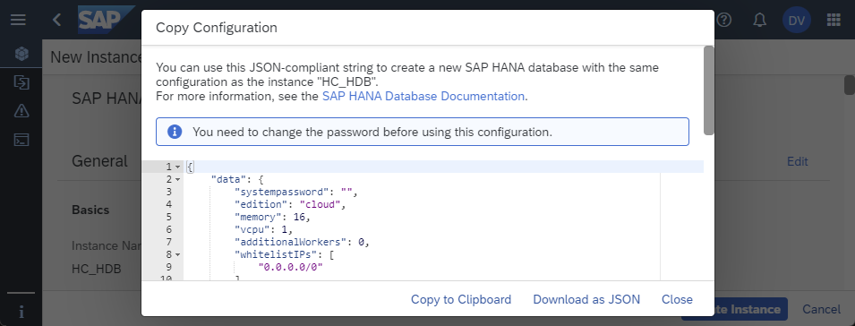

4. Considerations when provisioning to the subaccount (Other):

    * SAP HANA Cloud Central, multi-environment edition (introduced in 2022 QRC 3) provisions to the subaccount (Other) in the Create Instance wizard
    * SAP HANA Cloud Central, multi-environment edition uses the BTP subaccount [role collections](https://help.sap.com/docs/hana-cloud/sap-hana-cloud-administration-guide/role-collections-for-sap-hana-cloud) for security
    * Instances can be managed using the SAP BTP CLI or SAP Service Manager

5. Considerations when provisioning to a Cloud Foundry space:

    * SAP HANA native development in the SAP Business Application Studio currently deploys to HDI containers in Cloud Foundry spaces
    * HDI containers provisioned into Cloud Foundry can be mapped to SAP HANA Cloud databases provisioned to the subaccount (Other)
    * If you already have instances deployed to Cloud Foundry spaces, you may wish to have all of your instances in the same runtime environment
    * SAP HANA Cloud Central, Cloud Foundry edition, uses the Cloud Foundry [space roles](https://help.sap.com/docs/btp/sap-business-technology-platform/about-roles-in-cloud-foundry-environment) for security
    * Instances can be managed using the Cloud Foundry CLI
    * SAP HANA Cloud Central, multi-environment edition cannot currently (as of Q3 2023) create or delete instances provisioned in Cloud Foundry.  Instances can be created or deleted using the SAP BTP Cockpit or the Cloud Foundry CLI


### Overview of the CLIs
A command line interface (CLI) is a text-based interface.  There are three different CLIs that can be used with an SAP HANA Cloud instance to perform administrative tasks such as start, stop, create, delete, update, or upgrade.

The CLI used depends on whether the SAP HANA Cloud instances were provisioned to the subaccount (Other) or to a Cloud Foundry space.  Details on the three CLIs can be found at [Create and Manage SAP HANA Cloud Instances Using the CLI](https://help.sap.com/docs/hana-cloud/sap-hana-cloud-administration-guide/create-and-manage-sap-hana-cloud-instances-using-cli).  

[SAP BTP CLI](https://help.sap.com/docs/btp/sap-business-technology-platform/account-administration-using-sap-btp-command-line-interface-btp-cli) can create, read, update, and delete an instance provisioned in a subaccount (Other).  It can also be used to read the configuration of an instance deployed in a Cloud Foundry space.  More details can be found in the [btp CLI Command Reference](https://help.sap.com/docs/btp/btp-cli-command-reference/btp-cli-command-reference).  Details on how to install the CF CLI can be found in the tutorial [Get Started with the SAP BTP Command Line Interface](cp-sapcp-getstarted) and [BTP Onboarding: BTP CLI](https://www.youtube.com/watch?v=eFOjC4OAp2w&list=PLkzo92owKnVw3l4fqcLoQalyFi9K4-UdY&index=5).  Additionally, the SAP BTP CLI can be used to create and configure subaccounts.

[Cloud Foundry CLI (CF CLI)](https://help.sap.com/docs/hana-cloud/sap-hana-cloud-administration-guide/using-cloud-foundry-command-line-interface-cf-cli-with-sap-hana-cloud) can be used to create, update, configure, or delete instances provisioned in a Cloud Foundry space.  Further details can be found at [Installing the cf CLI](https://docs.cloudfoundry.org/cf-cli/install-go-cli.html) and [Cloud Foundry Releases](https://github.com/cloudfoundry/cli/releases).

[SAP Service Manager](https://help.sap.com/docs/service-manager/sap-service-manager/sap-service-manager) can create, read, update, and delete an instance provisioned in a subaccount (Other).  It can also be used to read the configuration of an instance deployed in a Cloud Foundry space.   The service manager also provides a REST API that can be accessed programmatically in applications such as a Node.js application.  Details on how install the service manager can be found at [Installing the Service Manager Control (SMCTL) Command-Line Tool  ](https://help.sap.com/docs/service-manager/sap-service-manager/installing-service-manager-control-smctl-command-line-tool).

The following steps will provide examples of each CLI as well as accessing the SAP Service Manager REST API.  **Please install one or more of the CLIs before proceeding.**

When using a CLI to perform an update to an instance, the update operation will take an input parameter in JSON format that describes the change being requested.  The parameters are common across the three CLIs.  Details on the SAP HANA Cloud service specific parameters can be found at [Parameter Reference](https://help.sap.com/docs/HANA_CLOUD/9ae9104a46f74a6583ce5182e7fb20cb/13ed4d847bd3485c8b3ef2bc7b89ec79.html).  

### Examples using the BTP CLI
Before proceeding ensure that your user has the subaccount service administrator role collection.

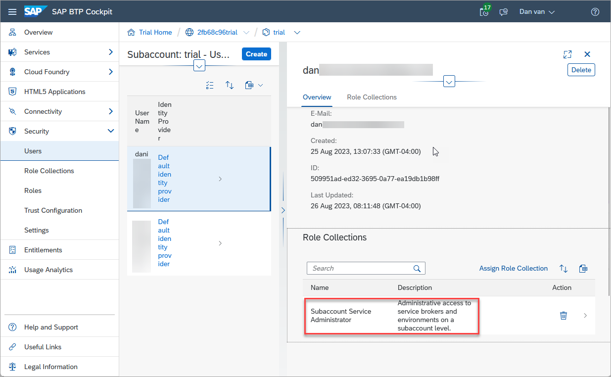

Additional details can be found at [Role Collections and Roles in Global Accounts, Directories, and Subaccounts](https://help.sap.com/docs/btp/sap-business-technology-platform/role-collections-and-roles-in-global-accounts-directories-and-subaccounts).

The commands below were executed in a Microsoft Windows PowerShell.  This shell offers code completion by pressing the tab key.  To try out the autocompletion, enter btp, a space, and press the tab key.  

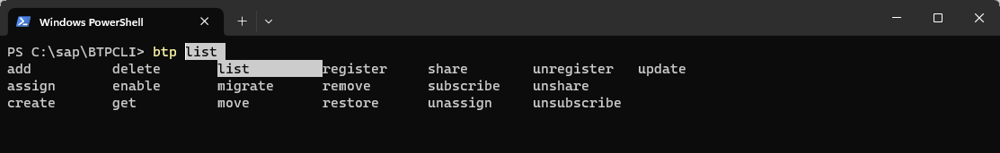

Select an action and press tab again to view the available operations for that action.

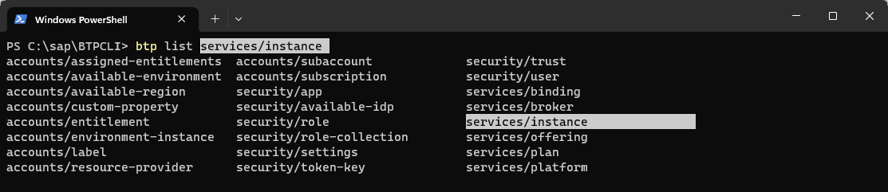

#### Version and help

```Shell
btp --version
```


#### Info and help

```Shell
btp --info
```

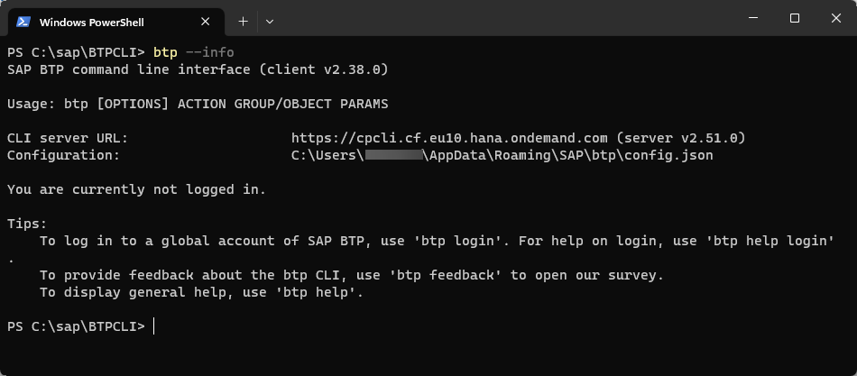

```Shell
btp help
btp help update services/instance
```

#### Log on

```Shell
btp login
```

or

```Shell
btp login --sso
```

Note that the CLI server URL value contains eu10 even though the trial account is in the US.

After a successful login, details can be seen using the info command.

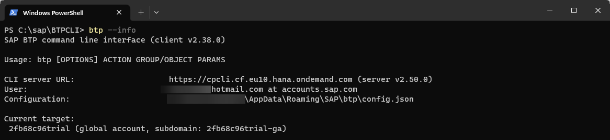

#### Specify the subaccount
If the subaccount is specified, then it does not need to be specified in each subsequent command.  

```Shell
btp target
```

The above command lists the available subaccounts.

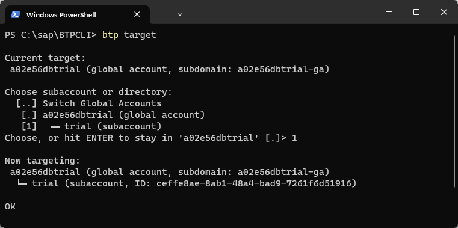

Alternatively, the subaccount can be specified using its ID.

```Shell
btp target --subaccount <SubaccountID>
```

The subaccount ID can be obtained on the BTP Cockpit Overview page for the subaccount.

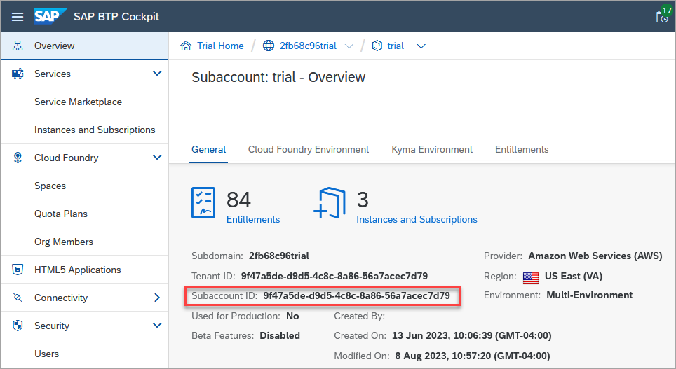

#### Create an instance
In order to create an instance, a JSON describing the instance is required and a plan ID.

* Create a JSON file named **create.json** that specifies the parameters of the instance to be created.  The JSON can be generated in the SAP HANA Cloud Central instance creation wizard or can come from an existing instance.

    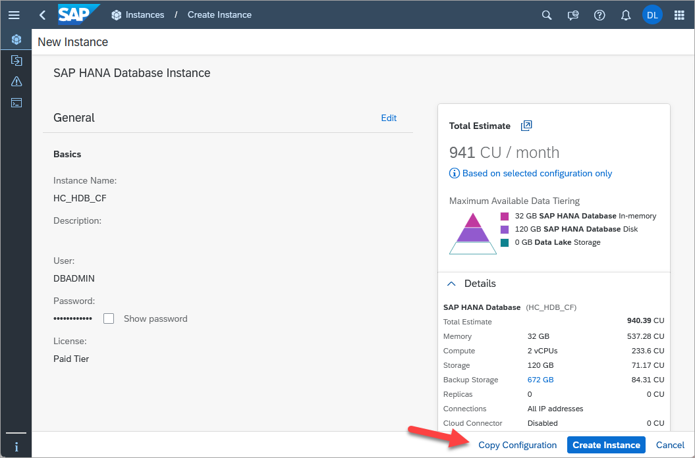

    

* Edit **create.json**  and provide a value for `systempassword`.  This is the password for the DBADMIN user.

    

* Identify the plan ID for the SAP HANA database.  Notice that the name is either `hana` for the paid service, `hana-free` for the free-tier service, or `hana-trial` for the trial service, the service_offering_name is `hana-cloud-trial`.  The list of all available offerings can be found using `services/offering`.

    ```Shell
    btp list services/plan --fields-filter "name contains 'hana'"
    ```

    Free tier and production service plans

    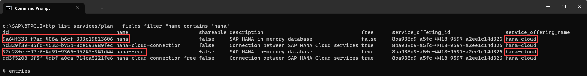


    Trial service plans

    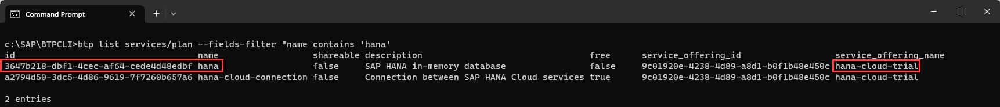

    or

    ```Shell
    btp list services/plan --fields-filter "name contains 'lake'"
    ```

    Free tier and production service plans

    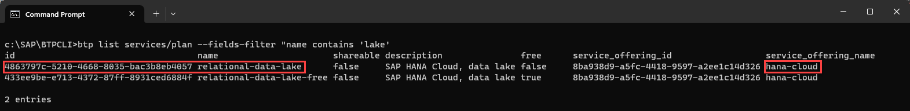

    Trial service plans

    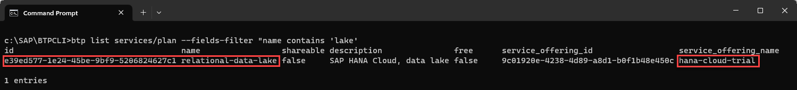

    Additional details on the filters available can be found at [Filtering Parameters and Operators](https://help.sap.com/docs/service-manager/sap-service-manager/filtering-parameters-and-operators).

* With the plan ID, create a new instance.

    ```Shell
    btp create services/instance --plan <Plan ID> --name HC_HDB --parameters create.json
    ```

    

    The instance being created can also be viewed in SAP HANA Cloud Central as shown below.

    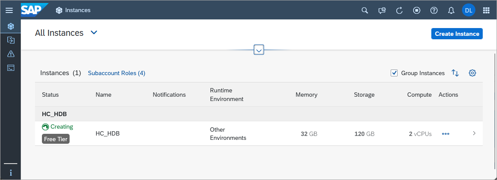

A more advanced example using a bash script is provided at [Automate Account Operations with the Command Line Interface (CLI)](cp-cli-automate-operations).  Additional details can be found at [Commands in the btp CLI](https://help.sap.com/docs/btp/sap-business-technology-platform/commands-in-btp-cli).

#### Delete an instance
Do not follow this step unless you no longer require your SAP HANA Cloud instance.

```Shell
btp delete services/instance --name HC_HDB
```

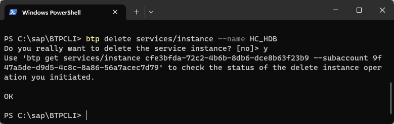

#### List instances

```Shell
btp list services/instance --fields-filter "name eq 'HC_HDB'"
```

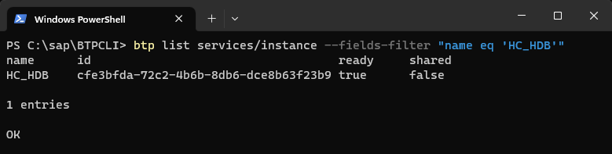

#### Update the label of an instance
Each instance can have one or more labels.  Below we will add a contact label.

* Create a file named **label.json** with the contents below.

    ```JSON
    [{
        "op": "add",
        "key": "Contact",
        "values": ["Dan at 123 456 7890"]
    }]
    ```

* Execute the below command.

    ```Shell
    btp update services/instance --id <instance ID> --labels .\label.json
    ```

    

    This adds a label that can be seen both in the SAP BTP Cockpit as well as when viewing the instance details with the CLI as shown in the next example.

    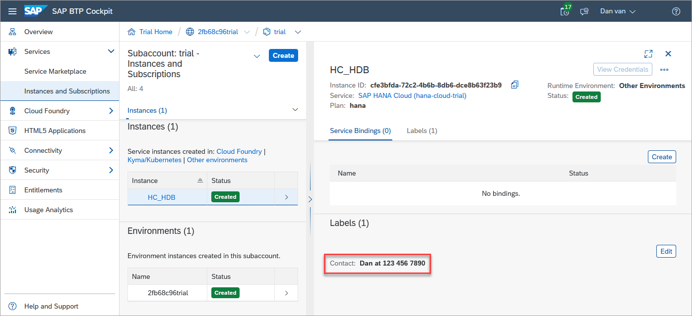

#### View instance details
The details of an instance can be viewed.

* Execute the command below.
    ```Shell
    btp get services/instance --name HC_HDB
    ```

    or

    ```Shell
    btp --format json get services/instance --name HC_HDB
    ```

    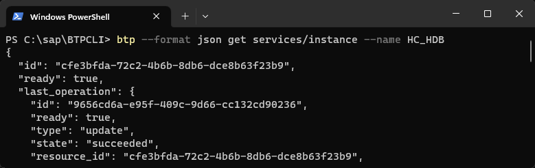

* Execute the command below to see the parameters of an instance.

    ```Shell
    btp --format json get services/instance --name HC_HDB --show-parameters
    ```

    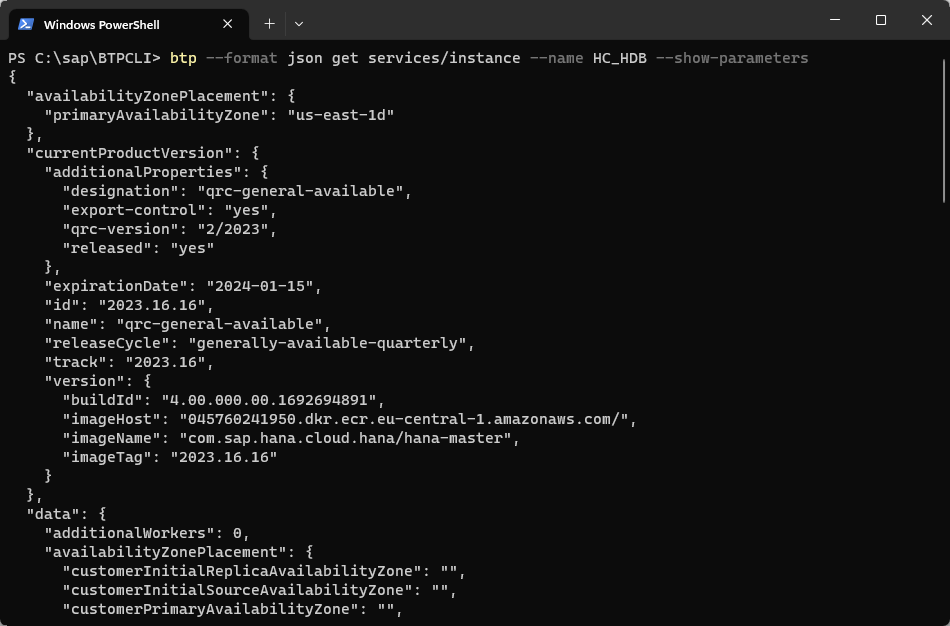

#### Update parameters of an instance
This step will be used to update the description of the instance.  The existing instance parameters can be obtained from the output of the previous example or from the Copy Configuration menu item in an SAP HANA Cloud Central actions menu for an instance.

* Create a file named **description.json** with the contents below.

    ```JSON
    {
        "metadata": {
            "ui.hc.sap.com/description": "Created as part of Automation Tutorial"
        }
    }
    ```

* Execute the below command.

    ```Shell
    btp update services/instance --id <Instance ID> --parameters description.json
    ```

    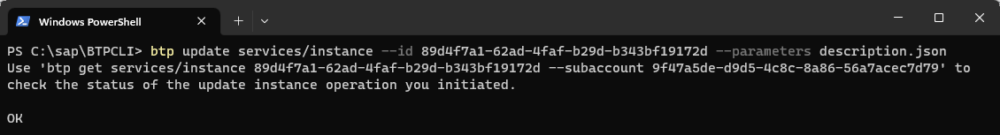

    The result is that the description has been updated.

    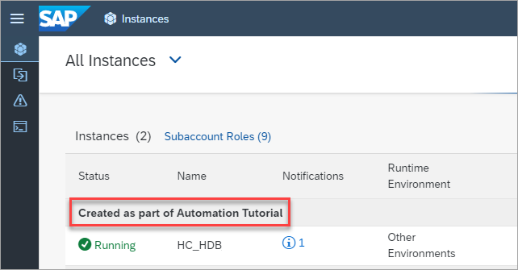

#### Stop an instance
* Create a file named **stop.json** with the contents below.

    ```JSON
    {
        "data": {
            "serviceStopped": true
        }
    }
    ```

* Run the below command to stop the specified instance.

    ```Shell
    btp update services/instance --id <Instance ID> --parameters stop.json
    ```

#### Start an instance
* Create a file named **start.json** with the contents below.

    ```JSON
    {
        "data": {
            "serviceStopped": false
        }
    }
    ```

* Run the below command to start the specified instance.

    ```Shell
    btp update services/instance --id <Instance ID> --parameters start.json
    ```

#### Check for and apply software updates
When an upgrade is available, the details for the upgrade options are included in the instance parameters.

A tool such as [jq](https://github.com/jqlang/jq) can be used to filter the result to only include details on the available upgrade versions.

* Get details about available upgrades.  

    ```Shell
    btp --format json get services/instance --name HC_HDB  --show-parameters | c:\tools\jq-win64 "{availableUpgradeVersions}"
    ```

    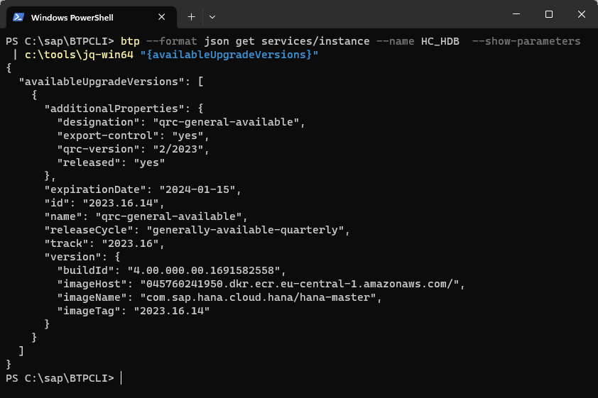

* Create a file named **upgrade.json** with the contents below and modify it as appropriate to match the available version.

    ```JSON
    {
        "data": {
            "productVersion": {
                "releaseCycle":"generally-available-quarterly",
                "track": "2023.16",
                "id": "2023.16.14"
            }
        }
    }
    ```

* Run the below command to perform the upgrade.

    ```Shell
    btp update services/instance --id <instance ID> --parameters upgrade.json
    ```

    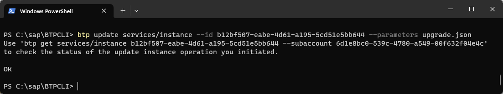

* Check in SAP HANA Cloud Central to see that the upgrade is occurring.  

    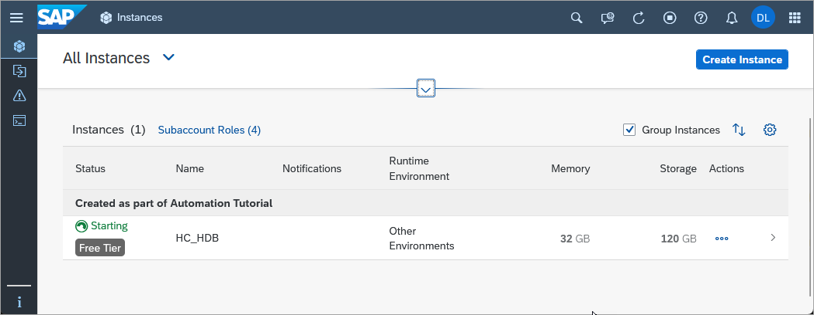

### Additional Examples using the BTP CLI (Optional)
The following examples require a non trial or free tier SAP HANA Cloud instance.

#### Clone an instance
An SAP HANA Cloud database instance may be cloned.  As an example, you may wish to periodically replace a QA instance with a new instance that has a copy of the latest data from a production instance.  

1. Select an instance to clone.  It **cannot** have an attached data lake.  To verify that it does not have an attached data lake, confirm that it has the option **Add Data Lake** and that it has the option **Create Template to Clone Instance**.

    

2. Create a file named **clone-template.json** with the contents below and modify it as appropriate.
    ```JSON
    {
        "data": {
            "requestedOperation": {
                "name": "TEMPLATE_BACKUP",
                "arguments": {
                    "template_name": "<name>",
                    "template_storage_endpoint": "<hdl-files-storage-endpoint>",
                    "hdl_access_token": "<hdl_access_token>",
                    "backup_encryption_passphrase": "<encryption_passphrase>"
                }
            }
        }
    }
    ```
    
    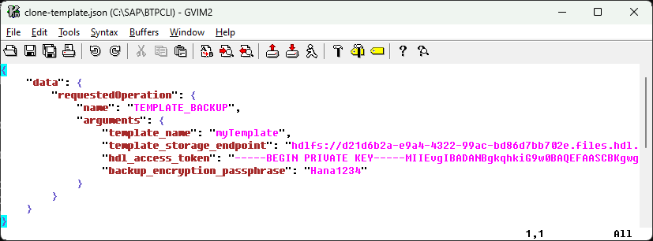

    Notice that endpoint above is the Files REST API Endpoint prefixed with hdlfs://  

    The token above is the concatenation of client.key, client.crt, and ca.crt with the newlines removed.

    Further information about data lake files and the certificates required to configure an instance can be found at step 4 of [Add Databases to the SAP HANA Database Explorer](hana-dbx-connections).

3. Create the template.

    ```Shell
    btp update services/instance --id <instance ID> --parameters clone-template.json
    ```

    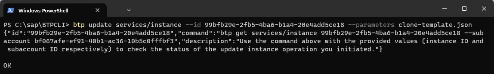

    After the command completes, the template files can be viewed in the specified data lake files instance.  
    
    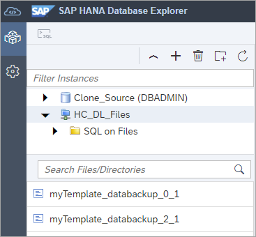

4. Create a file named **clone.json** with the contents below and modify it as appropriate.

    ```JSON
    {
        "data": {
            "requestedOperation": {
            "name": "TEMPLATE_RECOVERY",
            "arguments": {
                "template_name": "<name>",
                "template_storage_endpoint": "<hdl-files-storage-endpoint>",
                "hdl_access_token": "<hdl_access_token>",
                "backup_encryption_passphrase": "<encryption_passphrase>"
            },
            "provisioned_size_gib": <disk size in GB>,
                "systempassword": "<password>",
                .....
            }
        }
    }
    ```

    The contents after requestedOperation are the same as the create.json covered previously.

    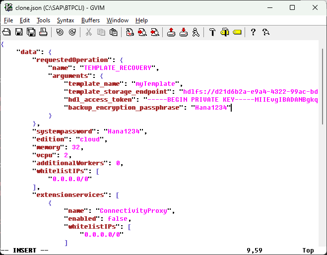   

5. After the template has been created, it can be used to create the clone.

    ```Shell
    btp create services/instance --name <instance name to create> --offering-name hana-cloud --plan-name hana --parameters clone.json
    ```

    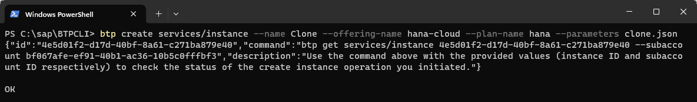

    After the command completes, a new SAP HANA Cloud instance named Clone is created that will have the same schema and data as the instance Clone_Source.  The data is stored in the files created when the template was created so the data in the clone reflects the data that was captured during the template creation.
    
    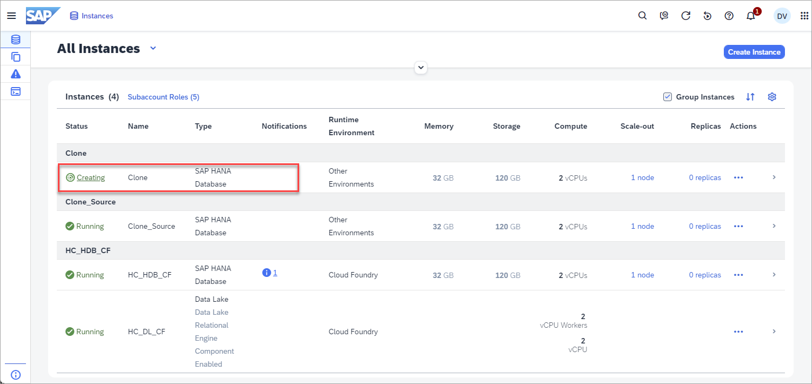

Additional details can be found at [Clone an SAP HANA Database Instance](https://help.sap.com/docs/hana-cloud/sap-hana-cloud-administration-guide/clone-sap-hana-database-instance).

#### Perform a takeover
A takeover from an SAP HANA instance to a replica can performed.  This can happen automatically or can be triggered from the SAP HANA Cloud Central actions menu or using the CLI command illustrated below.  Additional details on the topic of replicas can be found at [Increasing System Availability](https://help.sap.com/docs/hana-cloud/sap-hana-cloud-administration-guide/increasing-system-availability).

1. Find an instance to perform a takeover on.  It will have a replica, and its action menu will have an option to start a takeover.

    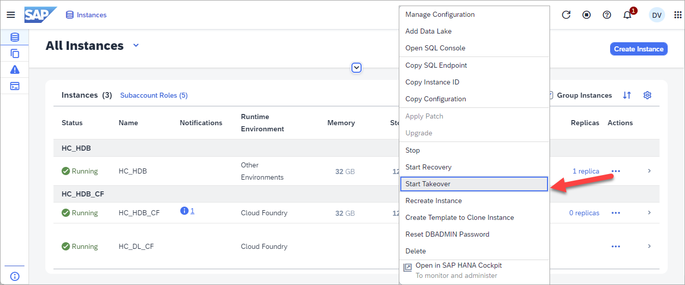

2. The details of the replica can be seen when after selecting Manage Configuration from the actions menu.

    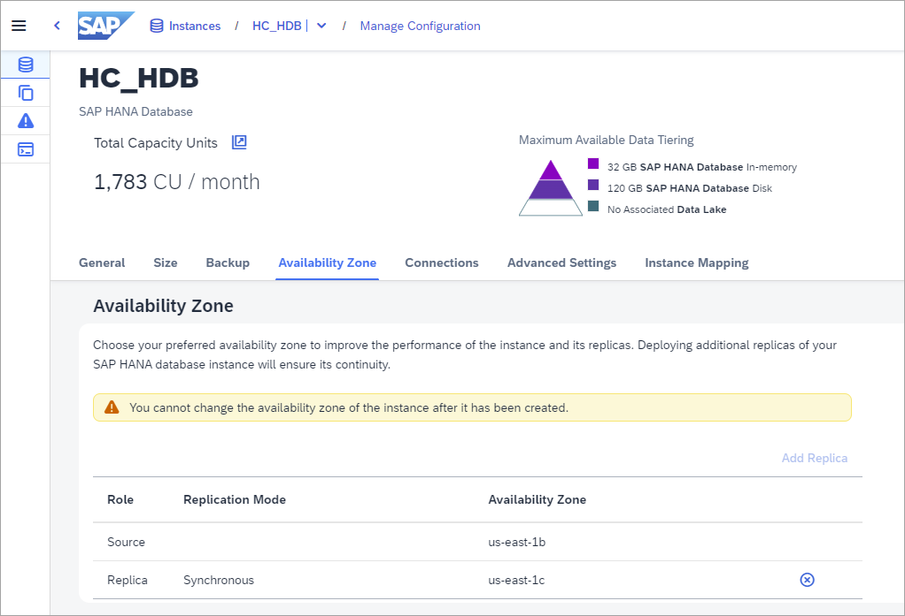

3. Create a file named **takeover.json** with the contents below and modify it as appropriate.

    ```JSON
    {
        "data": {
            "requestedOperation": {
                "name": "synchronous_replication_takeover"
            },
            "arguments": {
                "secondary_az": "us-east-1c"
            }
        }
    }
    ```

4. Perform the takeover

    ```Shell
    btp update services/instance --id <instance ID> --parameters takeover.json
    ```

    

    The instance will briefly show a starting status and when it is back to running, the source database will now be in the new availability zone.

    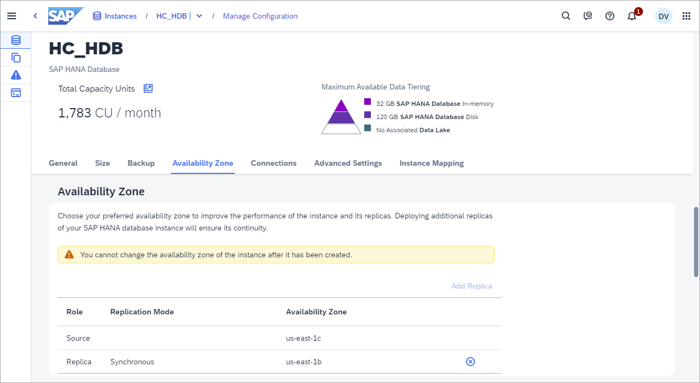


### Examples using the CF CLI

Before proceeding ensure that your user has the space developer privilege which is required to perform actions such as `create-service` or `update-service`.

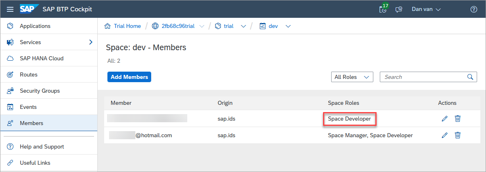

Additional details can be found at [About Roles in the Cloud Foundry Environment](https://help.sap.com/docs/btp/sap-business-technology-platform/about-roles-in-cloud-foundry-environment).

#### Version and help

```Shell
cf -v
```


Help can be obtained using the commands below.

```Shell
cf -help
```

All the available help can be seen with -a.

```Shell
cf -help -a
```

#### Log on
Log on to Cloud Foundry using an API endpoint.

* Obtain the API endpoint.

    The API endpoint can be obtained from the SAP BTP Cockpit on the subaccount **Overview** page in the **Cloud Foundry Environment** section.

    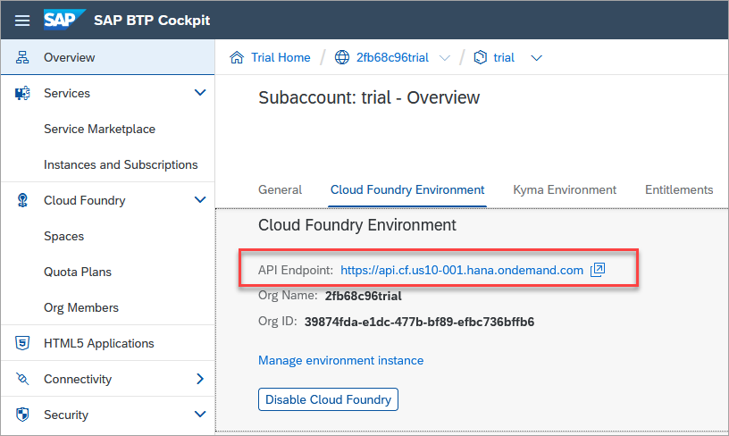

* Set the API endpoint with the command below.

    ```Shell
    cf api <API Endpoint>
    ```

    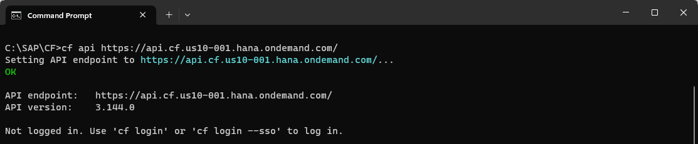

* Logon with one of the commands below.

    ```Shell
    cf login
    ```

    or

    ```Shell
    cf login --sso
    ```

    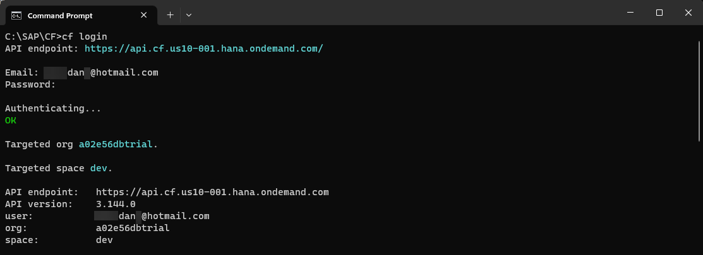

#### Create an instance
In order to create an instance, a JSON describing the instance is required as is a service offering name and plan.

* Create a JSON file named **create.json**.

* Populate the JSON file.  

    The JSON can be obtained in the SAP HANA Cloud Central instance creation wizard or from copying the JSON from an existing instance.

    

    

* Edit the saved JSON file and provide a value for systempassword.

    

* Get the available services.

    ```Shell
    cf marketplace
    ```

* Get the service plan offerings for SAP HANA Cloud free-tier or paid.

    ```Shell
    cf marketplace -e hana-cloud
    ```

    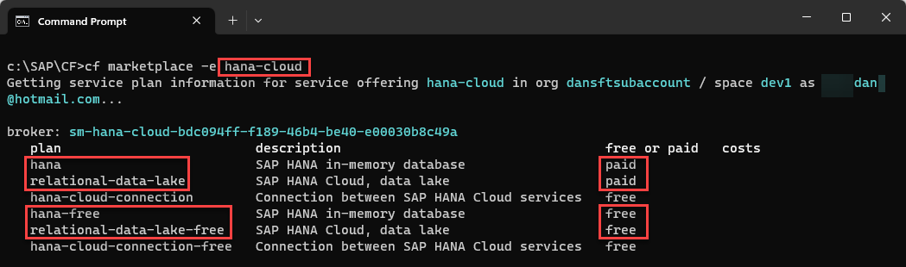

* Get the service plan offerings for SAP HANA Cloud trial.

    ```Shell
    cf marketplace -e hana-cloud-trial
    ```

    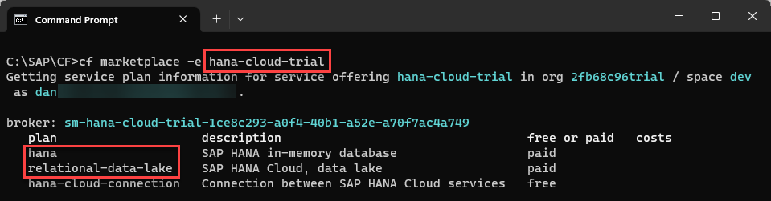

* Create an SAP HANA Cloud, SAP HANA database instance.

    ```Shell
    cf create-service hana-cloud-trial hana HC_HDB_CF -c create.json
    ```

    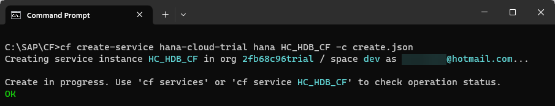

    Notice that the service offering is `hana-cloud-trial`, the plan within that service offering is `hana`, and the name of the instance is `HC_HDB_CF`.

    The instance being created can also be viewed in SAP HANA Cloud Central as shown below.

    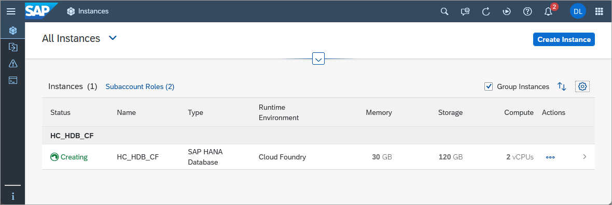

#### Delete an instance
Do not follow this step unless you no longer require your SAP HANA Cloud instance.

```Shell
cf delete-service HC_HDB_CF
```

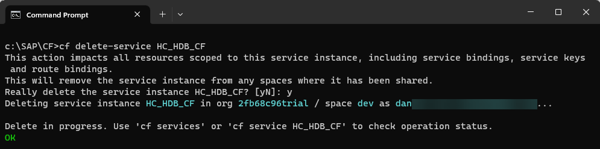

#### List instances

```Shell
cf services
```

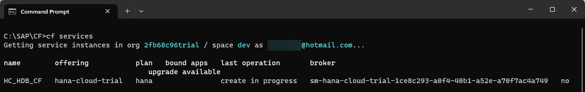

#### View instance details

```Shell
cf service HC_HDB_CF
```

or

```Shell
cf service HC_HDB_CF --params
```

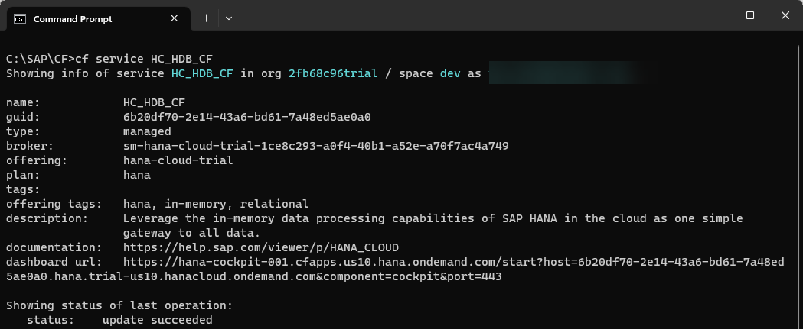

Some operations are not permitted such as showing or updating the parameters of an instance while another operation is in progress.

#### Update parameters of an instance
This step will be used to update the description of the instance.

* View the instance parameters.

    The existing instance parameters can be obtained from the Copy Configuration menu item in an SAP HANA Cloud Central actions menu for an instance.

    The existing parameters can also be retrieved through adding `–-params` in an instance detail request as shown below.

    ```Shell
    cf service HC_HDB_CF --params
    ```

* Create a file named **description.json** with the contents below.

    ```json
    {
        "metadata": {
            "ui.hc.sap.com/description": "Created as part of Automation Tutorial"
        }
    }
    ```

* Run the below command to update the description of the instance.

    ```Shell
    cf update-service HC_HDB_CF -c description.json
    ```

    The result is that the description has been updated.

    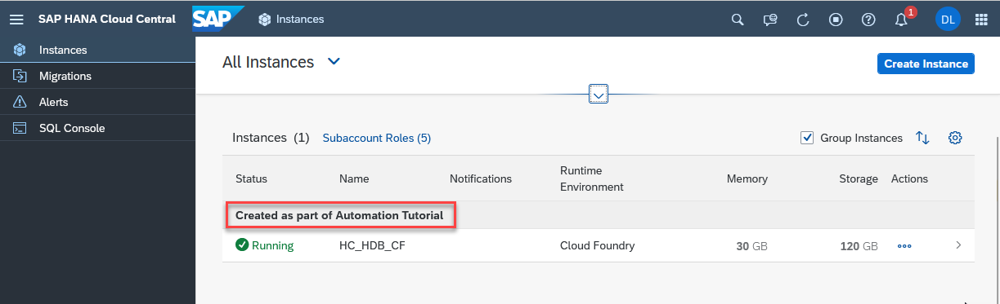

#### Stop an instance
Create a file named **stop.json** with the contents below.

```JSON
{
    "data": {
        "serviceStopped": true
    }
}
```
Run the below command to stop the specified instance.

```Shell
cf update-service HC_HDB_CF -c stop.json
```


#### Start an instance
Create a file named **start.json** with the contents below.

```JSON
{
    "data": {
        "serviceStopped": false
    }
}
```

Run the below command to start the specified instance.

```Shell
cf update-service HC_HDB_CF -c start.json
```

#### Check for and apply software updates
When an upgrade is available, the details for the upgrade options are included in the instance parameters.

* Get the instance details.

    ```Shell
    cf service HC_HDB_CF --params > out.json
    ```

    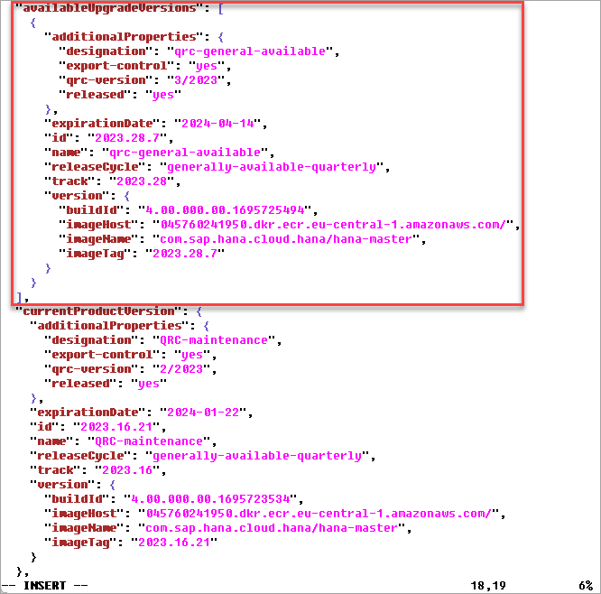

* Create a file named **upgrade.json** with the contents below and modify it as appropriate to match the available version.

    ```JSON
    {
        "data": {
            "productVersion": {
                "releaseCycle":"generally-available-quarterly",
                "track": "2023.16",
                "id": "2023.16.14"
            }
        }
    }
    ```

* Run the below command to perform the upgrade.

    ```Shell
    cf update-service HC_HDB_CF -c upgrade.json
    ```

    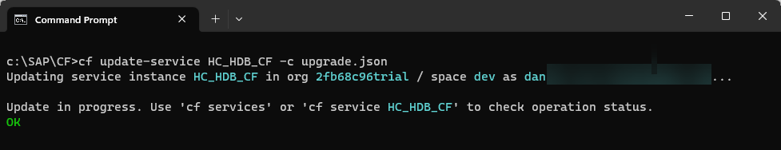

### Examples using the Service Manager CLI
Before proceeding ensure that your user has the proper permissions.  The Service Manager uses the same role collection Subaccount Service Administrator that was assigned with the BTP CLI previously.  Further details can be found at [Assign Subaccount Service Administrator Collection](https://help.sap.com/docs/service-manager/sap-service-manager/assign-subaccount-service-administrator-collection).

#### Version and help

```Shell
smctl version
smctl help
```

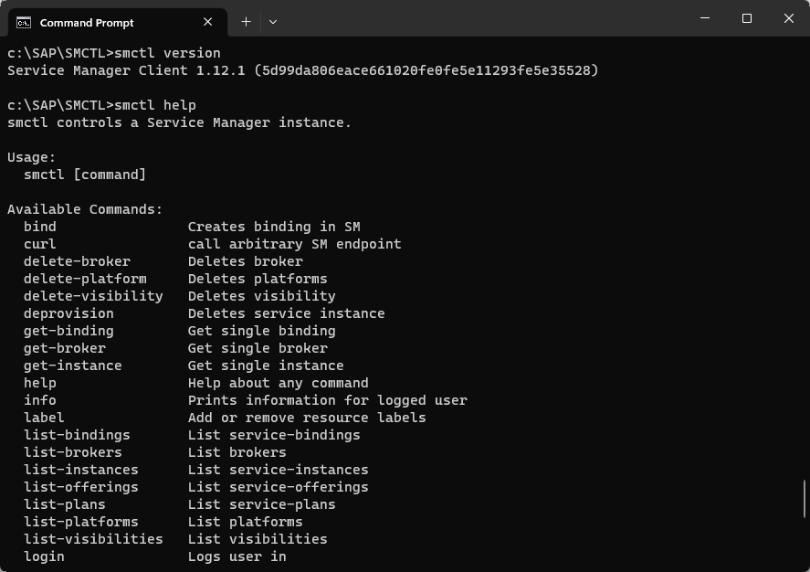

#### Log on

```Shell
smctl info
smctl login --url https://service-manager.cfapps.<REGION>.hana.ondemand.com --param subdomain=<SUBDOMAIN>
```

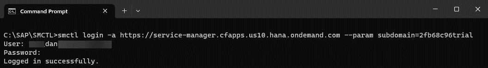

The region and subdomain can be obtained from the subaccount overview page within the SAP BTP Cockpit.  Additional details are available at [Logging in to SAP Service Manager](https://help.sap.com/docs/service-manager/sap-service-manager/logging-in-to-sap-service-manager).  Provide your SAP BTP credentials for the user and password.

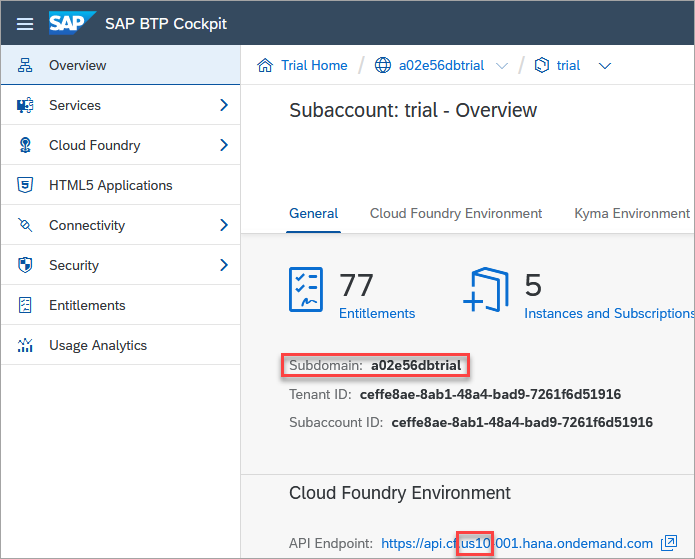

#### List instances

```Shell
smctl list-instances --output json
```

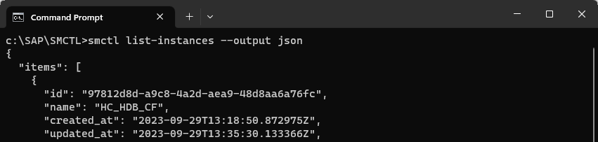


The commands are very similar to the BTP CLI and are not repeated here. The BTP CLI additionally provides commands for working with global accounts.

Further details can be found at [Service Manager Control (SMCTL) CLI Commands](https://help.sap.com/docs/service-manager/sap-service-manager/service-manager-control-smctl-cli-commands).


### Knowledge check
You have now executed diagnostic SQL statements from the command line, are aware of the different runtimes in the SAP BTP platform that an SAP HANA Cloud instance can be provisioned to, and have used one or more of the CLIs to manage an SAP HANA Cloud instance.
