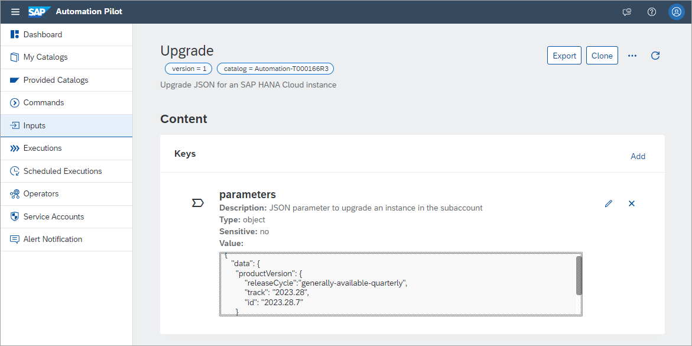
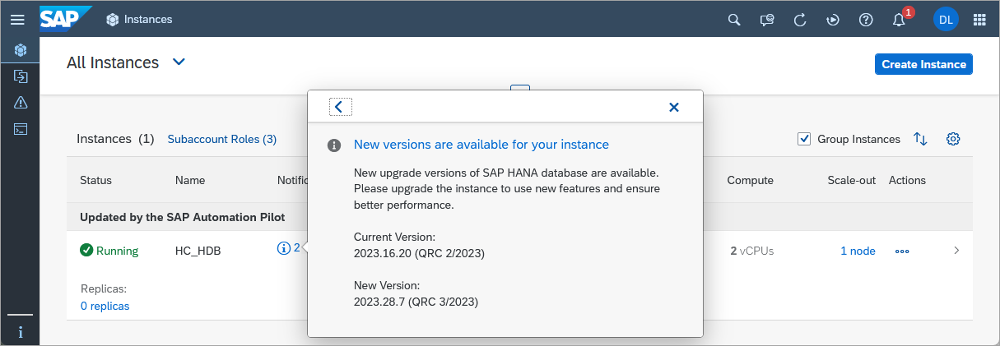
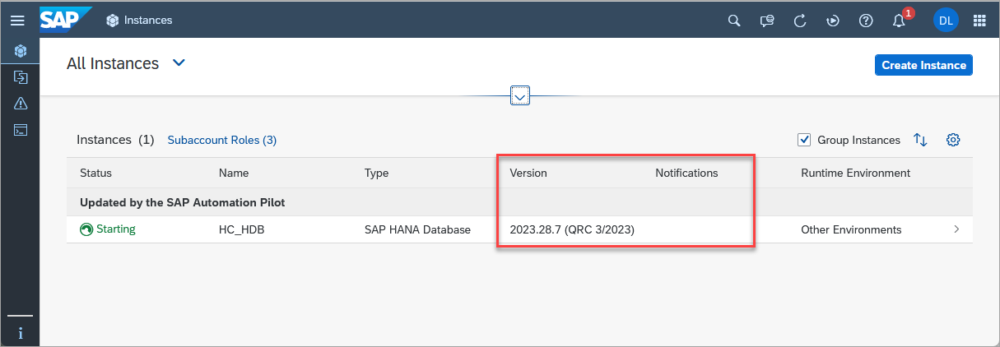
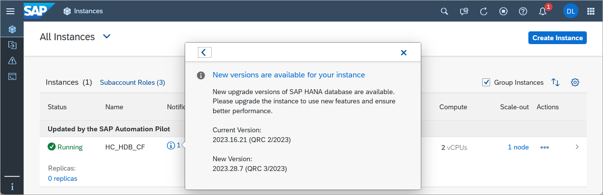
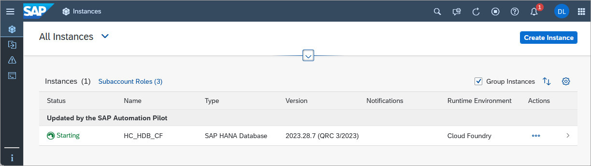

# Automating SAP HANA Cloud Tasks with the SAP Automation Pilot Service
<!-- description --> Learn how to use the SAP Automation Pilot service to execute administrative tasks for an SAP HANA Cloud instance.  

## Prerequisites
- An SAP BTP account
- An SAP HANA Cloud instance

## You will learn
  - About the catalogs provided in SAP Automation Pilot relating to SAP HANA Cloud
  - How to import a catalog containing examples of automation commands
  - How to edit inputs and run the commands from the imported catalog

---

### Learn about the SAP Automation Pilot
The [SAP Automation Pilot](https://help.sap.com/docs/automation-pilot/automation-pilot/what-is-sap-automation-pilot) is a service within the SAP BTP that can be used to schedule and automate tasks.  


Once subscribed to the service, the tool can be opened by clicking on the application link.


It provides a visual tool for constructing commands.


The SAP Automation Pilot provides the following catalogs to aid in managing an SAP HANA Cloud instance:

  * **sm-sapcp** contains commands to perform tasks within a BTP subaccount.

      

  * **dblm-sapcp** contains commands to start, stop, or upgrade an SAP HANA Cloud instance provisioned in Cloud Foundry.

    

  * **cf-sapcp** contains commands to perform tasks within Cloud Foundry.

      

In addition, SAP Automation Pilot provides an option to schedule commands and provides integration with the SAP Alert Notification service which is used to send an email or create an incident in various ticketing systems.  If you do not already have the SAP Automation Pilot configured, step 1 of the tutorial [Take Action Following a SAP HANA Cloud Database Alert with SAP Automation Pilot](hana-cloud-alerts-autopilot) demonstrates how to get started.

### Import the automation catalog
The catalog below contains commands and inputs for those commands that can be used to automate tasks within SAP HANA Cloud instances.

1. Import the catalog below into the SAP Automation Pilot.

    

    ```JSON
    {
      "id": "Automation-<<<TENANT_ID>>>",
      "technicalName": "Automation",
      "name": "Automation",
      "description": "Collection of commands to demonstrate automating tasks in SAP HANA Cloud",
      "owner": "<<<TENANT_ID>>>",
      "inputs": [
        {
          "id": "Automation-<<<TENANT_ID>>>:CFInstanceDetails:1",
          "name": "CFInstanceDetails",
          "description": "The details of an SAP HANA Cloud instance provisioned in Cloud Foundry",
          "catalog": "Automation-<<<TENANT_ID>>>",
          "owner": null,
          "version": 1,
          "keys": {
            "resourceGroup": {
              "type": "string",
              "sensitive": false,
              "description": "Cloud Foundry space name (dev)"
            },
            "resourceName": {
              "type": "string",
              "sensitive": false,
              "description": "The name of an instance (HC_HDB_CF)"
            },
            "region": {
              "type": "string",
              "sensitive": false,
              "description": "cf- value from API Endpoint (cf-us10-001)"
            },
            "subAccount": {
              "type": "string",
              "sensitive": false,
              "description": "The Cloud Foundry org name (2fb68c96trial)"
            }
          },
          "values": {
            "resourceGroup": "dev",
            "resourceName": "HC_HDB_CF",
            "region": "cf-us10-001",
            "subAccount": "2fb68c96trial"
          },
          "tags": {}
        },
        {
          "id": "Automation-<<<TENANT_ID>>>:Description:1",
          "name": "Description",
          "description": "Update description JSON for an SAP HANA Cloud instance",
          "catalog": "Automation-<<<TENANT_ID>>>",
          "owner": null,
          "version": 1,
          "keys": {
            "parameters": {
              "type": "object",
              "sensitive": false,
              "description": "JSON parameter to update its description"
            }
          },
          "values": {
            "parameters": "{\n    \"metadata\": {\n        \"ui.hc.sap.com/description\": \"Updated by the SAP Automation Pilot\"\n    }\n}"
          },
          "tags": {}
        },
        {
          "id": "Automation-<<<TENANT_ID>>>:CFTechnicalUser:1",
          "name": "CFTechnicalUser",
          "description": "A user that has space developer role in a Cloud Foundry space",
          "catalog": "Automation-<<<TENANT_ID>>>",
          "owner": null,
          "version": 1,
          "keys": {
            "password": {
              "type": "string",
              "sensitive": true,
              "description": ""
            },
            "user": {
              "type": "string",
              "sensitive": false,
              "description": "A Cloud Foundry user"
            }
          },
          "values": {
            "user": "",
            "password": ""
          },
          "tags": {}
        },
        {
          "id": "Automation-<<<TENANT_ID>>>:Start:1",
          "name": "Start",
          "description": "Start JSON for an SAP HANA Cloud instance",
          "catalog": "Automation-<<<TENANT_ID>>>",
          "owner": null,
          "version": 1,
          "keys": {
            "parameters": {
              "type": "object",
              "sensitive": false,
              "description": "JSON parameter to start an SAP HANA Cloud instance"
            }
          },
          "values": {
            "parameters": "{\n    \"data\": {\n        \"serviceStopped\": false\n    }\n}"
          },
          "tags": {}
        },
        {
          "id": "Automation-<<<TENANT_ID>>>:Upgrade:1",
          "name": "Upgrade",
          "description": "Upgrade JSON for an SAP HANA Cloud instance",
          "catalog": "Automation-<<<TENANT_ID>>>",
          "owner": null,
          "version": 1,
          "keys": {
            "parameters": {
              "type": "object",
              "sensitive": false,
              "description": "JSON parameter to upgrade an instance in the subaccount"
            }
          },
          "values": {
            "parameters": "{\n   \"data\": {\n     \"productVersion\": {\n         \"releaseCycle\":\"generally-available-quarterly\",\n         \"track\": \"2023.28\",\n         \"id\": \"2023.28.7\"\n     }\n   }\n}\n"
          },
          "tags": {}
        },
        {
          "id": "Automation-<<<TENANT_ID>>>:CFUpgradeDetails:1",
          "name": "CFUpgradeDetails",
          "description": "The release cycle, track, and version to upgrade to",
          "catalog": "Automation-<<<TENANT_ID>>>",
          "owner": null,
          "version": 1,
          "keys": {
            "id": {
              "type": "string",
              "sensitive": false,
              "description": "The new version to upgrade to such as 2023.16.17"
            },
            "track": {
              "type": "string",
              "sensitive": false,
              "description": "A track value such as 2023.16 for QRC 2 2023"
            },
            "releaseCycle": {
              "type": "string",
              "sensitive": false,
              "description": "A value such as generally-available-quarterly"
            }
          },
          "values": {
            "id": "2023.16.17",
            "track": "2023.16",
            "releaseCycle": "generally-available-quarterly"
          },
          "tags": {}
        },
        {
          "id": "Automation-<<<TENANT_ID>>>:Stop:1",
          "name": "Stop",
          "description": "Stop JSON for an SAP HANA Cloud instance",
          "catalog": "Automation-<<<TENANT_ID>>>",
          "owner": null,
          "version": 1,
          "keys": {
            "parameters": {
              "type": "object",
              "sensitive": false,
              "description": "JSON parameter to stop an SAP HANA Cloud instance"
            }
          },
          "values": {
            "parameters": "{\n    \"data\": {\n        \"serviceStopped\": true\n    }\n}"
          },
          "tags": {}
        },
        {
          "id": "Automation-<<<TENANT_ID>>>:InstanceDetails:1",
          "name": "InstanceDetails",
          "description": "The details of an SAP HANA Cloud Instance deployed to an SAP BTP subaccount",
          "catalog": "Automation-<<<TENANT_ID>>>",
          "owner": null,
          "version": 1,
          "keys": {
            "instanceId": {
              "type": "string",
              "sensitive": false,
              "description": "The instance ID"
            },
            "instanceName": {
              "type": "string",
              "sensitive": false,
              "description": null
            },
            "serviceKey": {
              "type": "object",
              "sensitive": false,
              "description": null
            }
          },
          "values": {
            "instanceId": "496c16df-34a8-4ec7-bbbe-a2f9bd9c1d85",
            "instanceName": "HC_HDB",
            "serviceKey": "{\n  \"clientid\": \"sb-166d84bf-73f3-4df1-a8a2-6324b89e84a0!b196428|service-manager!b1476\",\n  \"clientsecret\": \"57ddf27f-cc2a-4170-a5e9-620d830e1d76$vvJpnICFx3JjwuM2rBGlDOcKSDzZX7P3PEnGegKRzbI=\",\n  \"sm_url\": \"https://service-manager.cfapps.us10.hana.ondemand.com\",\n  \"url\": \"https://a02e56dbtrial.authentication.us10.hana.ondemand.com\",\n  \"xsappname\": \"166d84bf-73f3-4df1-a8a2-6324b89e84a0!b196428|service-manager!b1476\"\n}"
          },
          "tags": {}
        }
      ],
      "commands": [
        {
          "configuration": {
            "values": [
              {
                "alias": "CFUser",
                "valueFrom": {
                  "inputReference": "Automation-<<<TENANT_ID>>>:CFTechnicalUser:1",
                  "inputKey": null
                }
              },
              {
                "alias": "CFInstanceDetails",
                "valueFrom": {
                  "inputReference": "Automation-<<<TENANT_ID>>>:CFInstanceDetails:1",
                  "inputKey": null
                }
              }
            ],
            "output": {},
            "executors": [
              {
                "execute": "dblm-sapcp:StopHanaCloudInstance:1",
                "input": {
                  "resourceGroup": "$(.CFInstanceDetails.resourceGroup)",
                  "password": "$(.CFUser.password)",
                  "resourceName": "$(.CFInstanceDetails.resourceName)",
                  "region": "$(.CFInstanceDetails.region)",
                  "user": "$(.CFUser.user)",
                  "subAccount": "$(.CFInstanceDetails.subAccount)"
                },
                "alias": "CFStopHC",
                "progressMessage": null,
                "initialDelay": null,
                "pause": null,
                "when": null,
                "validate": null,
                "autoRetry": null,
                "repeat": null,
                "errorMessages": []
              }
            ],
            "listeners": []
          },
          "id": "Automation-<<<TENANT_ID>>>:CFStopHC:1",
          "name": "CFStopHC",
          "description": "Stop an SAP HANA Cloud Instance provisioned in Cloud Foundry",
          "catalog": "Automation-<<<TENANT_ID>>>",
          "version": 1,
          "inputKeys": {},
          "outputKeys": {},
          "tags": {}
        },
        {
          "configuration": {
            "values": [
              {
                "alias": "CFUser",
                "valueFrom": {
                  "inputReference": "Automation-<<<TENANT_ID>>>:CFTechnicalUser:1",
                  "inputKey": null
                }
              },
              {
                "alias": "CFInstanceDetails",
                "valueFrom": {
                  "inputReference": "Automation-<<<TENANT_ID>>>:CFInstanceDetails:1",
                  "inputKey": null
                }
              }
            ],
            "output": {},
            "executors": [
              {
                "execute": "dblm-sapcp:StartHanaCloudInstance:1",
                "input": {
                  "resourceGroup": "$(.CFInstanceDetails.resourceGroup)",
                  "password": "$(.CFUser.password)",
                  "resourceName": "$(.CFInstanceDetails.resourceName)",
                  "region": "$(.CFInstanceDetails.region)",
                  "user": "$(.CFUser.user)",
                  "subAccount": "$(.CFInstanceDetails.subAccount)"
                },
                "alias": "CFStartHC",
                "progressMessage": null,
                "initialDelay": null,
                "pause": null,
                "when": null,
                "validate": null,
                "autoRetry": null,
                "repeat": null,
                "errorMessages": []
              }
            ],
            "listeners": []
          },
          "id": "Automation-<<<TENANT_ID>>>:CFStartHC:1",
          "name": "CFStartHC",
          "description": "Start an SAP HANA Cloud Instance provisioned in Cloud Foundry",
          "catalog": "Automation-<<<TENANT_ID>>>",
          "version": 1,
          "inputKeys": {},
          "outputKeys": {},
          "tags": {}
        },
        {
          "configuration": {
            "values": [
              {
                "alias": "InstanceDetails",
                "valueFrom": {
                  "inputReference": "Automation-<<<TENANT_ID>>>:InstanceDetails:1",
                  "inputKey": null
                }
              },
              {
                "alias": "start",
                "valueFrom": {
                  "inputReference": "Automation-<<<TENANT_ID>>>:Start:1",
                  "inputKey": null
                }
              }
            ],
            "output": {},
            "executors": [
              {
                "execute": "sm-sapcp:UpdateServiceInstance:1",
                "input": {
                  "instanceId": "$(.InstanceDetails.instanceId)",
                  "displayName": "$(.InstanceDetails.instanceName)",
                  "serviceKey": "$(.InstanceDetails.serviceKey)",
                  "parameters": "$(.start.parameters)"
                },
                "alias": "update",
                "progressMessage": null,
                "initialDelay": null,
                "pause": null,
                "when": null,
                "validate": null,
                "autoRetry": null,
                "repeat": null,
                "errorMessages": []
              }
            ],
            "listeners": []
          },
          "id": "Automation-<<<TENANT_ID>>>:StartHC:1",
          "name": "StartHC",
          "description": "Start an SAP HANA Cloud instance provisioned to an SAP BTP subaccount",
          "catalog": "Automation-<<<TENANT_ID>>>",
          "version": 1,
          "inputKeys": {},
          "outputKeys": {},
          "tags": {}
        },
        {
          "configuration": {
            "values": [
              {
                "alias": "InstanceDetails",
                "valueFrom": {
                  "inputReference": "Automation-<<<TENANT_ID>>>:InstanceDetails:1",
                  "inputKey": null
                }
              },
              {
                "alias": "description",
                "valueFrom": {
                  "inputReference": "Automation-<<<TENANT_ID>>>:Description:1",
                  "inputKey": null
                }
              }
            ],
            "output": {
              "CommandOutput": "$(.update.output.serviceInstance)"
            },
            "executors": [
              {
                "execute": "sm-sapcp:UpdateServiceInstance:1",
                "input": {
                  "instanceId": "$(.InstanceDetails.instanceId)",
                  "displayName": "$(.InstanceDetails.instanceName)",
                  "serviceKey": "$(.InstanceDetails.serviceKey)",
                  "parameters": "$(.description.parameters)"
                },
                "alias": "update",
                "progressMessage": null,
                "initialDelay": null,
                "pause": null,
                "when": null,
                "validate": null,
                "autoRetry": null,
                "repeat": null,
                "errorMessages": []
              }
            ],
            "listeners": []
          },
          "id": "Automation-<<<TENANT_ID>>>:UpdateHC:1",
          "name": "UpdateHC",
          "description": "Update the description of an SAP HANA Cloud instance provisioned to an SAP BTP subaccount",
          "catalog": "Automation-<<<TENANT_ID>>>",
          "version": 1,
          "inputKeys": {},
          "outputKeys": {
            "CommandOutput": {
              "type": "string",
              "sensitive": false,
              "description": ""
            }
          },
          "tags": {}
        },
        {
          "configuration": {
            "values": [
              {
                "alias": "CFUser",
                "valueFrom": {
                  "inputReference": "Automation-<<<TENANT_ID>>>:CFTechnicalUser:1",
                  "inputKey": null
                }
              },
              {
                "alias": "CFInstanceDetails",
                "valueFrom": {
                  "inputReference": "Automation-<<<TENANT_ID>>>:CFInstanceDetails:1",
                  "inputKey": null
                }
              }
            ],
            "output": {
              "current": "$(.CFGetAvailableUpgradeVersions.output.currentVersion)",
              "available": "$(.CFGetAvailableUpgradeVersions.output.availableVersions)"
            },
            "executors": [
              {
                "execute": "dblm-sapcp:GetHanaCloudInstanceUpdateVersions:1",
                "input": {
                  "resourceGroup": "$(.CFInstanceDetails.resourceGroup)",
                  "password": "$(.CFUser.password)",
                  "resourceName": "$(.CFInstanceDetails.resourceName)",
                  "region": "$(.CFInstanceDetails.region)",
                  "user": "$(.CFUser.user)",
                  "subAccount": "$(.CFInstanceDetails.subAccount)"
                },
                "alias": "CFGetAvailableUpgradeVersions",
                "progressMessage": null,
                "initialDelay": null,
                "pause": null,
                "when": null,
                "validate": null,
                "autoRetry": null,
                "repeat": null,
                "errorMessages": []
              }
            ],
            "listeners": []
          },
          "id": "Automation-<<<TENANT_ID>>>:CFGetAvailableUpgradeDetails:1",
          "name": "CFGetAvailableUpgradeDetails",
          "description": "Get details on available upgrades for an SAP HANA Cloud Instance provisioned in Cloud Foundry",
          "catalog": "Automation-<<<TENANT_ID>>>",
          "version": 1,
          "inputKeys": {},
          "outputKeys": {
            "current": {
              "type": "object",
              "sensitive": false,
              "description": null
            },
            "available": {
              "type": "object",
              "sensitive": false,
              "description": null
            }
          },
          "tags": {}
        },
        {
          "configuration": {
            "values": [
              {
                "alias": "CFUser",
                "valueFrom": {
                  "inputReference": "Automation-<<<TENANT_ID>>>:CFTechnicalUser:1",
                  "inputKey": null
                }
              },
              {
                "alias": "CFInstanceDetails",
                "valueFrom": {
                  "inputReference": "Automation-<<<TENANT_ID>>>:CFInstanceDetails:1",
                  "inputKey": null
                }
              },
              {
                "alias": "CFUpgradeDetails",
                "valueFrom": {
                  "inputReference": "Automation-<<<TENANT_ID>>>:CFUpgradeDetails:1",
                  "inputKey": null
                }
              }
            ],
            "output": {},
            "executors": [
              {
                "execute": "dblm-sapcp:UpdateHanaCloudInstance:1",
                "input": {
                  "resourceGroup": "$(.CFInstanceDetails.resourceGroup)",
                  "password": "$(.CFUser.password)",
                  "resourceName": "$(.CFInstanceDetails.resourceName)",
                  "releaseTrack": "$(.CFUpgradeDetails.track)",
                  "region": "$(.CFInstanceDetails.region)",
                  "releaseCycle": "$(.CFUpgradeDetails.releaseCycle)",
                  "version": "$(.CFUpgradeDetails.id)",
                  "user": "$(.CFUser.user)",
                  "subAccount": "$(.CFInstanceDetails.subAccount)"
                },
                "alias": "CFUpgradeHC",
                "progressMessage": null,
                "initialDelay": null,
                "pause": null,
                "when": null,
                "validate": null,
                "autoRetry": null,
                "repeat": null,
                "errorMessages": []
              }
            ],
            "listeners": []
          },
          "id": "Automation-<<<TENANT_ID>>>:CFUpgradeHC:1",
          "name": "CFUpgradeHC",
          "description": "Upgrade an SAP HANA Cloud Instance provisioned in Cloud Foundry",
          "catalog": "Automation-<<<TENANT_ID>>>",
          "version": 1,
          "inputKeys": {},
          "outputKeys": {},
          "tags": {}
        },
        {
          "configuration": {
            "values": [
              {
                "alias": "CFUser",
                "valueFrom": {
                  "inputReference": "Automation-<<<TENANT_ID>>>:CFTechnicalUser:1",
                  "inputKey": null
                }
              },
              {
                "alias": "CFInstanceDetails",
                "valueFrom": {
                  "inputReference": "Automation-<<<TENANT_ID>>>:CFInstanceDetails:1",
                  "inputKey": null
                }
              },
              {
                "alias": "description",
                "valueFrom": {
                  "inputReference": "Automation-<<<TENANT_ID>>>:Description:1",
                  "inputKey": null
                }
              }
            ],
            "output": {},
            "executors": [
              {
                "execute": "cf-sapcp:UpdateCfServiceInstance:1",
                "input": {
                  "password": "$(.CFUser.password)",
                  "org": "$(.CFInstanceDetails.subAccount)",
                  "serviceInstance": "$(.CFInstanceDetails.resourceName)",
                  "region": "$(.CFInstanceDetails.region)",
                  "deadline": "30",
                  "user": "$(.CFUser.user)",
                  "parameters": "$(.description.parameters)",
                  "space": "$(.CFInstanceDetails.resourceGroup)"
                },
                "alias": "CFUpdateHC",
                "progressMessage": null,
                "initialDelay": null,
                "pause": null,
                "when": null,
                "validate": null,
                "autoRetry": null,
                "repeat": null,
                "errorMessages": []
              }
            ],
            "listeners": []
          },
          "id": "Automation-<<<TENANT_ID>>>:CFUpdateHC:1",
          "name": "CFUpdateHC",
          "description": "Update the description of an SAP HANA Cloud Instance provisioned in Cloud Foundry",
          "catalog": "Automation-<<<TENANT_ID>>>",
          "version": 1,
          "inputKeys": {},
          "outputKeys": {},
          "tags": {}
        },
        {
          "configuration": {
            "values": [
              {
                "alias": "InstanceDetails",
                "valueFrom": {
                  "inputReference": "Automation-<<<TENANT_ID>>>:InstanceDetails:1",
                  "inputKey": null
                }
              },
              {
                "alias": "stop",
                "valueFrom": {
                  "inputReference": "Automation-<<<TENANT_ID>>>:Stop:1",
                  "inputKey": null
                }
              }
            ],
            "output": {},
            "executors": [
              {
                "execute": "sm-sapcp:UpdateServiceInstance:1",
                "input": {
                  "instanceId": "$(.InstanceDetails.instanceId)",
                  "displayName": "$(.InstanceDetails.instanceName)",
                  "serviceKey": "$(.InstanceDetails.serviceKey)",
                  "parameters": "$(.stop.parameters)"
                },
                "alias": "update",
                "progressMessage": null,
                "initialDelay": null,
                "pause": null,
                "when": null,
                "validate": null,
                "autoRetry": null,
                "repeat": null,
                "errorMessages": []
              }
            ],
            "listeners": []
          },
          "id": "Automation-<<<TENANT_ID>>>:StopHC:1",
          "name": "StopHC",
          "description": "Stop an SAP HANA Cloud instance provisioned to an SAP BTP subaccount",
          "catalog": "Automation-<<<TENANT_ID>>>",
          "version": 1,
          "inputKeys": {},
          "outputKeys": {},
          "tags": {}
        },
        {
          "configuration": {
            "values": [
              {
                "alias": "InstanceDetails",
                "valueFrom": {
                  "inputReference": "Automation-<<<TENANT_ID>>>:InstanceDetails:1",
                  "inputKey": null
                }
              }
            ],
            "output": {
              "CommandOutput": "$(.getDetails.output.parameters)"
            },
            "executors": [
              {
                "execute": "sm-sapcp:GetServiceInstanceParameters:1",
                "input": {
                  "instanceId": "$(.InstanceDetails.instanceId)",
                  "serviceKey": "$(.InstanceDetails.serviceKey)"
                },
                "alias": "getDetails",
                "progressMessage": null,
                "initialDelay": null,
                "pause": null,
                "when": null,
                "validate": null,
                "autoRetry": null,
                "repeat": null,
                "errorMessages": []
              }
            ],
            "listeners": []
          },
          "id": "Automation-<<<TENANT_ID>>>:GetInstanceParameters:1",
          "name": "GetInstanceParameters",
          "description": "Get the instance parameter details",
          "catalog": "Automation-<<<TENANT_ID>>>",
          "version": 1,
          "inputKeys": {},
          "outputKeys": {
            "CommandOutput": {
              "type": "object",
              "sensitive": false,
              "description": "Instance parameters"
            }
          },
          "tags": {}
        },
        {
          "configuration": {
            "values": [
              {
                "alias": "InstanceDetails",
                "valueFrom": {
                  "inputReference": "Automation-<<<TENANT_ID>>>:InstanceDetails:1",
                  "inputKey": null
                }
              },
              {
                "alias": "upgrade",
                "valueFrom": {
                  "inputReference": "Automation-<<<TENANT_ID>>>:Upgrade:1",
                  "inputKey": null
                }
              }
            ],
            "output": {},
            "executors": [
              {
                "execute": "sm-sapcp:UpdateServiceInstance:1",
                "input": {
                  "instanceId": "$(.InstanceDetails.instanceId)",
                  "displayName": "$(.InstanceDetails.instanceName)",
                  "serviceKey": "$(.InstanceDetails.serviceKey)",
                  "deadline": "30",
                  "parameters": "$(.upgrade.parameters)"
                },
                "alias": "update",
                "progressMessage": null,
                "initialDelay": null,
                "pause": null,
                "when": null,
                "validate": null,
                "autoRetry": null,
                "repeat": null,
                "errorMessages": []
              }
            ],
            "listeners": []
          },
          "id": "Automation-<<<TENANT_ID>>>:UpgradeHC:1",
          "name": "UpgradeHC",
          "description": "Upgrade an SAP HANA Cloud instance provisioned to an SAP BTP subaccount",
          "catalog": "Automation-<<<TENANT_ID>>>",
          "version": 1,
          "inputKeys": {},
          "outputKeys": {},
          "tags": {}
        }
      ]
    }
    ```

    The catalog will appear under **My Catalogs** and is named **Automation**.

    

2. Examine the imported commands and inputs.

    

    The commands that start with CF are for instances that were provisioned to Cloud Foundry.  

    

Further examples can be found at [automation pilot examples](https://github.com/SAP-samples/automation-pilot-examples).

### Execute commands for instances provisioned to the subaccount
The examples shown include commands to start, stop, update, and upgrade an SAP HANA Cloud instance.  The commands make use of a common input parameter that specifies the instance to target.  

1. Modify the input key **InstanceDetails** to match the SAP HANA Cloud instance that you wish to work with.

    

    The serviceKey value comes from a binding on a service manager instance that was created in the previous [tutorial](hana-cloud-automation-rest).

2. The commands StartHC and StopHC can be used to start and stop a SAP HANA Cloud instance.

    * Open the command **StartHC**.

        

    * Examine the **Additional Values** section for the **input**.  Notice that it has as its inputs **InstanceDetails** which describes which SAP HANA Cloud instance to target and **Start** which contains the JSON that specifies how to update the serviceStopped state.

        

    * Examine the executor named **update**.  Notice that it makes use of one of the provided commands `sm-sapcp:UpdateServiceInstance` and that its inputs are taken from inputs just examined.

        

    * Trigger the command.

        

        No additional inputs are required.

       The command will then complete, and its status can be examined.

      

      The status of the SAP HANA Cloud instance will update to Starting.

      

3. Open the command **UpdateHC**.  It can be used to perform an update of an SAP HANA Cloud instance.  

    * Examine the **Description** input parameter.  This parameter describes the change that will be made.

        

        In this case the update will be to the description of the instance but other parameters could be updated as described at [Parameter Reference](https://help.sap.com/docs/hana-cloud/sap-hana-cloud-administration-guide/parameter-reference).

    * Trigger the command.  Once the command has completed,  the description will appear as shown below in SAP HANA Cloud Central.

        

4. Open the command **UpgradeHC**.  It can be used to perform an upgrade of an SAP HANA Cloud instance.

    Similar to the previous example, this command takes two input parameters; one to specify the instance to target and one to describe the change the update should make.  In this case the update will be to upgrade to a new version.  

    * Open the **Upgrade** input parameter and edit its value to reflect the version to be upgraded to.

        

        These values can be taken from SAP HANA Cloud Central, by using the command **GetInstanceParameters**, or by making a request using the BTP CLI.

        

    * Trigger the command.  Once the command completes, the notification that there are new versions available will disappear and the new version will be shown in SAP HANA Cloud Central.

        

### Execute commands for instances provisioned to Cloud Foundry
The examples shown include commands to start, stop, update, and upgrade an SAP HANA Cloud instance.  The commands make use of two common input parameters that specify the instance to target and the credentials to use.

1. Modify the input keys to match the SAP HANA Cloud instances that you wish to work with.

    * Open **CFInstanceDetails**.

        

        The values can be found on the Overview page of the subaccount page.

        

    * Open **CFTechnicalUser**.

        Enter your Cloud Foundry user and password.  The user must not have two factor authentication enabled.  

        

2. The commands **CFStartHC** and **CFStopHC** can be used to start and stop a SAP HANA Cloud instance.

    * Open the command **CFStartHC**.

        

        Notice that it has as its inputs **CFUser** which provides the technical user details and **CFInstanceDetails** which describes which SAP HANA Cloud instance to target.

        Notice that the executor named **CFStartHC** makes use of one of the provided commands `dblm-sapcp:StartHanaCloudInstance` and that its inputs are taken from inputs just examined.

        

    * Trigger the command.

        

        No additional inputs are required.

        The command will then complete, and its status can be examined.

        

        The status of the SAP HANA Cloud instance will update to Starting.

        

3. Open the command **CFUpdateHC**.  The command can be used to perform an update of an SAP HANA Cloud instance.  

    * Examine the **Description** input parameter.  This parameter describes the change that will be made.

        

        In this case the update will be to the description of the instance but other parameters could be updated as described at [Parameter Reference](https://help.sap.com/docs/hana-cloud/sap-hana-cloud-administration-guide/parameter-reference).

    * Trigger the command and notice that the description will appear as shown below in SAP HANA Cloud Central after the command has finished executing.

        

4. Open the command **CFUpgradeHC**.  It can be used to perform an upgrade of an SAP HANA Cloud instance.  

    * Open the input parameter named **CFUpgradeDetails** and edit its values to reflect the version to be upgraded to.  

        

        These values can be taken from SAP HANA Cloud Central as shown below, by using the command **CFGetAvailableUpgradeDetails**, or by making a request using the CF CLI.

        

    * Trigger the command.  Once the command has completed, the notification that there are new versions available will disappear and the new version will be shown.

        

        An additional upgrade example is available at [Patch Update of HANA Cloud Database](https://github.com/SAP-samples/automation-pilot-examples/tree/main/patch-update-hana-cloud).

### Knowledge check

Congratulations! You have now used the SAP Automation Pilot to run commands against an SAP HANA Cloud instance.
