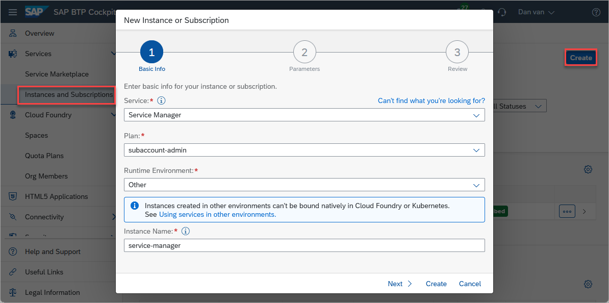
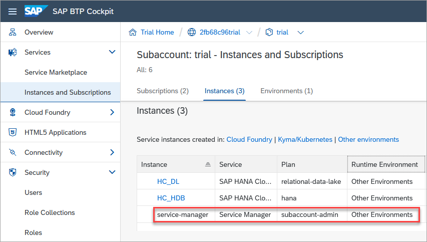
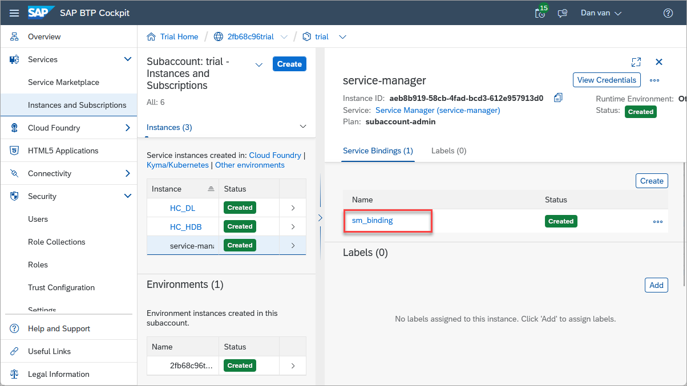
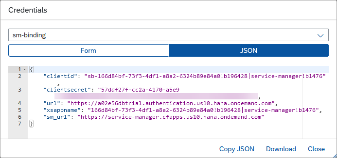
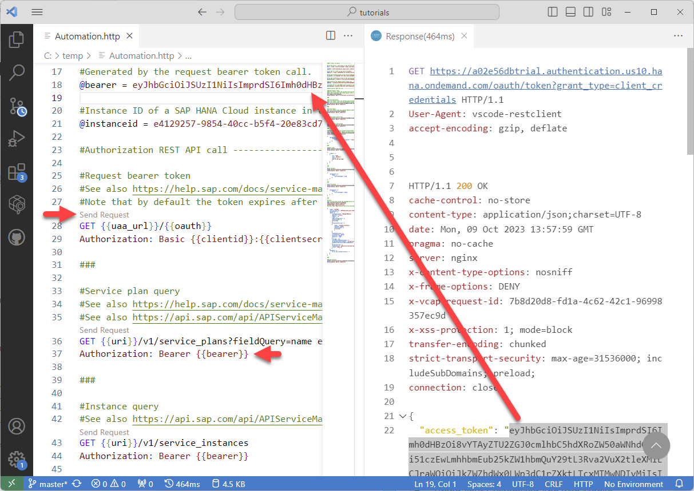
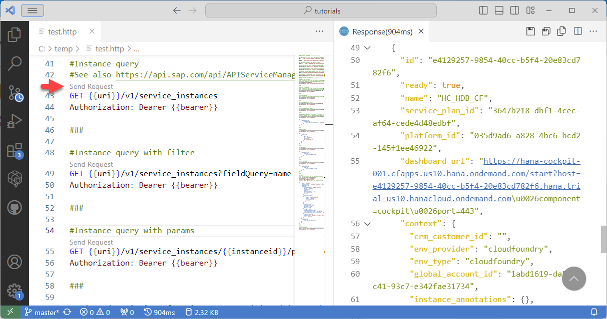
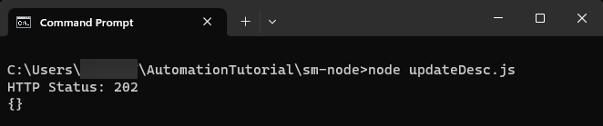
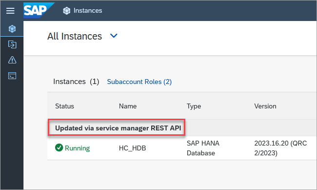

# Automating SAP HANA Cloud Tasks with a REST API
<!-- description --> Learn how the SAP Service Manager's REST API can be used in a REST Client or in a Node.js application.

## Prerequisites
- An SAP BTP account
- An SAP HANA Cloud instance

## You will learn
  - How to create and access an SAP Service Manager instance
  - How to use the SAP Service Manager's REST API from a REST client and an application

---

### Create a Service Manager instance
A service manager instance will be created.  It can then be used to manage SAP HANA Cloud instances within the subaccount.

1. In the SAP BTP Cockpit, in the subaccount, create a new SAP Service Manager instance.

    

    After clicking **Create**, the instance will be shown as seen below.
 
    

2. Create a service binding by clicking on the just created service manager instance and selecting **Create** under **Service Bindings**.

    

    The service binding provides a URL and credentials that can be used when requesting access to the service and will be used in the next step.

    

### Try out the REST APIs
The [SAP Service Manager's APIs](https://help.sap.com/docs/service-manager/sap-service-manager/working-with-sap-service-manager-apis) are available through a REST API.  Details of the REST API can be seen in the [Business Accelerator Hub](https://api.sap.com/api/APIServiceManagment/resource/Service_Instances).

The API's can be invoked using a tool such as the [REST Client](https://marketplace.visualstudio.com/items?itemName=humao.rest-client) for Visual Studio Code.  Additional details on how to use the REST Client can be found at the tutorial [Access SAP HANA Cloud Alerts and Metrics using a REST API](hana-cloud-alerts-rest-api).

1. Create a folder and a text file that will contain REST API calls and open the file with Visual Studio Code.

    ```Shell
    mkdir %HOMEPATH%\AutomationTutorial
    cd %HOMEPATH%\AutomationTutorial
    code Automation.http
    ```

2. Paste the following into the opened file and save it.  Using the values from the service binding, verify the values on lines 4 and 9 and provide a value for the values on lines 12 and 15.  

    ```HTTP[4, 9, 12, 15]
    #REST Client variables -------------------

    #From the sm_url, last field in the service binding
    @uri = https://service-manager.cfapps.us10.hana.ondemand.com

    @oauth = oauth/token?grant_type=client_credentials

    #From the url field in the service binding.
    @uaa_url = https://2fb68c96trial.authentication.us10.hana.ondemand.com

    #From the clientid field in the service binding.  
    @clientid =

    #From the clientsecret field in the service binding.  
    @clientsecret =

    #Generated by the request bearer token call.  Copy the access_token value from the result without the quotes
    @bearer =

    #Instance ID of a SAP HANA Cloud instance in the same subaccount as the service manager instance
    @instanceid = 
  
    #Authorization REST API call --------------------

    #Request bearer token
    #See also https://help.sap.com/docs/service-manager/sap-service-manager/retrieve-oauth2-access-token
    #Note that by default the token expires after 1799 seconds or 30 minutes as seen in the response in the expires_in field
    GET {{uaa_url}}/{{oauth}}
    Authorization: Basic {{clientid}}:{{clientsecret}}

    ###

    #Service plan query
    #See also https://help.sap.com/docs/service-manager/sap-service-manager/filtering-parameters-and-operators
    #See also https://api.sap.com/api/APIServiceManagment/resource/Service_Plans
    GET {{uri}}/v1/service_plans?fieldQuery=name eq 'hana'
    Authorization: Bearer {{bearer}}

    ###

    #Instance query
    #See also https://api.sap.com/api/APIServiceManagment/resource/Service_Instances
    GET {{uri}}/v1/service_instances
    Authorization: Bearer {{bearer}}

    ###

    #Instance query with filter
    GET {{uri}}/v1/service_instances?fieldQuery=name eq 'HC_HDB'
    Authorization: Bearer {{bearer}}

    ###

    #Instance query with params
    GET {{uri}}/v1/service_instances/{{instanceid}}/parameters
    Authorization: Bearer {{bearer}}

    ###

    #Update description of an instance provisioned in a subaccount (Other)
    #Service manager can not update instances provisioned in Cloud Foundry spaces
    PATCH {{uri}}/v1/service_instances/{{instanceid}}
    Authorization: Bearer {{bearer}}

    {
        "parameters": {
            "metadata": {
              "ui.hc.sap.com/description": "Created as part of Automation Tutorial!"
            }
        }
    }

    ###

    #Update label
    PATCH {{uri}}/v1/service_instances/{{instanceid}}
    Authorization: Bearer {{bearer}}

    {
      "labels": [
        {
          "op": "add",
          "key": "Contact",
          "values": [
            "Dan at 123 456 7890"
          ]
        }
      ]
    }

    ###

    #Stop instance
    PATCH {{uri}}/v1/service_instances/{{instanceid}}
    Authorization: Bearer {{bearer}}

    {
        "parameters": {
            "data": {
                "serviceStopped": true
            }
        }
    }

    ###

    #Start instance
    PATCH {{uri}}/v1/service_instances/{{instanceid}}
    Authorization: Bearer {{bearer}}

    {
        "parameters": {
            "data": {
                "serviceStopped": false
            }
        }
    }

    ###

    #Create
    #The service_plan_id and the systempassword will need to be updated
    POST {{uri}}/v1/service_instances
    Authorization: Bearer {{bearer}}
    Content-Type: application/json
    #Content-Type: application/x-www-form-urlencoded

    {
      "name": "HC_HDB",
      "service_plan_id": "3647b218-dbf1-4cec-af64-cede4d48edbf",
      "parameters": {
        "data": {
          "systempassword": "ManagerPWD1234",
          "edition": "cloud",
          "memory": 30,
          "vcpu": 2,
          "additionalWorkers": 0,
          "whitelistIPs": [
            "0.0.0.0/0"
          ],
          "extensionservices": [
            {
              "name": "ConnectivityProxy",
              "enabled": false,
              "whitelistIPs": [
                "0.0.0.0/0"
              ]
            }
          ],
          "enabledservices": {
            "scriptserver": false,
            "docstore": false,
            "dpserver": true
          },
          "storage": 120,
          "availabilityZonePlacement": {
            "primaryAvailabilityZone": "us-east-1d",
            "highAvailabilityCrossMultiAZEnabled": false
          },
          "productVersion": {
            "releaseCycle": "generally-available-quarterly",
            "track": "2023.16"
          }
        },
        "metadata": {
          "ui.hc.sap.com/description": ""
        }
      }
    }

    ###

    #DELETE instance
    DELETE {{uri}}/v1/service_instances/{{instanceid}}
    Authorization: Bearer {{bearer}}
    ```

3. Provide a value for the `instanceid` variable on line 21.  This can be obtained from the action's menu item **Copy Instance ID** in SAP HANA Cloud Central.

4. Request a bearer token (line 28) by clicking **Send Request**.  The token is valid for 30 minutes as described in the expires_in field in the response.
    
    Copy the returned `access_token` value to the bearer variable (line 18) which is then used for credentials in subsequent requests (line36).  

    

5. Try out a few of the other examples such as getting the details of an instance, update the label or description.

    


### Accessing the REST API from a Node.js application
In this step, a [Node.js](https://nodejs.org/en) application will be used to update the description of an SAP HANA Cloud instance.  Before proceeding ensure that Node.js is installed.  Instructions on installing Node.js can be found at [Connect Using the SAP HANA Node.js Interface](hana-clients-node).

1. Initialize a Node.js project, install node-fetch, and create and open a JavaScript file.

    ```Shell
    mkdir %HOMEPATH%\AutomationTutorial\sm-node
    cd %HOMEPATH%\AutomationTutorial\sm-node
    npm init -y
    npm install node-fetch@2
    code updateDesc.js
    ```

2. Copy the below code into **updateDesc.js**. 

    Highlighted values are to be updated with details from your binding key. Sensitive values could alternatively be read from environment variables.  Remember to also update the instance ID.

    ```JavaScript[4, 7, 9, 10, 16]
    const fetch = require('node-fetch');

    //replace with your url from the service manager binding
    const url = "https://2fb68c96trial.authentication.us10.hana.ondemand.com";
    const oauthUrl = url + "/oauth/token?grant_type=client_credentials";
    //replace with your sm_url
    const smUrl = "https://service-manager.cfapps.us10.hana.ondemand.com";
    //fill in your clientid and clientsecret here or remove lines 9-11 and uncomment line 12 to use environment variables
    const clientId = "";
    const clientSecret = "";
    const auth = "Basic " + Buffer.from(clientId + ":" + clientSecret).toString('base64');
    //const auth = "Basic " + Buffer.from(process.env.CLIENT_ID + ":" + process.env.CLIENT_SECRET).toString('base64');
    //Note, on Windows, precede | with ^| in the clientid when setting the environment variable

    //replace with your HANA Database instance id
    const instanceId = "5d9d428a-e613-4964-97cb-f7dba1283cb6";

    const authHeaders = {
      "Content-Type": "application/json",
      "Authorization": auth
    }

    var requestHeaders = {
      "Content-Type": "application/json",
      "authorization": "Bearer "
    }

    const jsonData = {
        "parameters": {
            "metadata": {
              "ui.hc.sap.com/description": "Updated via service manager REST API"
            }
        }
    }

    //get the bearer token
    fetch(oauthUrl, { method: 'GET', headers: authHeaders })
      .then((res) => {
        return res.json()
      })
      .then((authResult) => {
        //add the bearer token to the authorization header
        requestHeaders.authorization = requestHeaders.authorization + authResult.access_token;

        //make a request to update the description
        fetch(smUrl + "/v1/service_instances/" + instanceId, { method: 'PATCH', headers: requestHeaders, body: JSON.stringify(jsonData) })
          .then((res) => {
            console.log("HTTP Status: " + res.status);
            return res.json()
          })
          .then((result) => {
            console.log(JSON.stringify(result, null, 2));
          });
      });
    ```

3. Run the application.

    ```Shell
    node updateDesc.js
    ```

    

    The result can be seen in SAP HANA Cloud Central.

    


### Knowledge check

Congratulations! You have now created an instance of the SAP Service Manager, added a service binding, and used the SAP Service Manager REST API in both a REST client and in an application.
