# Scheduling SAP HANA Cloud Tasks
<!-- description --> Learn different ways that SAP HANA Cloud tasks can be scheduled.  

## Prerequisites
- An SAP BTP account
- An SAP HANA Cloud instance

## You will learn
  - How stored procedures can be scheduled with the CREATE SCHEDULER JOB SQL statement
  - How tasks can be scheduled using cron on Linux
  - How tasks can be scheduled in the SAP Automation Pilot

---

There are different tools that can be used to schedule commands.  SAP HANA enables stored procedures to be scheduled.  Linux provides a service called cron that can execute a script at a scheduled time.  The SAP Automation Pilot is a service in the SAP BTP that has a feature to enable commands to be scheduled.  This tutorial will demonstrate each of these methods of scheduling tasks.

### Scheduling SQL using CREATE SCHEDULER JOB
In this step a diagnostic script from the [SQL Statement Collection for SAP HANA](https://me.sap.com/notes/1969700) will be used.  If you have not already done so, download the zip.  The download section shown below is near the bottom of the SAP Note.  

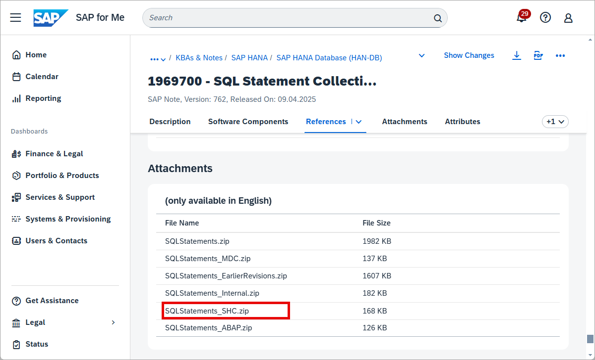

These scripts are for SAP HANA databases.  The script `HANA_Configuration_MiniChecks_SHC.txt` will be placed in a stored procedure and its output will be written to a table.  The procedure can be scheduled to run once a day.  It will check for configuration values that are outside of expected values.

1. Create a table to hold the results.  Run the below SQL in the SAP HANA database explorer connected to an SAP HANA database.

    ```SQL
    CREATE COLUMN TABLE DBADMIN.MINI_CHECK_RESULTS(
      CHID VARCHAR(5),
      DESCRIPTION VARCHAR(100),
      HOST VARCHAR(100),
      VALUE VARCHAR(100),
      EXPECTED_VALUE VARCHAR(100),
      C VARCHAR(1),
      SAP_NOTE VARCHAR(8),
      CHECK_TIME TIMESTAMP
    );
    ```

2. Copy the contents of `HANA_Configuration_MiniChecks_SHC.txt` into a SQL console.  

    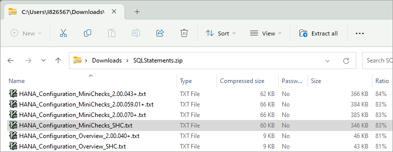

    Execute the script to  ensure that it runs correctly and examine its output.

    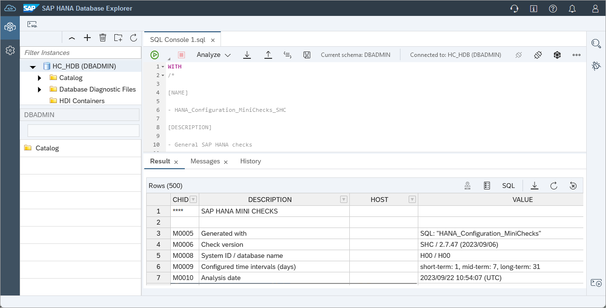

3. Modify the script to only show critical errors by removing the below from approximately line 7916.  Ctrl+L can be used to go to a line within the SQL console.  The line numbers mentioned here are subject to change as the script is frequently updated.

    ```SQL
    ONLY_POTENTIALLY_CRITICAL_RESULTS = ' ' OR
    ```

4. Below line 688 which contains `LPAD(SAP_NOTE, 8) SAP_NOTE)` add the SQL below so that each row in the table will have a timestamp.

    ```SQL
    ,
    CURRENT_TIMESTAMP
    ```

5. Create a stored procedure and insert the results into a table by adding the following to the top of the file.  The shortcut Ctrl+Home can be used to navigate to the top of the file.

    ```SQL
    CREATE OR REPLACE PROCEDURE DBADMIN.HANA_Configuration_MiniChecks()
    LANGUAGE SQLSCRIPT AS
    BEGIN
    INSERT INTO DBADMIN.MINI_CHECK_RESULTS
    ```

6. At the bottom (Ctrl+End), add

    ```SQL
    ;
    END;
    ```

7. Run the SQL to create the new procedure.

    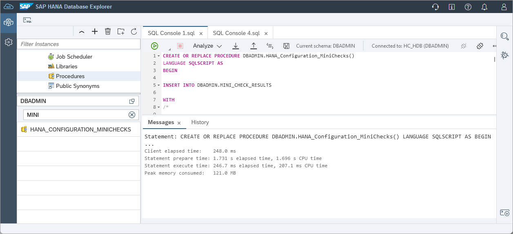

8. In a new SQL console, call the stored procedure and check the results.

    ```SQL
    CALL DBADMIN.HANA_CONFIGURATION_MINICHECKS();
    SELECT * FROM DBADMIN.MINI_CHECK_RESULTS;
    ```

    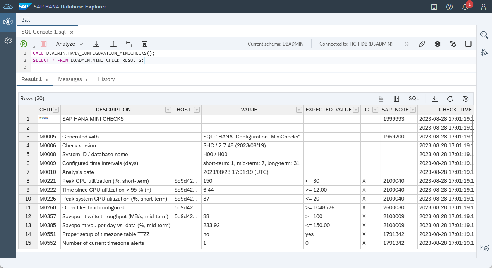

    Notice that the table **MINI_CHECK_RESULTS** contains the results of the checks that occurred from running the `HANA_Configuration_MiniChecks_SHC`.

9. The procedure can now be scheduled to run at a set frequency.  

    ```SQL
    --Get the current date and time in UTC
    SELECT CURRENT_DATE, CURRENT_TIME FROM DUMMY;
    ```

    ```SQL    
    --Schedule an event a few minutes in the future
    --Adjust the date and time below
    CREATE SCHEDULER JOB DBADMIN.MINICHECKS CRON '2023 08 28 * 17 14 0' ENABLE PROCEDURE DBADMIN.HANA_CONFIGURATION_MINICHECKS;
    SELECT * FROM SCHEDULER_JOBS WHERE SCHEDULER_JOB_NAME = 'MINICHECKS';
    SELECT * FROM M_SCHEDULER_JOBS;
    ```

    The script will be run on a specified schedule and will record the results of each run in the table MINI_CHECK_RESULTS.

    After the scheduled time, examine the contents of the table **MINI_CHECK_RESULTS** to confirm that the stored procedure was executed at the scheduled time.

    ```SQL
    SELECT * FROM DBADMIN.MINI_CHECK_RESULTS;
    ```

10. Details of scheduled jobs and their executions can also be seen under **Job Scheduler** in the SAP HANA database explorer's catalog.

    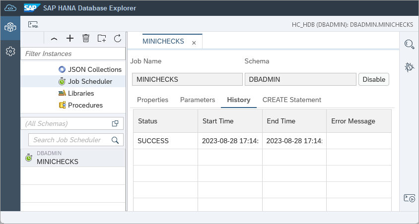

    >If the job does not appear, check if a schema filter is set.

    For additional details see [Scheduling Administrative Tasks](https://help.sap.com/viewer/f9c5015e72e04fffa14d7d4f7267d897/latest/en-US/be4c214b87e54a08bd8047f6149645ec.html).

A job has now been scheduled within SAP HANA Cloud, SAP HANA database.  It should be noted that scheduled jobs only run when the SAP HANA database is running.  

### Scheduling using CRON
The example shown in step 1 of the tutorial [Executing SAP HANA Cloud tasks from the command line](hana-cloud-automation-cli) will now be scheduled using cron on Linux.  This assumes that you have installed the SAP HANA Client.  Details on installing the SAP HANA Client can be found at [Install the SAP HANA Client](hana-clients-install).  

The example shown below was run on an WSL 2 Ubuntu 22 instance.

>If you are using openSUSE on WSL, you may need to install and start the cron service as shown below.
>
>
>```Shell
>which cron
>ps aux | grep cron
>su
>/usr/sbin/cron &
>```

1. Copy the file HANA_Configuration_Overview_SHC.txt to your machine.  The paths below are an example and will need to change.

    ```Shell
    cp /mnt/c/SAP/SQL\ Statements/HANA_Configuration_Overview_SHC.txt /home/dan/.
    ```

2. Create a file that will call hdbsql using your editor of choice such as pico, nano, vi, etc.

    ```Shell
    pico SQLScript.sh
    ```

3. Paste following into the file after updating the folder locations to match your setup.

    ```Shell
    now=`date +"%d-%m-%Y-%H:%M"`

    /home/dan/sap/hdbclient/hdbsql -A -o /home/dan/results_${now}.txt -U AdminUserKey -I /home/dan/HANA_Configuration_Overview_SHC.txt
    ```

    Details on using hdbuserstore were shown in the tutorial [Executing SAP HANA Cloud tasks from the command line](hana-cloud-automation-cli).  Follow those instructions to set the host, port, user and password values for the key AdminUserKey.

4. Enable the file to be executed.

    ```Shell
    chmod +x SQLScript.sh
    ```

5. Call the script to verify that it is correct.

    ```Shell
    ./SQLScript.sh
    ```

    An output file should be generated with the results of calling HANA_Configuration_Overview_SHC.txt

    ```SQL
    cat results_*.txt
    ```

    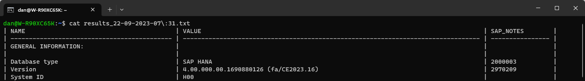

6. Schedule the script.

    ```Shell
    crontab -e
    ```

    Add the following line which instructs it be run every minute.

    ```Shell
    # MIN (0-59), HOUR(0-23), Day of Month(1-31),  Month(1-12), Day of Week(0-6) 
    * * * * * /home/dan/SQLScript.sh
    ```

    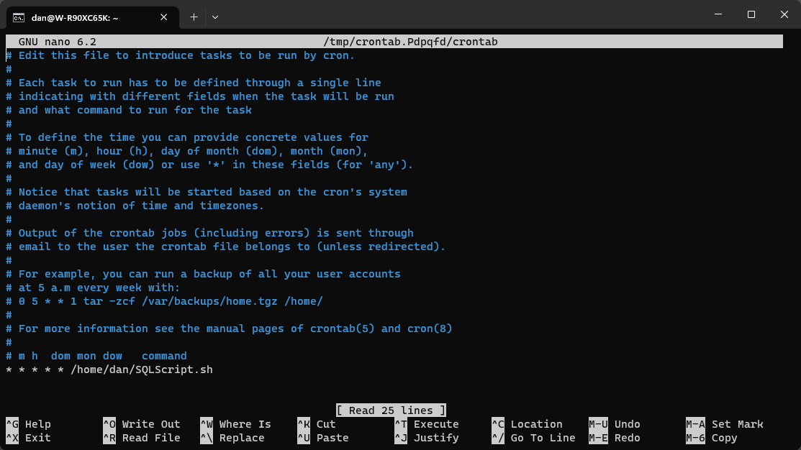

    The names of each 

7. View the list of scheduled tasks using the below command.

    ```Shell
    crontab -l
    ```

    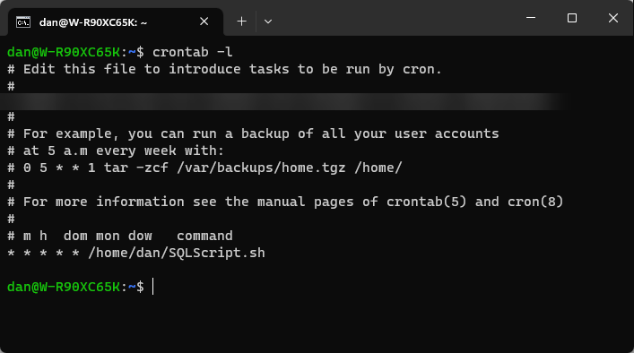

    [crontab generator](https://crontab-generator.org/) can be used to generate a different schedule for cron.

8. View the output after waiting for a minute.

    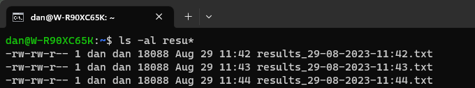

    You may be able to further troubleshoot cron jobs or see additional details by examining the syslog.

    ```SQL
    cat /var/log/syslog | grep CRON
    ```

9. The cron job can be stopped by deleting or commenting out the previously added line.

    ```Shell
    crontab -e
    ```

    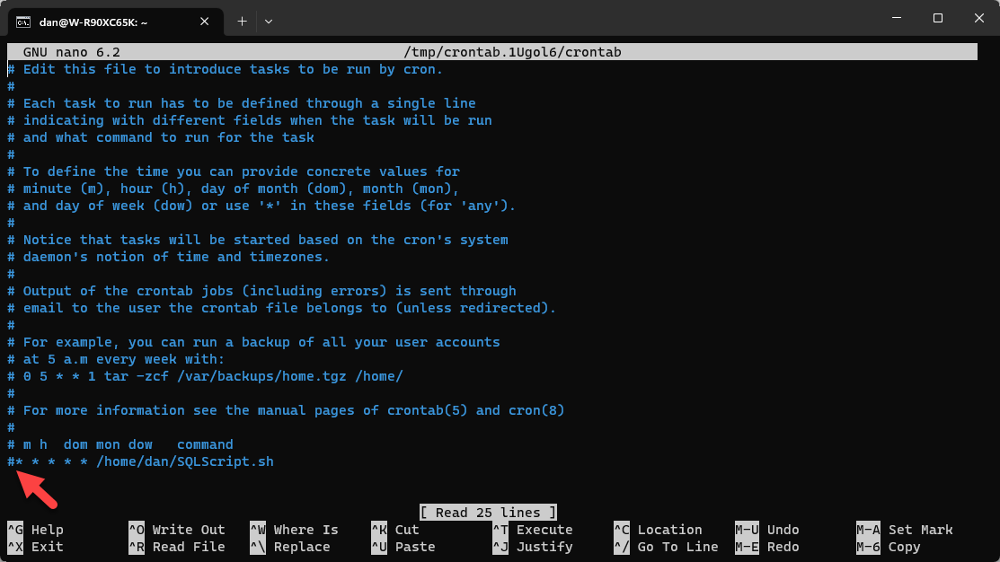

### Scheduling Tasks in the SAP Automation Pilot
Commands such as starting and stopping an SAP HANA Cloud instance can be scheduled within the SAP Automation Pilot.

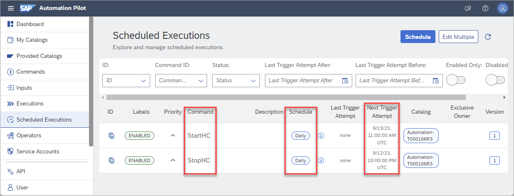

Above we can see that the command **StartHC** has been scheduled daily to start at UTC 11 am or 6 am EST and **StopHC** has been scheduled for 10 PM UTC or 5 PM EST.

### Knowledge check

Congratulations! You have now used various techniques to schedule SAP HANA Cloud tasks using SQL, cron, and the SAP Automation Pilot.
