# Automating SAP HANA Cloud Tasks with the Terraform Provider for SAP BTP
<!-- description --> Terraform is a tool that provides a declarative approach to provisioning and managing infrastructure.  

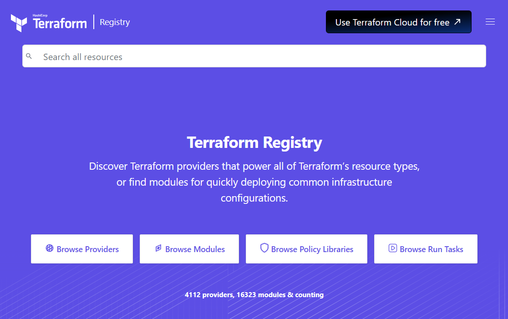

When working with Terraform, a description of a target state is provided in a file named `main.tf`.  Terraform will compare the last known state of the system to the target state and will determine the changes required.  If the Terraform Provider for SAP BTP is being used to update the state of an instance, it is not recommended to also use other tools such as SAP HANA Cloud Central or the BTP CLI to make further updates.  For additional details, see [Drift Detection](https://github.com/SAP/terraform-provider-btp/blob/main/guides/DRIFTDETECTION.md).  The provider works with SAP HANA Cloud instances in a subaccount.  If you wish to provision to Cloud Foundry, consider using the Cloud Foundry provider.  See also [https://registry.terraform.io/namespaces/SAP](https://registry.terraform.io/namespaces/SAP).

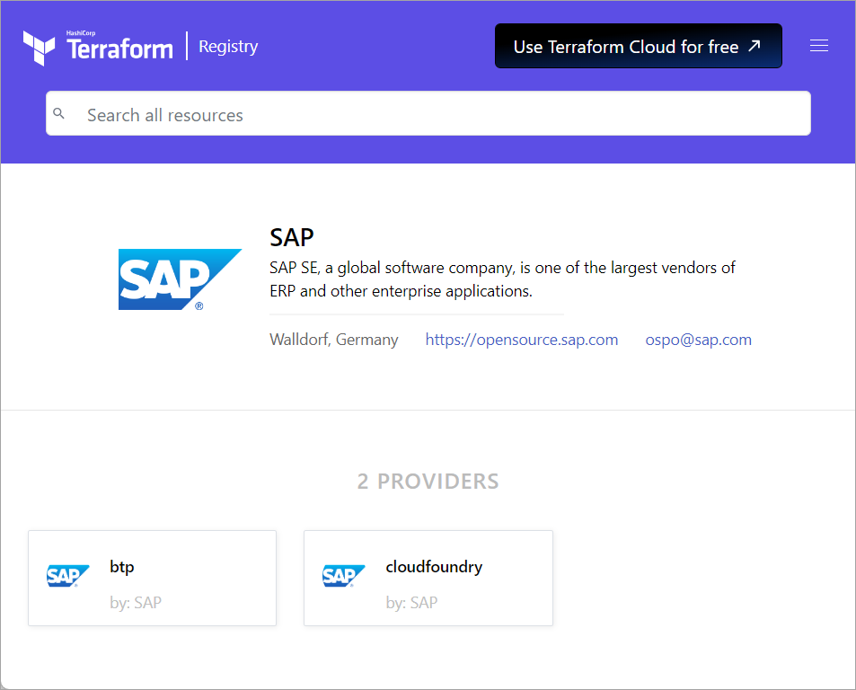

## Prerequisites
- An SAP BTP account

## You will learn
  - How to use the Terraform Provider for SAP BTP
  - How to create an SAP BTP subaccount that contains entitlements
  - How to create a subscription to SAP HANA CLoud Central
  - How to create and update one or more SAP HANA Cloud instances

---

### Get started with Terraform and the Terraform Provider for SAP BTP
1.  Download Terraform from [Install Terraform](https://developer.hashicorp.com/terraform/install).

    Extract the download into a folder such as C:\Terraform and add that folder to your path. 

2.  Create a folder and a provider file.  Replace notepad or pico with your favorite editor.

    ```Shell (Microsoft Windows)
    mkdir C:\HC_Terraform
    cd C:\HC_Terraform
    notepad provider.tf
    ```

    ```Shell (Linux)
    mkdir ~/HC_Terraform
    cd ~/HC_Terraform
    pico provider.tf
    ```

    Terraform provides a [registry of providers](https://registry.terraform.io/browse/providers?category=platform&tier=community), one of which is the [Terraform Provider for SAP BTP](https://registry.terraform.io/providers/SAP/btp/latest/docs).

    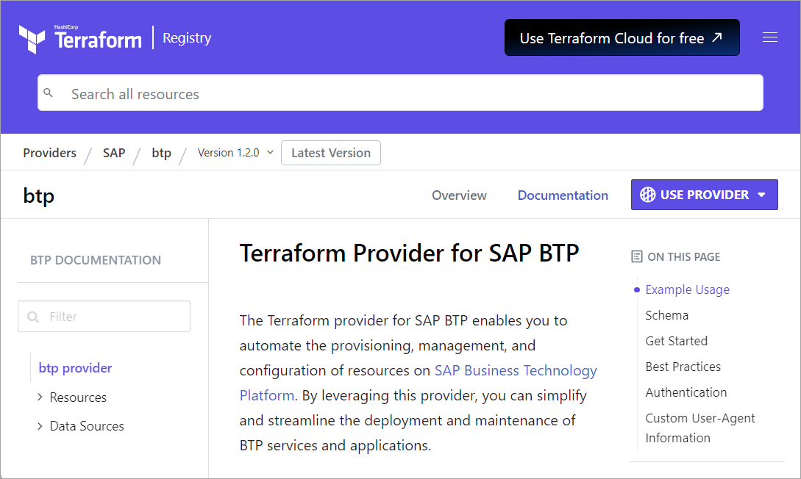

3. Paste the following contents into provider.tf and save the file.  This file will specify that we wish to use the Terraform Provider for SAP BTP, which [version](https://registry.terraform.io/providers/SAP/btp/latest) to use, and which global SAP BTP account to target.  Details of what has changed between releases can be found on the [Releases](https://github.com/SAP/terraform-provider-btp/releases) page.

    ```Terraform
    terraform {
      required_providers {
        btp = {
          source  = "SAP/btp"
          version = "~>1.3.0"
        }
      }
    }

    provider "btp" {
      globalaccount = "xxxxxxxx-8bb4-4df3-bd09-cc6e044fa174"
    }
    ```

    Update the value of globalaccount to match your account.  This value can be obtained from the URL parameter in the SAP BTP Cockpit

4. Initialize the project.

    ```Shell
    terraform init
    ```

    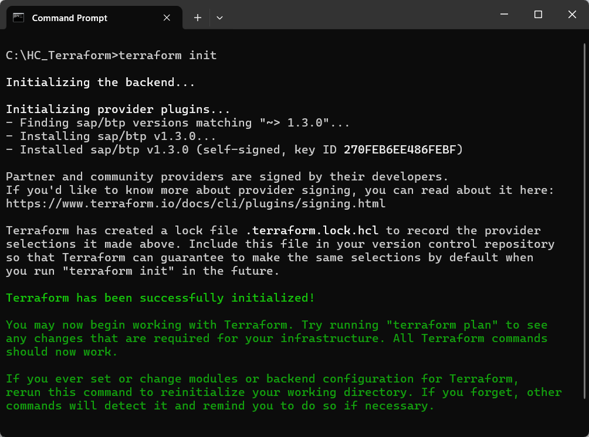
     
For additional details, see [Creating SAP HANA Cloud Instances Using Terraform](https://help.sap.com/docs/hana-cloud/sap-hana-cloud-administration-guide/creating-sap-hana-cloud-instances-using-terraform) and [Basic CLI Features](https://developer.hashicorp.com/terraform/cli/commands).

### Use Terraform to create a subaccount with entitlements for SAP HANA Cloud
1. Create a file named `main.tf`.

    ```Shell (Microsoft Windows)
    notepad main.tf
    ```

    ```Shell (Linux)
    pico main.tf
    ```
    
    Paste the following code into `main.tf`.

    ```Terraform
    #Create a subaccount
    resource "btp_subaccount" "my_subaccount" {
      name      = "Subaccount 1"
      subdomain = "subaccount-1"
      region    = "ca10"
    }

    #Add an entitlement for hana to the subaccount
    resource "btp_subaccount_entitlement" "my_sap_hana_cloud_entitlement" {
      subaccount_id = btp_subaccount.my_subaccount.id
      service_name  = "hana-cloud"
      plan_name     = "hana"
    }

    #Add entitlement for SAP HANA Cloud Central to the subaccount
    resource "btp_subaccount_entitlement" "my_sap_hana_cloud_tooling_entitlement" {
      subaccount_id = btp_subaccount.my_subaccount.id
      service_name  = "hana-cloud-tools"
      plan_name     = "tools"
    }
    ```

    Additional details can be found at [btp_subaccount_entitlement](https://registry.terraform.io/providers/SAP/btp/latest/docs/resources/subaccount_entitlement) and [btp_subaccount (Resource)](https://registry.terraform.io/providers/SAP/btp/latest/docs/resources/subaccount).

2. Provide credentials for Terraform to use with the SAP BTP.

    ```Shell (Microsoft Windows)
    set BTP_USERNAME=dan@hotmail.com
    set BTP_PASSWORD=mypassword
    ```

    ```Shell (Linux)
    export BTP_USERNAME=dan@hotmail.com
    export BTP_PASSWORD=mypassword
    ```
  
3. Apply the changes.

      ```Shell
      terraform apply -auto-approve
      ```

      Alternatively, to view the changes that would be made run the command below.

      ```Shell
      terraform plan
      ```

      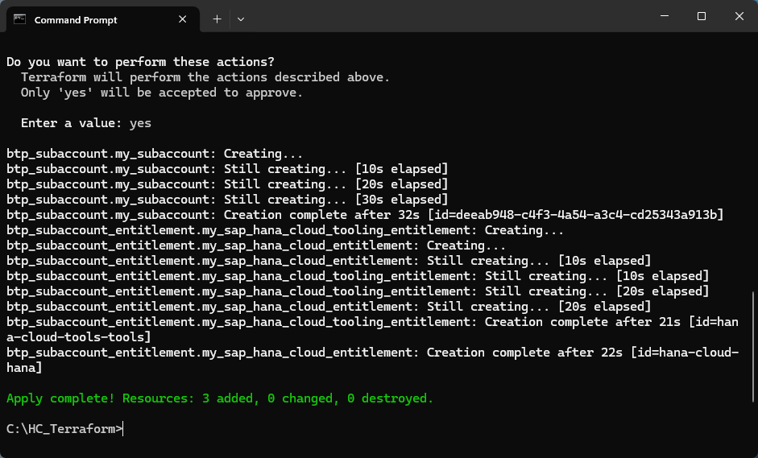

  4.  In the SAP BTP Cockpit, examine the subaccount and added entitlements.

      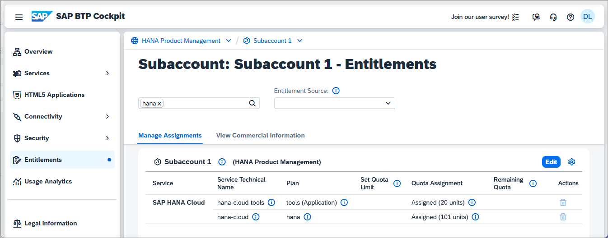

### Use Terraform to subscribe to SAP HANA Cloud Central and assign a role collection
1. Paste the following code at the end of `main.tf`.  Update the user_name value to match your SAP BTP user name.

    ```Terraform
    #Create a subscription to the tooling
    resource "btp_subaccount_subscription" "my_tooling_subscription" {
      subaccount_id = btp_subaccount.my_subaccount.id
      app_name      = "hana-cloud-tools"
      plan_name     = "tools"
      depends_on = [
        btp_subaccount_entitlement.my_sap_hana_cloud_tooling_entitlement
      ]
    }

    #Assign role collection to user
    resource "btp_subaccount_role_collection_assignment" "my_role_collection_assignment" {
      subaccount_id = btp_subaccount.my_subaccount.id
      role_collection_name = "SAP HANA Cloud Administrator"
      user_name            = "dan@hotmail.com"
      depends_on = [
        btp_subaccount_subscription.my_tooling_subscription
      ]
    }
    ```

    Additional details can be found at [btp_subaccount_subscription (Resource)](https://registry.terraform.io/providers/SAP/btp/latest/docs/resources/subaccount_subscription).

2. Apply the changes.

    ```Shell
    terraform apply -auto-approve
    ```

    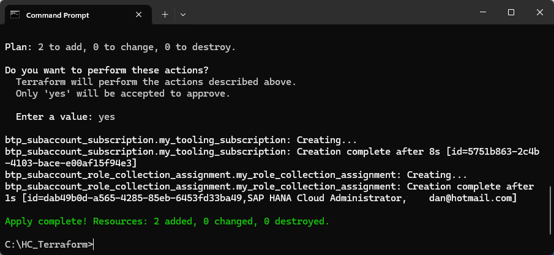

3. In the SAP BTP Cockpit, examine the subscription and assigned role collection.

    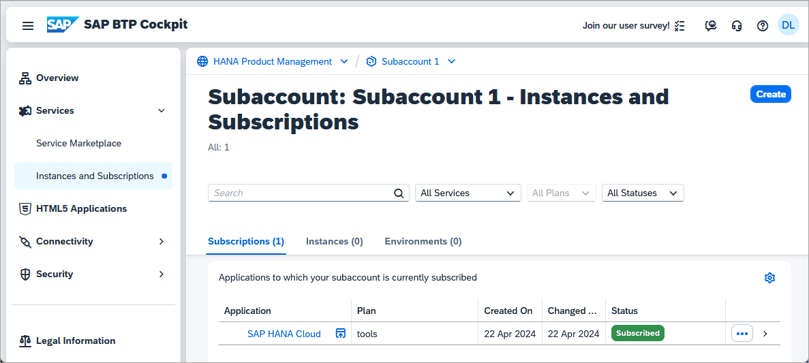

    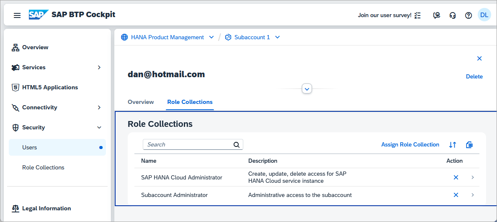


### Use Terraform to create an SAP HANA Cloud instance
1. Paste the following code at the end of `main.tf`.

    ```Terraform
    #Lookup the serviceplan_id for SAP HANA database
    data "btp_subaccount_service_plan" "my_hana_plan" {
      subaccount_id = btp_subaccount.my_subaccount.id
      name = "hana"
      offering_name = "hana-cloud"
      depends_on = [
        btp_subaccount_entitlement.my_sap_hana_cloud_tooling_entitlement
      ]
    }

    #Create or Update an SAP HANA Cloud database instance
    resource "btp_subaccount_service_instance" "my_sap_hana_cloud_instance" {
      subaccount_id = btp_subaccount.my_subaccount.id
      serviceplan_id = data.btp_subaccount_service_plan.my_hana_plan.id
      name = "my_hdb"
      #parameters = jsonencode({"data": { "memory": 32, "vcpu": 2, "systempassword": "Hana1234"}})
      parameters = jsonencode({
        data = {
          memory = 32
          vcpu = 2
          systempassword = "Hana1234"
        }
      })
    }
    ```

    Additional details can be found at [btp_subaccount_service_instance (Resource)](https://registry.terraform.io/providers/SAP/btp/latest/docs/resources/subaccount_service_instance).

    >[Create an SAP HANA Database Instance Using Terraform](https://help.sap.com/docs/hana-cloud/sap-hana-cloud-administration-guide/create-sap-hana-database-instance-using-terraform) demonstrates adding the parameter generateSystemPassword and the additional creation of a service binding so that the database password does not need to be included in the parameters.

2. Apply the changes.

    ```Shell
    terraform apply -auto-approve
    ```

    

3. Open SAP HANA Cloud Central and view the created SAP HANA Cloud, SAP HANA database.

    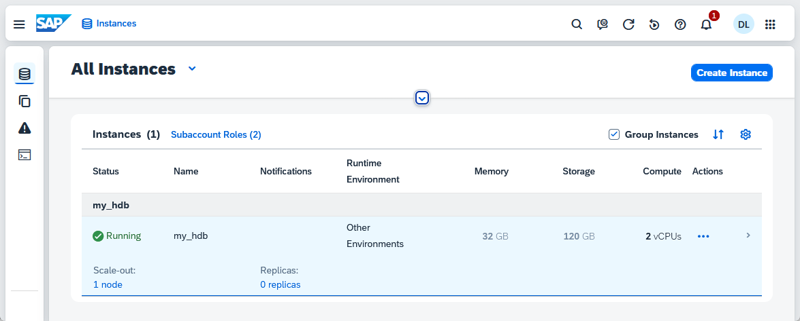

### Use Terraform to add a label to an SAP HANA Cloud instance
1. Update the parameters line in the last section of `main.tf` to include the parameter below.

    ```Terraform
    labels = {
        "Contact" = ["Dan cell: 123 456 7890", "Dan email: dan@hotmail.com" ]
    }
    ```

    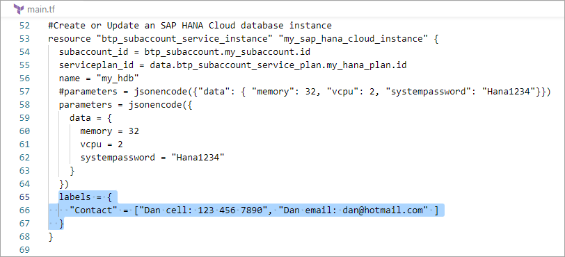

2. Apply the changes.

    ```Shell
    terraform apply -auto-approve
    ```

    

3. View the change in the SAP BTP Cockpit.

    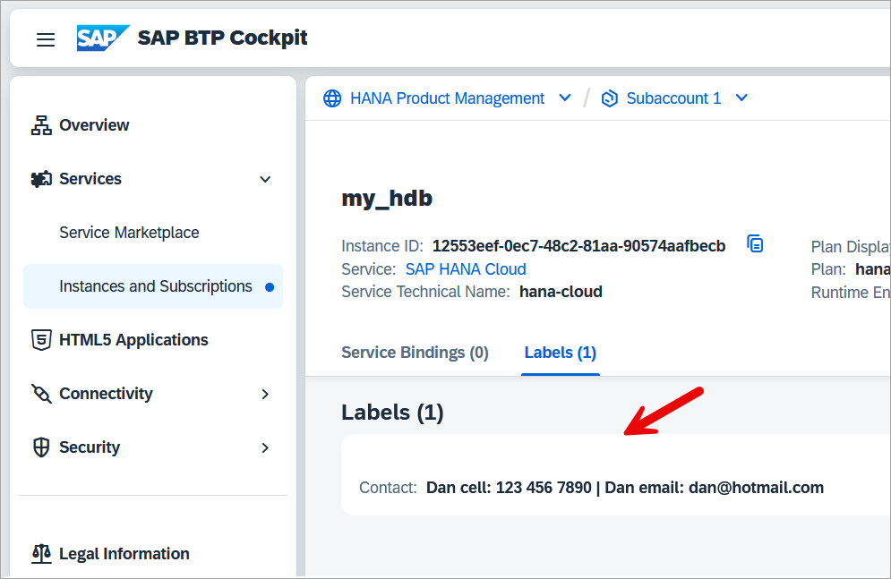

### Use Terraform to update an SAP HANA Cloud instance
1. Update the parameters line in the last section of `main.tf` to include the parameter below.

    ```Terraform
    whitelistIPs = ["0.0.0.0/0"]
    ```

    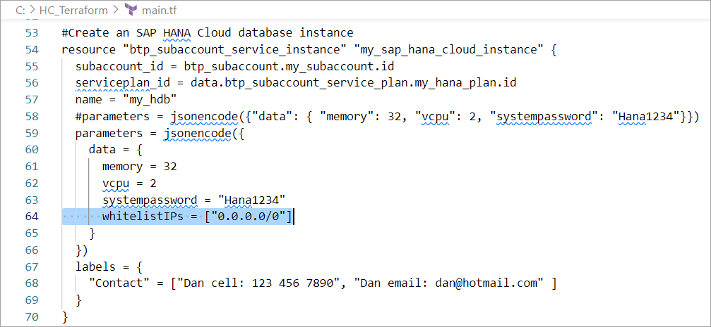

    When an SAP HANA Cloud database instance is created, by default it limits the incoming [connections](https://help.sap.com/docs/hana-cloud/sap-hana-cloud-administration-guide/sap-hana-database-connections) as shown below.

    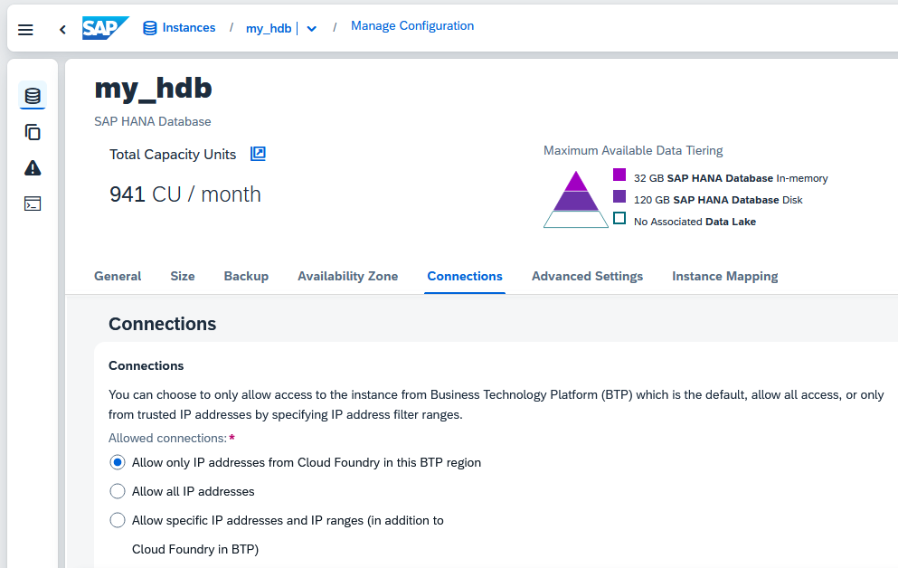

    The changes above will enable connections from any location and is equivalent to the Allow all IP addresses option.

2. Apply the changes.

    ```Shell
    terraform apply -auto-approve
    ```

    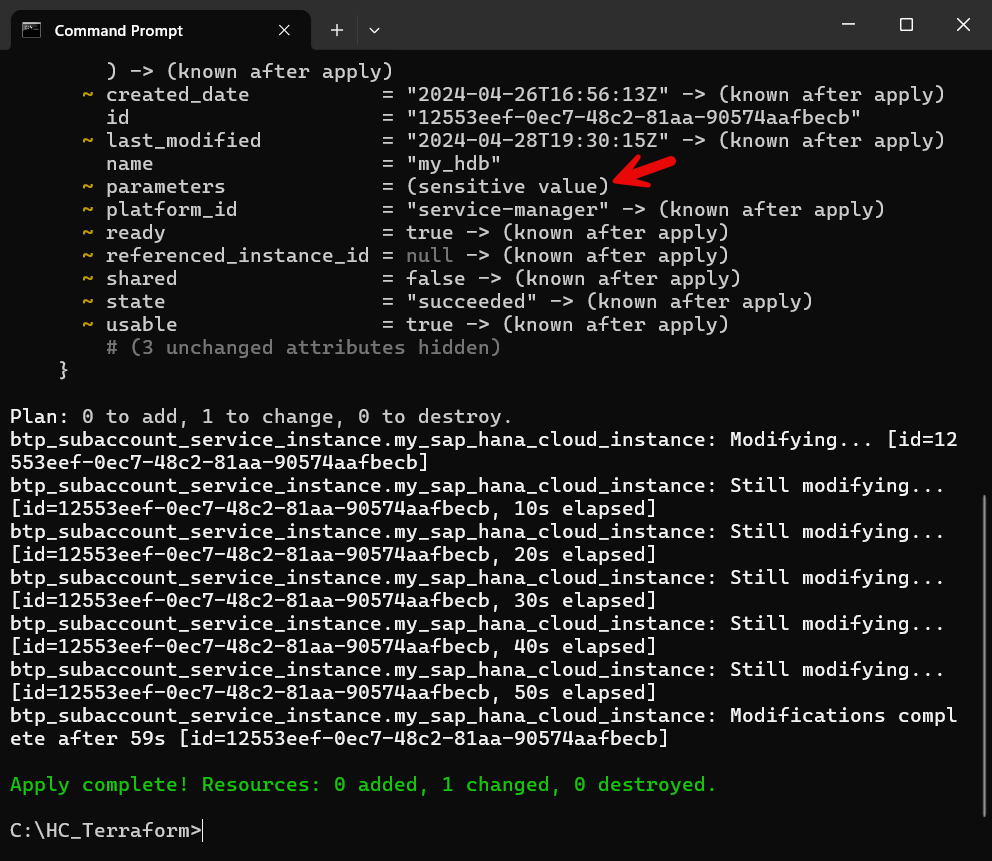

    In the event you need to see more details about the changes being applied, see [Accessing sensitive data in local executions](https://github.com/SAP/terraform-provider-btp/blob/main/guides/SENSITIVEDATA.md).
  
3. Open SAP HANA Cloud Central and view the changed setting.

    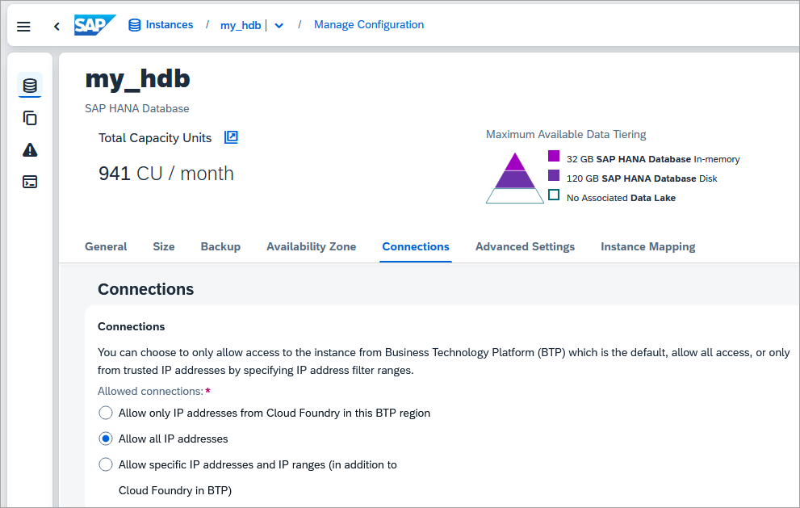

### Knowledge check

Congratulations! You have now used the Terraform to declaratively provision and update an SAP HANA Cloud instance.