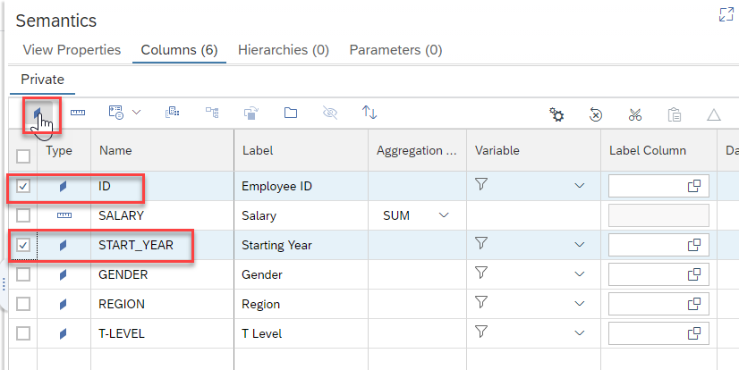

## Prerequisites
 - You have completed the previous tutorials in this series specially [Create an SAP HANA Database Project](hana-cloud-create-db-project)

## Details
### You will learn
 - How to create Calculation View of type Cube using SAP Business Application Studio
 - How to configure data anonymization to a column in order to protect sensitive data

A video version of this tutorial is also available:

<iframe width="560" height="315" src="https://www.youtube.com/embed/kZhATB7yJ-M" frameborder="0" allow="accelerometer; autoplay; clipboard-write; encrypted-media; gyroscope; picture-in-picture" allowfullscreen></iframe>

---

[ACCORDION-BEGIN [Step 1: ](Create a salary table and load data into it)]

Using what you learned in [Create an SAP HANA Database Project](hana-cloud-create-db-project), you will create another database table and load sample data into it but without step by step instructions. Extrapolate what you learned from these same steps in the earlier tutorial to complete this task.

1. Create a new database table named `TGT_SALARIES` using the `hdbtable` artifact type in the data folder. Use the following table definition.

    ```SQL
    column table "TGT_SALARIES" (
	    ID INTEGER  unique not null COMMENT 'Employee ID',
	    SALARY DOUBLE COMMENT 'Salary',
	    START_YEAR INTEGER not null COMMENT 'Starting Year',
	    GENDER NVARCHAR(1) COMMENT 'Gender',
        REGION NVARCHAR(4) COMMENT 'Region',
        "T-LEVEL" NVARCHAR(200) COMMENT 'T Level',
	    PRIMARY KEY ("ID")
    )
    COMMENT 'Employee Salary'
    ```

2. Create the configuration for the `csv` upload.  In the `data/loads` folder, create a file called `salaryload.hdbtabledata` with the following content

    ```json
    {
      "format_version": 1,
      "imports": [{
        "target_table": "TGT_SALARIES",
        "source_data": {
          "data_type": "CSV",
          "file_name": "salarydata.csv",
          "has_header": true,
          "dialect": "HANA",
          "type_config": {
            "delimiter": ","
          }
        }
        }]
    }		
    ```

3. Download this `csv` file -- `https://github.com/SAPDocuments/Tutorials/blob/master/tutorials/hana-cloud-calculation-view-differential-privacy/salarydata.csv` into your computer. Upload it into the **loads** folder using the **Upload Files** option.

4. **Save** and **Deploy** these new Artifacts

    !

[DONE]
[ACCORDION-END]

[ACCORDION-BEGIN [Step 2: ](Create a new calculation view)]

1. Create a new folder called **models** under `db/src`. Create a new **Calculation View** via the **SAP HANA: Create SAP HANA Database Artifact** command pallet entry.

    !

2.  Call it `SALARIES_ANONYMIZED` and make it a **CUBE**. Press **Create**.

    !

3. Select the new calculation view file in the **Explorer**. This will load it into the graphical Calculation View editor. Click on the `Projection` node and then click on the white canvas to drop it.

    !

4. Use the  on the node to add a table as a data source. Choose `TGT_SALARIES`

    !

[DONE]
[ACCORDION-END]


[ACCORDION-BEGIN [Step 3: ](Complete the calculation View)]


1. Double click on the `Projection_1` node. This will open the mapping. Double click on `TGT_SALARIES` to add all of the columns to the output

    !

2. Connect the `Projection_1` node to the **Aggregation** node.

    !

3. Double-click on the name of the node to move all the fields into the output columns.

    !

4. Go into the **Semantics** node and switch `START_YEAR` and `ID` to attribute

    !

5. **Save** and **Deploy**

[DONE]
[ACCORDION-END]

[ACCORDION-BEGIN [Step 4: ](Configure differential privacy via SQL view)]

1.  Create a view (artifact type `hdbview`) in the `src/data/models` folder named `V_SALARIES`.

    !

2. Use the following syntax to create a SQL view that uses the **Differential Privacy** Anonymization approach for the **SALARY** column.

    ```SQL
    VIEW V_SALARIES (
      ID,
      SALARY,
      START_YEAR,
      GENDER,
      REGION,
      "T-LEVEL"
    ) AS
    SELECT ID,
      SALARY,
      START_YEAR,
      GENDER,
      REGION,
      "T-LEVEL"
    FROM "SALARIES_ANONYMIZED"
    WITH READ ONLY
    WITH ANONYMIZATION (ALGORITHM 'DIFFERENTIAL_PRIVACY'
      PARAMETERS '{"data_change_strategy": "qualified"}'
      COLUMN ID PARAMETERS '{"is_sequence": true}'
      COLUMN SALARY PARAMETERS '{"is_sensitive":true, "epsilon":0.1, "sensitivity":15000}')
    ```

    > For more information about these parameters check the [SAP HANA Cloud Data Anonymization Guide](https://help.sap.com/viewer/2f789e82e97d4f4e9416547abfbd012e/latest/en-US/a66e8541c4004f048630f8a55f67ad37.html)

3. If you receive an error that the feature is not supported, this can be safely ignored.

    !

4. **Save** and **Deploy**

[DONE]
[ACCORDION-END]

[ACCORDION-BEGIN [Step 5: ](Preview data)]

1. Open the Database Explorer for your project

    !

2. Open a SQL Console and issue the following statement   

    ```SQL
    refresh view V_SALARIES anonymization;
    ```

3.  Execute that statement in the SQL console

    !

4.  You can now use the normal **Open Data** on the view to preview the Raw Data.

    !

[DONE]
[ACCORDION-END]

---
