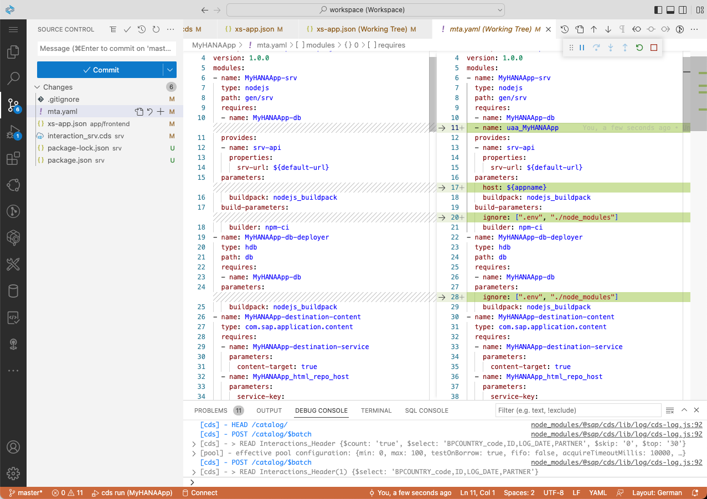

# Deploy Your Application with Access Control (SAP HANA Cloud)
<!-- description --> Define security and enable user authentication and authorization for your SAP HANA Cloud CAP application before deploying it to SAP BTP.

## Prerequisites
- This tutorial is designed for SAP HANA Cloud. It is not intended for SAP HANA on-premise or SAP HANA, express edition.
- You have created database artifacts and loaded data, as explained in [the previous tutorial](hana-cloud-cap-add-list-report).

## You will learn
  - How to incorporate security into the routing endpoint of your application
  - How to configure Cloud Application Programming (CAP) service authentication
  - How to make the current project deployable to SAP BTP

## Intro
We will set up production level security using the SAP Authorization and Trust Management service for SAP BTP in the Cloud Foundry environment and, more specifically, the User Account and Authorization (UAA) Service.

---

### Extend the .gitignore file


In the first step, we need to extend the ignore list for `git`. This will help us to keep the version control clean of any build artifacts that we'll create in this tutorial.

```gitignore
dist/
resources/
```

<!-- border -->


### Turn authentication on


Open the `srv/interaction_srv.cds` file. You need to add `@requires: 'authenticated-user'` to the service definition. Authentication and scopes could also be applied at the individual entity level.

```CDS [3]
using app.interactions from '../db/interactions';

@requires: 'authenticated-user'
service CatalogService {

 entity Interactions_Header
	as projection on interactions.Interactions_Header;

 entity Interactions_Items
	as projection on  interactions.Interactions_Items;

}
```

<!-- border -->


### Make the CAP app deployment-ready


The `srv` is not deployable now as it doesn't include any information about the needed runtime environment. Let's add this information with a simple `package.json` file that will tell the Cloud Foundry runtime that this is a Node.js module. The file also declared the needed dependencies and the configuration parameters that the app requires when running in production.

```JSON
{
    "name": "MyHANAApp",
    "version": "1.0.0",
    "description": "A simple CAP project.",
    "license": "UNLICENSED",
    "private": true,
    "dependencies": {
        "@sap/audit-logging": "^5.0.0",
        "@sap/cds": "^6",
        "@sap/hana-client": "^2.6.61",
        "@sap/xsenv": "^3.1.0",
        "@sap/xssec": "^3.2.0",
        "express": "^4",
        "passport": "^0.4.1"
    },
    "scripts": {
        "start": "cds serve srv/csn.json"
    },
    "engines": {
        "node": "14.X"
    },
    "cds": {
        "build": {
            "target": "."
        },
        "hana": {
            "deploy-format": "hdbtable"
        },
        "requires": {
            "db": {
                "kind": "hana"
            },
            "uaa": {
                "kind": "xsuaa"
            }
        }
    }
}
```

<!-- border -->


### Make the Fiori app deployment-ready


Not only the backend component was missing its final touch - do you remember when we select `None` in the destination field in the previous tutorial? Now it's time to add the route that will redirect traffic to this destination.

```JSON [5-10]
{
  "welcomeFile": "/index.html",
  "authenticationMethod": "route",
  "routes": [
      {
        "source": "/catalog/(.*)",
        "destination": "hana-app-api",
        "csrfProtection": true,
        "authenticationType": "xsuaa"
    },
    ...
```

<!-- border -->

### Adjust mta.yaml


We also need to make a few changes to the `mta.yaml` to create a destination for the web application that points to the backend server.

1. Create a binding from the `MyHANAApp-srv` to the existing `uaa_MyHANAApp` so that the access control can be performed (line 11). The change in line 17 helps us fix the URL that this module will later connect to. The remaining lines enable us to keep the resulting deployment archive as small as possible to allow a faster upload.

    <!-- border -->

> You might be wondering why the code that is to be inserted is only shown in the screen shot, so it's impossible to copy and paste. That is because `.yaml` files are very sensitive to indentation and pasting mistakes happen easily. Please be extra cautious when typing the new code and compare it the screen shot.

3. In the second part we define the destination that points to the backend server. Note that we make use of the same URL patterns that we used for the `host` parameter. Both lines (17 and 109) use the variable `appname` - which hasn't been defined yet. Let's do this in line 131. Make sure you use a unique suffix for this name. It might be a good idea to reuse the ID of your subaccount for this.

    <!-- border -->


> This file defines four instance level destinations. Once the project has been deployed, you can find them in the service dashboard of the destination instance.
> <!-- border -->


### Build the project


**Right-click** on the `mta.yaml` file and select **Build MTA Project**. This will trigger a process that generates the `.mtar` deployment artifact.

<!-- border -->


### Deploy the project


Once the build process has been completed, look for the newly generated file in the project tree (you'll find it in the `mta_archives` folder). **Right-click** on this file and select **Deploy MTA Archive**.
<!-- border -->


### Test the HTML5 app


1. You should see the URL of the deployed backend server once the operation completes. **Open** this URL in a new tab.

    <!-- border -->


2. If you try to access one of the service endpoints or metadata, you should receive an "Unauthorized" error.

    <!-- border -->

    This means your security setup is working. Accessing the URL of the CAP service will always produce an error now as there is no authentication token present.  We need to access the app via the managed application router (short: approuter) to generate and forward the authentication token.

3. Go to the SAP BTP Cockpit and click on the **HTML5 Applications** menu on the subaccount level. You should see at least one entry there. Click on **frontend** to access the web application via the managed approuter.

    <!-- border -->

2. Note that you need to select the visible columns manually before you can see any records.

    <!-- border -->

7.  Once all needed columns are selected, hit the **Go** button to display the data. This should show the **NO DATA** this time.

    > The reason why you don't see data, is that you created a **new HDI container** during the deployment. You can use the *SAP HANA Projects* panel of the SAP Business Application Studio to open the container in the SAP HANA DB Explorer. In there, you can repeat the same steps to display the data that you saw at the end of the previous tutorial.

    <!-- border -->


Congratulations! You have successfully configured and tested the SAP HANA Cloud and Cloud Business Application-based project with production level authentication and authorization.


---
