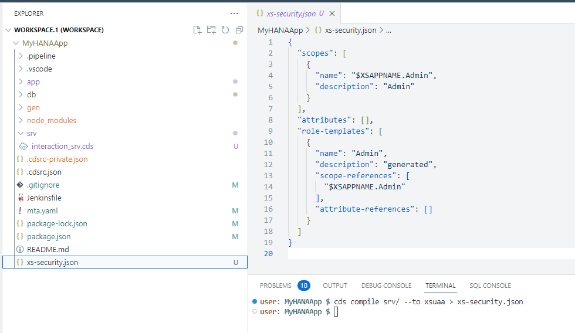
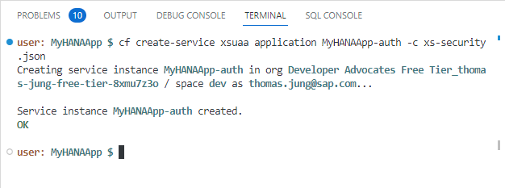
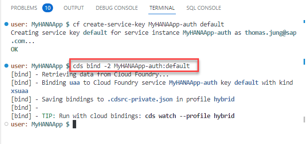
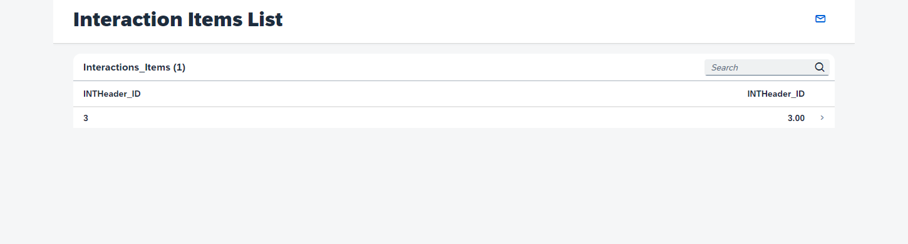

# Add User Authentication to Your Application (SAP HANA Cloud)

<!-- description --> Define security and enable user authentication and authorization for your SAP HANA Cloud CAP application.

## You will learn

- How to create an instance of the User Authentication and Authorization service
- How to incorporate security into the routing endpoint of your application
- How to configure Cloud Application Programming (CAP) service authentication

## Prerequisites

- This tutorial is designed for SAP HANA Cloud. It is not designed for SAP HANA on premise or SAP HANA, express edition.
- You have created database artifacts, loaded data, and added basic UI as explained in [the previous tutorial](hana-cloud-cap-create-ui).

## Video Version

Video tutorial version:

<iframe width="560" height="315" src="https://www.youtube.com/embed/AvROFBCEcEc" frameborder="0" allow="accelerometer; autoplay; clipboard-write; encrypted-media; gyroscope; picture-in-picture" allowfullscreen></iframe>

### Create XSUAA configuration

We are going to set up production level security using the [SAP Authorization and Trust Management service for SAP BTP in the Cloud Foundry environment](https://help.sap.com/viewer/65de2977205c403bbc107264b8eccf4b/Cloud/en-US/649961f8d4ad463daca33b3a20deba4c.html) and more specifically the User Account and Authorization or UAA Service. By default CAP allows you to mock your security for testing during development (which we used in the last tutorial). However we also want to teach you how to setup the full production security and test that during development as well.  

The UAA will provide user identity, as well as assigned roles and user attributes. This is done in the form of a JWT token in the Authorization header of the incoming HTTP request.  We will need the Application Router we added to our application in the last tutorial to perform the redirect to the UAA Login Page and then forward this JWT token to your CAP service. Therefore this will be a multiple step process.

1. In the previous tutorial, we used an Application Router in our project. When we did, the wizard created an xs-security.json file in the root of the project. This file is used during the creation or update of the XSUAA service instance and controls the roles, scopes, attributes and role templates that will be part of the security for your application.  What was generated was a basic version of the xs-security.json that will only require authentication but not specific roles.

    

1. To really test the impact of roles in our application, lets add some security to our services. Open the `interaction_srv.cds` from the `srv` folder. Adjust the code as follows to make `Interactions_Header` service only available to authenticated users and `Interactions_Items` only available to users with the `Admin` role and restrict the results during read operations to only those records where the language column has the value of German (DE).

    ```cap cds
    using app.interactions from '../db/interactions';
    service CatalogService {

    @requires: 'authenticated-user'
    entity Interactions_Header
        as projection on interactions.Interactions_Header;

    @requires: 'Admin'
    @restrict: [{ grant: 'READ', where: 'LANGU = ''DE'''}]
    entity Interactions_Items
        as projection on  interactions.Interactions_Items;

    }
    ```

1. When you do add scopes to the services as we did in the previous step you can generate a sample `xs-security.json` using the following command and merge that into the basics `xs-security.json` file generated by the Application Router wizard.

    ```shell
    cds compile srv/ --to xsuaa > xs-security.json
    ```

    

1. Since we want to test the security setup from the Business Application Studio, we are going to have add some additional configuration to the `xs-security.json`. You need to add another property to the `xs-security.json` to configure which redirect URIs are allowed by the `OAuth` configuration. Also while editing, add an `xsappname` with the value `myhanaapp` and a `tenant-mode` of `dedicated` as well. We can also add `credential-types` as a security best practice. You can read more about the [Credential Types in this blog post](https://blogs.sap.com/2022/07/05/why-developers-should-care-about-credential-types-for-xsuaa/) by [`Dinu PAVITHRAN`](https://people.sap.com/dinu.pavithran)

    ```json
    {
    "xsappname": "myhanaapp",
    "tenant-mode": "dedicated",
    "scopes": [
        {
            "name": "$XSAPPNAME.Admin",
            "description": "Admin"
        }
    ],
    "attributes": [],
    "role-templates": [
        {
            "name": "Admin",
            "description": "generated",
            "scope-references": [
                "$XSAPPNAME.Admin"
            ],
            "attribute-references": []
        }
    ],
    "oauth2-configuration": {
        "credential-types": [
            "binding-secret",
            "x509"
        ],
        "redirect-uris": [
            "https://*.applicationstudio.cloud.sap/**"
        ]
    }
    }
    ```

    

    This wild card will allow testing from the Application Studio by telling the XSUAA it should allow authentication requests from this URL. See section [Application Security Descriptor Configuration Syntax](https://help.sap.com/viewer/65de2977205c403bbc107264b8eccf4b/Cloud/en-US/517895a9612241259d6941dbf9ad81cb.html) for more details on configuration options.

1. Open a terminal and create the XSUAA services instance with the `xs-security.json` configuration using the following command:

    ```shell
    cf create-service xsuaa application MyHANAApp-auth -c xs-security.json
    ```

    

1. Finally return the `package.json` file in the root. In the last tutorial we changed the authentication configuration to `mocked`. Now we can change it back to `xsuaa`.

    

### Configure the application

1. From the terminal, we need to create a service key. This will give us access to the credentials for your XSUAA instance.

    ```shell
    cf create-service-key MyHANAApp-auth default  
    ```

2. Change back to the root of your project in the terminal and issue the command `cds bind -2 MyHANAApp-auth:default`.  This is the same command that we used to bind our running CAP application to HANA DB earlier. Now we are adding a binding to the security XSUAA service as well.

    

### Create and grant roles for application

1. Before we can test our application, we need to create a role that includes the XSUAA instance details and grant to that our user. We will do this from the SAP Business Technology Platform cockpit. In the cockpit, you set up the roles and role collections and assign the role collections to your users. This brings the necessary authorization information into the JWT token when the user logs on to your application through XSUAA and Application Router.

1. Open the SAP BTP cockpit.

1. The roles collections are created on subaccount level in the cockpit. Navigate to your subaccount and then to Security > Role Collections. Then press the `+` to create a new Role Collection.

    

1. Name your role collection `MyHANAApp`. Then go into edit mode on the role collection. Use the value help for the Role. Use the Application Identifier to find your service instance (`myhanaapp!XXXXX`). Select the role and press **Add**

    

1. From the Role Collection edit screen you can also grant the role to your user.  In the Users section fill in your email address you use for your SAP BTP account. Save the Role Collection.

    

    See [Assign Role Collections](https://help.sap.com/viewer/65de2977205c403bbc107264b8eccf4b/Cloud/en-US/9e1bf57130ef466e8017eab298b40e5e.html) in SAP BTP documentation for more details.

### Adjust Application Router

1. The `approuter` component implements the necessary handshake with XSUAA to let the user log in interactively. The resulting JWT token is sent to the application where it's used to enforce authorization.

1. Next open the xs-app.json file in the /app folder.  Here want to make several adjustments. Change the `authenicationMethod` to `route`. This will turn on authentication. You can deactivate it later by switching back to `none`.  Also add/update the routes.  We are adding authentication to CAP service route.  We are also adding the Application Router User API route (`sap-approuter-userapi`), which is nice for testing the UAA connection. We will also add the custom `logoutEndpoint` of `/app-logout`.  You can add this path to your URL if you want to force logout your user; which can be helpful to pickup any changes to your role configuration during development. Finally add the route to the local directory to serve the UI5/Fiori web content.

    ```json
   {
    "authenticationMethod": "route",
    "logout": {
        "logoutEndpoint": "/app-logout",
        "logoutPage": "/"
    },
    "routes": [
        {
            "source": "^/app/(.*)$",
            "target": "$1",
            "localDir": ".",
            "cacheControl": "no-cache, no-store, must-revalidate",
            "authenticationType": "xsuaa"
        },
        {
            "source": "^/appconfig/",
            "localDir": ".",
            "cacheControl": "no-cache, no-store, must-revalidate"
        },
        {
            "source": "^/user-api(.*)",
            "target": "$1",
            "service": "sap-approuter-userapi"
        },
        {
            "source": "^/(.*)$",
            "target": "$1",
            "destination": "srv-api",
            "csrfProtection": true,
            "authenticationType": "xsuaa"
        }
    ]
    }
    ```

### Test

1. If you open the CAP service test page (`cds watch --profile hybrid` if you need to restart it) and try to access one of the service endpoints or metadata, you should receive an Unauthorized error.

    

    This means your security setup is working. Accessing the CAP service directly will always produce an error now as there is no authentication token present.  We need to run via the Application Router to generate and forward the authentication token.

1. Without stopping the CAP service, open a second terminal. In this terminal run `cds bind --exec -- npm start --prefix app` to start the Application Router but using the `cds bind` command to inject all the `UAA` configuration into the Application Router automatically and securely as well.

    

1. Open the application router in a new tab (the new service instance running on port 5000). Click on the `Interactions_Header`. Now instead of the Unauthorized error you received when testing CAP service directly, you should see the data returned normally.

    

1. Finally change to the `Interaction_Items` from the test page. You are now testing with data from the CAP service but all with authentication. You should also only be seeing a single record thanks to the data restriction we placed on the service as well.

    

1. Add `/user-api/attributes` to the end of the URL and you should see your Email and other User details. This is testing that the application router is actually getting the security token from the UAA instance.

    

Congratulations! You have now successfully configured and tested with production level authentication and authorization for the SAP HANA Cloud and Cloud Business Application based project.

If you are wanting to learn about packaging and deploying this complete application as a Multi-Target Application to SAP BTP, Cloud Foundry runtime; there is a separate, optional tutorial which is not part of this mission that covers this step.  Note: that this is an advanced topic and does allocate a large amount of your available resources in an SAP BTP trial account. [Deploy CAP with SAP HANA Cloud project as MTA](hana-cloud-cap-deploy-mta)
