## Prerequisites
- This tutorial is designed for SAP HANA Cloud. It is not designed for SAP HANA on premise or SAP HANA, express edition.
- You have created database artifacts, loaded data, and added basic UI as explained in [the previous tutorial](hana-cloud-cap-create-ui).

## Details
### You will learn
  - How to create an instance of the User Authentication and Authorization service
  - How to incorporate security into the routing endpoint of your application
  - How to configure Cloud Application Programming (CAP) service authentication

We are going to set up production level security using the [SAP Authorization and Trust Management service for SAP BTP in the Cloud Foundry environment](https://help.sap.com/viewer/65de2977205c403bbc107264b8eccf4b/Cloud/en-US/649961f8d4ad463daca33b3a20deba4c.html) and more specifically the User Account and Authorization or UAA Service. By default CAP allows you to mock your security for testing during development. However we also want to teach you how to setup the full production security and test that during development as well.  

The UAA will provide user identity, as well as assigned roles and user attributes. This is done in the form of a JWT token in the Authorization header of the incoming HTTP request.  We will need the Application Router we added to our application in the last tutorial to perform the redirect to the UAA Login Page and then forward this JWT token to your CAP service. Therefore this will be a multiple step process.

Video tutorial version: </br>

<iframe width="560" height="315" src="https://www.youtube.com/embed/AvROFBCEcEc" frameborder="0" allow="accelerometer; autoplay; clipboard-write; encrypted-media; gyroscope; picture-in-picture" allowfullscreen></iframe>
---

[ACCORDION-BEGIN [Step 1: ](Create XSUAA configuration)]

1. In the previous tutorial, we generated an Application Router into a our project. When we did, the wizard created an xs-security.json file in the root of the project. This file is used during the creation or update of the XSUAA service instance and controls the roles, scopes, attributes and role templates that will be part of the security for your application.  What was generated was a basic version of the xs-security.json that will only require authentication but not specific roles.

    !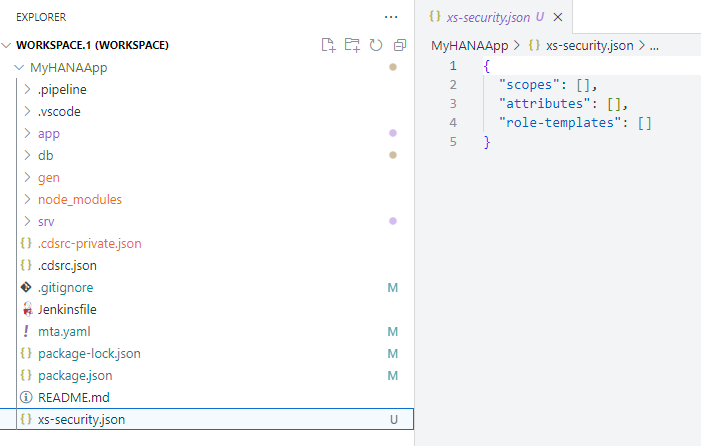

2. **We won't add application scopes in this tutorial**, but those can be added using the CDS syntax in your services.  If you do add scopes to the services you can generate a sample xs-security.json using the following command and merge that into the basics xs-security.json file generated by the Application Router wizard.

    ```shell
    cds compile srv/ --to xsuaa
    ```     

3. Since we want to test the security setup from the Business Application Studio, we are going to have add some additional configuration to the xs-security.json. You need to add another property to the xs-security.json to configure which redirect URIs are allowed.

    ```json
    "oauth2-configuration": {
        "redirect-uris": [
            "https://*.applicationstudio.cloud.sap/**"
        ]
    }
    ```

    !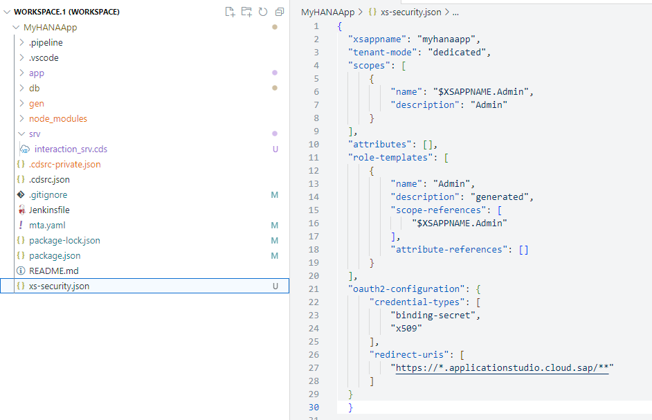

    This wild card will allow testing from the Application Studio by telling the XSUAA it should allow authentication requests from this URL. See section [Application Security Descriptor Configuration Syntax](https://help.sap.com/viewer/65de2977205c403bbc107264b8eccf4b/Cloud/en-US/517895a9612241259d6941dbf9ad81cb.html) for more details on configuration options.

4. Open a terminal and create the XSUAA services instance with the xs-security.json configuration using the following command:

    ```shell
    cf create-service xsuaa application MyHANAApp-xsuaa-service -c xs-security.json
    ```

    !

[DONE]
[ACCORDION-END]

[ACCORDION-BEGIN [Step 2: ](Configure the application)]

1. In the previous tutorial, we used a default-env.json file in the root of the project, to configure the connection to the SAP HANA Cloud database. We will now extend that same file to do the same for the XSUAA instance we just created in the previous step.

2. Open the default-env.json and add an `xsuaa` section with a placeholder for the credentials which we will fill soon:

    ```json
    "xsuaa": [{
            "name": "MyHANAApp-xsuaa-service",
            "label": "xsuaa",
            "tags": ["xsuaa"],
            "credentials": {
                [...]
            }
        }],
    ```
    !

3. From the terminal, we need to create a service key. This will give us access to the credentials for your XSUAA instance.

    ```shell
    cf create-service-key MyHANAApp-xsuaa-service default
    cf service-key MyHANAApp-xsuaa-service default
    ```    

    !

4.  Copy the output of the service-key command and paste it into the credentials section of the default-env.json file.

    !

5. Next we need to enhance the CAP application configuration in the package.json file in the root of the project. Add an `uaa` section to the `cds.requires` section of the file.

    !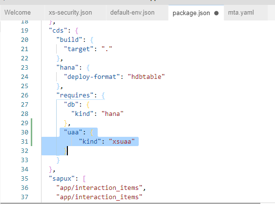

6. While in the package.json, also change the scripts section.  Change the start script to the following:

    ```json
    "scripts": {
      "start": "NODE_ENV=production cds run"
    }
    ```  

    We make this change because otherwise CAP will try to mock the authentication.  But we want to test with the real production security of the XSUAA and this change will tell CAP to run in Production mode and use the XSUAA instance.

7.  Open the `srv/interaction_srv.cds` file. You need to add `@requires: 'authenticated-user'` to the service definition. Authentication and scopes can also be applied at the individual entity level.

    !

8. Finally we are going to need some additional Node.js modules for CAP to process the authentication. We can both add them to the package.json dependencies and install them all in one step from the terminal.

    ```shell
    npm install -save passport @sap/xssec @sap/xsenv @sap/audit-logging
    ```

    !

[DONE]
[ACCORDION-END]


[ACCORDION-BEGIN [Step 3: ](Create and grant roles for application)]

1. Before we can test our application, we need to create a role that includes the XSUAA instance details and grant to that our user. We will do this from the SAP Business Technology Platform cockpit. In the cockpit, you set up the roles and role collections and assign the role collections to your users. This brings the necessary authorization information into the JWT token when the user logs on to your application through XSUAA and Application Router.

2. Open the SAP BTP cockpit. If you are working in the SAP BTP trial, the URL will be: [https://cockpit.hanatrial.ondemand.com](https://cockpit.hanatrial.ondemand.com)

3. The roles collections are created on subaccount level in the cockpit. Navigate to your subaccount and then to Security > Role Collections.

    !

4. Name your role collection `MyHANAApp`. Then go into edit mode on the role collection. Use the value help for the Role. Use the Application Identifier to find your service instance (`myhanaapp!#####`). Select the role and press **Add**

    !

5. From the Role Collection edit screen you can also grant the role to your user.  In the Users section fill in your email address you use for your SAP BTP account. Save the Role Collection.    

    !

    See [Assign Role Collections](https://help.sap.com/viewer/65de2977205c403bbc107264b8eccf4b/Cloud/en-US/9e1bf57130ef466e8017eab298b40e5e.html) in SAP BTP documentation for more details.   


[DONE]
[ACCORDION-END]

[ACCORDION-BEGIN [Step 4: ](Adjust Application Router)]

1. The `approuter` component implements the necessary handshake with XSUAA to let the user log in interactively. The resulting JWT token is sent to the application where it's used to enforce authorization.

2. The application router configuration was generated in the previous tutorial via wizard.  We now want to extend that application router setup.  Start with the package.json file in the `/app` folder. We want to update the version of the `@sap/approuter` to at least version 10

    !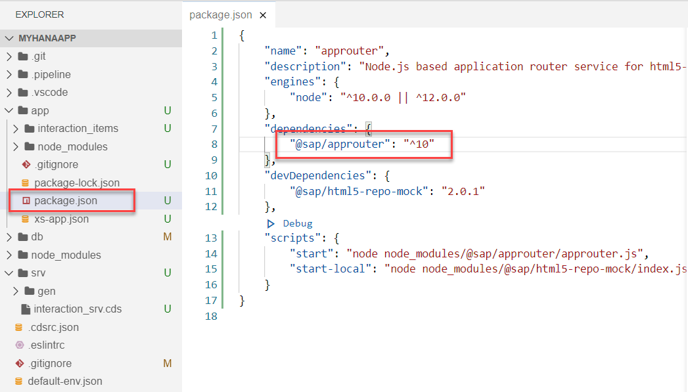

3. From the terminal change to the /app folder and run `npm install` to update to this newer version.

4. Next open the xs-app.json file in the /app folder.  Here want to make several adjustments. Change the `authenicationMethod` to `route`. This will turn on authentication. You can deactivate it later by switching back to `none`.  Also add/update the routes.  We are adding authentication to CAP service route.  We are also adding the Application Router User API route (which is nice for testing the UAA connection).  Finally add the route to the local directory to serve the UI5/Fiori web content.

    ```json
    {
    "authenticationMethod": "route",
    "routes": [{
            "source": "/catalog/(.*)",
            "destination": "srv-api",
            "csrfProtection": true,
            "authenticationType": "xsuaa"
        },
        {
            "source": "^/user-api(.*)",
            "target": "$1",
            "service": "sap-approuter-userapi"
        }, {
            "source": "/(.*)",
            "localDir": ".",
            "authenticationType": "xsuaa"
        }
        ]
    }
    ```    

5. The application router is going to need a `default-env.json` file as well so during testing it can connect to the UAA instance. Copy the `default-env.json` file from the root of the project into the /app folder. Edit this file and add a destinations section:

    ```json
    "destinations": [{
      "name": "srv-api",
      "url": "http://localhost:4004",
      "forwardAuthToken": true
    }],
    ```

    This is setting up the internal routing from the Application Router to the CAP since we will run each separately. If you are working where the localhost:4004 came from, you can see that in the CAP log when you test the service.

    !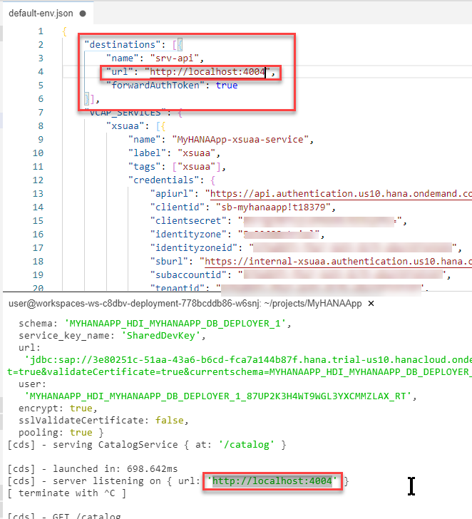

[DONE]
[ACCORDION-END]

[ACCORDION-BEGIN [Step 5: ](Adjust mta.yaml)]

1. We have done all the setup to make testing from the Business Application Studio possible, but it's important to also update the mta.yaml file. Unlike the old Web IDE, the Business Application Studio does not use the mta.yaml while test running services. However this file is still critical for packaging and deploying your application. Therefore we will to also make sure that the XSUAA instance is bound to the modules in the mta.yaml.

2. Open the mta.yaml in the MTA editor. The wizard from the previous tutorial already added the UAA resource to our project.  We now just need to bind it to our modules. Select the `MyHANAApp-srv` module and add a requires entry for the `uaa_MyHANAApp (resource)`.

    !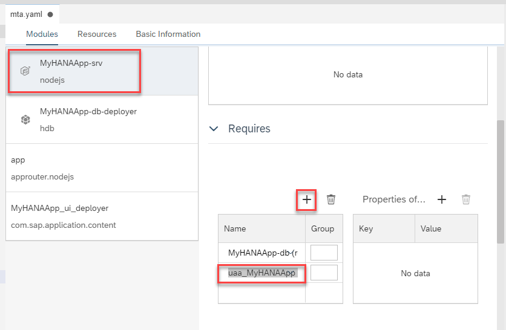

3. **OPTIONAL** If you want to use the mta.yaml text editor instead of the form based edition you could make this same change by adding the following line:

    !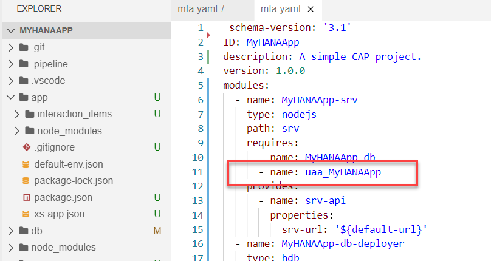

[DONE]
[ACCORDION-END]

[ACCORDION-BEGIN [Step 6: ](Test)]

1. We are assuming you have no services running from previous tutorials. If you do, then please stop them with CTRL+C. From the Terminal in the root of the project, issue the command `npm start` to start the CAP service.

    !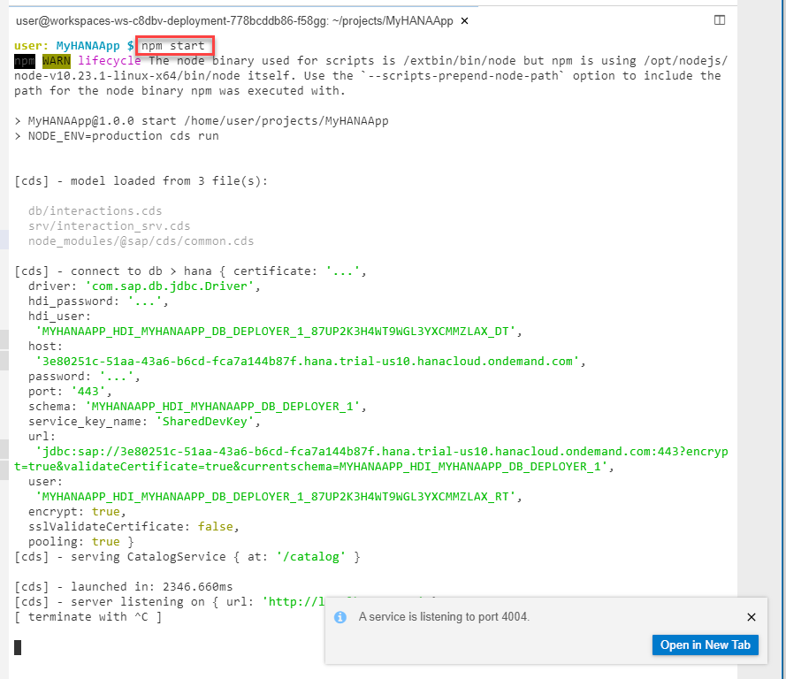

2. If you open the CAP service test page and try to access one of the service endpoints or metadata, you should receive an Unauthorized error.

    !

    This means your security setup is working. Accessing the CAP service directly will always produce an error now as there is no authentication token present.  We need to run via the Application Router to generate and forward the authentication token.

3. Without stopping the CAP service, open a second terminal. In this terminal change to the `/app` folder and then run `npm start` to start the Application Router.

    !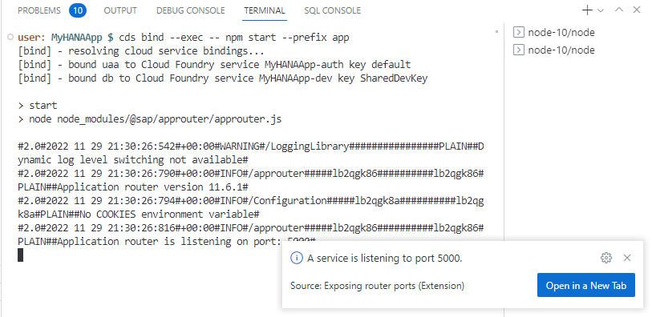

4. Open the application router in a new tab.  We've not configured any default entry page so it's normal that you will receive a not found page.  But this gives us the place where we can start testing.

    !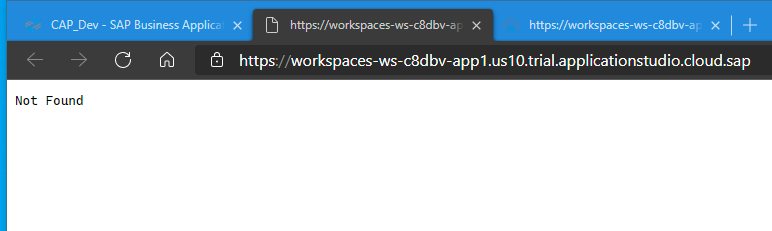

5. Add `/user-api/attributes` to the URL and you should see your Email and other User details. This is testing that the application router is actually getting the security token from the UAA instance.

    !

6. Change the URL path to `/catalog/Interactions_Header?$top=11`. Now instead of the Unauthorized error you received when testing CAP service directly, you should see the data returned normally.     

    !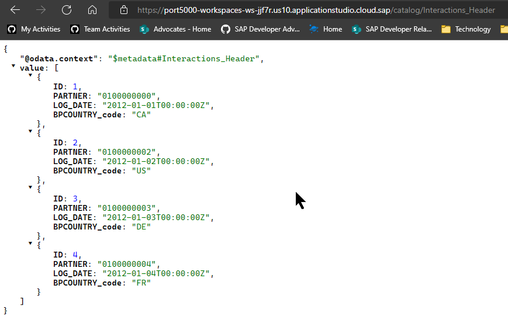

7. Finally change the ULR path to `/interaction_items/webapp/index.html`. You are now testing the Fiori free style application from the previous tutorial with data from the CAP service but all with authentication.

    !

Congratulations! You have now successfully configured and tested with production level authentication and authorization for the SAP HANA Cloud and Cloud Business Application based project.   

If you are wanting to learn about packaging and deploying this complete application as a Multi-Target Application to SAP BTP, Cloud Foundry runtime; there is a separate, optional tutorial which is not part of this mission that covers this step.  Note: that this is an advanced topic and does allocate a large amount of your available resources in an SAP BTP trial account. [Deploy CAP with SAP HANA Cloud project as MTA](hana-cloud-cap-deploy-mta)       

[DONE]
[ACCORDION-END]

---
