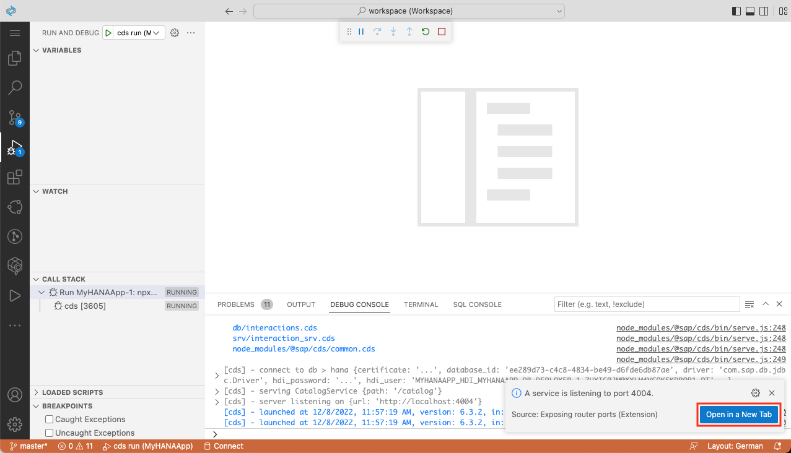
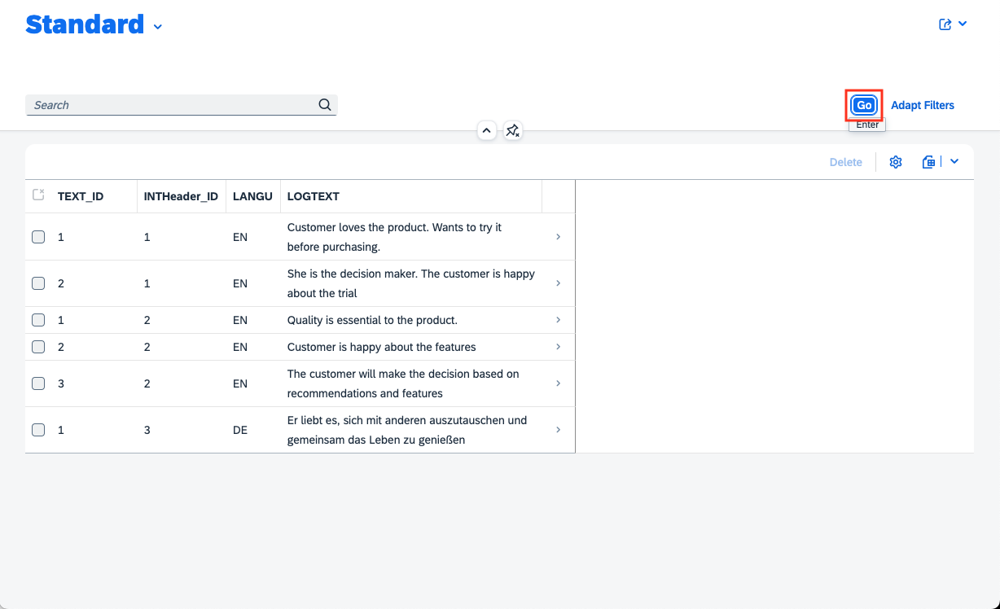

# Add a List Report Interface to the CAP App (SAP HANA Cloud)
<!-- description --> Run the CAP app locally and add an SAP Fiori elements list report to display the data.

## Prerequisites
 - This tutorial is designed for SAP HANA Cloud. It is not intended for SAP HANA on-premise or SAP HANA, express edition.
 - You have created database artifacts and loaded data, as explained in [the previous tutorial](hana-cloud-cap-create-database-cds).


## You will learn
 - How to connect an HDI container during local development
 - How to create an SAP Fiori elements web interface
 - How to run the CAP application locally

---

### Start the development server


1. Open the **Run Configurations** panel from the left-hand toolbar and click the **+** button to trigger the prompts.

    <!-- border -->

2. Select the suggested development profile **`MyHANAApp`**. You can provide a name for this run configuration in the next step - any name will do the job here.

    <!-- border -->

3. You'll see that a new run configuration has been added to the list. Expand the configuration to see that it has one dependency: The HDI container where the data is stored. Click on the **plug** icon to trigger the binding.

    <!-- border -->

4. Select the HDI container you created in the previous tutorial.

    <!-- border -->

5. You'll see a few success messages once the binding has been established successfully. We want to skip the deployment of data to the `MyHANAApp-dev`, so click **No** if prompted.

    <!-- border -->

6. Click on the green **play** button of the run configuration. This will switch the view to the debug panel and scripts will be executed. A few moments later, a message will pop up and suggest exposing a new port. Accept this suggestion by selecting **Open in New Tab**.

    <!-- border -->

    If you accidentally close this dialog, you can always open the running services via **Menu > View > Command Palette** and then choose **Ports: Preview** and select the running service from the list.

7. A new browser tab should now open and you'll see the list of entities you exposed.

    <!-- border -->

8. You can click on the entities to see the values in a JSON format being served from the SAP HANA Cloud database.    

    <!-- border -->                 


### Test the services


1. Choose the `$metadata` option from the *Welcome page* to see a technical description of the service.

    <!-- border -->

2. You can use different methods in the OData V4 services you have created. Go back to the welcome page for the service and click **`Interactions_Items`**. Add the following to the URL:

    ```URL
    ?$search=DE
    ```

    <!-- border -->

3. You can find out more about OData V4 in the [OData organization](https://www.odata.org/documentation/) and the [SAPUI5 documentation](https://sapui5.hana.ondemand.com/#/topic/5de13cf4dd1f4a3480f7e2eaaee3f5b8).


### Add a managed approuter


The managed approuter will make it easy for us to access web applications (such as the SAP Fiori elements app) in a [serverless manner](https://blogs.sap.com/2020/10/02/serverless-sap-fiori-apps-in-sap-cloud-platform/) later on.

1. Trigger the wizard with a **right-click** on the `mta.yaml` file and select **Create MTA Modules from Template**.

    <!-- border -->

2. This will start a wizard to add the module to your project. Choose the Module Template type of **Approuter Configuration** and then press **Start**.

    <!-- border -->

3. Choose the application runtime type **Managed Approuter**, choose **`hana.app`** as the name of the business solution, and confirm that you want to **add a UI**. Then press **Next** to complete the wizard.

    <!-- border -->        

4. This will complete the wizard and add a few new sections to the `mta.yaml` file at the root of your project.

    <!-- border -->


### Add the Fiori elements list report


Now that the managed approuter is part of this project, it's time to add the web application. To be more precise, an SAP Fiori elements app that implements the [List Report Floorplan](https://experience.sap.com/fiori-design-web/list-report-floorplan-sap-fiori-element/). We will use the built-in wizard to generate the UI.

1. This wizard can also be triggered via a **right-click** on the `mta.yaml` file and then select **Create MTA Modules from Template** once again.

    <!-- border -->

2. This time you need to choose the **SAP Fiori application** tile and **Start** the wizard.

    <!-- border -->

3. As mentioned before, we want to create a **List Report Page**. Select the corresponding tile and proceed with **Next**.    

    <!-- border -->

4. This Fiori app shall retrieve its data from the **Local CAP Project**. Provide the path to this project so that you can select the **`CatalogService`** you defined earlier.

    <!-- border -->    

5. For this tutorial, we want to visualize the **`Interactions_Items`** entity.

    <!-- border -->

6. Change the following properties and enter these values, before you confirm with **Next**.

    | **Key**       | **Value**           
    | ------------- |:-------------:|
    | Module name      | **`frontend`**
    | Application title      | **`List Report`**     
    | Add deployment configuration | true      |
    | Add FLP configuration | true      |

    <!-- border -->

7. Select **Cloud Foundry** as the target platform. Note that it's not necessary to enter a destination name. We will create the required destination in the following tutorial directly in the code.

    <!-- border -->

8. Last but not least, enter the launchpad configuration. This information is needed for the navigation from the Launchpad to your Fiori app. Once you provided all the data from the screenshot, click **Finish** to add the new files to the project.

    <!-- border -->


### Restart the development server


We added the Fiori resources now, but they are not yet visible in the running development server. This is expected as we started the process *before* the files were created.

1. Go to the **Debug** view and click the **restart** button.

    <!-- border -->


2. Go back to the running CAP application or open a new tab (if you already closed it). There should now be an `index.html` link under *Web Applications:*. Click this link.

    <!-- border -->

### Display the data


It's time to use the Fiori application!

1. Note that you need to select the visible columns manually before you can see any records.

    <!-- border -->


2. Once all needed columns are selected, hit the **Go** button to display the data.

    <!-- border -->


Congratulations! You have created a complete SAP Fiori elements application.

Now is an excellent time to commit your application to the local or remote Git repository.


---
