## Prerequisites
- This tutorial is designed for SAP HANA Cloud. It is not designed for SAP HANA on premise or SAP HANA, express edition.
- You have created database artifacts and loaded data as explained in [the previous tutorial](hana-cloud-cap-create-database-cds).

## Details
### You will learn
- The basics of creating HANA Native Artifacts within a Cloud Application Programming Model project
- How to create SAP HANA calculation views
- How to integrate SAP HANA native artifacts, like calculation views, within the SAP Cloud Application Programming Model

With the SAP Cloud Application Programming Model and its implementation of Core Data Services (CDS), we don't  directly import a Calculation View or other native DB artifact. This import, however, is important if you want to expose these artifacts via OData V4 services, since that requires a CDS entity or view.

But CDS does have an annotation called  `@cds.persistence.exists`. This annotation allows you to re-define an existing DB object and CDS won't attempt to create or alter it. It will just assume it already exists in the matching state.

This feature does require you to completely redefine the DB artifact with exactly the same name, columns and column names.

In this exercise, lets see how we can create a calculation view and other artifacts and expose them to CDS.

For more details on this topic, including advanced features such as parameters and quoted names, please refer to the online documentation here: [https://cap.cloud.sap/docs/advanced/hana#create-sap-hana-native-object](https://cap.cloud.sap/docs/advanced/hana#create-sap-hana-native-object)

Video tutorial version: </br>

<iframe width="560" height="315" src="https://www.youtube.com/embed/Zb_9ccGXIRk" frameborder="0" allow="accelerometer; autoplay; clipboard-write; encrypted-media; gyroscope; picture-in-picture" allowfullscreen></iframe>

---

[ACCORDION-BEGIN [Step 1: ](Create calculation view)]

Calculation Views and other HANA native artifacts allow you to leverage HANA specific features and optimizations that might not otherwise be available at the abstraction layers within the SAP Cloud Application Programming Model. Calculation Views are especially good at aggregation and filtering of large datasets. In this exercise will create a simple join Calculation View based upon or small data set and data model. This is done so we focus on the mechanics of combining HANA native with CAP without needing the typical large data set where the technical advantages of Calculation Views become more apparent.

1. Create a new **Calculation View** via **View > Find Command** and then **SAP HANA: Create SAP HANA Database Artifact** command pallet entry.

    !

2. Create a calculation view called `V_INTERACTION` of Data Category **DIMENSION** and Dimension Type of **STANDARD**. Press **Create**     

    !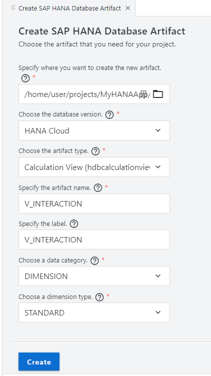

3. The new artifact is created in the `/db/src` folder alongside the `/gen` content created by CAP.  This way you can have a single HANA database model that contains both HANA native content and CAP generated content.

    !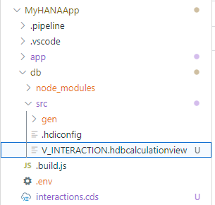

4.  Click on the `V_INTERACTION.hdbcalculationview` to load the graphical calculation view editor.

    !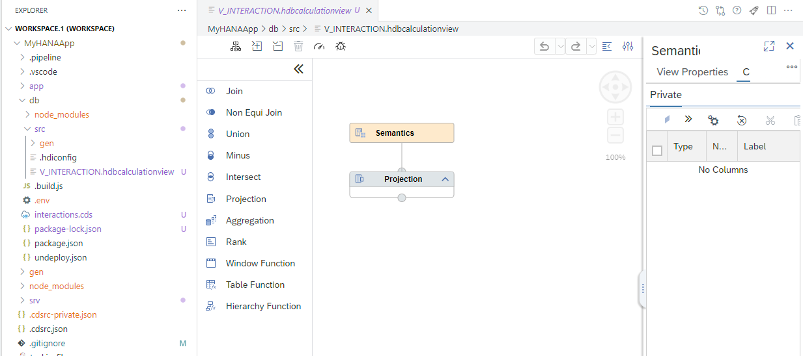

[DONE]
[ACCORDION-END]

[ACCORDION-BEGIN [Step 2: ](Model the join relationship)]

1. Drop a `join` node into the modeling space

    !

2. Use the  sign to add tables to the node.

    !

3. Type in `HEADER` and then select the table you created earlier via CDS called `APP_INTERACTIONS_INTERACTIONS_HEADER` and press **Finish**.

    !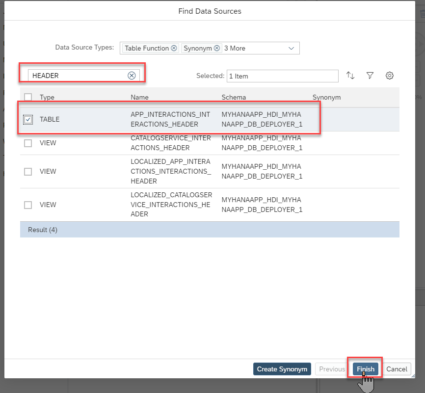

4.  Repeat the process to add the `APP_INTERACTIONS_INTERACTIONS_ITEMS` table to the same join node.  You should see both artifacts in the join node.

    !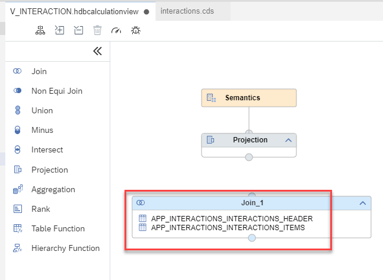

5. Double-click on the join node. A panel will open on the right.

    !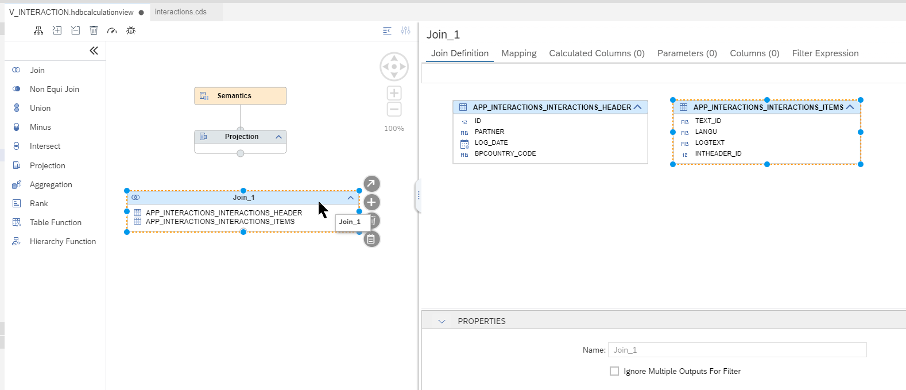

6. Drag and drop the `ID` field to the `INTHEADER_ID` field.  

    !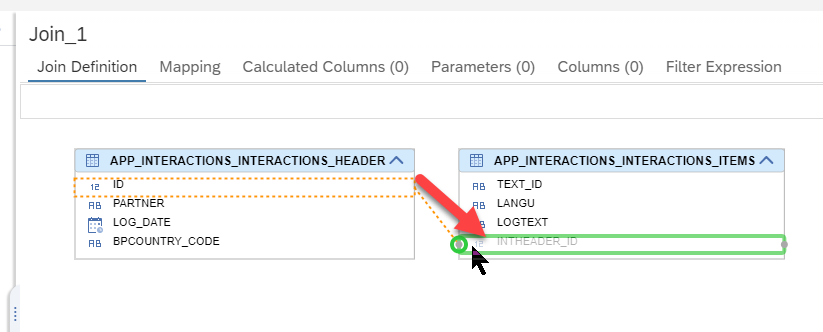

7. Set the cardinality to `1..n`

    !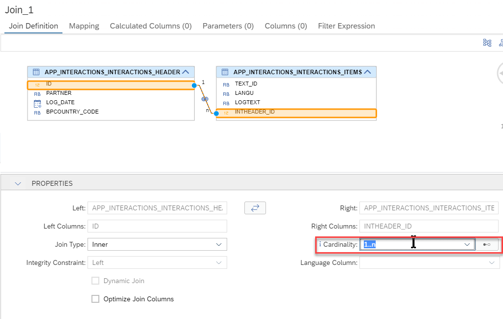

8. In the **Mapping** tab, add all the columns except `INTHEADER_ID` as output columns.

    !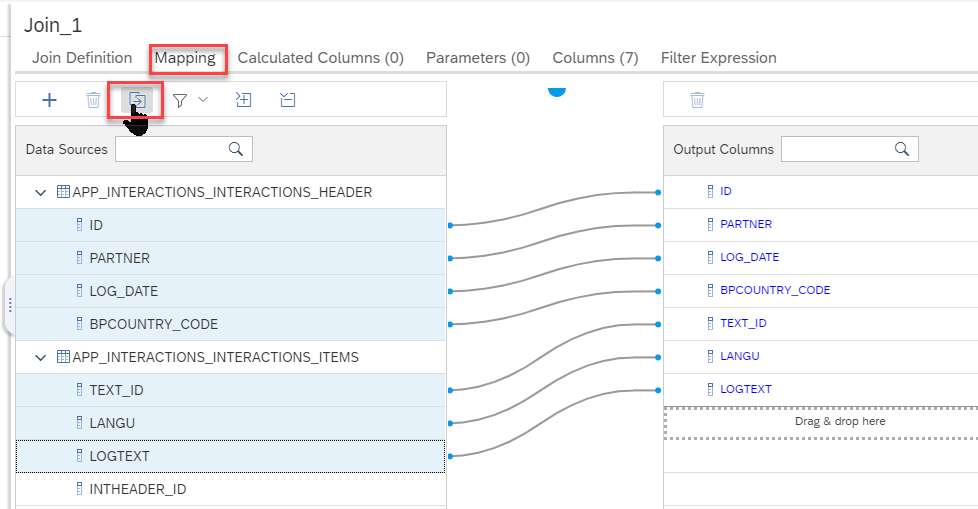

9. Connect the join node with the Projection node using the 

    !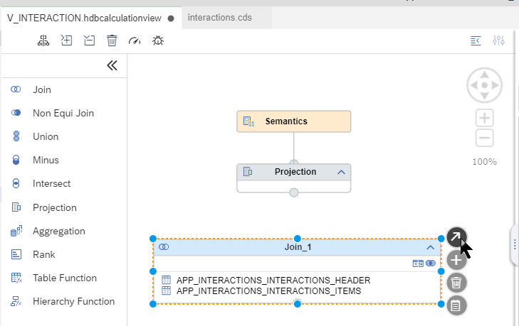

    !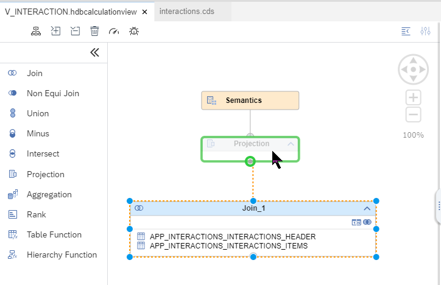

10.  Click on the **Projection** node and double-click on the join parent to add all the columns to the output

    !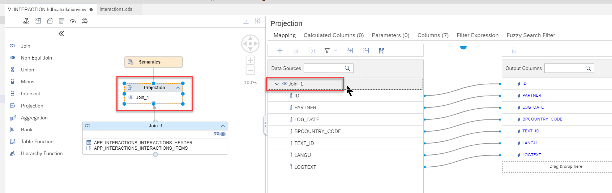

11.  Save your View

12.  From the SAP HANA Projects view, press the Deploy button

    !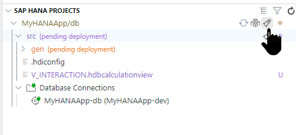

13. Check the deployment log to make sure everything was successfully created in the database.

    !

14. Open the HDI Container in the Database Explorer

     !

15. Under **Column Views** you will find your Calculation View.  Choose **Open Data**

    !

16. Go to the **Raw Data** and you should see the header and item data joined together.

    !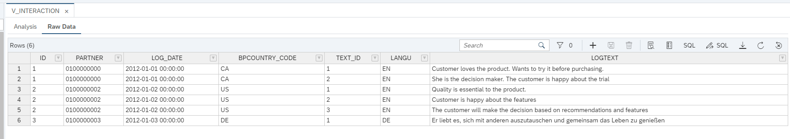             

[DONE]
[ACCORDION-END]


[ACCORDION-BEGIN [Step 3: ](Create calculation view proxy entity)]

We now want to expose our Calculation View to the Cloud Application Programming model by creating a "proxy" entity for the view in the CDS data model.

1.  Return to the Business Application Studio and open `interactions.cds`.

    !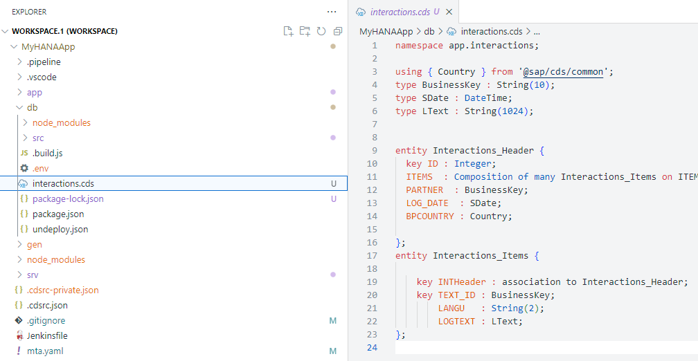

2.  We need our proxy entity to be created without the namespace in our current `interactions.cds`.  Therefore comment out the namespace line and add all the existing content except the `using ...` line in a new context for `app.interactions`.

    !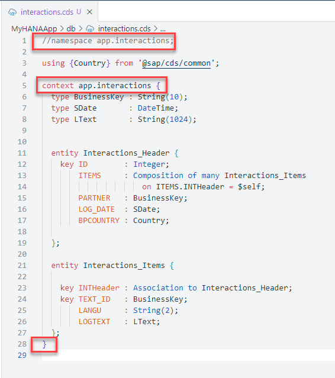

2.  We need to add a matching entity definition for the Calculation View. This means redefining all the column names and data types / lengths. Doing so manually would be error prone, but the `hana-cli` has a utility that will help.  Open a terminal and change to the `db` folder with the command `cd db`.  Now issue the command:

    ```shell
    hana-cli inspectView -v V_INTERACTION -o cds
    ```

    !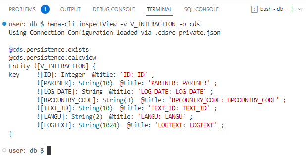

    With this command you are looking up the definition of the view but asking for the output (-o) in the CDS format.

3. Copy this block from the terminal and paste it into the `interactions.cds` file at the end outside the context block.   

    !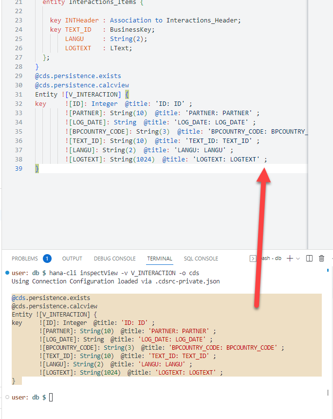

4. CDS does have an annotation called `@cds.persistence.exists`. This annotation allows you to re-define an existing DB object and CDS won't attempt to create or alter it. It will just assume it already exists in the matching state.

5. You can also add the annotation `@cds.persistence.calcview`. This will further tell the Cloud Application Programming Model that this target entity is also a Calculation View.

    !

6. Now open the `interactions_srv.cds` file from the `/srv` folder. Add this new Calculation View based entity to the CAP service as read-only.

     !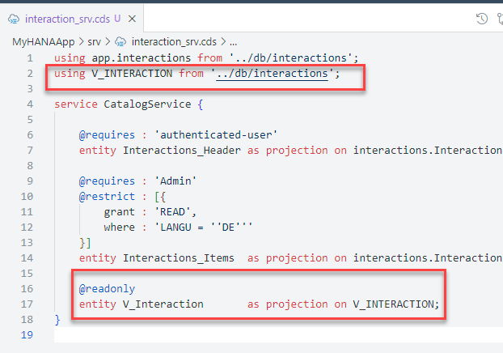

7. Save any open files.

8. From the terminal return to the root of the project and issue the command: `cds build`

    ```shell
    cds build
    ```          

    !

9. Although we didn't add any new database artifacts to the project, the addition of an entity to the service layer causes new views to be generated within SAP HANA. Therefore we need to deploy to the database using the SAP HANA Projects view before we can test.

    !

10. From the console in the project root run `npm start` to start the CAP service layer for testing.  If you have performed the tutorial [SAP HANA Cloud, Add User Authentication to Your Application](hana-cloud-cap-add-authentication), remember you must also run the application router to test your service with authentication.

11. You can test your view via the service layer by adding `/catalog/V_Interaction` to the path.

   !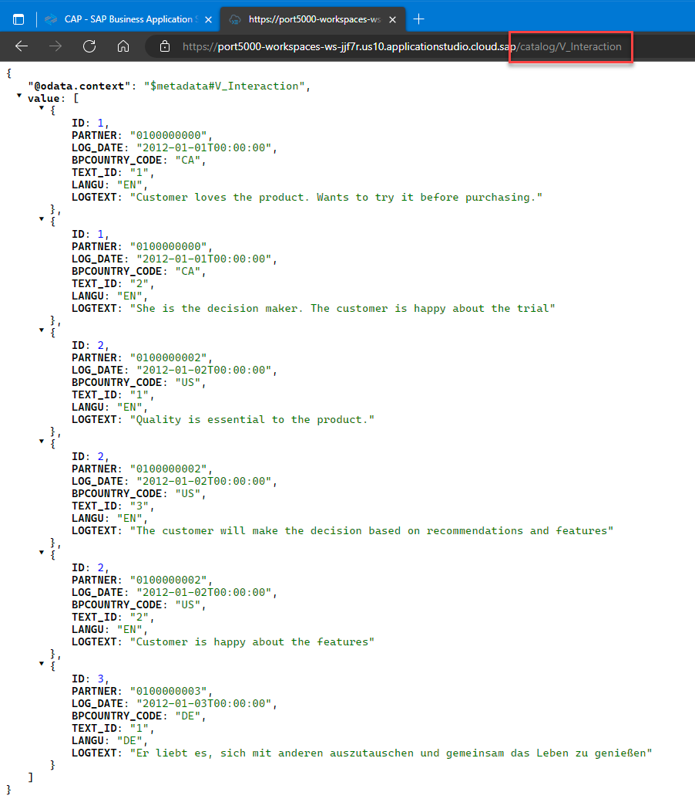

Congratulations! You have now successfully combined HANA native artifacts with the SAP Cloud Application Programming Model and learned the modern HANA way to expose Calculation Views via OData.

[DONE]
[ACCORDION-END]

---
