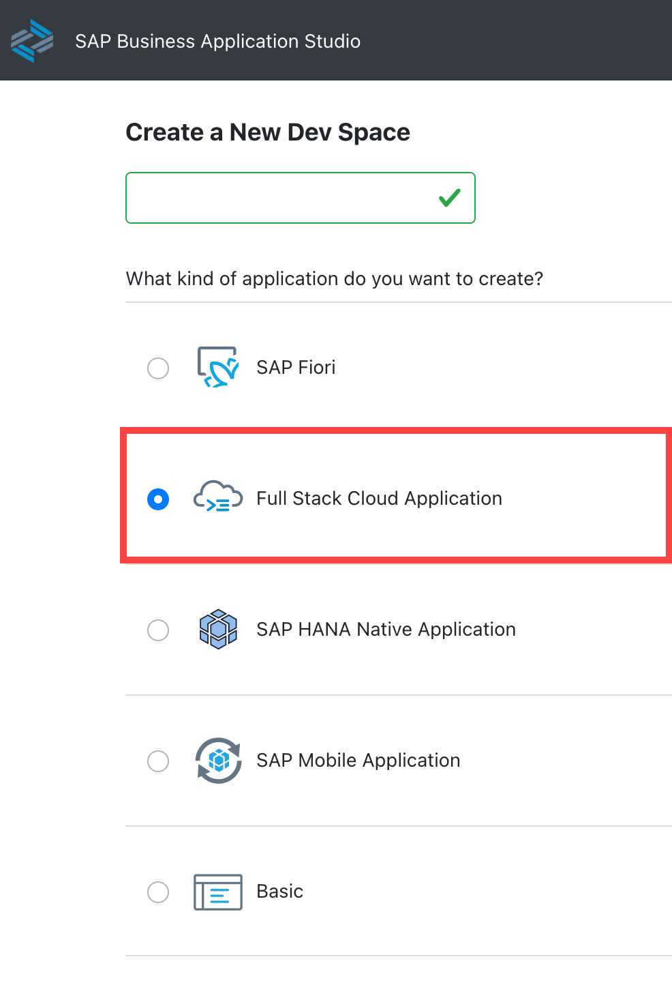
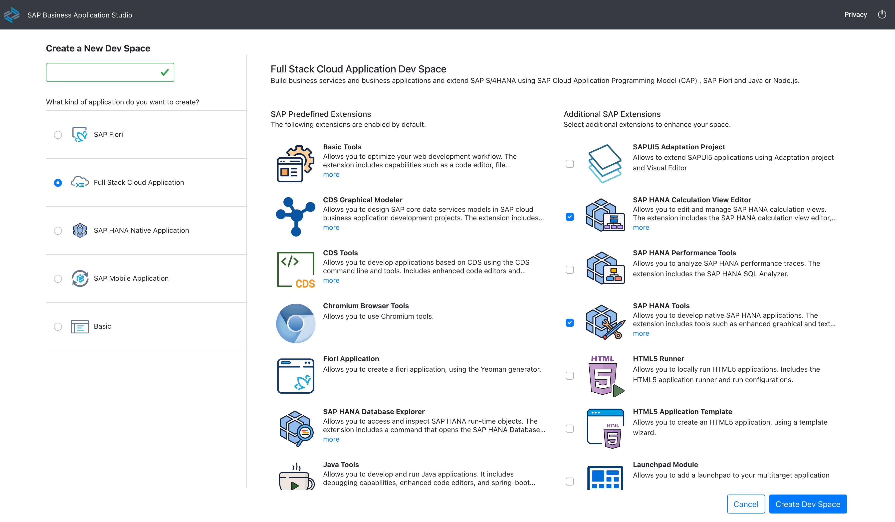
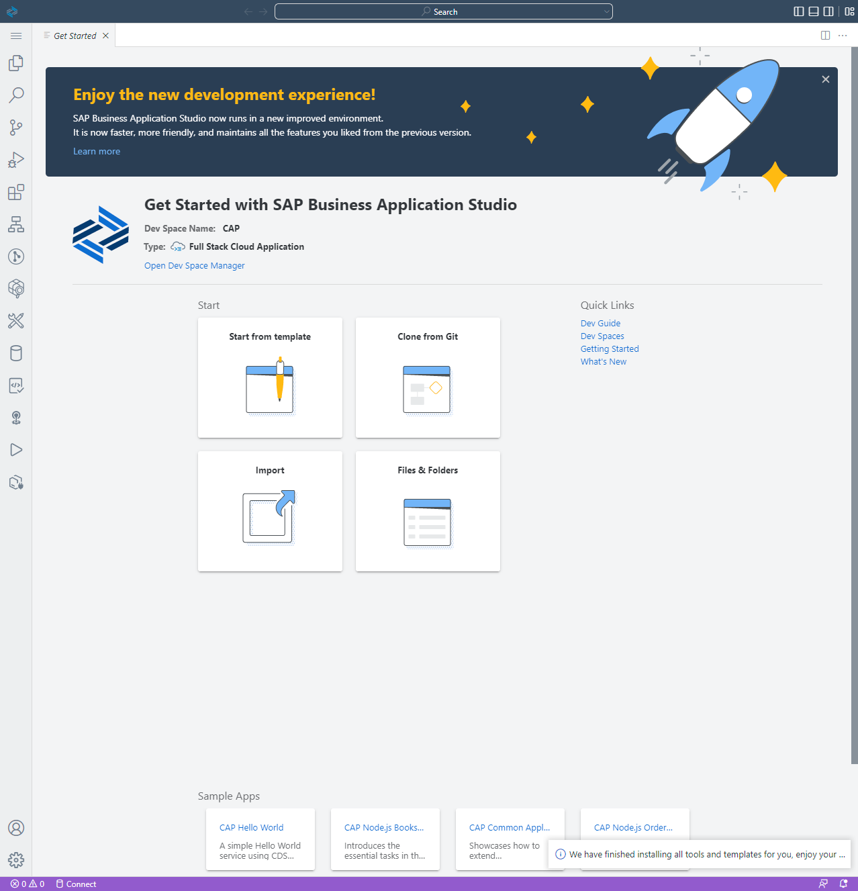
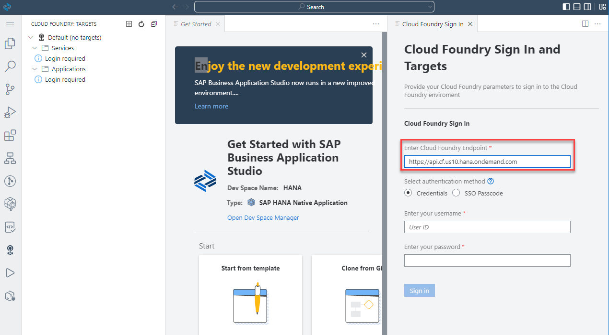
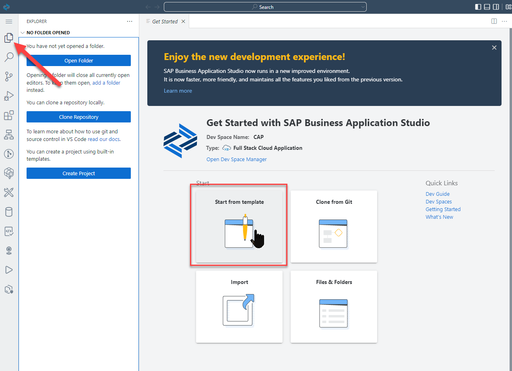
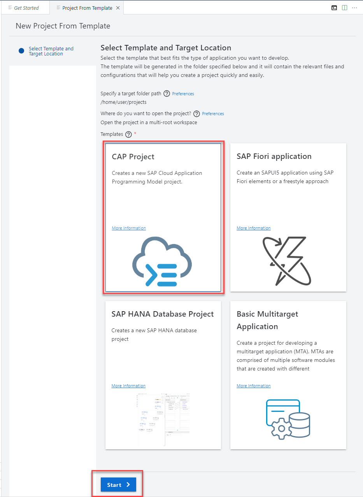
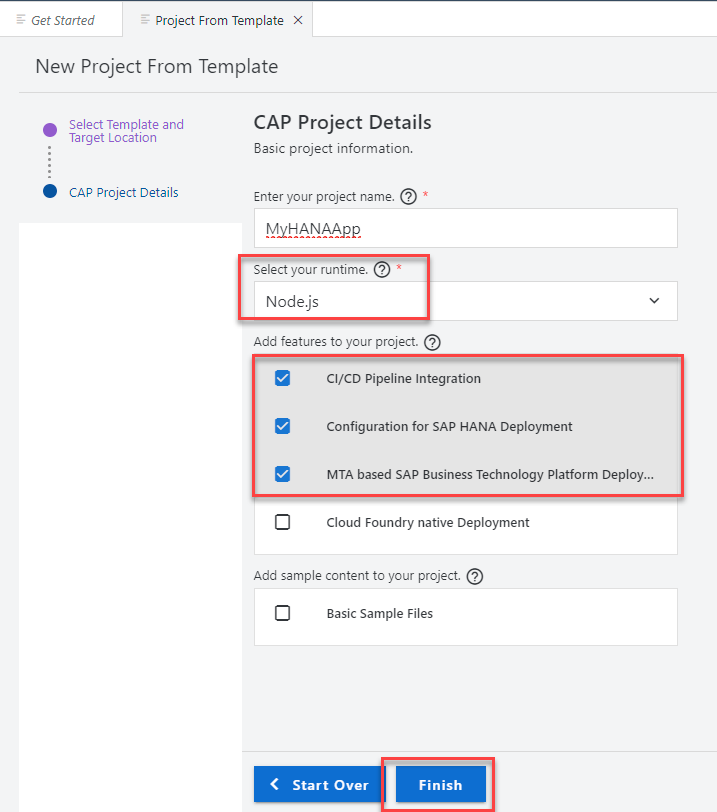
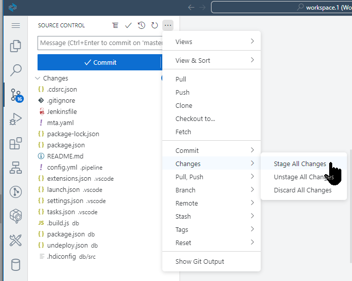

# Create an SAP Cloud Application Programming Model Project for SAP HANA Cloud

<!-- description --> Use the wizard for the SAP Cloud Application Programming Model to create a project in SAP Business Application Studio that will also support SAP HANA Cloud.

## You will learn

- How to create an application with the wizard for the [SAP Cloud Application Programming model](https://cap.cloud.sap/docs/)
- How to use the local Git repository for development/testing purposes

## Prerequisites

- This tutorial is designed for [SAP HANA Cloud](https://community.sap.com/topics/hana). It is not designed for SAP HANA on premise or SAP HANA, express edition.
- You have created a BTP, SAP HANA Cloud instance. [Deploy SAP HANA Cloud](hana-cloud-deploying)
- You have setup SAP Business Application Studio for development: [Set Up SAP Business Application Studio for Development](appstudio-onboarding)

## Video Version

Video version of tutorial:

<iframe width="560" height="315" src="https://www.youtube.com/embed/ydDOGz7P--8" frameborder="0" allow="accelerometer; autoplay; clipboard-write; encrypted-media; gyroscope; picture-in-picture" allowfullscreen></iframe>

### Create dev space in SAP Business Application Studio

Dev spaces are like isolated virtual machines in the cloud that can be quickly spun-up. Each dev space type contains tailored tools and pre-installed run-times for a target scenario such as SAP Fiori or mobile development. This simplifies and saves time in setting up the development environment as there's no need to install anything or upgrade; letting developers focus on their business domain, anytime, anywhere.

In this step we will create a new Dev Space configured for SAP Cloud Application Programming Model (CAP) development. If you already have a dev space configured for CAP and HANA development, you can skip this step as each dev space can hold multiple projects.

1. Go to your SAP Business Technology Platform subaccount and click the **Services -> Instances and Subscriptions** option.

    

1. Locate the **SAP Business Application Studio** entry and click **Go to Application**

    

1. Choose **Create Dev Space**. Please NOTE: In the SAP BTP trial and free tier you are limited to only two Dev Spaces and only one can be active at a time. If you have performed other tutorials, you might already have reached your maximum. In that case you might have to delete one of the other dev spaces in order to continue with this tutorial.

    

1. Enter any name you wish for your dev space name and choose **Full Stack Cloud Application** as the kind of application you are creating.

    

1. The Dev space will automatically be configured with the most common tools you need for the type of application you choose. However you can also choose additional, optional extensions. Since you want to combine CAP and HANA artifacts in the same project, we would ask that you also choose **SAP HANA Calculation View Editor** and **SAP HANA Tools at minimum**.

    

1. Once all selections are completed, press **Create Dev Space**

    

1. The Dev Space will then begin starting and the process will take a minute or so as your cloud environment is being created

    

1. Once the Dev Space reaches the green status of **RUNNING**, you can click on the name of the Dev Space and it will load into the editor within your browser

    

1. You'll be redirected to your newly created SAP Business Application Studio Dev Space. We recommend you bookmark this URL so it's easier for you to access this dev space of your SAP Business Application Studio in the future

    

### Configure dev space

Before we create our SAP HANA project, we want to do a few more one-time configuration steps to prepare the Dev Space

1. In the left side of the Business Application Studio click on the Cloud Foundry targets icon

    

1. Now in the Cloud Foundry Targets window you can expand either Service or Applications and then click on the Logon icon to continue the configuration process

    

1. The Cloud Foundry Sign In and Targets window will then open in a side panel of the SAP Business Application Studio. The first input will prompt you for the API endpoint and your credentials

    

1. The default value proposed is not necessarily the correct value, please confirm. The value can be found in the SAP BTP cockpit at the Subaccount level

    

1. Once you have verified the API endpoint, input the email address you used to create your SAP BTP account and password and press Sign In.

    

1. If successful, the next input will ask you for your Organization. In most situations you will have a single choice. But like the API endpoint earlier, if you need to confirm the correct value it will be displayed in the top navigation of the SAP BTP cockpit

    

1. The final input will ask you for your Space. Press **Apply**.
    

1. Upon completion of all the inputs, you should see that the Organization and Space have been set and you will see any service instances or application instances from the target space. It's normal to see less options in this tree display than the screenshot depending upon how much other development you might have already done in your BTP account.

    

### Create a new project

1. Return to the **Explorer** view. From the SAP Business Application Studio Welcome tab, click **New Project from Template**.

    

1. Choose **CAP Project** and click Start

    

1. Use the following name for your project and click **Next**

    ```Name
    MyHANAApp
    ```

    > **This name will be used in different steps**. It is recommended that you do not change it unless you remember to replace it in future tasks.

    

    Choose `Node.js` as the runtime. Select `SAP HANA Cloud` and `SAP Application Router` from the productive runtime capabilities for your application section. Choose `Cloud Foundry:MTA Deployment` and `CI/CD Pipeline Integration` under which way to deploy your project.  Press **Finish**

    

1. The new project should be added to your workspace automatically.

### Explore the generated artifacts

1. The wizard has generated a Multi-target Application with two modules: a database module and a service module. Expand them to familiarize yourself with the basic folder structure.

    

1. The wizard has also populated the `mta.yaml` configuration file with the necessary dependencies and parameters for each module. Open it in the code editor by right mouse clicking on it and using the **Open With** menu option to explore it.

    

    This file is the deployment descriptor and it is the glue that keeps all the micro-services together as a single application throughout its lifecycle. It declares the modules (applications or micro-services) and their dependencies with other micro-services or backing services. You can also use this file to inject variables into the environment variable `VCAP_SERVICES` of your application.

    > This file is very sensitive to indentation and does not allow for tabs.

### Install dependencies

We are using several dependent Node.js modules in our project. They are referenced in the `dependencies` section of the package.json file we were just editing. These dependencies need to be installed into your project before we can do any testing.

1. Open a new terminal

    

1. The terminal will open in the bottom right of the Business Application studio

    

1. From the terminal run the command `npm install`

    ```shell
    npm install
    ```

    

1. We will use an open source sample utility called hana-cli to help with development tasks.  From this same terminal window run the command ```npm install -g hana-cli``` in order to install it for later usage.

    ```shell
    npm install -g hana-cli
    ```

### Initialize local Git repository

You will use the local Git repository for basic version management.

1. Click on the **Source Control** icon

    

1. Click on the **Initialize Repository** icon

    

1. The Source Control panel now shows that it is being managed by Git and changes are being tracked

    

### Perform your first commit

Each time you commit to the local or remote repository, you create a version. This will allow you to revert and compare any changes.
**It is recommended that you perform commits at the end of each tutorial.**

1. Choose **Changes -> Stage All Changes** to include all the new or changed files in this commits

    

2. Add a commit message and click **Commit All (Signed Off)**:

    

> For a real project it is recommended to set a remote repository, for example GitHub. This will allow you to have a copy of your code outside the SAP Business Application Studio Dev Space.
