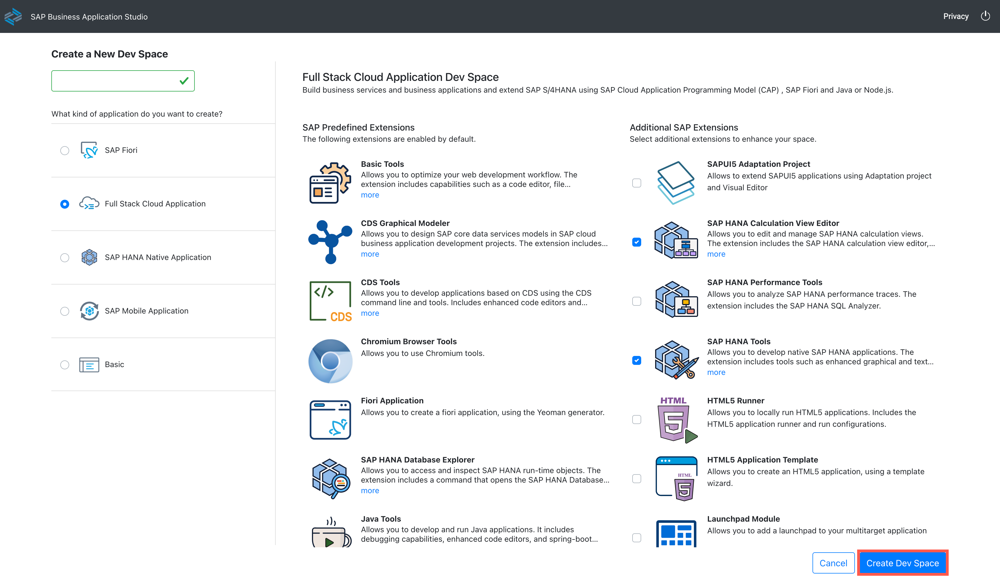
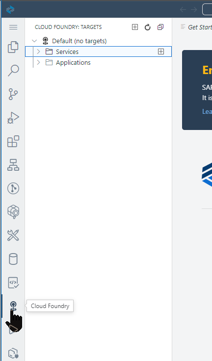
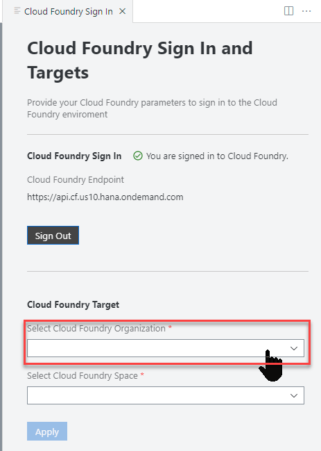
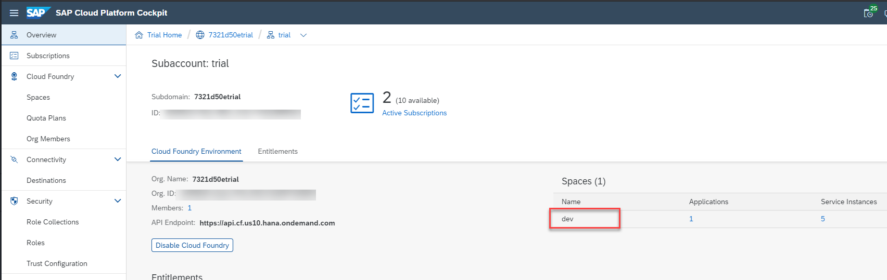
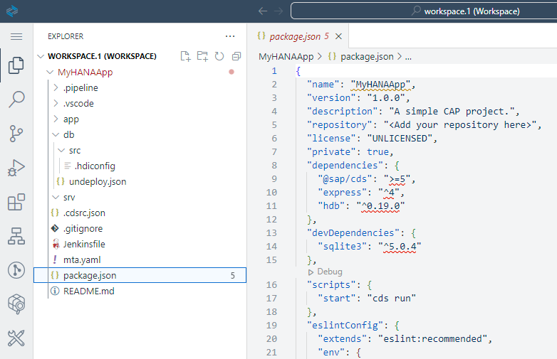
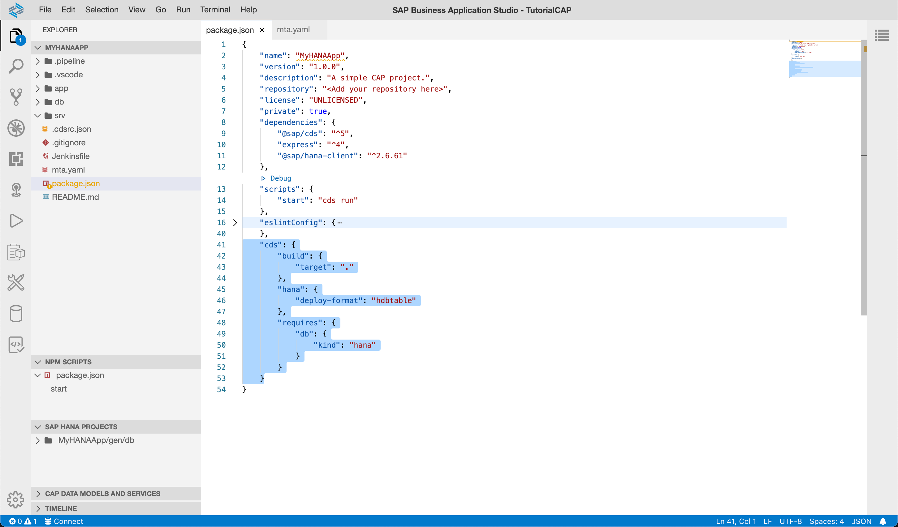
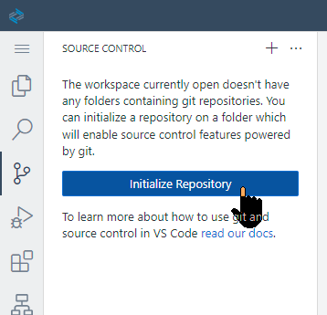
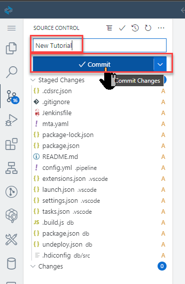

## Prerequisites
- This tutorial is designed for SAP HANA Cloud. It is not designed for SAP HANA on premise or SAP HANA, express edition.
- You have created a BTP trial, SAP HANA Cloud instance. [Deploy SAP HANA Cloud trial](hana-cloud-deploying)
- You have setup SAP Business Application Studio for development: [Set Up SAP Business Application Studio for Development](appstudio-onboarding)

## Details
### You will learn
- How to create an application with the wizard for the Cloud Application Programming model
- How to use the local Git repository for development/testing purposes

Video version of tutorial: </br>
<iframe width="560" height="315" src="https://www.youtube.com/embed/ydDOGz7P--8" frameborder="0" allow="accelerometer; autoplay; clipboard-write; encrypted-media; gyroscope; picture-in-picture" allowfullscreen></iframe>
---

[ACCORDION-BEGIN [Step 1: ](Create dev space in SAP Business Application Studio)]

Dev spaces are like isolated virtual machines in the cloud that can be quickly spun-up. Each dev space type contains tailored tools and pre-installed run-times for a target scenario such as SAP Fiori or mobile development. This simplifies and saves time in setting up the development environment as there's no need to install anything or upgrade; letting developers focus on their business domain, anytime, anywhere.

In this step we will create a new Dev Space configured for SAP Cloud Application Programming Model (CAP) development. If you already have a dev space configured for CAP and HANA development, you can skip this step as each dev space can hold multiple projects.


1. Go to your [SAP Business Technology Platform trial homepage](https://account.hanatrial.ondemand.com/trial/#/home/trial) and click the **SAP Business Application Studio** link.

    !

2. Choose **Create Dev Space**. Please **NOTE**: In the SAP BTP trial you are limited to only two Dev Spaces and only one can be active at a time. If you have performed other workshops, you might already have reached your maximum. In that case you might have to delete one of the other dev spaces in order to continue with this workshop.

    !

3. Enter any name you wish for your dev space name and choose **Full Stack Cloud Application** as the kind of application you are creating.

    !

4. The Dev space will automatically be configured with the most common tools you need for the type of application you choose. However you can also choose additional, optional extensions. Since you want to combine CAP and HANA artefacts in the same project, we would ask that you also choose SAP HANA Calculation View Editor and SAP HANA Tools at minimum.

    !

5. Once all selections are completed, press **Create Dev Space**

    !

6. The Dev Space will then begin starting and the process will take a minute or so as your cloud environment is being created

    !

7. Once the Dev Space reaches the green status of **RUNNING**, you can click on the name of the Dev Space and it will load into the editor within your browser

    !

8. You'll be redirected to your newly created SAP Business Application Studio Dev Space. We recommend you bookmark this URL so it's easier for you to access this dev space of your SAP Business Application Studio in the future

    !

[DONE]
[ACCORDION-END]

[ACCORDION-BEGIN [Step 2: ](Configure dev space)]

Before we create our SAP HANA project, we want to do a few more one-time configuration steps to prepare the Dev Space

1. In the left side of the Business Application Studio click on the Cloud Foundry targets icon

    !

2. Now in the Cloud Foundry Targets window you can expand either Service or Applications and then click on the Logon icon to continue the configuration process

    !

3. The command window will then open at the top of the SAP Business Application Studio. The first input will prompt you for the API endpoint

    !

4. The default value proposed is likely the correct value, but if you need to confirm; the value can be found in the SAP BTP cockpit at the Subaccount level

    !

5. Press **Enter** to confirm your input of the API endpoint. The next input field will ask you for the email address you used to create your SAP BTP trial account

    !

6. The next input will ask you for your SAP BTP trial account password

    !

7. The next input will ask you for your Organization. In most situations you will have a single choice. But like the API endpoint earlier, if you need to confirm the correct value it will be displayed in the top navigation of the SAP BTP cockpit

    !

8. The final input will ask you for your Space. If you choose the endpoint API and Organization correctly, then you should have a single option of **dev**

    !

9. Upon completion of all the inputs, you should see that the Organization and Space have been set and you will see any service instances or application instances from the target space.

    !

[DONE]
[ACCORDION-END]


[ACCORDION-BEGIN [Step 3: ](Create a new project)]


> The wizard that is explained in this step currently doesn't work due to a [temporary problem](https://answers.sap.com/questions/13395658/issue-in-creating-cap-project.html). Please open a new terminal and execute the following command to achieve the same result without a GUI.

> 1. Open a new terminal
>    !
> 1. Execute the following commands
>        
>        `npm i -g @sap/cds-dk`
>
>        `bash  # a bit strange, but makes sure the new cds-dk is active`
>
>        `cd projects/`
>
>        `cds init MyHANAApp --add hana,mta,pipeline`
>
> 1. Open the project in a new workspace
>    !
>    !

> 1. Proceed to step 5: Adjust CAP project for HANA development


1. From the SAP Business Application Studio Welcome tab, click **Start from template Create a new project**.

    !

2. Choose **CAP Project** and click Start    

    !

3. Use the following name for your project and click **Next**

    ```Name
    MyHANAApp
    ```

    > **This name will be used in different steps**. It is recommended that you do not change it unless you remember to replace it in future tasks.    

    !

    Choose `Node.js` as the runtime. Select `CI/CD Pipeline Integration`, `Configuration for SAP HANA Deployment`, and `MTA based SAP Cloud Platform Deployment` as the additional features for your project.  Press **Finish**

    !

4. Choose to open the project in a new workspace once the generation is complete.

    !


[DONE]
[ACCORDION-END]

[ACCORDION-BEGIN [Step 4: ](Explore the generated artifacts)]

1. The wizard has generated a Multi-target Application with two modules: a database module and a service module. Expand them to familiarize yourself with the basic folder structure.

    !

2. The wizard has also populated the `mta.yaml` configuration file with the necessary dependencies and parameters for each module. Open it in the code editor to explore it.

    !

    This file is the deployment descriptor and it is the glue that keeps all the micro-services together as a single application throughout its lifecycle. It declares the modules (applications or micro-services) and their dependencies with other micro-services or backing services. You can also use this file to inject variables into the environment variable `VCAP_SERVICES` of your application.

    > This file is very sensitive to indentation and does not allow for tabs.


[DONE]
[ACCORDION-END]

[ACCORDION-BEGIN [Step 5: ](Adjust CAP project for HANA development)]

The Cloud Application Programming Model wizard generates a project that supports HANA development but is not fully configured to target HANA during the development phase. In this step we will adjust the generated project to fully compatible to also contain HANA native artifacts as well.

1. From the `mta.yaml` file we were just looking at the in the previous step, edit the path of the service module from `gen/srv` to just `srv`

    !

2. Make a similar change to the database module, adjusting the path from `gen/db` to just `db`

    !

3. Save these changes

4. In the root of the project there is another important configuration file - the package.json. We are going to need to make several changes to this file as well.

    !

    > No need to worry about the yellow underlining below the name of the package. This is just a hint and doesn't have any impact on the tutorial.

5. You can completely delete the `devDependencies` section of the `package.json`

6. The rest of the changes will be in the `cds` section of the file. Replace this entire section of `package.json` with the following content

    ```json
    "cds": {
        "build": {
           "target": "."
        },
        "hana": {
            "deploy-format": "hdbtable"
        },
        "requires": {
            "db": {
                "kind": "hana"
            }
        }
    }
    ```

    > These changes will alter the generated folder structure of the cds build operation. Content will no longer be placed into the gen folder but back into the source folders. This also will tell CAP to generate hdbtable artifacts instead of hdbcds. This is a critical change for SAP HANA Cloud compatibility. Finally the db.kind change to HANA tells CAP to use HANA at development time instead of SQLite.

7. Your `package.json` file should now look something like this. The exact version numbers in the `dependencies` section in your file might differ from this screenshot

    !

8. Save the file

[DONE]
[ACCORDION-END]

[ACCORDION-BEGIN [Step 6: ](Install dependencies)]

We are using several dependent Node.js modules in our project. They are referenced in the `dependencies` section of the package.json file we were just editing. These dependencies need to be installed into your project before we can do any testing.

1.  Open a new terminal

    !

2. The terminal will open in the bottom right of the Business Application studio

    !

3. From the terminal run the command `npm install`

    ```shell
    npm install
    ```

    !

4. For one last change we need to adjust the content generated by the wizard for the **db** folder. The CAP wizard expects that you will use the `cds deploy` command to send content into HANA. However to use the HANA Projects view to deploy to HANA we need some additional files in the **db** folder. Mainly we need a package.json file that will run the `@sap-hdi-deploy` module. Rather than create this file manually, we will use an open source sample utility called hana-cli.  From this same terminal window run the command ```npm install -g hana-cli```

    ```shell
    npm install -g hana-cli
    ```

5. After installation run the command ```hana-cli createModule```

    ```shell
    hana-cli createModule
    ```

[DONE]
[ACCORDION-END]

[ACCORDION-BEGIN [Step 7: ](Initialize local Git repository)]

You will use the local Git repository for basic version management.

2. Click on the **Source Control** icon

    !

3. Click on the **Initialize Repository** icon

    !

4. The Source Control panel now shows that it is being managed by Git and changes are being tracked

    !        

[DONE]
[ACCORDION-END]

[ACCORDION-BEGIN [Step 8: ](Perform your first commit)]

Each time you commit to the local or remote repository, you create a version. This will allow you to revert and compare any changes.
**It is recommended that you perform commits at the end of each tutorial.**

1. Choose **Changes -> Stage All Changes** to include all the new or changed files in this commits

    !

2. Add a commit message and click **Commit All (Signed Off)**:

    !

> It is recommended to set a remote repository in, for example, GitHub. This will allow you to have a copy of your code outside the SAP Business Application Studio Dev Space.

[DONE]
[ACCORDION-END]


---
