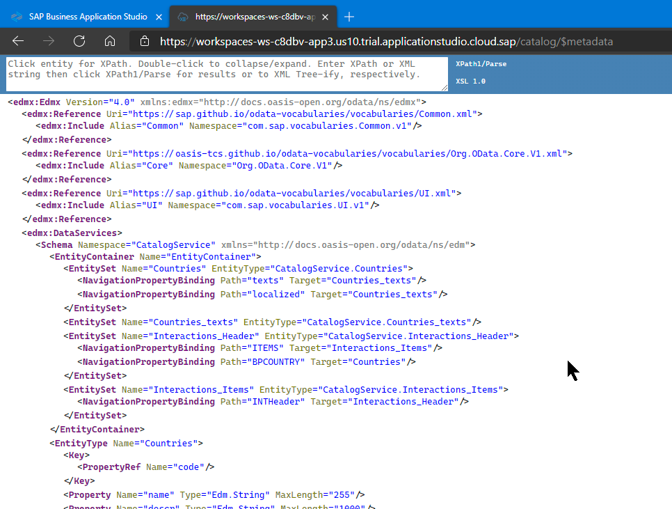
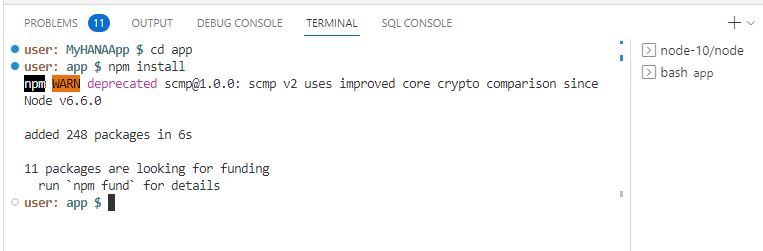
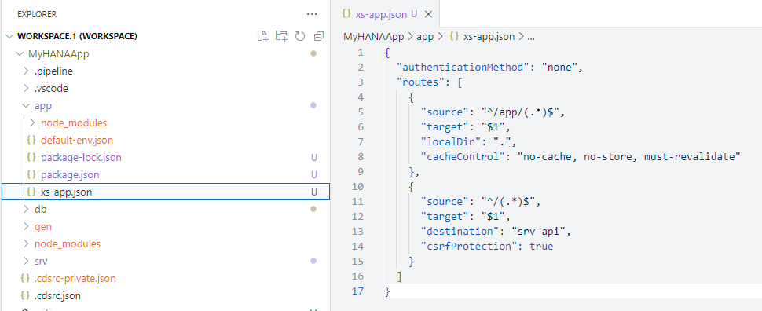
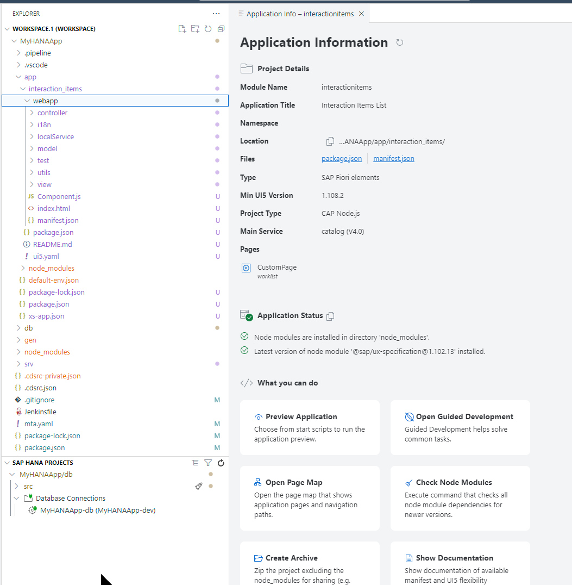
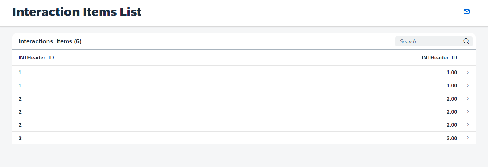

# Create a User Interface with CAP (SAP HANA Cloud)

<!-- description --> Use services based on SAP Cloud Application Programming Model Node.js and use an SAP Fiori wizard to create a user interface.

## You will learn

- How to create an SAP Fiori freestyle web interface
- How to configure the `approuter`

## Prerequisites

- This tutorial is designed for SAP HANA Cloud. It is not designed for SAP HANA on premise or SAP HANA, express edition.
- You have created database artifacts and loaded data as explained in [the previous tutorial](hana-cloud-cap-create-database-cds).

## Video Version

Video tutorial version:

<iframe width="560" height="315" src="https://www.youtube.com/embed/WMDpKa1QkFE" frameborder="0" allow="accelerometer; autoplay; clipboard-write; encrypted-media; gyroscope; picture-in-picture" allowfullscreen></iframe>

### Run the services

1. From the previous tutorial we have a `.env` file in the `/db` folder. This file contains the connection details to the SAP HANA Cloud instance and it was created when we performed the **bind** operation from the SAP HANA Projects view.

    

1. We can use this same configuration information from Cloud Foundry to start the CAP service layer and connect it to SAP HANA as well. Use the command `cds bind -2 MyHANAApp-dev:SharedDevKey` to tell CAP to bind to this same HANA Cloud HDI service instance that we bound to earlier in the SAP HANA Projects view.

    

1. Run the command `npm install` to install any Node.js dependent modules needed by the Cloud Application Programming Model.

    

1. Our project is setup for real XSUAA security and we will use that later in this tutorial.  But for now we want to test without configuration of the necessary authentication and authorization setup. To do so, open the package.json file in the root of your project. Change the `cds.requires.auth` property from `xsuaa` to `mocked` so we can test with mock authentication.

    

1. Now issue the command `cds watch --profile hybrid`. This will start the CAP service locally and use the binding configuration to connect to our remote HANA database instance. Once started you will see a dialog with a button that says **Open in New Tab**. Press this button to test the CAP service in a new browser tab.

    

    If you accidentally close this dialog, you can always open the running services via **View > Command Pallette** and then choosing **Ports: Preview** and choosing the running service from the list

1. You should see the list of entities you exposed.

    

1. You can click on the entities to see the values in a JSON format being served from the SAP HANA Cloud database.

    

### Test the services

1. Choose the `$metadata` option from the Welcome page and you can see a technical description of the service

    

1. You can use different methods in the OData v4 services you have created. Go back to the welcome page for the service and click `Interactions_Items`. Different versions of the Cloud Application Programming Model preview page do different things at this point. Some add a $top limit to the generated URL for `Interactions_Items` automatically. Other and perhaps newer versions do not.  Have a look at the end of the URL when it opens. If it ends in `?$top=11` then add the following to the URL:

    ```URL
    &$search=DE
    ```

    Otherwise add the following to the URL:

    ```URL
    ?$search=DE
    ```

    

1. You can find out more about OData V4 at the [OData organization](https://www.odata.org/documentation/) and the [documentation for SAPUI5](https://ui5.sap.com/#/topic/5de13cf4dd1f4a3480f7e2eaaee3f5b8).

### Configure routing

You will use an [Application Router](https://www.npmjs.com/package/@sap/approuter) module. This was generated into a project using the initial wizard. This module is very important as it will become the entry point for your application. Every request coming to this module will be routed into the different backend services.

1. You should see a folder named `app` in the root of your project.

    

1. Since the web module will be receiving the requests and routing them into the proper processing backend services, such as the OData service you have just tested, it will also be responsible for enforcing authentication.

    These routing logic is done by an application called `approuter`. You can see the Node.js module being called as the starting script for the web module as defined in the file `package.json`.

    

1. We need to install the approuter dependency now as well.  From the terminal change to the `app` folder and issue the command `npm install`

    

1. The `approuter` will scan the file `xs-app.json` to route patterns in the request to the right destinations. The xs-app.json that was generated by the wizard is ready to use real security settings, but our project isn't that far along yet.  Therefore, let's change the configuration to temporarily disable the security checks.

    Replace the content of `xs-app.json` with the following content

    ```json
    {
    "authenticationMethod": "none",
    "routes": [
        {
        "source": "^/app/(.*)$",
        "target": "$1",
        "localDir": ".",
        "cacheControl": "no-cache, no-store, must-revalidate"
        },
        {
        "source": "^/(.*)$",
        "target": "$1",
        "destination": "srv-api",
        "csrfProtection": true
        }
    ]
    }
    ```

    

1. Among other information, this configuration is declaring that requests containing the pattern `^/(.*)$` are routed to a destination called `srv-api`. This destination was defined by the wizard in the `mta.yaml` file and points the service layer of our CAP application.

### Create a Fiori freestyle web interface

We want to create a Fiori freestyle UI for our CAP service.  We will use the wizards to generate most of the UI.

1. From the top menu select **View -> Command Pallette**. Then type `fiori` into the search box. Select **Fiori Open Application Generator**.

    

1. Choose **SAP Fiori** as the template type, select **Worklist Page** as the template and press **Next**

    

1. At the Data Source and Service Selection screen, choose **Use a Local CAP Project**. Select your project as the **Choose your CAP project**. Select `CatalogService (Node.js)` as your OData service. Press **Next**

    

1. Choose `Interactions_Header` as the main entity, `ITEMS` for the Navigation entity, leave the `YES` value for the "Automatically add table columns to the list page and a section to the object page if none already exists?" option and press **Next**

    

1. In the Project Attributes screen, match to the values shown in the following screenshot and press **Finish**

    

1. The new project structure and content should look like This

    

1. From the terminal you should still have your `cds watch --profile hybrid` still running (if not restart it). This command watches for changes so your application is already to test with the new UI. Open the browser tab where you were testing it previously.

1. The CAP test page now has a link to the newly generated application.

    

1. Clicking that link will launch the generated Fiori free style UI for the CAP service.

    

1. If you wish you can open another terminal instance and change to the Application Router folder (`cd app`).  Then run the command `npm start`.  This will run the Application Router which you can test from it's own port (5000). Nothing will really look different at this point, but you are passing all requests through the Application Router now. This will become important once we add security to our service and want to test it locally using the Application Router.

Congratulations! You have created your first, full application.

Now it is a good time to commit your application into the local or remote Git.
