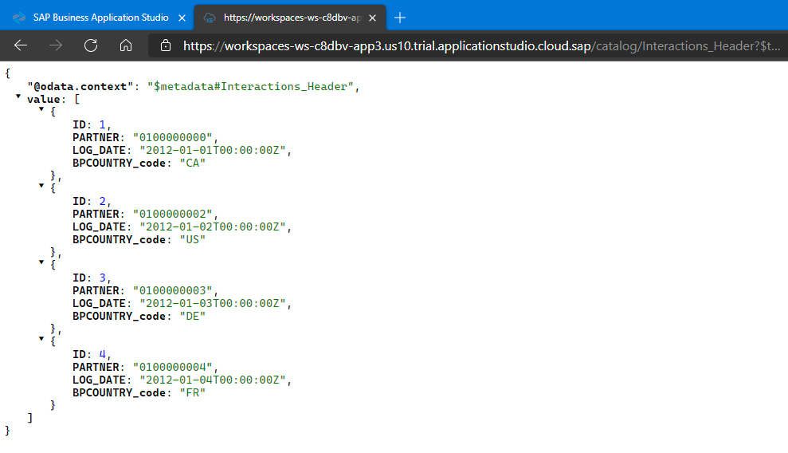
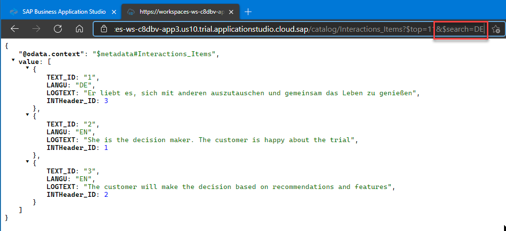
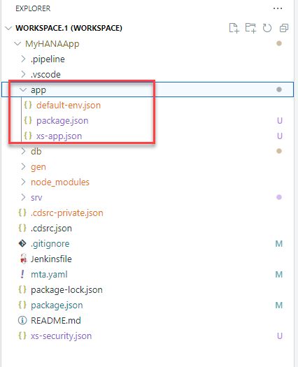
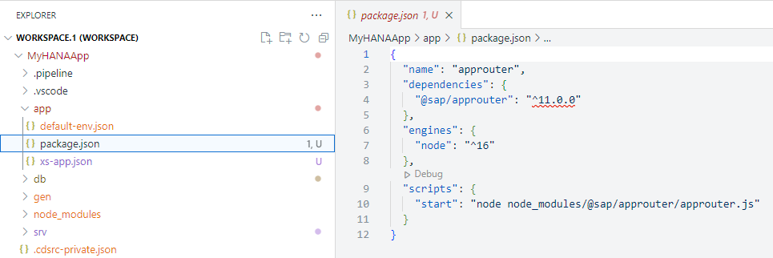
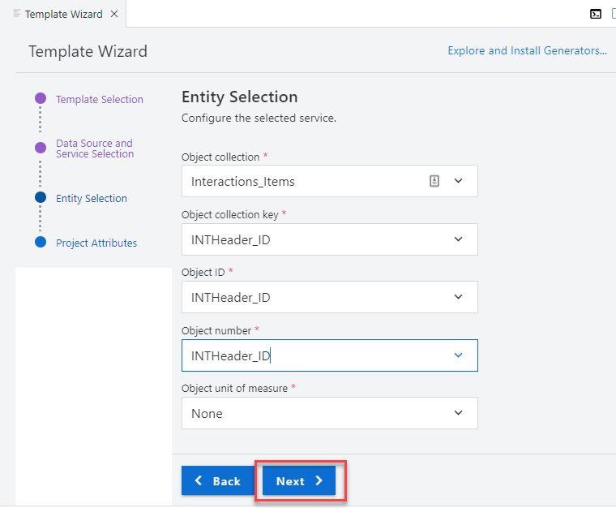
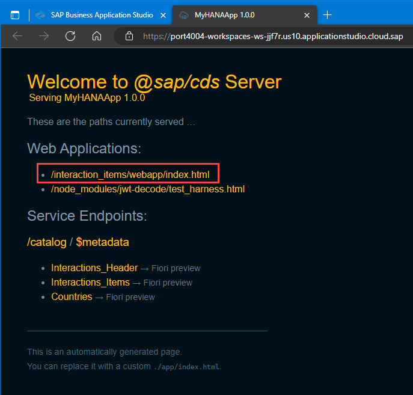

## Prerequisites
 - This tutorial is designed for SAP HANA Cloud. It is not designed for SAP HANA on premise or SAP HANA, express edition.
 - You have created database artifacts and loaded data as explained in [the previous tutorial](hana-cloud-cap-create-database-cds).


## Details
### You will learn
 - How to create an SAP Fiori freestyle web interface
 - How to configure the `approuter`

Video tutorial version: </br>

<iframe width="560" height="315" src="https://www.youtube.com/embed/WMDpKa1QkFE" frameborder="0" allow="accelerometer; autoplay; clipboard-write; encrypted-media; gyroscope; picture-in-picture" allowfullscreen></iframe>
---

[ACCORDION-BEGIN [Step 1: ](Run the services)]

1. From the previous tutorial we have a `.env` file in the `/db` folder. This file contains the connection details to the SAP HANA Cloud instance and it was created when we performed the **bind** operation from the SAP HANA Projects view.

    !

2. We can use this same configuration information to start the CAP service layer and connect it to SAP HANA as well. But this will require copying the file contents to a slightly different format and changing the file name to `default-env.json`.  We can do this using the `hana-cli` developer utility. Open a Terminal window and change to the `/db` folder.

    !

3. Issue the command `hana-cli copy2DefaultEnv`. This will create the file named `default-env.json` which already contains the connection information to your HANA database.

    !

4. Move the `default-env.json` file from the `/db` folder to the root folder of your project.

    !

5. You can return to the terminal window and change back to the root `cd ..`.  Run the command `npm install` to install any Node.js dependent modules needed by the Cloud Application Programming Model.

    !

6. Now issue the command `npm start`. This will start the CAP service. Once started you will see a dialog with a button that says **Open in New Tab**. Press this button to test the CAP service in a new browser tab.

    !

    If you accidentally close this dialog, you can always open the running services via **View > Find Command** and then choosing **Ports: Preview** and choosing the running service from the list

7. You should see the list of entities you exposed.

    !

8. You can click on the entities to see the values in a JSON format being served from the SAP HANA Cloud database.    

    !                 

[DONE]
[ACCORDION-END]

[ACCORDION-BEGIN [Step 2: ](Test the services)]

1. Choose the `$metadata` option from the Welcome page and you can see a technical description of the service

    !

2. You can use different methods in the OData v4 services you have created. Go back to the welcome page for the service and click `Interactions_Items`. Add the following to the URL:

    ```URL
    &$search=DE
    ```

    !

3. You can find out more about OData V4 at the [OData organization](https://www.odata.org/documentation/) and the [documentation for SAPUI5](https://sapui5.hana.ondemand.com/#/topic/5de13cf4dd1f4a3480f7e2eaaee3f5b8).    

[DONE]
[ACCORDION-END]


[ACCORDION-BEGIN [Step 3: ](Configure routing)]

You will now create an application router module. This module is very important as it will become the entry point for your application. Every request coming to this module will be routed into the different backend services.

1. Right-click on the mta.yaml file within your project and choose **Create MTA Module from Template**.

    !

2. This will start a wizard to add the module to your project. Choose the Module Template type of **Approuter Configuration** and then press **Start**.

    !

3. Choose the application runtime type of **Standalone Approuter**. Choose to add authentication and that you plan to add a UI. Press **Next**.

    !        

4. This will complete the wizard and generate a folder named `myhanaapp-approuter` in the root of your project.

    !

5. But to better test this content within CAP at design time we want to rename this folder to **app**, but we already have an **app** folder.  Therefore delete this existing **app** folder and then rename `myhanaapp-approuter` to **app**

    !

6. We need to make the same change in the mta.yaml file since it keeps track of all the module and folder names in your project. Open the mta.yaml file for editing and perform a find and replace for the value `myhanaapp-approuter` and change it **app**.

    !

7. Since the web module will be receiving the requests and routing them into the proper processing backend services, such as the OData service you have just tested, it will also be responsible for enforcing authentication.

    These routing logics are done by an application called `approuter`. You can see the Node.js module being called as the starting script for the web module as defined in the file `package.json`.     

    !

8. The `approuter` will scan the file `xs-app.json` to route patterns in the request to the right destinations.

    Replace the content of `xs-app.json` with the following content          

    ```json
    {
      "authenticationMethod": "none",
      "routes": [{
		      "source": "/catalog/(.*)",
		        "destination": "srv-api",
		          "csrfProtection": true
	    }]
    }
    ```

    **Save** the changes.

    !

9. Among other information, this configuration is declaring that requests containing the pattern `/catalog/(.*)` are routed to a destination called `srv-api`. This destination was defined by the wizard in the `mta.yaml` file.   

[DONE]
[ACCORDION-END]

[ACCORDION-BEGIN [Step 4: ](Edit the deployment descriptor)]

When an application is deployed, the `mta.yaml` file is used to establish the dependencies between the modules and resources. During this binding process, environment variables such as the name of the destinations are set.

1. Open the `mta.yaml` file using the dedicated MTA Editor.

    !

2. You will notice the `myHANAAPP-srv` module provides a variable called `srv-url`. This variable is taking the value of the default URL provided at runtime.

    !

3. Click on the **app** module. You will establish its dependency with the `myHANAAPP-srv` module and declare the destination. The name of the destination here needs to match the name you used in `xs-app.json` in the previous step.    

    !

4. Add a new **Requires** entry for the **app** module.

    !    

5. Choose `srv-api` under **Requires** in the dropdown.

    !

6. Enter **`destinations`** under **Group**   

    !

7. Fill in the properties with the following key-value pairs ...

    | **Key**       | **Value**           
    | ------------- |:-------------:|
    | name      | `srv-api`
    | `url`      | `~{srv-url} `     
    | `forwardAuthToken` | true      |

    ... as follows:

    !

8. **Save** the changes in the deployment descriptor file.       

9. **OPTIONAL**: If you would want to make these changes without the form based mta.yaml editor, here is also the section as it could be inserted via the text editor:

    !

> For more information and examples about the `approuter`, refer to this [section in the help](https://help.sap.com/viewer/4505d0bdaf4948449b7f7379d24d0f0d/latest/en-US/6ba89596e3a64a5480c3977d4ea7fdba.html).

[DONE]
[ACCORDION-END]

[ACCORDION-BEGIN [Step 5: ](Create a Fiori freestyle web interface)]

We want to create a Fiori freestyle UI for our CAP service.  We will use the wizards to generate most of the UI.

1. From the top menu select **View -> Find Command**. Then type `fiori` into the search box. Select **Fiori Open Application Generator**.

    !

2. Choose **SAPUI5 freestyle** as the application type, select **SAP Fiori Worklist Application** as the floor plan and press **Next**

    !

3. At the Data Source and Service Selection screen, choose **Use a Local CAP Node.js Project**. Select your project root as the **CAP project folder path**. Select `CatalogService` as your OData service. Press **Next**

    !

4. Choose `Interactions_Items` as the Object collection, `INTHeader_ID` for the remaining columns and press **Next**

    !

5. In the Project Attributes screen, match to the values shown in the following screenshot and press **Finish**

    !

6. The wizard will generate a new folder named `interaction_items` in the root of the project.  We want to drag that folder into the **app** folder.

    !

7. The new project structure and content should look like This

    !

8. From the terminal you can stop your running CAP service with `CTRL+C`. Then run the service again with `npm start` to pickup the new content we added to the project.   

9. The CAP test page now has a link to the newly generated application.

    !

10. Clicking that link will launch the generated Fiori free style UI for the CAP service.

    !                        

Congratulations! You have created your first, full application.

Now it is a good time to commit your application into the local or remote Git.

[DONE]
[ACCORDION-END]

---
