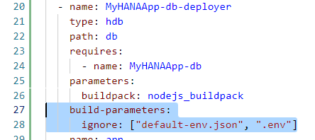
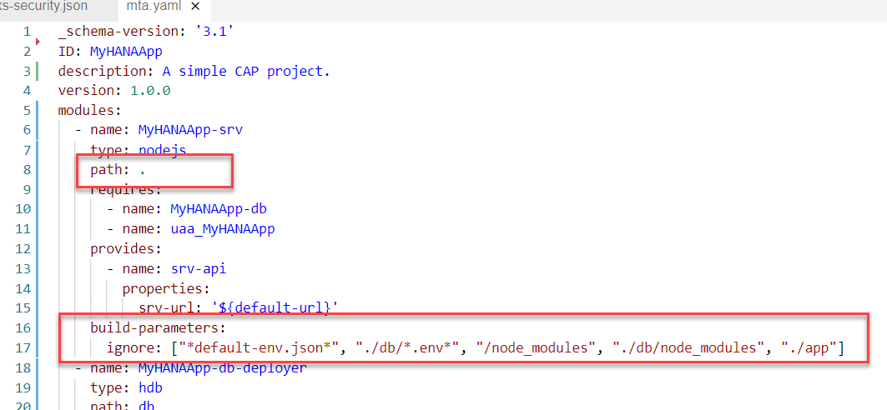
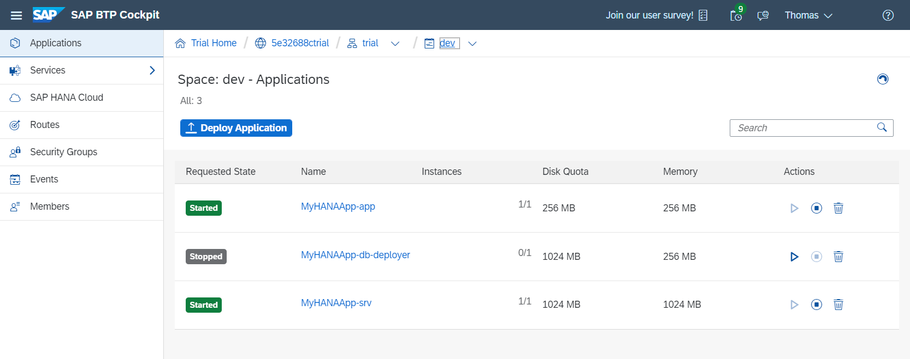
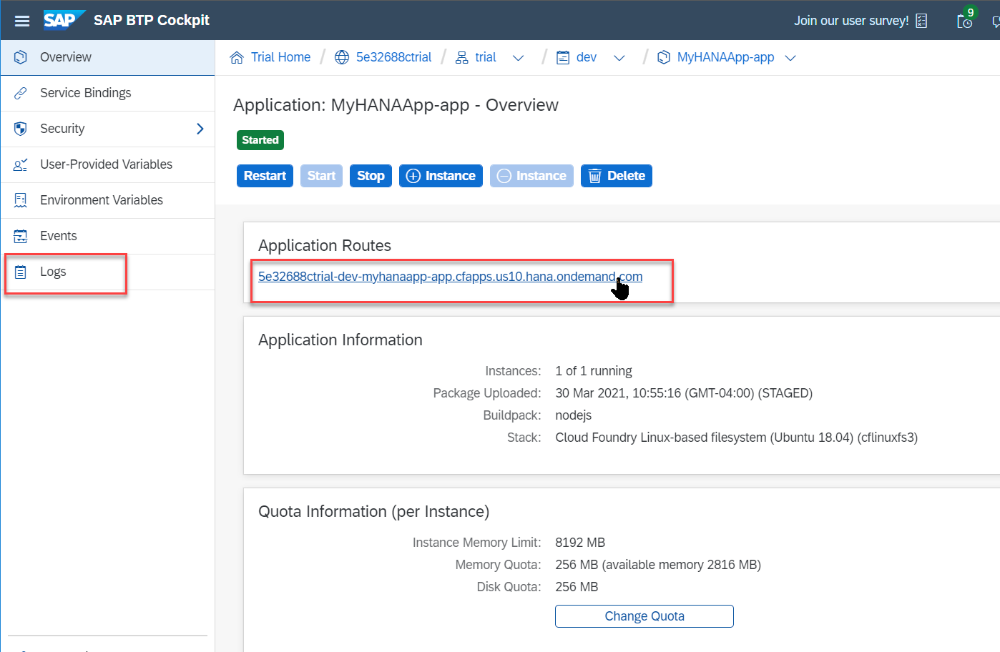

## Prerequisites
 - This tutorial is designed for SAP HANA Cloud. It is not designed for SAP HANA on premise or SAP HANA, express edition.
 - You have completed all previous tutorials in this Mission or have at least developed up to the point of [adding User Authentication to your application](hana-cloud-cap-add-authentication).


## Details
### You will learn
  - You will prepare our project for deployment via Multi Target Application to SAP BTP, Cloud Foundry runtime
  - You will use the Cloud MTA Build tool to package your project for deployment
  - You will deploy your application to SAP BTP, Cloud Foundry runtime

Note:  This is an optional tutorial as part of this mission on SAP HANA Cloud plus Cloud Application Programming Model for those that want to fully deploy like a production application. There are limited resources allocated in an SAP BTP trial account and you should consider deleting this content after deploying to avoid using up all of these resources.  

---

[ACCORDION-BEGIN [Step 1: ](Project final adjustments and preparations)]

1. In this tutorial mission we've combined several different development types (HANA, CAP, Fiori) and wizards into a single project. This has required several workarounds to the project structure to make it all work together.  Furthermore we will need a few more adjustments before we can deploy the complete application.

2. We will begin with the `xs-security.json` file. We need to make two adjustments to this file. First of all we've already deployed the UAA service instance into our target space in trial.  Therefore if you package the complete application and deploy it; when trying to deploy the UAA service instance again you will receive an error that the Application with the given name already exists.

    !

3. Only because we are going to be deploying the application into the same space where we did our initial development and testing we need to return the `xs-security.json` file in the root of the project and change the `xsappname` to a new, unique value. This will mean that later when you want to test the deployed application you will need to repeat the role collection setup and assignment steps from the [previous tutorial](hana-cloud-cap-add-authentication).  We will remind you of that later in this tutorial when you reach that point.

    !

4. While we are in the `xs-security.json file`, we want to make one other adjustment.  Remember that we added the `oauth2-configuration` section to allow authentication redirection from the SAP Business Application Studio testing. We want to remove this configuration so that we will instead get the standard UAA `oAuth` configuration.

    !

5. The `xs-security.json` file should now look like this:

    ```JSON
    {
      "xsappname": "myhanaappfinal",
      "tenant-mode": "dedicated",
      "description": "Security profile of called application",
      "scopes": [
        {
          "name": "uaa.user",
          "description": "UAA"
        }
      ],
      "role-templates": [
        {
          "name": "Token_Exchange",
          "description": "UAA",
          "scope-references": [
            "uaa.user"
          ]
        }
      ]
    }
    ```        

6. The rest of the adjustments we need to make are all in the `mta.yaml` file in the root of the project. This is the file that will control the build and deployment of the application.

7. The first adjustment we want to make is to the database module section. We added `default-env.json` and `.env` files to the project so that we could deploy and test from the SAP Business Application Studio.  However we don't want these files to be present in a "real" deployment, instead getting configuration from the bound service instances. Therefore we can tell the builder to exclude these files from this module as well as any other build content (such as the `node_modules` folder). That way we can keep these files in our project for future testing and development but ensure that they don't accidentally make it into a production deployment.

    !

8. Now move up to the `srv` module in the `mta.yaml` file.  Remember we had to restructure the generated output of the CAP project so that it would be compatible with the HANA tooling in SAP Business Application Studio. This means we no longer have a separate `/gen` folder with all the output that CAP needs at deploy and runtime.  Therefore we want to change the path for the module to point the root of the project. But this will cause this module to include too much content.  Therefore we will use the `build-parameters` on this module as well to exclude the temporary build files, the `default-env.json` (like in the `db` module), the `node_modules` folder from the `db` module (that way we get the `cds` model files not the deployer itself) and the entire `app` folder.

    !

9. The next adjustment to `mta.yaml` is rather substantial. There are different ways to deploy the UI content of our project. We could use standalone application router, managed application router, Fiori launchpad, and/or the HTML5 repository. The wizard that we've used previously setup our project to use a standalone application router but also the HTML5 repository. For your project needs you might decide on different combination of these options and you should explore the impact that each choice has on your deployment approach. However for this tutorial, we've chosen to stay with the standalone application router, but not to use the HTML5 repository. This is a choice that simplifies the setup and is good for small scale applications where you don't mind keeping the UI5 content local within the application router service itself. Therefore we can simply remove all the references and dependencies to the HTML5 Repository and UI Deployer in your `mta.yaml` file.

    !

    Note: If you wanted to keep the HTML5 repository, then some additional changes to the build parameters of the UI Deployer and to the xs-app.json of the application router would be necessary.

10. The last adjustment is a continuation of the previous step.  We need to also remove all references to the HTML Repo and UI Deployer from the resources section of the `mta.yaml` file as well.

    !

[DONE]
[ACCORDION-END]

[ACCORDION-BEGIN [Step 2: ](Use the Cloud MTA Build tool to package your project for deployment)]

1. Now that all of our project adjustments are complete, we can use the Cloud MTA Build tool to package the project for deployment.

2. Open a terminal window in SAP Business Application Studio and from the root folder of your project issue the command `mbt build`

    !

3. This will take several minutes as various build steps are performed (such as running npm install on each module) to prepare the project for deployment.  The output of this command will be a zip archive with the extension `MTAR` in a new folder of your project named `mta_archives`.

    !

4. Not required as part of the deploy process, but it might be interesting to see what is inside this `MTAR` file. You can download the file to your desktop and then open with an zip archive tool.  In the root of the zip you will find folders (with zip files inside them) for the three modules we described in your mta.yaml file.  Looking at the MTAR file in a zip utility is a good way to double check and make sure that your content is structured the way you wanted (and that your build-parameters exclusions worked) before attempting to deploy to Cloud Foundry.  

    !


[DONE]
[ACCORDION-END]


[ACCORDION-BEGIN [Step 3: ](Deploy your application to SAP BTP, Cloud Foundry runtime)]

1. Now we are ready to deploy our entire project to SAP BTP, Cloud Foundry runtime. Although you can perform the deployment from the command line using the `cf deploy` command, you can also trigger it from the SAP Business Application Studio just by right mouse click on the MTAR file and choosing **Deploy MTA Archive**.

    !

2. If you start the deploy and immediately receive this error don't be alarmed.

    !

    This just means that your login to Cloud Foundry has expired (which it does daily).  From the Business Application Studio you can click on the **Targeting CF** section in the bottom bar or from any terminal window use the `cf login` command to renew your login credentials. Then you can repeat the deployment.

3. Otherwise your deploy should continue as normal. It will take several minutes to complete.  You should see services being created from the resources section of the mta.yaml first then applications from the modules section of the mta.yaml.

    !

4. Upon successful completion of the MTAR deployment, you should be able to navigate to your space and applications in the SAP BTP Cockpit and see the three deployed applications.  It is normal that the database deployer would be in a state of stopped. A deployer is an application that only needs to run upon deployment to send it's content somewhere (SAP HANA in this case).  The application then shutdown and no longer consume resources.

    !

5. If either of other two application have bad requested state or their instances are not 1/1 then there may have been an error during deployment. If so continue to the next step where we will see how to view the Logs.

6. If you click on the name of the app, you will navigate to a detail screen for each application. From here you can access the URL for your application or view the Logs if there was some startup error.

    !

7. Before you test your deployed application, however, please remember that you will need to repeat the UAA role collection setup and assignment as we have a new application name. Please refer back to this tutorial for the necessary steps: [adding User Authentication to your application](hana-cloud-cap-add-authentication)

8. After restoring your role collection assignment, you are ready to test your deployed application. Remember to test via the Application Router as only that application will have the redirect to the Login Screen to generate the security token. But other than the different URLs everything should work the same as when we tested with authorization from the SAP Business Application Studio.

[DONE]
[ACCORDION-END]


---
