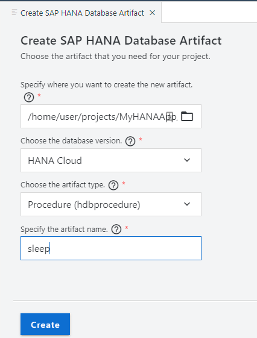
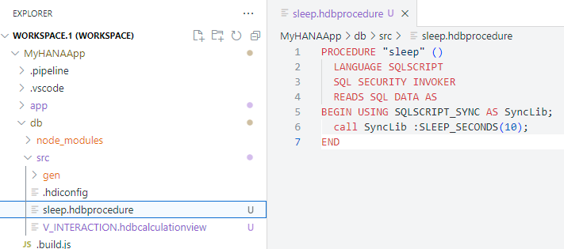
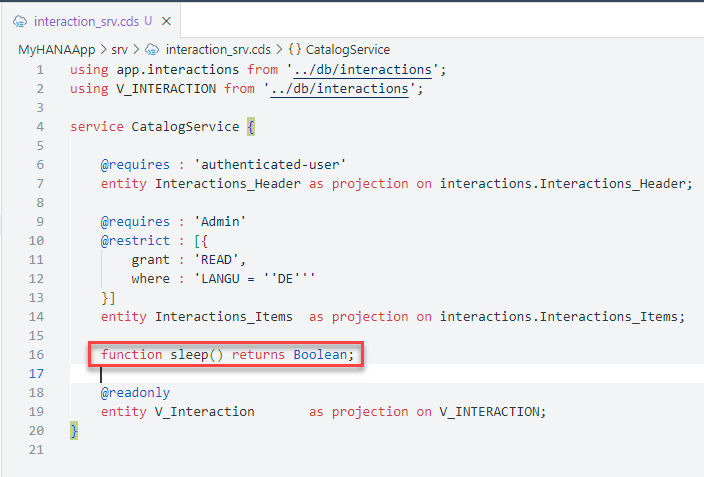
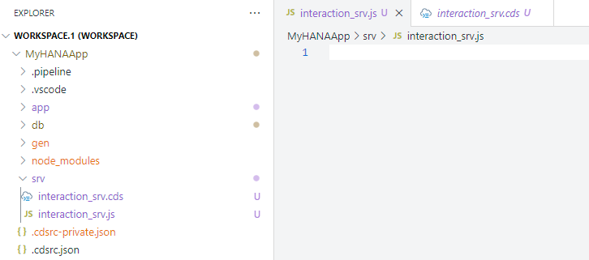
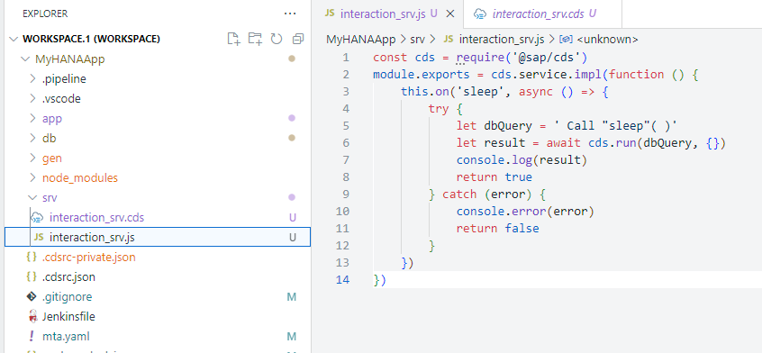
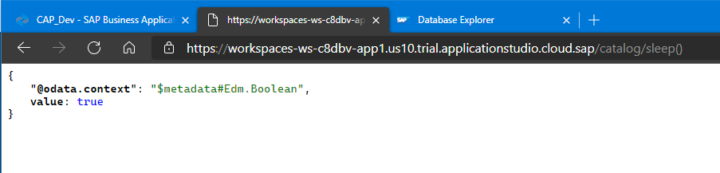

## Prerequisites
- This tutorial is designed for SAP HANA Cloud. It is not designed for SAP HANA on premise or SAP HANA, express edition.
- You have created database artifacts and loaded data as explained in [the previous tutorial](hana-cloud-cap-calc-view).

## Details
### You will learn
  - How to create and deploy an SAP HANA Cloud SQLScript stored procedure
  - How to create a service function implemented via an SAP HANA SQLScript stored procedure
  - How to use a CAP service exit to implement the service function

Video tutorial version: </br>

<iframe width="560" height="315" src="https://www.youtube.com/embed/wr9KpbqsNpM" frameborder="0" allow="accelerometer; autoplay; clipboard-write; encrypted-media; gyroscope; picture-in-picture" allowfullscreen></iframe>

---

[ACCORDION-BEGIN [Step 1: ](Create stored procedure)]

1. In the `/db/src` folder create a new database artifact named **sleep** of type `hdbprocedure`

    !

2. This is a very simple SAP HANA Stored Procedure that calls the built-in `SYNC` library to put processing to sleep for 10 seconds. It's a nice tool to be able to test the impact of long running queries without actually putting unnecessary load on the system.

    !

    ```SQL
    PROCEDURE "sleep" ( )
       LANGUAGE SQLSCRIPT
       SQL SECURITY INVOKER
       READS SQL DATA AS
    BEGIN USING SQLSCRIPT_SYNC as SyncLib;

    call SyncLib:SLEEP_SECONDS(10);

    END
    ```

3. Save.  Deploy the to the database again using the SAP HANA Projects view.

    !

4. Check the deployment log to make sure everything was successfully created in the database.

    !

5. Open the HDI Container in the Database Explorer

    !

6. This new Procedure is there now and can be tested.    

    !

7. There isn't much output from the execution, but the 10 second wait makes testing quite easy.

    !    

[DONE]
[ACCORDION-END]

[ACCORDION-BEGIN [Step 2: ](Add procedure to CAP service)]

1. Now we want to add this Procedure to the CAP service as a function.  Edit `/srv/interaction_srv.cds`.

    Add: ```function sleep() returns Boolean;``` to the service definition.

    This will expose an OData Function as part of the service interface.

    !

2. Just adding the function to the service definition doesn't implement it. Unlike tables and views which are implemented by the built-in handler classes of CAP, we need to use a service handler exit to implement this ourselves. In order to do this create a file named `interaction_srv.js` in the `/srv` folder. The name must match `interaction_srv.cds` just with the different file extension for JavaScript. The matching naming tells CAP that you want to use this file to write custom exit handlers for the services defined in `interaction_srv.cds`.

    !

3. In `interaction_srv.js` we will implement the call to the Stored Procedure.  This logic will implement the exit handler for this function which in turn uses the standard `@sap/hdbext` Node.js module to call the Stored Procedure from SAP HANA Cloud.  Save the file.

    !    

    ```JavaScript
    const cds = require('@sap/cds')
    module.exports = cds.service.impl(function () {
       this.on('sleep', async () => {
           try {
                const db = await cds.connect.to('db')
                const dbClass = require("sap-hdbext-promisfied")
                let dbConn = new dbClass(await dbClass.createConnection(db.options.credentials))
                const hdbext = require("@sap/hdbext")
                const sp = await dbConn.loadProcedurePromisified(hdbext, null, 'sleep')
                const output = await dbConn.callProcedurePromisified(sp, [])
                console.log(output.results)
                return true
           } catch (error) {
                console.error(error)
                return false
           }
        })
    })
    ```

4. But since we used two additional SAP provided Node.js modules in our code, we need to add those to our root **package.json**. From a terminal in the root of the project use the following command:

    ```shell
    npm install -save @sap/hdbext sap-hdbext-promisfied
    ```

    !

5. From the terminal return to the root of the project and issue the command: `cds build`

    ```shell
    cds build
    ```          

6. From the console in the project root run `npm start` to start the CAP service layer for testing.  If you have performed the tutorial [SAP HANA Cloud, Add User Authentication to Your Application](hana-cloud-cap-add-authentication), remember you must also run the application router to test your service with authentication.

7. The CAP preview UI doesn't list functions or actions, however. Manually add `/catalog/sleep()` to the end of the URL. If it works correctly it should take 10 seconds to respond since the procedure is running a sleep operation for that long.

    !

You've now added an OData function to your service layer which in turn is implemented as an SAP HANA Stored Procedure  

[DONE]
[ACCORDION-END]

---
