# Get Started to Collaborate in SAP Business Application Studio
<!-- description --> Set up a development space and a project in SAP Business Application Studio and connect it to your SAP HANA Cloud, SAP HANA database.

## Prerequisites
 - [Sign up](https://www.sap.com/cmp/td/sap-hana-cloud-trial.html) for the free SAP HANA Cloud trial.
 - [Provision an instance](hana-cloud-mission-trial-2) of SAP HANA Cloud, SAP HANA database and make sure it is running.
 - [Subscribe](hana-cloud-mission-trial-3) to the free SAP Business Application Studio trial.
 - Create a free account on <https://github.com/> to use the required sample data.


## You will learn
  - How to create an SAP HANA Native Application Dev Space
  - How to create an SAP HANA database project
  - How to view the run-time user of your database connection

  **Are you wondering what the best way is to manage changing data structures? Do you want to know how to collaborate more efficiently when working in development projects?**

## Intro
> To answer the first question, learn what benefits different table types in SAP HANA Cloud, SAP HANA database can offer you based on your needs. The following 3 tutorials in this tutorial group will help you navigate through your challenges with the managing data structures:

  1.	You are here <sub-style="font-size:30px">&#9755;</sub> **Get started to collaborate in SAP Business Application Studio**
  2.	Import data into a table in SAP HANA Database Project
  3.	Change data structures using `HDBTABLE` and `HDBMIGRATIONTABLE` objects

    > To answer the second question, create template projects that help you set up service connections, handle synonyms and prepare authorization management. You can create these templates once in the beginning and give your project team members a head-start. Using the template, they can build on your work and can quickly start working productively.
    >  
    > The following 4 tutorials in this tutorial group will help you learn how to collaborate efficiently:

  4.	Prepare your SAP HANA Database Project for collaboration
  5.	Generate users and roles for assigning privileges
  6.	Enhance your project with services, synonyms and grants
  7.	Collaborate on an SAP HANA Database Project template

  This tutorial will show you how to create an SAP HANA Database project in SAP Business Application Studio.

---

### Introduction to changing data structures


In SAP HANA Cloud, Data Definition Language (DDL) can be used to create a table or a view in a schema. When you make changes to data structures in this case, you need to make sure that these changes are accepted by the database. Alternately, you can also use Frameworks (e.g., NetWeaver) to generate DDL and take responsibility for the changes made to data structures.

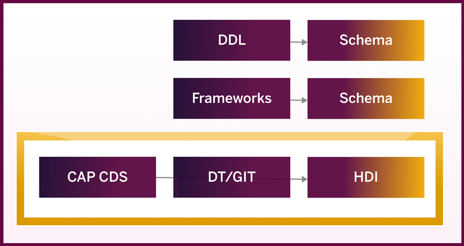

In this tutorial group, you will generate design-time artifacts (or objects) to manage the data present in an HDI container. This is done using the support of a GitHub repository. You can manage changing data structures using two design-time object types: `HDBTABLE` and `HDBMIGRATIONTABLE`. This tutorial group will include both the approaches while also highlighting the advantages of using an HDBMIGRATIONTABLE over HDBTABLE.

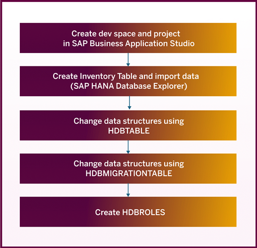


### Check the status of your instance


Before you can start with your development space, you need to make sure that your SAP HANA Cloud, SAP HANA database is running.

1.	Open SAP BTP cockpit.
2.	If you are using a trial account, click on **Go To Your Trial Account** from the SAP BTP Trial homepage.

    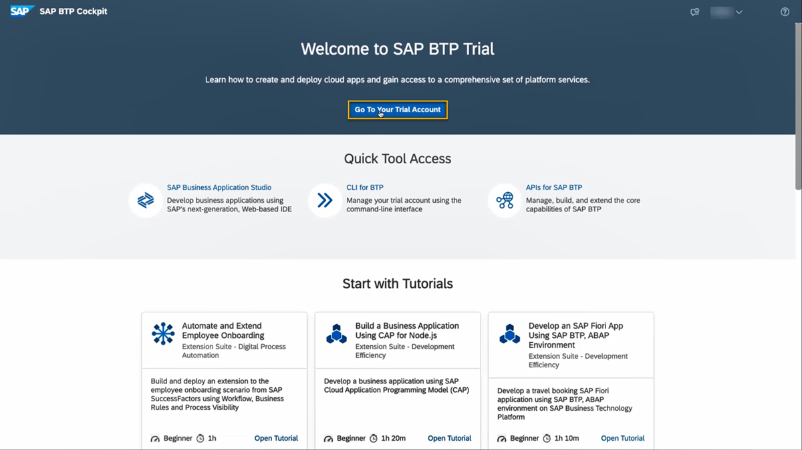

3.	In SAP BTP Cockpit, select your **Subaccount** and within the subaccount, select your **Space**.
4.	After selecting your Space, click on **SAP HANA Cloud** on the left sidebar.
5.	On the tile of your trial SAP HANA database instance, click on **Actions**.
6.	Select **Open in SAP HANA Cloud Central**. You might need to sign in with your user credentials.
7.	In SAP HANA Cloud Central, check the status of your database instance from the list of all instances. Ensure it has the status `RUNNING`, otherwise click on the **three dots icon** in the column Actions and select **Start**.


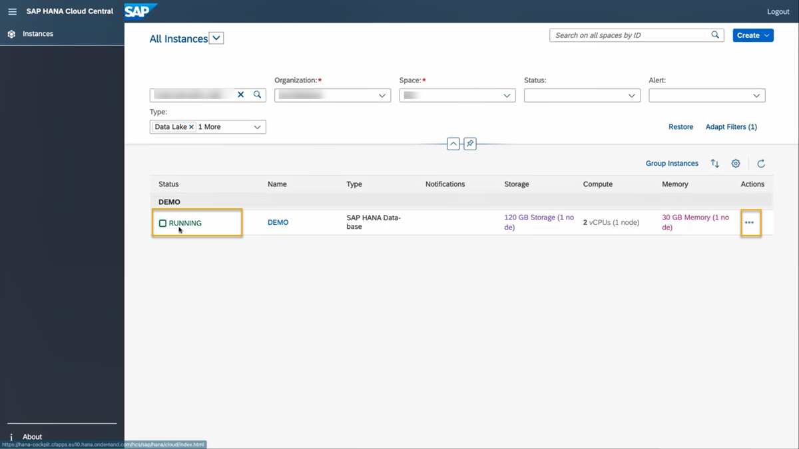


### Create an SAP HANA Native Application Dev Space 


1.	Open SAP Business Application Studio. In a trial landscape you can get there via the Trial Home page in SAP BTP cockpit.
    > If you are using a non-trial account, you need to first select your Subaccount from the SAP BTP cockpit. Then, click on Service Marketplace from the left-side Menu bar and search for SAP Business Application Studio. Finally, click on the three dots (Actions) icon for SAP Business Application Studio option and choose Go to Application.

    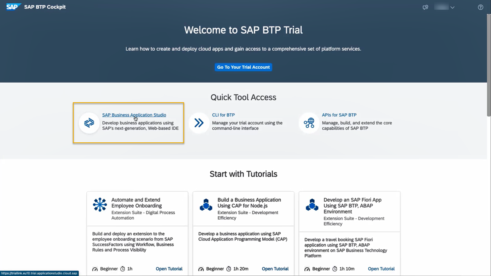

2.	A new window opens for SAP Business Application Studio. Click on **Create Dev Space**.
3.	In the Create a New Dev Space window, select **SAP HANA Native Application Dev Space** as the option for the kind of application you want to create.


    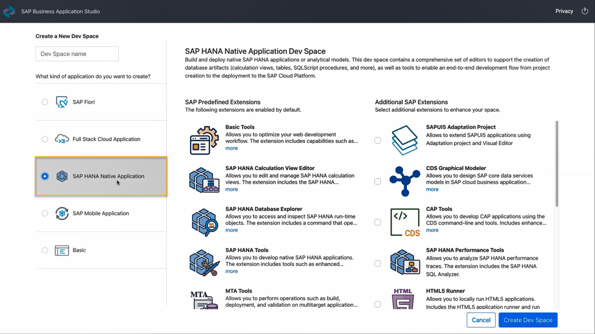

    This will add SAP Predefined Extensions to your development space that allow you to deploy native SAP HANA applications or analytical models.

4.	Next, name your dev space in the field in the top left corner, for example as **WS3_1**. This name must start with a letter or number and only allows alphanumeric characters and underscores, no special characters. You can see if the name is valid if a green tick mark becomes visible alongside the name field.
5.	Here, you could also select additional SAP Extensions for your dev space. To complete these tutorials, you do not need to select any of the additional extensions.
6.	Finally, click on **Create Dev Space** at the bottom right corner of the screen.

7.	A new window opens for Dev Spaces. Here, you can view all the existing Dev Spaces you have created.

    > ### **Important**
> As a trial user, you can have a maximum of two Dev Spaces while only having one of them running. Throughout these tutorials, you can re-use the dev space you just created. If you have other dev spaces before starting these tutorials, we recommend you remove them. Alternatively, if you already have an SAP HANA Native Application Dev Space, you can create a new project inside that space.

8.	The process of creation of development space usually takes a few minutes. Once the status changes to RUNNING, you can click on the name of your dev space to open it.

    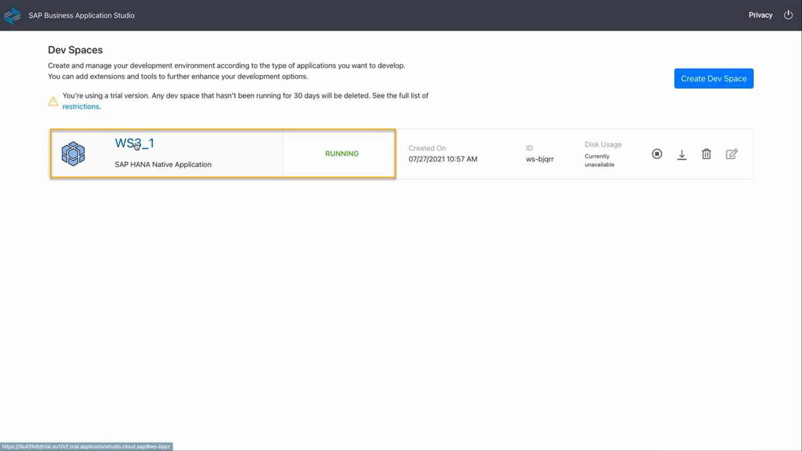


### Create an SAP HANA Database project 


1.	After you have opened your dev space in SAP Business Application Studio, select **Start from template** from the welcome screen to create a new project.
2.	Choose **SAP HANA Database Project template** and click on **Start**.

    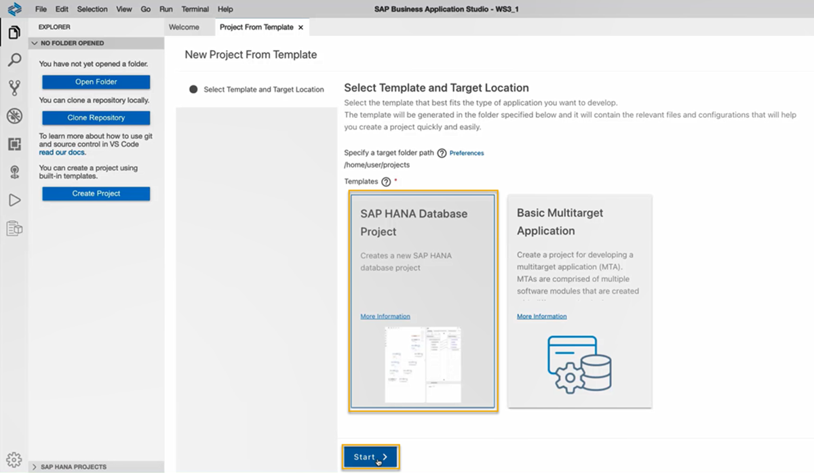

3.	Under **Add Basic Information**, add the name of your new Project as **WS3_1**. Click on **Next**.
    > You can usually name your project as whatever you want. But to be able to follow these steps more easily, we recommend the name above.

4.	Under **Set Basic Properties**, we suggest you keep the database module name as db. Click on **Next**.
5.	Under **Set Database Information**, we recommend not to fill in the fields Namespace and Schema Name for the purpose of this tutorial.
6.	Set **SAP HANA Database Version** as HANA Cloud. Also, select **Yes** for the option **Bind the database module to a Cloud Foundry service instance?**. Click on **Next**.
7.	Under **Bind to HDI Container service**, enter your email address (the one you used for your SAP BTP cockpit login or SAP HANA Cloud trial account) and corresponding password to make the project target your trial account and click on the    login icon . This will automatically select your Cloud Foundry Organization and Cloud Foundry Space.

    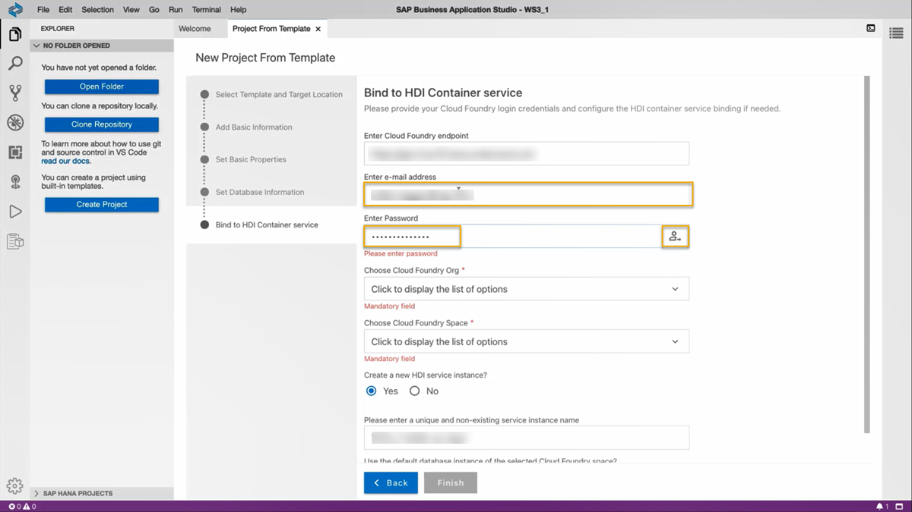

8.	Select **Yes** for both the options **Create a new HDI service instance?**, and **Use the default database instance of the selected Cloud Foundry space?**. A unique and non-existing service instance name will be generated automatically for you.
9.	Click on **Finish** and your project will be created. This process usually takes a moment to complete.


### Explore database connection options for your project


On the left panel, you can now see your workspace where you have your files, and the SAP HANA Project panel where you can deploy your project and open the HDI container in the SAP HANA Database Explorer. Whenever you add a new database object that can be deployed to your HDI container, it will appear in this panel and you can deploy it. In this area you can also check the database connections of your project.
Moving your cursor to the name of an object, folder, or connection in this panel, you will see different icons:

- This icon  will open the HDI container in SAP HANA Database Explorer
-	This icon  will deploy an object, folder or the whole project to the HDI container or other connected database.
-	This icon  (only on the Database Connections level) allows you to create a new database connection.
-	This icon  /   allows you to bind (green color) or unbind (grey color) a database connection.


### View the run-time user (optional)


When you are opening the HDI container in the SAP HANA Database Explorer, you will automatically be connected as the run-time user and this connection will be added to your list of database connections. To check what user you are currently connected with, you can use the following statement in a SQL console:


```SQL
  SELECT CURRENT_USER "current user" FROM DUMMY
```


This shows the statement being used in a connection opened from SAP BTP cockpit or SAP HANA Cloud Central:

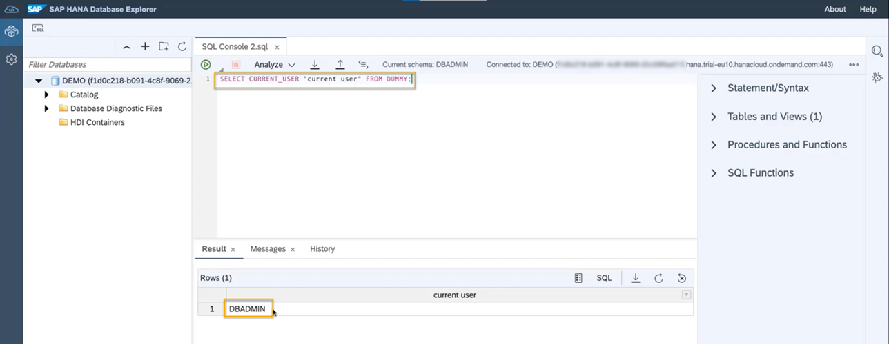

Opening the HDI container from SAP Business Application Studio will show the run-time (RT) user of this HDI container:

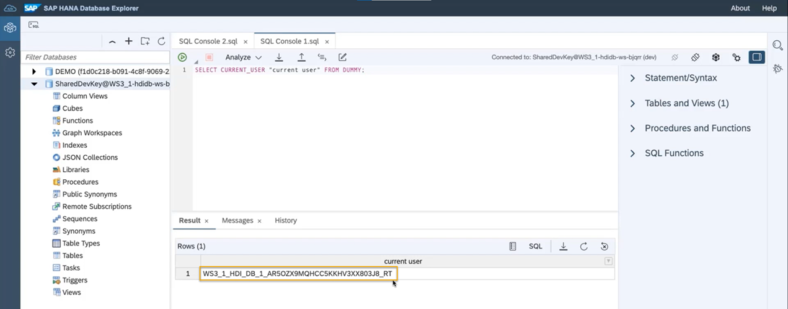

> You have successfully completed the first tutorial. In the next tutorial, you will create a table in your SAP HANA Database Project and insert sample data into it.


### Test yourself


---
