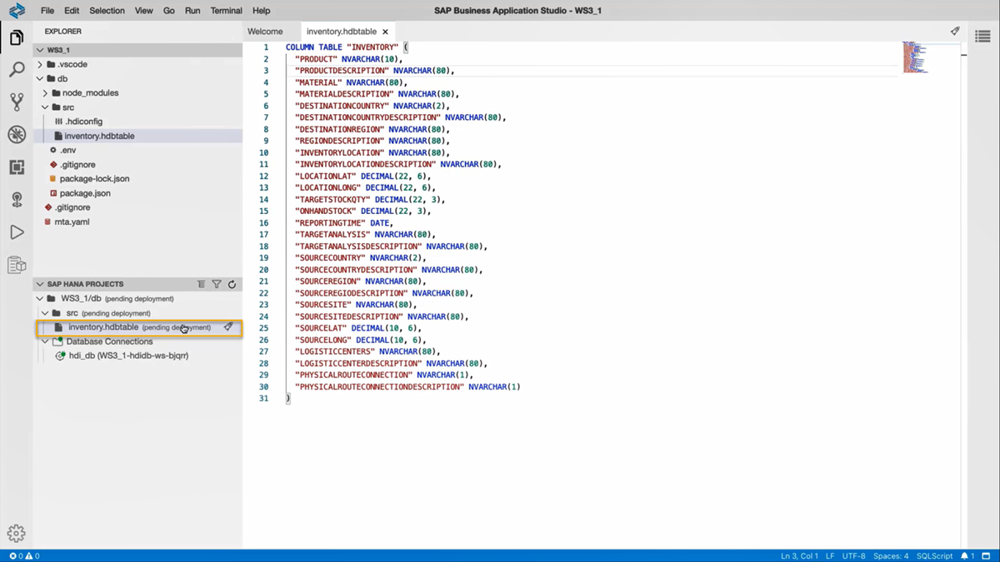

# Import Data into a Table in SAP HANA Database Project
<!-- description --> Create a table in SAP HANA Database Project and import sample data into the table.

## Prerequisites
 - You need to complete the [previous tutorial](hana-cloud-collaborative-database-development-1) about creating an SAP HANA Database project.
 - [Provision an instance](hana-cloud-mission-trial-2) of SAP HANA Cloud, SAP HANA database and make sure it is **running**.


## You will learn
  - How to create an `HDBTABLE` object
  - How to add the column definitions to a table
  - How to import data into a table
  - How to generate an analysis graph of data present in a table using SAP HANA Database Explorer


  **Are you wondering what the best way is to manage changing data structures? Do you want to know how to collaborate more efficiently when working in development projects?**

## Intro
>To answer the first question, learn what benefits different table types in SAP HANA Cloud, SAP HANA database can offer you based on your needs. The following 3 tutorials in this tutorial group will help you navigate through your challenges with the managing data structures:

1.	Get started to collaborate in SAP Business Application Studio
2.	You are here <sub-style="font-size:30px">&#9755;</sub> **Import data into a table in SAP HANA Database Project**
3.	Change data structures using `HDBTABLE` and `HDBMIGRATIONTABLE` objects

    > To answer the second question, create template projects that help you set up service connections, handle synonyms and prepare authorization management. You can create these templates once in the beginning and give your project team members a head-start. Using the template, they can build on your work and can quickly start working productively.
    >
    > The following 4 tutorials in this tutorial group will help you learn how to collaborate efficiently:

4.	Prepare your SAP HANA Database Project for collaboration
5.	Generate users and roles for assigning privileges
6.	Enhance your project with services, synonyms and grants
7.	Collaborate on an SAP HANA Database Project template

This tutorial will show you how to import data into a table in your SAP HANA Database Project.
---

### Create an HDBTABLE Object


Now you can create the first object in your project: an `HDBTABLE` that will store the sample data used in this tutorial. After you have opened your dev space in SAP Business Application Studio, click to select the project you created in the [previous tutorial](hana-cloud-collaborative-database-development-1).

  1.	In the explorer panel on the left side, expand the folders under your Project **WS3_1**. Click on the `src` folder.

      <!-- border -->

  2.	To create a new SAP HANA Database Artifact, you can press the **F1 key** or click on **View – Find Command** at the top of the screen to open a search prompt. Enter **HANA** in the field and from the dropdown list of functionalities, choose **SAP HANA: Create SAP HANA Database Artifact**.

      <!-- border -->

  3.	In the window for creating a new SAP HANA Database Artifact, click on the   folder icon in the first field (Choose path where you want to create the artifact). Navigate to your project, the `src` folder, and then click on **Open**.

  4.	Select the artifact type as **Table** (`hdbtable`).

  5.	In the field **Specify the artifact name**, enter **'inventory'**.

  6.	The database version should be HANA Cloud, by default. Without making any further changes, click on Create.

  7.	A new file `inventory.hdbtable` can be seen under the `src` folder in the **EXPLORER** panel.


### Add the column definitions to the table


1.	Click on the `inventory.hdbtable` file to open the file window. You can see that the file only contains the code `column table "inventory" ()`. Remove the default code in this file and paste the code below in it to add the column definitions to this new table.

    > **The name of the table in this code must be written in upper case characters**.


    ```SQL
  column table "INVENTORY" (
   "PRODUCT"  NVARCHAR(10),
   "PRODUCTDESCRIPTION"  NVARCHAR(80),
   "MATERIAL"  NVARCHAR(80),
   "MATERIALDESCRIPTION"  NVARCHAR(80),
   "DESTINATIONCOUNTRY"  NVARCHAR(2),
   "DESTINATIONCOUNTRYDESCRIPTION"  NVARCHAR(80),
   "DESTINATIONREGION"  NVARCHAR(80),
   "REGIONDESCRIPTION"  NVARCHAR(80),
   "INVENTORYLOCATION"  NVARCHAR(80),
   "INVENTORYLOCATIONDESCRIPTION"  NVARCHAR(80),
   "LOCATIONLAT"  DECIMAL(22, 6),
   "LOCATIONLONG"  DECIMAL(22, 6),
   "TARGETSTOCKQTY"  DECIMAL(22, 3),
   "ONHANDSTOCK"  DECIMAL(22, 3),
   "REPORTINGTIME"  DATE,
   "TARGETANALYSIS"  NVARCHAR(80),
   "TARGETANALYSISDESCRIPTION"  NVARCHAR(80),
   "SOURCECOUNTRY"  NVARCHAR(2),
   "SOURCECOUNTRYDESCRIPTION"  NVARCHAR(80),
   "SOURCEREGION"  NVARCHAR(80),
   "SOURCEREGIODESCRIPTION"  NVARCHAR(80),
   "SOURCESITE"  NVARCHAR(80),
   "SOURCESITEDESCRIPTION"  NVARCHAR(80),
   "SOURCELAT"  DECIMAL(10, 6),
   "SOURCELONG"  DECIMAL(10, 6),
   "LOGISTICCENTERS"  NVARCHAR(80),
   "LOGISTICCENTERDESCRIPTION"  NVARCHAR(80),
   "PHYSICALROUTECONNECTION"  NVARCHAR(1),
   "PHYSICALROUTECONNECTIONDESCRIPTION"  NVARCHAR(1)
)
```
> You can right-click inside the file window and choose **Format document** to clean up the formatting of the file.

2.	On the bottom left corner, you can see in the SAP HANA Projects panel that the table has been added.

    

3.	Click on the  deploy icon next to the `inventory.hdbtable` to deploy the table to your **HDI container**. You can check in the terminal if the table was successfully deployed. Alternately, you can also deploy by clicking on the deploy icon on the project level (WS3_1/db).


### View the changes to the table in Database Explorer


1.	In the SAP HANA Project panel, click on the   HDI container icon. The **SAP HANA Database Explorer** will open in a new tab.

    <!-- border -->

2.	In the catalog of the **HDI container connection**, click on **Tables**. If you cannot see the `INVENTORY` table, right-click on **Tables** and select **Refresh**.

3.	Click on the `INVENTORY` table to view the list of all the columns you have just defined.

    <!-- border -->

If you click on **Open Data**, you can see that the table does not contain any data yet. Let's change that!


### Add data to the Inventory table


1.	To download the sample data from the GitHub repository, [click here](https://github.com/SAP-samples/hana-cloud-learning/raw/main/Workshop:%20Collaborative%20Development/Sample%20Data.zip). Select the `Download` option for the `Sample Data.zip` file under the folder location `SAP-samples/ hana-cloud-learning/ Workshop: Collaborative Development`.

2.	You need to **unzip** the `Sample Data.zip` file before it can be used to upload into the table.

3.	Go back to the SAP HANA Database Explorer, right-click on the **INVENTORY** table and select **Import Data**.

    <!-- border -->

4.	A wizard opens where you can select **Import Data** as **IMPORT TYPE**. Click on **Step 2**.

5.	Under **IMPORT SOURCE**, select **Local** to specify where the data is imported from. Click on **Browse** to find the unzipped CSV file on your local machine. Click on the CSV file and select open. Click on **Step 3**.

6.	Under **IMPORT TARGET**, name the Table as INVENTORY unless it's not named so by default. Click on **Step 4**.

7.	Under **TABLE MAPPING**, verify that the column properties match with the column definition that you had used to create the `inventory.hdbtable`. After the check is complete, click on **Step 5**.

8.	Under **ERROR HANDLING**, select the option **Save all successful rows and list the errors (if any)**. Click on Review.

9.	After reviewing the Import Summary, click **Import into Database**. Wait until the Import Status shows the **Import complete** notification.

    <!-- border -->

10.	To verify the data import, click on `INVENTORY` table from the left side panel. Select **Open Data** to view the data added into the table.


### Generate graphical views of data using SAP HANA Database Explorer


1.	Now that your data is imported successfully, you can preview it using the Analysis functions of the SAP HANA Database Explorer.

2.	In the **Open Data** window, click on **Analysis** to view the data in the form of graphs.

3.	For example, you can drag **PRODUCT** from the list of Available Columns to the **Value Axis** and **REGIONDESCRIPTION** to the **Label Axis** to see how products are distributed over regions.

    <!-- border -->

4.	You can select different graphical options provided in a main toolbar at the top or access the corresponding SQL code to these graphical views.


> You have successfully completed the second tutorial. In the next tutorial, you will change data structures by adding columns to a table using `HDBTABLE` and `HDBMIGRATIONTABLE` objects.


### Test yourself


---
