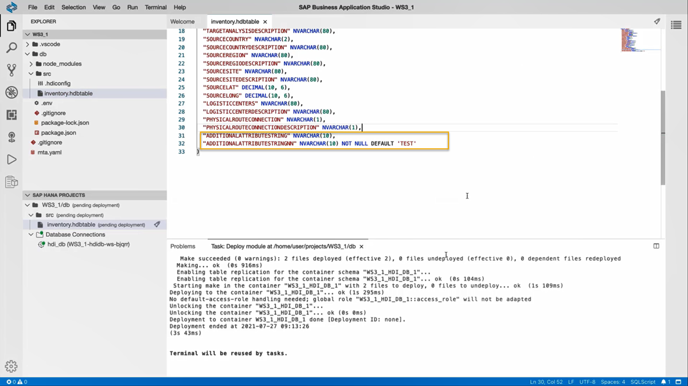
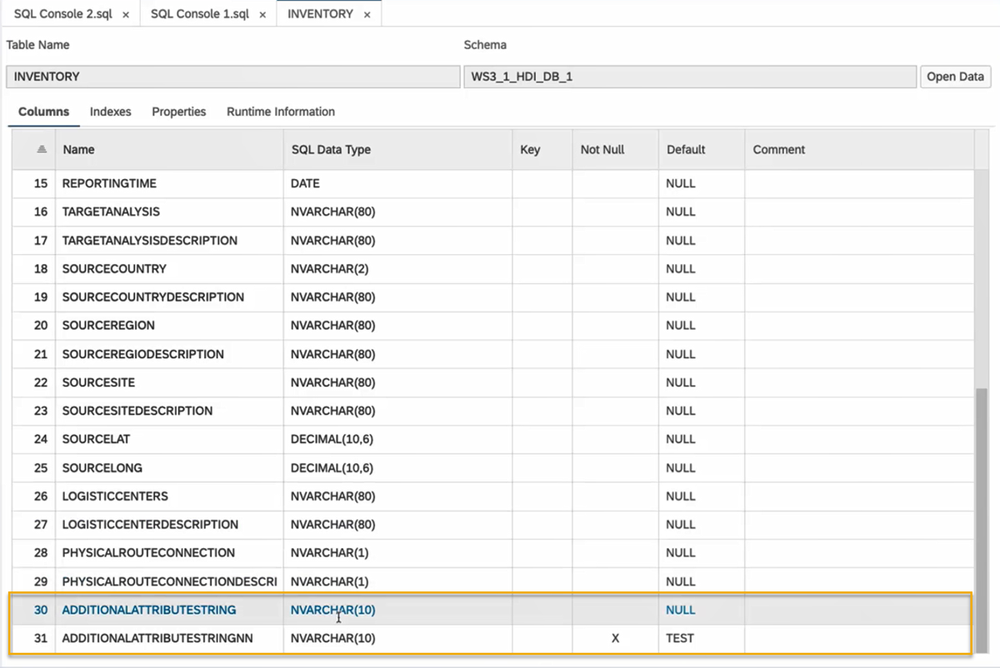
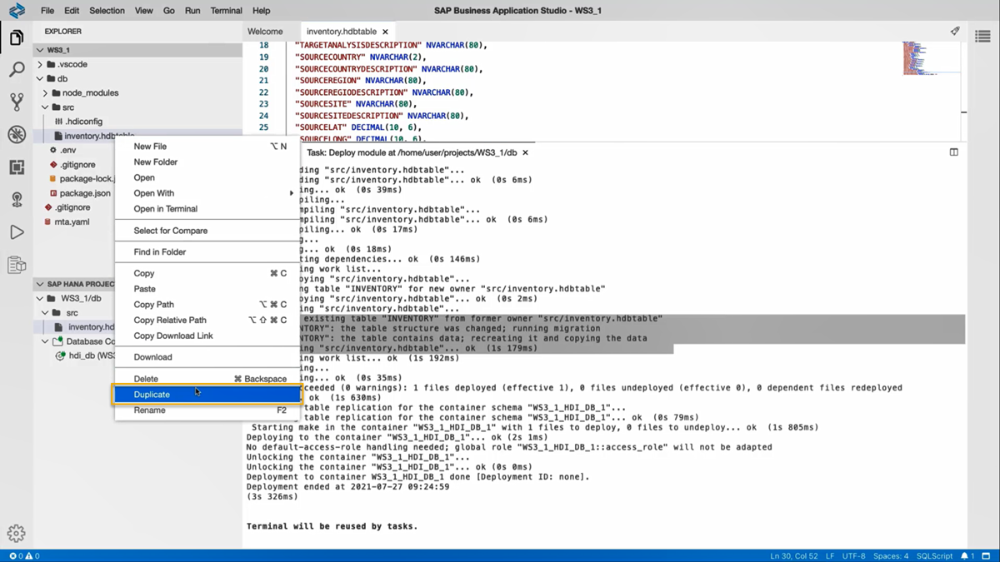
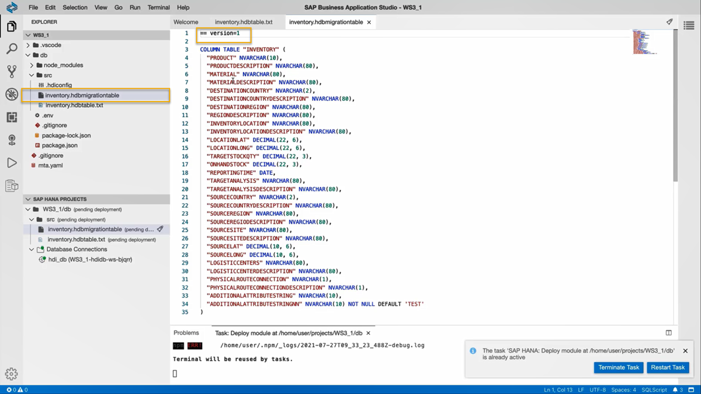
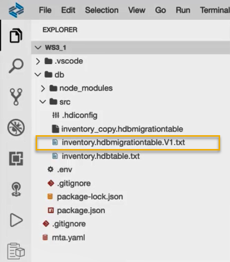
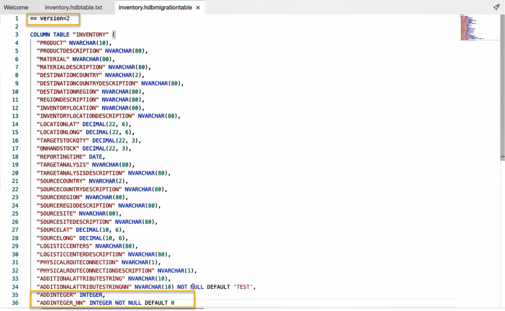
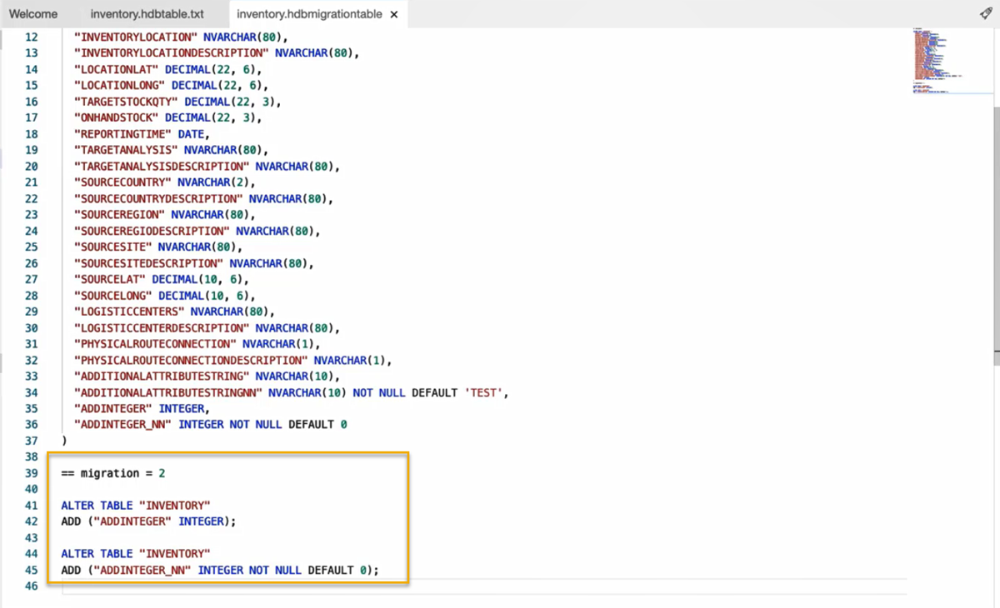
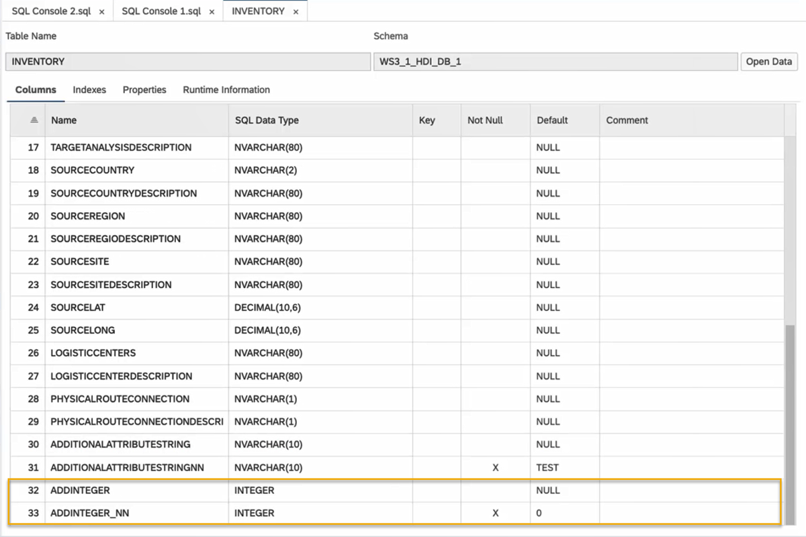

# Change Data Structures Using HDBTABLE and HDBMIGRATIONTABLE Objects
<!-- description --> Change data structures by adding columns to a table using HDBTABLE and HDBMIGRATIONTABLE objects.

## Prerequisites
 - You need to complete the [previous tutorial](hana-cloud-collaborative-database-development-1) about creating an SAP HANA Database project.
 - [Provision an instance](hana-cloud-mission-trial-2) of SAP HANA Cloud, SAP HANA database and make sure it is **running**.


## You will learn
  - How to change table definition in an `HDBTABLE` object
  - How to recreate the table using an `HDBMIGRATIONTABLE` object
  - How to change table definition in an `HDBMIGRATIONTABLE` object
  - How to insert migration definition in an `HDBMIGRATIONTABLE` object


  **Are you wondering what the best way is to manage changing data structures? Do you want to know how to collaborate more efficiently when working in development projects?**

## Intro
>To answer the first question, learn what benefits different table types in SAP HANA Cloud, SAP HANA database can offer you based on your needs. The following 3 tutorials in this tutorial group will help you navigate through your challenges with the managing data structures:

1.	Get started to collaborate in SAP Business Application Studio
2.	Import data into a table in SAP HANA Database Project
3.	You are here <sub-style="font-size:30px">&#9755;</sub> **Change data structures using HDBTABLE and HDBMIGRATIONTABLE objects**

    >To answer the second question, create template projects that help you set up service connections, handle synonyms and prepare authorization management. You can create these templates once in the beginning and give your project team members a head-start. Using the template, they can build on your work and can quickly start working productively.
    >
    >The following 4 tutorials in this tutorial group will help you learn how to collaborate efficiently:

4.	Prepare your SAP HANA Database Project for collaboration
5.	Generate users and roles for assigning privileges
6.	Enhance your project with services, synonyms, and grants
7.	Collaborate on an SAP HANA Database Project template

  This tutorial will show you how to change data structures using HDBTABLE and HDBMIGRATIONTABLE objects.
---

### Change data structures using `HDBTABLE` and `HDBMIGRATIONTABLE` objects


Now that your table is created and the data is imported, we will change the structure of this table by adding two columns. You can then examine in the terminal how this type of object handles data structure changes, which we will compare to other table types later.

1.	Go back to SAP Business Application Studio and select your `inventory.hdbtable`.

2.	Add two columns to the table definition by copying the following code and pasting at the end of the line 30.

    ```SQL
"ADDITIONALATTRIBUTESTRING" NVARCHAR(10),
"ADDITIONALATTRIBUTESTRINGNN" NVARCHAR(10) NOT NULL DEFAULT 'TEST'
```

    Make sure to paste these lines in between the last column definitions and the closing parenthesis `')'` in **line 31**. The last previous line of column definitions needs to have a ',' at the end.

    The new table definition should look like this image:

    

3.	Now you can deploy this updated object again to your database by clicking on the  deploy icon in the SAP HANA Projects panel. You can either deploy only the file `inventory.hdbtable` or the whole project.


### Verify the changes to the data structure using Database Explorer


1.	Once the table was successfully deployed, you can check if the data is still in the table by going back to the SAP HANA Database Explorer and refreshing the table.

2.	In the table definitions, you should now see that two additional columns have been added to the table and opening the data should not result in any changes to the number of rows in the previous graph.



You may also check the data in the table to verify that it contains the same data as it had earlier. You can do this by comparing the output graph of [Step 5 from the previous tutorial](hana-cloud-collaborative-database-development-2) to what you get with the current table.

> ### **Important**
> While making changes to data structure using `HDBTABLE`, your database recreates the existing table with the updated table definition and copies the existing data into it. This is not the most efficient way to use your database capability if you have large amounts of data present in these tables.


> To highlight how to make changes to data structures efficiently, you will use an `HDBMIGRATIONTABLE` in the next section. In comparison to using an `HDBTABLE`, an `HDBMIGRATIONTABLE` can save considerable time and resources while handling changes in data structures.


### Recreate the table using an HDBMIGRATIONTABLE object


Now that you know how `HDBTABLE` objects handle data changes, you can use a different type of object to add two more rows to this table.

1.	Go back to SAP Business Application Studio. Right-click your `inventory.hdbtable` and select Duplicate.

    


2.	Now, you can see a new file named `inventory_copy.hdbtable` in your `src` folder. Right-click on this file and select Rename. Rename the file as `'inventory.hdbmigrationtable'`.

    >**Important:**
> Before you deploy the new file `inventory.hdbmigrationtable`, you must make a change to the already existing `inventory.hdbtable` file. Otherwise, the deployment will result in an error. Adding the ending `'.txt' ` to the file name will signal to SAP Business Application Studio, that this file shall not be deployed to create an HDI object in the database.

3.	Rename the `inventory.hdbtable` as `inventory.hdbtable.txt` to facilitate the deployment of `inventory.hdbmigrationtable`.

4.	Now, click on the `inventory.hdbmigrationtable` file. Copy and paste the following code at the beginning of the file such that it comes before the table definition.

    ```SQL
== version = 1
```

    

5.	On the bottom left corner, you can see the file `inventory.hdbmigrationtable` in the SAP HANA Projects panel. Click on the  deploy icon for the file to deploy the changes to your HDI container.

6.	In the terminal you can see that the table was successfully deployed.

7.	Go back to the `SAP HANA Database Explorer`, right-click on **Tables** and select **Refresh** to update the changes you made to the table.

8.	Click on the `INVENTORY` table to view the list of all the columns present. Here, you can verify that deploying the `inventory.hdbmigrationtable` has produced exactly the same results as with `inventory.hdbtable`.


### Change table definition in HDBMIGRATIONTABLE object


The next step is to change the data structure of the table by adding two new columns. We will again duplicate our table change the previous version of this file to a `.txt` file that will not be deployed. Then, we will adjust the code of the `hdbmigration` object to define how to migrate from Version 1 of `hdbmigrationtable` to Version 2. For this, follow the next steps.

1.	Go back to SAP Business Application Studio.

2.	In the **Explorer** panel, right-click on the `inventory.hdbmigrationtable` and select **Duplicate**.

3.	Now, you can see a new file named `inventory_copy.hdbmigrationtable` in your `src` folder.

4.	Right-click on the original `inventory.hdbmigration` file and rename this file as `'inventory.hdbmigrationtable.V1.txt'` to facilitate the deployment of the new copy of the `hdbmigrationtable`.

    

5.	Next, right-click on the `inventory_copy.hdbmigrationtable` file and select **Rename**. Rename this file as `inventory.hdbmigrationtable`.
6.	Now, click on the `inventory.hdbmigrationtable` file. Adjust the first line of code to version 2 and paste the following two lines of code at the end of the file.

```SQL
"ADDINTEGER" INTEGER,
"ADDINTEGER_NN" INTEGER NOT NULL DEFAULT 0
```

You can check the image given below.




### Insert migration definition in HDBMIGRATIONTABLE object


An `hdbmigrationtable` object also needs to have a block of code at the very end that defines all migration steps. The following code will do just that, so paste it below the closing parenthesis of the table definition.

```SQL
== migration = 2

ALTER TABLE "INVENTORY"
ADD ("ADDINTEGER" INTEGER);

ALTER TABLE "INVENTORY"
ADD ("ADDINTEGER_NN" INTEGER NOT NULL DEFAULT 0);
```

You can check the image given below.



>The above step changes the data structure by adding two new columns into the table by using the ALTER command. In this way you can efficiently avoid the need to recreate the table and copy data into it.

2.	Now, deploy your project to the database by clicking on the  deploy icon on the project level **WS3_1/db**. In the terminal you can see that the table was successfully deployed. Follow the next steps to verify the changes made to the column definition.

3.	Go back to the `SAP HANA Database Explorer` and **Refresh** your table to update the changes made to the table.

4.	Click on the `INVENTORY` table to view the list of all the columns present. Here, you can see that two additional columns have been added to the table.



And now you know how to manage changing data structures using `HDBTABLE` and `HDBMIGRATIONTABLE` design-time objects.

> You have successfully completed the third tutorial. In the next tutorial, you will prepare your project for collaboration by creating `HDBROLEs` and synchronizing your `SAP HANA Database Project` with Git.


### Test yourself


---
