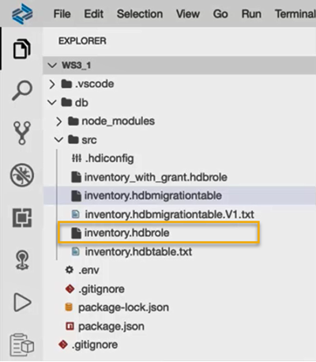

# Prepare Your SAP HANA Database Project for Collaboration
<!-- description --> Create HDBROLEs and synchronize your SAP HANA Database Project with Git to prepare your project for collaboration.

## Prerequisites
- You need to complete the [previous tutorial](hana-cloud-collaborative-database-development-3) about changing data structures using HDBTABLE and HDBMIGRATIONTABLE Objects.
- Make sure your instance of SAP HANA Cloud, SAP HANA database is **running**.


## You will learn
- How to create an HDBROLE with grant options
- How to create an HDBROLE without grant options
- How to create a new repository and token in GitHub
- How to connect your development project to GitHub
- How to add a remote origin via HTTPS connection


## Intro
**Are you wondering what the best way is to manage changing data structures? Do you want to know how to collaborate more efficiently when working in development projects?**

> To answer the first question, learn what benefits different table types in SAP HANA Cloud, SAP HANA database can offer you based on your needs. The following 3 tutorials in this tutorial group will help you navigate through your challenges with the managing data structures:

1. Get started to collaborate in SAP Business Application Studio
2. Import data into a table in SAP HANA Database Project
3. Change data structures using HDBTABLE and HDBMIGRATIONTABLE objects

    > To answer the second question, create template projects that help you set up service connections, handle synonyms and prepare authorization management. You can create these templates once in the beginning and give your project team members a head-start. Using the template, they can build on your work and can quickly start working productively. The following 4 tutorials in this tutorial group will help you learn how to collaborate efficiently:


4. You are here <sub font-size="60px">&#9755;</sub> **Prepare your SAP HANA Database Project for collaboration**
5. Generate users and roles for assigning privileges
6. Enhance your project with services, synonyms and grants
7. Collaborate on an SAP HANA Database Project template


This tutorial will show you how to prepare your SAP HANA Database Project for collaboration.

### Create a role with grant option

Now that you know the difference between `hdbtable` and `hdbmigration` table objects when changing data structures, we need to prepare some rights for the next tutorials. In this tutorial, you will create roles with specific permissions to give other users access to these tables. This is necessary, e.g., for creating calculation views, which you will do in the [last tutorial](hana-cloud-collaborative-database-development-7).

First, we want to create a role that contains SELECT privileges with grant option, which means when someone is assigned this role, they can grant this privilege to others themselves.

1.	From the explorer panel on the left side of SAP Business Application Studio, expand the folders under your project **WS3_1**.

2.	Select the **`src`** folder and press **F1** key or click on **View – Find Command** at the top of the screen to open a search prompt. Enter HANA in the field and from the dropdown list of functionalities, choose **SAP HANA: Create SAP HANA Database Artifact**.

3.	In the window for creating a new SAP HANA Database Artifact, click on the     folder icon in the first field. Navigate to your project, the **`src`** folder, and then click on **Open**.

4.	Select the artifact type as **Role `hdbrole`**.

    <!-- border -->

5.	Under 'Specify the artifact name' option enter the name **`inventory_with_grant`**.

6.	The database version should be HANA Cloud, by default. Without making any further changes, click on **Create**.


### Assign privileges to the role with grant option


1.	A new file **`inventory_with_grant.hdbrole`** can be seen under the `src` folder in the EXPLORER panel. Click on this role file to open the **Role Editor** window.

2.	Click on **Edit** for the Role name. Rename it as **`inventory_with_grant#`**.

    <!-- border -->

    > **IMPORTANT**
    >
    > The **`#`** character at the end of the role name is necessary to create this role. Whenever you create roles with grant or admin options, they need to have a **`#`** character at the end of the role name.

3.	Next, click on the tab **Object Privileges**. In the column **Object Name**, click on the  icon in the first row.


4.	A wizard will open with all the objects available to you to select from. Since we have only created one object so far, the only object available is the table **INVENTORY**. Click on it to select it.

5.	In the column **Privileges with Grant Option**, click on the arrow where it says **Choose privileges** to select from a list of privileges with grant option that you want to assign to this role.

    <!-- border -->

6.	Check the **SELECT** privilege.


### Create a second role without grant option


Now you will create a new role having privileges without the grant option. Repeat the steps from the previous step with a few modifications:

1.	When creating the object, under 'Specify the artifact name' enter the name **`inventory_without_grant`**.

2.	Once the file **`inventory_without_grant.hdbrole`** can be seen under the `src` folder in the explorer panel, open this role file in the **Role Editor**.

    <!-- border -->

3.	Again, in the tab **Object Privileges**, in the field **Object Privileges**, select the table **INVENTORY** .

4.	In the column **Privileges**, click on the arrow where it says **Choose privileges** to select from a list of privileges that you want to assign to this role.

    <!-- border -->

5.	Check the **SELECT** privilege.

6.	Now that both roles are created, you can deploy both files individually or deploy the whole project by clicking on the  deploy icon in the SAP HANA Projects panel. Once you see in the terminal that the project was deployed successfully, you can continue.

> These roles will be used in the [last tutorial](hana-cloud-collaborative-database-development-7) to share calculation views among different users.


### Create a new repository in GitHub


When collaborating with others on development projects, pushing your files to a git repository is very helpful. In this last section, we will establish a connection to GitHub, create a new repository and sync our development project with the repository.

1.	Open <https://github.com/> on a new browser tab. Enter your GitHub account using your credentials.

2.	On the top right corner of the screen, click on the profile icon in the top right corner and select **Your repositories**.

3.	In the top right corner, click on **New** to create a new repository.

    <!-- border -->

4.	Under Create a new repository, enter **WS3_1** as the Repository name.

5.	Optionally, you can add a short description.

6.	You can choose to make your repository visible publicly or privately. In this case, it is recommended that you select the option **Private**.

7.	Click on **Create repository** to finish. Your first step is done, and you have an empty repository ready to have the content from your development project.

    <!-- border -->


### Generate a GitHub token


There are two ways of connecting to a GitHub project: SSH and HTTPS. SSH requires you to use your GitHub password and HTTPS requires the use of a token. We recommend using HTTPS for higher security. In this step we will create a GitHub token that can be used to connect to git.

1.	On the top right corner of the screen, click on your GitHub profile icon and choose **Settings**.

2.	Scroll down the Settings page to find **Developer settings** on the left side of the screen and select it.

3.	In **Developer Settings**, select **Personal access tokens**.

4.	Click on **Generate new token** at the top right corner of the screen. You will be asked to sign in using your GitHub account password.

    <!-- border -->

5.	After signing in, enter a **name** for the token (for example: `MyNewToken`) under the caption Note.

    <!-- border -->

6.	Next you can select an **expiration date**.

7.	Under **Select scopes**, you can select both **repo** and **notifications**. Click on **Generate token** to complete generation.

8.	Copy the new token you generated and paste it in a safe location that could be accessed later.

    <!-- border -->

> **CAUTION**
> After you proceed to the next step, you cannot go back to view the token again unless you have saved it in another location. In such a case, you will need to generate a new token.


### Connect your development project to GitHub


1.	Go back to SAP Business Application Studio.

2.	On the left menu, click on the   icon to go to the **Source Control** panel. Here, you can see all the recent updates to your project that have not been pushed to GitHub yet. In this panel, you can also administer your GitHub connection and changes from a menu instead of using the terminal.

    <!-- border -->

3.	Open a terminal by clicking on **Terminal** at the top navigation bar and select **Open Terminal**.

4.	Paste the following command in the terminal and hit Enter.

    ```Shell/Bash
    git init
    ```

    <!-- border -->

    This will initialize the empty Git repository.

5.	Type **first commit** in the Message box under the Source Control panel. Click on the **tick mark** icon at the top of the panel to stage all your changes and commit them.

    <!-- border -->

6.	Select **Yes** or **Always**, if you encounter a message box asking what action to take when the commit (tick mark) icon is selected.

You have now committed all the changes made to the data structures during this session. Next, you will add the remote origin and push the staged changes to your repository.


### Add a remote origin via HTTPS connection


1.	Go to the terminal and paste the following command. Before you hit Enter, replace `Username` with your GitHub username and `Repository name` with your GitHub repository name. (in this case for example: WS3_1)

    ```Shell/Bash
    git remote add origin https://github.com/<Username>/<Repository name>.git
    ```

2.	After making the changes, press **Enter**.

3.	Paste the following command into the terminal and press **Enter**.

    ```Shell/Bash
    git fetch
    ```

4.	A prompt will open at the top center of the screen.

5.	There, enter your Git username and press **Enter**.

    <!-- border -->

6.	Next, paste the token you had generated from GitHub in the prompt and press **Enter**.

7.	You may save these credentials for future use by selecting the option to do so.

8.	Paste the following command into the terminal and press **Enter**.

    ```Shell/Bash
    git push -u origin master
```
    <!-- border -->

    This pushes all the committed changes to the GitHub repository.

You can go back to your GitHub repository and verify that all the folders of your project are present in it.


>You have successfully completed the fourth tutorial. In the next tutorial, you will generate users and roles for assigning privileges necessary for collaborating on the project.


### Test yourself

