# Generate Users and Roles for Assigning Privileges
<!-- description --> Generate users and roles in SAP HANA Database Explore, to assign the necessary privileges for collaborating on a template project.

## Prerequisites
- Complete the [previous tutorial](hana-cloud-collaborative-database-development-4) of this tutorial group. You should already have created the INVENTORY table, imported the sample data and created the two HDBROLES.

## You will learn
- How to use Git account token to establish remote connection with your project
- How to generate roles for object owner and application user
- How to grant roles to a new user with `ADMIN` option


## Intro
**Are you wondering what the best way is to manage changing data structures? Do you want to know how to collaborate more efficiently when working in development projects?**

> To answer the first question, learn what benefits different table types in SAP HANA Cloud, SAP HANA database can offer you based on your needs. The following 3 tutorials in this tutorial group will help you navigate through your challenges with the managing data structures:

1. Get started to collaborate in SAP Business Application Studio
2. Import data into a table in SAP HANA Database Project
3. Change data structures using HDBTABLE and HDBMIGRATIONTABLE objects
</li>
    > To answer the second question, create template projects that help you set up service connections, handle synonyms and prepare authorization management. You can create these templates once in the beginning and give your project team members a head-start. Using the template, they can build on your work and can quickly start working productively. The following 4 tutorials in this tutorial group will help you learn how to collaborate efficiently:


4. Prepare your SAP HANA Database Project for collaboration
5. You are here <sub style="font-size:30px">&#9755;</sub> **Generate users and roles for assigning privileges**
6. Enhance your project with services, synonyms and grants
7. Collaborate on an SAP HANA Database Project template

This tutorial will show you how to generate users and roles for assigning privileges.

---

### Introduction


In the last 4 tutorials of this group, you will focus on how to collaborate on a project within a team. The main goal is to show you how to create a template project in SAP Business Application Studio, that your colleagues can re-use and modify without having to prepare services and synonyms each time they wish to collaborate on the project. These tutorials  will also illustrate to you the advantage of collaborating through a template project using a sample scenario.

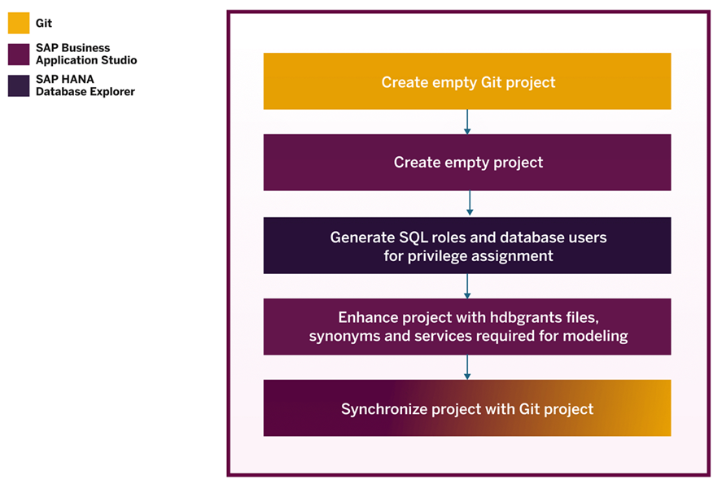

You will begin this tutorial by creating an empty Git project that you can share with your colleagues later. Next, you will create an empty project in SAP Business Application Studio. Subsequently, you will generate roles and users in SAP HANA Database Explore, to assign the necessary privileges for collaborating on the project. Afterwards, you will generate `hdbgrants` files, synonyms, and services within the project. Finally, you will synchronize the project with your GitHub repository and share the Git project with your colleague.

In the last tutorial, you will see how a collaborator can work with the template project you have created. You can simulate these steps in your own environment by creating another project in your dev space. The instructions that are meant for collaborators to use the template are marked in the tutorial accordingly.


### Create an empty Git project


1.	First, we will create an empty git project that will be used for the template project created in SAP Business Application Studio.

2.	Open github.com. Sign into your GitHub account using your credentials.

3.	Click on the **profile icon** in the top right corner and select **Your repositories**.

4.	In the top right corner, click on **New** to create a new repository.

5.	Under Create a new repository, enter `WS3_3` as the **Repository name**.

6.	Optionally, you can add a short **description**.

7.	You can choose to make your repository visible publicly or privately. We suggest you select the option **Private**.

8.	Click on **Create repository** to finish.

9.	Now, you will be taken to a **Quick setup** page for your new repository. Copy the HTTPS connection link for the repository to a safe location. This is required to set up the connection with your SAP Business Application Studio project.

    <!-- border -->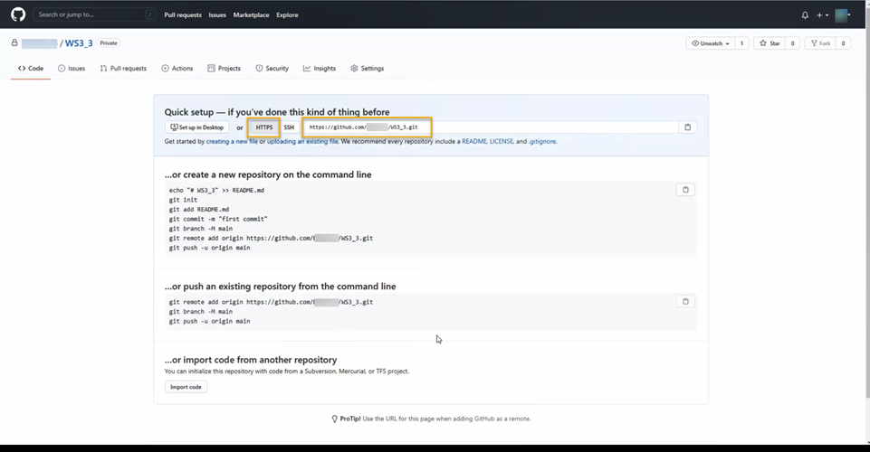


### Create an empty SAP Business Application Studio project


Next, you will create an SAP Business Application Studio project. For that, you need a running dev space with the SAP HANA Native Application configuration.

> ### Important:
>
> In a trial landscape, you can only have two dev spaces at a time with only one of them running. If you have followed the previous tutorials, you will already have one SAP HANA Native Application dev space created in the [first tutorial](hana-cloud-collaborative-database-development-1).

You can create a new dev space for the following steps or simply restart the SAP HANA Native Application dev space already created in the first tutorial and follow the instructions below.

1.	Open SAP Business Application Studio.

2.	On the page that shows your dev spaces in SAP Business Application Studio, start your dev space (if you are using the one previously created, restart `WS3_1`).

3.	Once the status has changed to `RUNNING`, click on the dev space to open it.

4.	After you have opened your dev space in SAP Business Application Studio, select **Start from template** from the **Welcome** screen to create a new project.

5.	Choose **SAP HANA Database Project template** and click on **Start**.

6.	In the step **Add Basic Information**, name your new project as `WS3_3`. Click on **Next**.

7.	In the step **Set Basic Properties**, we suggest you keep the database module name as `db`. Click on **Next**.

8.	In the step **Set Database Information**, we recommend **not** to fill in the fields Namespace and Schema Name for the purpose of this tutorial.

9.	Set SAP HANA Database Version as HANA Cloud.

10.	Select **Yes** for the option **Bind the database module to a Cloud Foundry service instance?**. Click on **Next**.

11.	In the step **Bind to HDI Container service**, sign in with your trial account credentials and click on the  login icon to make the project target your SAP HANA Cloud account. This will automatically select your Cloud Foundry Organization and Cloud Foundry Space.

12.	Select **Yes** for the fields **Create a new HDI service instance?** and **Use the default database instance of the selected Cloud Foundry space?**. A unique and non-existing service instance name will be generated automatically for you. This generates a HDI container in your SAP HANA Cloud, SAP HANA database.

13.	Click on **Finish**. It might take a few minutes to complete the process.


### Commit all the changes required


1.	Your project should automatically open in a new workspace. If it does not, open the project in a new workspace or click on the project name `WS3_3` on the **Welcome** screen.

2.	On the left side menu of your SAP BAS environment, click on the   icon to go to the Source Control panel. Here, you will see all the recent updates to your project that have not been pushed to Git yet.

3.	Next, click on the **plus icon** to add a local git repository.

    <!-- border -->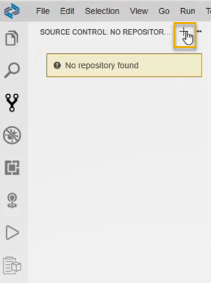

4.	In the **Source Control** panel, you can see a list of changes made when the empty project `WS3_3` was created. Click on the **plus icon** to stage these changes.

    <!-- border -->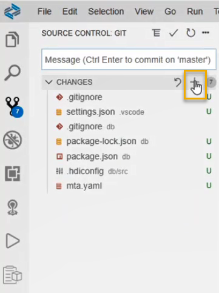

5.	Enter a commit message in the Message box (for example: Initial commit).

6.	Click on **tick mark icon** above to commit the changes.

    <!-- border -->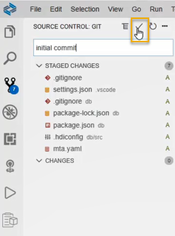


### Enter Git account token to complete remote connection


1.	Next, click on the **three dots** icon at the same navigation area.

2.	Select **Remote** and then **Add Remote**. This will add the remote connection to your GitHub repository

    <!-- border -->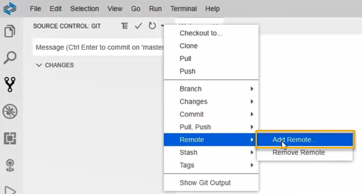

3.	A prompt asking to provide repository URL appears on the top center of the screen. Paste the GitHub HTTPS connection link that you obtained from GitHub after creating your new repository `WS3_3` into the prompt. Press **Enter**.

    <!-- border -->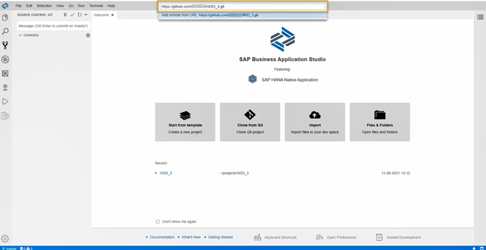

4.	Now, enter the remote name `main`. Press **Enter**.

5.	Next, enter your GitHub username and press **Enter**.

6.	Enter your Git account token. If you have already generated a token in the first session of this workshop series, use that token here. Press **Enter**.

7.	Finally, it is recommended that you select to save your credentials for this session only. You can also select No in the notification box asking for periodically running git fetch, as shown below.


### Synchronize the project with the GitHub repository


1.	Go to the **Source Control** panel and click on the **three dots** icon. Select **Pull, Push** and then the **Push to…** option.

    <!-- border -->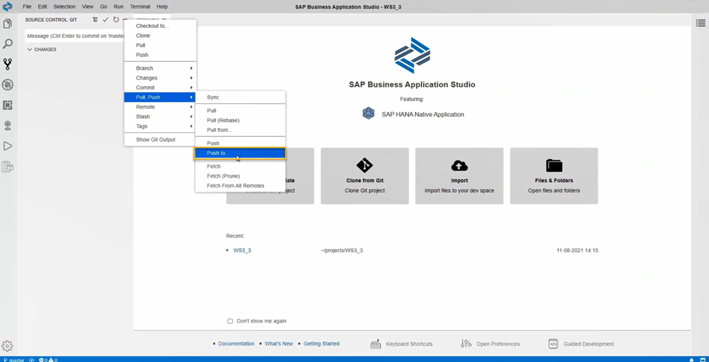

2.	A prompt asking for a remote to publish the master branch appears on the top center of the screen. Select the remote connection main that you have just created.

    <!-- border -->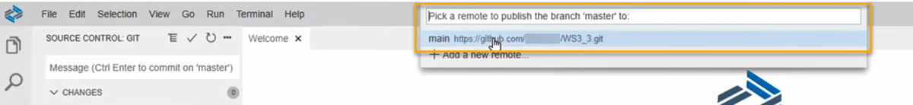

3.	You can verify the synchronization by checking your GitHub repository WS3_3. You should now see the folders and objects from your SAP Business Application Studio project there, for example, the `db` folder and `mta.yaml` file.

    <!-- border -->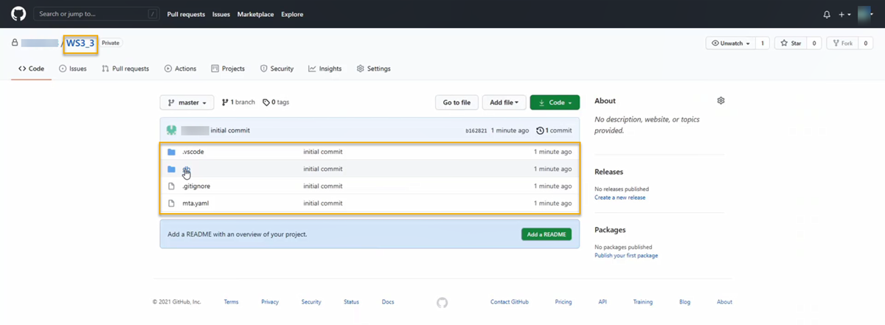


### Generate roles for Object Owner and Application User


As the last two steps, you will create two generic roles and database users. Then, you will grant these roles to the newly created user with option `ADMIN` so that the newly created user can grant these roles to your project users. Additional privileges that are assigned to these roles are automatically assigned to the project users once the roles have been granted to the project users.

1.	Go to your SAP BAS environment, press **F1** key or click on **View – Find Command** at the top of the screen to open a search prompt. Enter Data in the field and from the dropdown list of functionalities, choose SAP HANA: Open Database Explorer.

2.	In the SAP HANA Database Explorer, right-click on your HDI container connection from the left-side panel and select **Open SQL Console**.

    <!-- border -->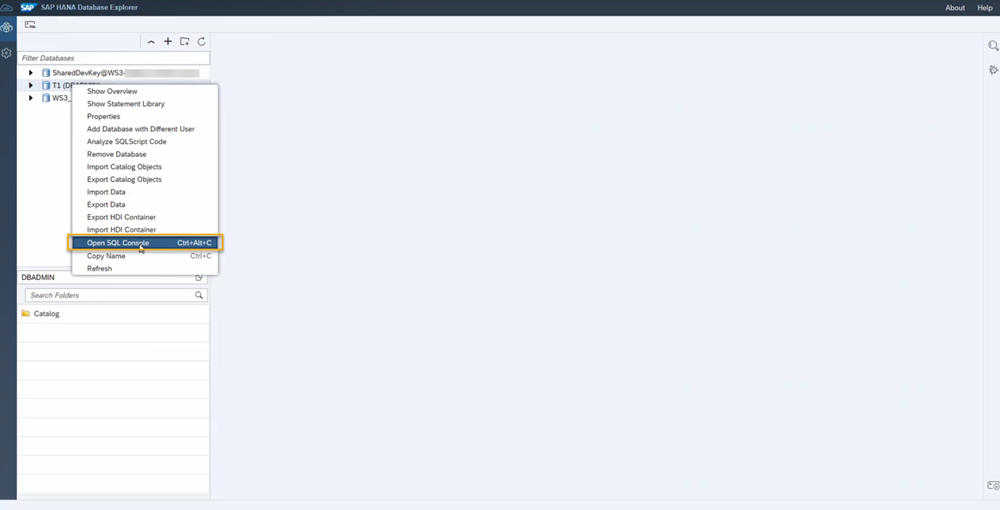

    > It is necessary to use the DBADMIN user connected to the instance since you require the DBADMIN user privileges to create and assign the roles.

3.	In the SQL Console, copy and paste the following code. Run it to create a role for the object owner (OO).

    ```SQL
create role "genericRoleForOO";
```
    > The Object Owner, in this example, will be assigned to the user who owns the project and creates calculation views. This role will need Select privileges with grant option that will be assigned to it in the next steps.

4.	Next, copy and paste the following code in the SQL Console and run it to create a role for application users (AP).

    ```SQL
create role "genericRoleForAP";
	```

    > The Application User, in this example, will be assigned to the user who uses the data preview on the calculation views created by the object owner. This role will need Select privileges that will be assigned to it in the next steps.

5.	Copy and paste the following code in the SQL Console. Run the code to view the schema name for the role inventory created earlier in this tutorial group.

    ```SQL
select role_schema_name,* from roles where role_name='inventory';
```

    Note the schema name as it is needed for the next statement.

    <!-- border -->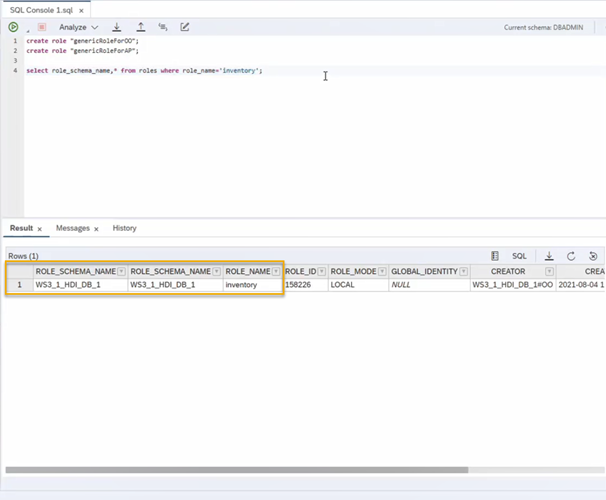


### Grant roles to the UPS_GRANTOR user


1.	Here, you will assign the two roles you have created in the fourth tutorial ("`inventory_with_grant#`" and "`inventory_without_grant`") to the two new roles you have just created. Copy and paste the following code in the SQL Console and make sure the schema name ("`WS3_1_HDI_DB_1`") matches the schema name you have just checked with the previous statement. Run the statement to grant roles to the object owner and application user.

    ```SQL
grant "WS3_1_HDI_DB_1"."inventory_with_grant#" to "genericRoleForOO";
grant "WS3_1_HDI_DB_1"."inventory_without_grant" to "genericRoleForAP";
	```

2.	Create a database user by running the following SQL statement. `UPS_GRANTOR` means **User-Provided Service Granter**. In the next step, this user will be allowed to grant the roles created above.

    ```SQL
create user UPS_GRANTOR password "DnATBG!1" NO FORCE_FIRST_PASSWORD_CHANGE;
	```

3.	Assign the roles you have created to this user `UPS_GRANTOR` by running the statements below.

    ```SQL
grant  "genericRoleForOO" to UPS_GRANTOR WITH ADMIN OPTION;
grant  "genericRoleForAP" to UPS_GRANTOR WITH ADMIN OPTION;
	```

4.	Now the user `UPS_GRANTOR` is assigned both roles that were created previously for collaborating on the project.

> You have successfully completed the fifth tutorial. In the next tutorial, you will see how to enhance the project with services, synonyms and grants.


### Test yourself


---
