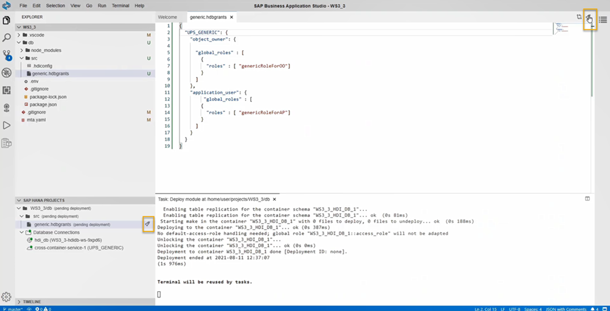

# Enhance Your Project with Services, Synonyms and Grants
<!-- description --> Create a user-provided service, grant privileges to the service and create a synonym to allows users of the template project to access data.

## Prerequisites
- Complete the [previous tutorial](hana-cloud-collaborative-database-development-5) of this tutorial group.

## You will learn
- How to create a user-provided service in SAP Business Application Studio
- How to grant privileges using a user-provided service
- How to create a synonym


## Intro
**Are you wondering what the best way is to manage changing data structures? Do you want to know how to collaborate more efficiently when working in development projects?**

> To answer the first question, learn what benefits different table types in SAP HANA Cloud, SAP HANA database can offer you based on your needs. The following 3 tutorials in this tutorial group will help you navigate through your challenges with the managing data structures:

1. Get started to collaborate in SAP Business Application Studio
2. Import data into a table in SAP HANA Database Project
3. Change data structures using HDBTABLE and HDBMIGRATIONTABLE objects
</li>
    > To answer the second question, create template projects that help you set up service connections, handle synonyms and prepare authorization management. You can create these templates once in the beginning and give your project team members a head-start. Using the template, they can build on your work and can quickly start working productively. The following 4 tutorials in this tutorial group will help you learn how to collaborate efficiently:


4. Prepare your SAP HANA Database Project for collaboration
5. Generate users and roles for assigning privileges
6. You are here <sub-style="font-size:30px">&#9755;</sub> **Enhance your project with services, synonyms and grants**
7. Collaborate on an SAP HANA Database Project template

This tutorial will show you how to enhance your project with services, synonyms, and grants.

---

### Create a User-Provided Service in SAP Business Application Studio


The user-provided service will be responsible for granting privileges to the project in the future.

1.	Go back to your SAP Business Application Studio tab and to your project `WS3_3`. If it is not open already, you can find it on the **Welcome** screen.

2.	Navigate to the explorer if you are still in the source control view. You can get there by clicking on the File Explorer icon at the top of the vertical menu bar on the left of the screen.

3.	On the bottom left corner, you can see the project folder `WS3_3/db` in the SAP HANA Projects panel. Click on the **deploy icon** for the file to deploy the changes to your HDI container.

4.	Next, click on the **plus icon** for adding database connections.

    <!-- border -->

5.	The **Add Database Connections** window will open.

6.	In the field **Select connection type**, select **Create a user-provided service instance** from the drop-down menu.

    <!-- border -->

7.	Enter the name of the service instance as `UPS_GENERIC`.

8.	Under **Connect to database**, select **Use deployment target container database**.

9.	Under **Enter username**, enter `UPS_GRANTOR`.

10.	Under **Enter password**, enter the password `DnATBG!1` that you used while creating the user in the SAP HANA Database Explorer using SQL.

11.	Click on **Add** to complete the creation of the user-provided service instance. You will see this addition in the SAP HANA PROJECTS panel.

    <!-- border -->


### Grant privileges using user-provided service


1.	Select the `src` folder from the explorer. Press the **F1** key or click on **View – Find Command** at the top of the screen to open a prompt. Enter HANA in the field and from the dropdown list of functionalities, choose **SAP HANA: Create SAP HANA Database Artifact**.

2.	In the window for creating a new SAP HANA Database Artifact, click on the  folder icon in the first field ("Choose path where you want to create the artifact"). Navigate to your project, the `src` folder, and then click on **Open**.

3.	Select the artifact type as **Grants (`hdbgrants`)**.

4.	In the field **Specify the artifact name**, enter the name `generic`.

5.	The database version should be HANA Cloud, by default. Without making any further changes, click on **Create**.

6.	A new file `generic.hdbgrants` can be seen in the `src` folder in the File Explorer. Click on this file to open the file window.

7.	The `hdbgrants` file comes pre-filled with templates you can use. In this session, we will only need to grant global roles to object owners and application users. Below you can see the code needed to do that. Remove all the default code and copy and paste the code below to the `generic.hdbgrants` file.

    ```JSON
{
    "UPS_GENERIC": {
        "object_owner": {
            "global_roles": [
                {
                    "roles": [
                        "genericRoleForOO"
                    ]
                }
            ]
        },
        "application_user": {
            "global_roles": [
                {
                    "roles": [
                        "genericRoleForAP"
                    ]
                }
            ]
        }
    }
}
```

8.	Click on the deploy icon for the file. You can do this either from the SAP HANA Projects panel or from the deploy icon on the top right corner of the file window.

    <!-- border -->

After successful deployment of the `generic.hdbgrants` file, object owner users and application users will be authorized to report on the data in the container.


### Create a synonym


Next, you will create a synonym that allows users of the template project to access the inventory table even if they do not have it present in their own HDI container.

1.	Right-click on the `src` folder and select **New File**.

2.	Name the file as `generic.hdbsynonym`. Click **OK**.

3.	A new file named `generic.hdbsynonym` will be visible under the `src` folder. Select the file to open the window.

4.	Click on **Click to Add** to add a new synonym.

    <!-- border -->

5.	Click on the new synonym created under the column Synonym Name and rename it as `SInventory`.

6.	In the **Object Name** column, click on the **three dots icon** to search for the object.

7.	A new dialog **Find Data Sources** will open. Make sure to select `UPS_GENERIC` in the services filter.

    <!-- border -->

8.	Type `**` in the search bar to view the list of all objects available. Double-click on the object `INVENTORY` contained in the schema used in the first session of this workshop series.

    <!-- border -->

9.	Select the synonym `SInventory`.

    > The Schema Name column should have the appropriate schema of the object by default (in this case, `WS3_1_HDI_DB_1`). Make sure this matches the name of your container. If this is not the case for you, please add the name of the schema you obtained in  step 7 (sub-step 5) of the tutorial "[Generate users and roles for assigning privileges](hana-cloud-collaborative-database-development-5)".

10.	Click on the **deploy icon** to deploy this synonym.

    <!-- border -->


### Verify the data present in the synonym


1.	You can check if your synonym was successfully deployed to your database by opening your HDI container icon from the SAP HANA Projects panel.

2.	In the SAP HANA Database Explorer select your HDI container from the list of database connections.

3.	In the catalog, scroll down to **Synonyms**, clicking on it should reveal the synonym `SInventory`.

4.	Right-click on `SInventory` seen at bottom left-side explorer panel and then select **Open Data**.

You will now view the data present in the INVENTORY table created in the [second tutorial](hana-cloud-collaborative-database-development-2).

And with that, your template project is already done and ready for collaborators to use. Before you can give others access to this project, you will need to synchronize your project with your git repository.

> You have successfully completed this tutorial. In the next tutorial, you will see how to collaborate on the template project you created previously.


### Test yourself


---
