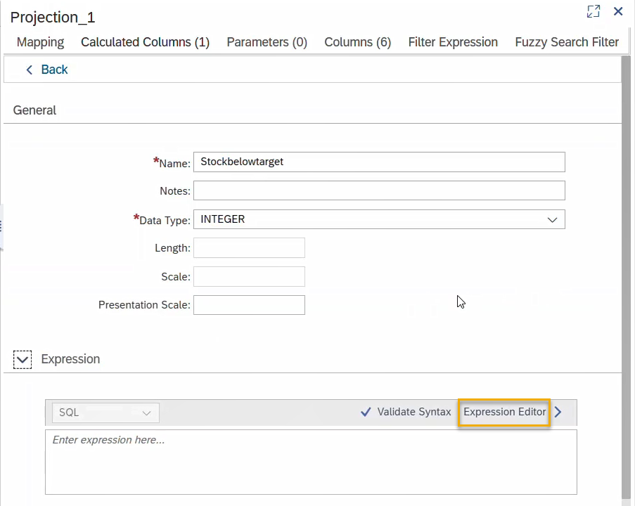

# Collaborate on an SAP HANA Database Project Template
<!-- description --> Create a simple calculation view in a cloned template project using the sample data present in the original project.

## Prerequisites
- Complete the [previous tutorial](hana-cloud-collaborative-database-development-6) of this tutorial group.

## You will learn
- How to invite a collaborator to your git repository
- How to clone a template project from git
- How to create a calculation view
- How to preview the data in a calculation view


## Intro
**Are you wondering what the best way is to manage changing data structures? Do you want to know how to collaborate more efficiently when working in development projects?**

> To answer the first question, learn what benefits different table types in SAP HANA Cloud, SAP HANA database can offer you based on your needs. The following 3 tutorials in this tutorial group will help you navigate through your challenges with the managing data structures:

1. Get started to collaborate in SAP Business Application Studio
2. Import data into a table in SAP HANA Database Project
3. Change data structures using HDBTABLE and HDBMIGRATIONTABLE objects
</li>
    > To answer the second question, create template projects that help you set up service connections, handle synonyms and prepare authorization management. You can create these templates once in the beginning and give your project team members a head-start. Using the template, they can build on your work and can quickly start working productively. The following 4 tutorials in this tutorial group will help you learn how to collaborate efficiently:


4. Prepare your SAP HANA Database Project for collaboration
5. Generate users and roles for assigning privileges
6. Enhance your project with services, synonyms and grants
7. You are here <sub-style="font-size:30px">&#9755;</sub> **Collaborate on an SAP HANA Database Project template**

This tutorial will show you how to collaborate on your SAP HANA Database Project template.

> ### **Steps for Project Owners**:
>
> The steps under the title (For Project Owner) will show you how the template project can be shared with a colleague or a collaborator who works with the project to create a calculation view. These steps are for the project template owner.


> ### **Steps for template users**:
>
> The steps under this title (For template User) will show you an example of how a collaborator could use your template project to create a simple calculation view. You can simulate the process by using the same dev space and creating a new project by cloning from git. Some instructions under this title will only apply to others using your template project, simply skip the steps not needed in your case.


---

### Synchronize the project with git


For Project Owners:

1.	Go back to your project `WS3_3` in SAP Business Application Studio.

2.	On the left side menu of your SAP BAS environment, click on the  icon to go to the Source Control panel. Here, you will see all the recent updates to your project that have not been pushed to GitHub yet.

3.	In the Source Control panel, you can see all the recent changes made. Click on the plus icon to stage these changes.

4.	Enter a commit message in the field at the top (for example: `template`) and click on **tick mark** icon next to the field to commit the changes.

5.	In the Source Control panel, click on the **three dots** icon. Select **Pull, Push** and then **Push to…** option.

6.	A search prompt asking for a remote to publish the master branch appears on the horizontal menu bar. Select `main`.

7.	You can verify the synchronization by checking your GitHub repository `WS3_3`. You should now see all the objects you created in the `src` folder there, for example, the synonyms and `hdbgrants` files.


### Invite a collaborator to your git repository


**For Project Owners**:

1.	Go back to your GitHub browser tab and navigate to your repository `WS3_3`.

2.	Select the **Settings** option from the horizontal menu bar at the top.

    <!-- border -->

3.	Select **Manage access** from the panel on the left side of the screen.

    <!-- border -->

4.	You might to need to sign in again with your GitHub credentials before you can continue.

5.	Click on **Invite a collaborator** in the Manage access section.

    <!-- border -->

6.	In the new dialogue box that appears, search for the GitHub username of your collaborator. Select the name and click on Add <username> to this repository.

> ### Important
> Your collaborator will now receive an invitation to collaborate on your project. Ideally, it is recommended that you to first fork your repository and only grant your collaborator the permission to work on the fork, thereby preventing any unwanted changes to your main project repository. The procedure used in this workshop is only for ease of illustration.


### Clone the template project from git 


For template users:

> If someone wants to use a template project by cloning it from the project repository, they have to enter the repository HTTPS URL, their username and their GitHub password or token.

1.	As a collaborator, you need to accept the invitation to work on the template project. To do this, go to your GitHub account and check the notifications for the invitation. Click on **Accept invitation**.

    <!-- border -->

    Now, you have access to the WS3_3 project folders in GitHub.

2.	To clone from the project repository, you need the HTTPS connection link. In the repository, click on the green **Code** button at the top right and the **clipboard** icon next to the HTTPS URL.

    <!-- border -->

3.	Go to your SAP Business Application Studio environment and open the **Welcome** page.
    >To view the welcome window, click on Help at the top navigation bar and select Welcome.

4.	Click on **Clone from Git**.

    <!-- border -->

5.	A prompt will open at the top center of the screen. Paste the HTTPS URL you just copied from GitHub into the dialogue box and press **Enter**.

6.	Enter your GitHub username in the dialogue box and press **Enter**.

7.	Next, enter your Git account password or a token. If you have already generated a token in GitHub, use that token here. Press **Enter**.

8.	You will receive a notification at the bottom right corner of the screen asking how you want to open the cloned repository. Click **Open**.

    <!-- border -->

Now, you can see all the folders present in project `WS3_3` from the GitHub repository in your file explorer in this new project.


### Deploy the template project to an HDI container


**For template users**:

> If you are the project template owner, this step may look different to you in a cloned project. If your cloned project is already bound to the right HDI container, you can skip this step.

Next, you will create your own HDI container in the database containing the project and make use of the user provided service `UPS_GENERIC` created in the template project.

1.	Click on the **bind icon** from the SAP HANA Projects panel.

    <!-- border -->

2.	Press **Enter** to confirm your Cloud Foundry Endpoint in the dialogue box that appears on the horizontal menu bar.

3.	Next, enter your SAP HANA Cloud account credentials and press **Enter**.

4.	Select the Organization and the Space of the Project Owner. (Project Owner refers to the one who created the project and gave you access to the template.)

5.	Next, select **Create a new service instance**.

    <!-- border -->

6.	Press **Enter** to confirm the new service instance name provided by default.

7.	Once the creation of the HDI container is complete, click on the **bind icon** for `cross-container-service-1`.

    <!-- border -->

    This will bind your project to the previously created `UPS_GENERIC` service.

8.	Select **Bind to the** `UPS_GENERIC` **service** as the binding option in the dialogue box.

    <!-- border -->

9.	Once the binding is complete, deploy the project to your HDI container. Click on the **deploy icon** for the project `WS3_3` in the SAP HANA PROJECTS panel.

And with that, you are ready to use the template project and access the data. In the next steps, you will see how to create a simple calculation view making use of the services, roles, and synonyms in the project.


### Create a simple calculation view


**For template users**:

> If you are the project owner, you can replicate the following sections regarding the calculation view in a cloned project in the same dev space or in the same template project.
Your goal is to create a calculation view on the inventory data that visualizes what products are low on stock. We will use a calculated column that indicates if a certain product stock is below its target value. To start, you first need to create a calculation view artifact in our project.

1.	In the SAP Business Application Studio environment, click on View – Find Command at the top of the screen to open a search prompt. Enter HANA in the field and from the dropdown list of functionalities and choose SAP HANA: Create SAP HANA Database Artifact.

2.	In the window for creating a new SAP HANA Database Artifact, click  on the folder icon in the first field (Choose path where you want to create the artifact). Navigate to your project, the `src` folder, and then click on Open.

3.	Select the **artifact type** as **Calculation View** (`hdbcalculationview`).

4.	In the field **Specify the artifact name** option, enter the name `Inventory_analysis`.

5.	In the field **Specify the label** option, enter the name `Inventory_analysis`.

6.	In the field **Choose a data category** option, select `CUBE`.

7.	Select the choice `No` for the option **Use a start join?**.

8.	The database version should be HANA Cloud, by default, click on **Create**.

    <!-- border -->


### Add a data source to the calculation view


**For template users**:

The first step in the calculation view graphical editor is to add a data source and define what columns should be mapped to the output. To do this, you will add a projection node to the view.

1.	Select the new file `Inventory_analysis.hdbcalculationview` created in the `src` folder of your project.

2.	Drag and drop a **Projection node** from the vertical tool bar into the calculation view window.

    <!-- border -->

    > To see the labels of different nodes available in the calculation view graphical editor, you can expand the side-bar menu by clicking on the arrows at the top left corner of the editor.

3.	Click on the **plus icon** to **Add Data Sources**.

    <!-- border -->

4.	In the dialogue that opens, type `**` in the search bar to view all the objects available. Select the synonym `SInventory` from the list and click on **Finish**.

    <!-- border -->

5.	Double-click on the **Projection** node to configure it.

    <!-- border -->

6.	In the tab **Mapping**, you can now select the columns from the **Data Sources** that you want in the **Output Columns**. Clicking on a column on the left will map it to the output on the right.

    <!-- border -->

7.	In this example, you select the columns `PRODUCT`, `PRODUCTDESCRIPTION`, `DESTINATIONCOUNTRY`, `TARGETSTOCKQTY` and `ONHANDSTOCK`.


### Add a calculated column to the Projection node


**For template users**:

To calculate what products' stock values are below a target stock value, we will next add a calculated column to the projection node.

1.	In the **Projection** node menu, select the **Calculated Columns** tab.

2.	Click on the **plus icon** at the top right to add a calculated column.

    <!-- border -->

3.	Once the calculated column is generated, click on the arrow `>` icon to take you the **General properties**.

4.	You can now rename the calculated column as `Stockbelowtarget`.

    <!-- border -->

5.	Select the Data Type as `INTEGER`.

6.	Expand the **Expression** section below the General settings.

7.	Click on **Expression Editor**.

    <!-- border -->

8.	From the **Elements** section on the left, select the column `TARGETSTOCKQTY` with a double-click. Then enter `>` and select the column `ONHANDSTOCK` from the left.

9.	The final expression should look like this. You can also copy and paste it to the expression editor from here:

```
"TARGETSTOCKQTY" > "ONHANDSTOCK"
```

<!-- border -->

Now the calculated column is created and you can close the Projection node window.


### Configure Aggregation node


**For template users**:

1.	Connect the **Projection node** with **Aggregation node** by dragging the arrow icon from the Projection node to the Aggregation node above.

    <!-- border -->

2.	Double-click on the Aggregation node to configure it.

    <!-- border -->

3.	In the tab **Mapping**, select the columns from the **Data Sources** that you want in the **Output Columns**. Map all the columns present in the Presentation node to Output Columns. Double-clicking on the top level on the left `Projection_1` will map all columns to the output.

    <!-- border -->

4.	Close the Aggregation node window.

And with that, the view is complete. Finally, we will deploy it to the database and preview the results.


### Deploy the view and preview the data


**For template users:**

1.	Click on the **deploy icon** on the top right corner of the **Calculation View editor** to deploy it to your database.

2.	Right-click on the **Aggregation node** and select **Data Preview** to analyze the data.

    <!-- border -->

    > You may also open the view and preview the data in the SAP HANA Database Explorer.

3.	In the Data Preview window of the Calculation View, select the **Analysis** tab.

4.	From the list of **Attributes** on the left, drag and drop the columns `DESTINATIONCOUNTRY` and `PRODUCTDESCRIPTION` to the **Label Axis**.

    <!-- border -->

5.	From the list of Measures, drag and drop the calculated column `Stockbelowtarget` to the **Value Axis**.

    <!-- border -->

6.	Using the menu bar for graphs, select the option for **Heat Map** to view what products have stock values below their target value in different countries.

    <!-- border -->

And this concludes the data analysis in the calculation view.

This example shows you how the template project created by the project owner can be used by a collaborator to create a calculation view and derive insights from the data in their own HDI container while easily accessing the data and necessary database objects the template owner has created. The advantage of using the template is that the collaborator can have access to the available data without managing roles and privileges.

> *Well done!*
>
> You have completed this tutorial group. We hope you learned a lot!
>
> Follow our tag in the [SAP Community](https://blogs.sap.com/tags/73554900100800002881/) to stay up to date on the latest updates and newest content! For more learning materials on SAP HANA Cloud, [click here](https://community.sap.com/topics/hana-cloud).


### Test yourself


---
