## Prerequisites
 - You have created an instance of the SAP HANA Cloud trial -- see [Deploy SAP HANA Cloud trial](hana-cloud-deploying).
 - You have set up SAP Business Application Studio for development -- see [Set Up SAP Business Application Studio for Development](appstudio-onboarding).

## Details
### You will learn
 - How to access SAP Business Application Studio and create a Dev Space
 - How to configure credentials to perform a deployment in the SAP Business Technology Platform, Cloud Foundry environment

---

[ACCORDION-BEGIN [Step 1: ](Create dev space in SAP Business Application Studio)]

[Video Link](https://www.youtube.com/watch?v=8rT-PEUg8Uw&t=297s) 

Dev spaces are like isolated virtual machines in the cloud that can be quickly spun-up. Each dev space type contains tailored tools and pre-installed run-times for a target scenario such as SAP Fiori or mobile development. This simplifies and saves time in setting up the development environment as there's no need to install anything or upgrade; letting developers focus on their business domain, anytime, anywhere.

1. Go to your SAP Business Technology Platform trial subaccount and click the **Services -> Instances and Subscriptions** option.

    !

2. Locate the **SAP Business Application Studio** entry and click **Go to Application**

    !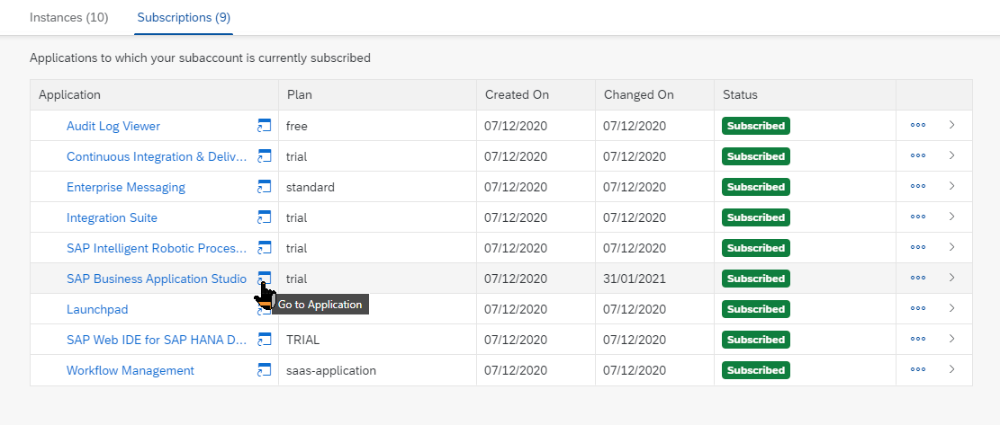

3. Choose **Create Dev Space**. Please **NOTE**: In the SAP BTP trial you are limited to only two Dev Spaces and only one can be active at a time. If you have performed other workshops, you might already have reached your maximum. In that case you might have to delete one of the other dev spaces in order to continue with this workshop.

    !

4. Enter **HANA** for your dev space name and choose **SAP HANA Native Application** as the kind of application you are creating.

    !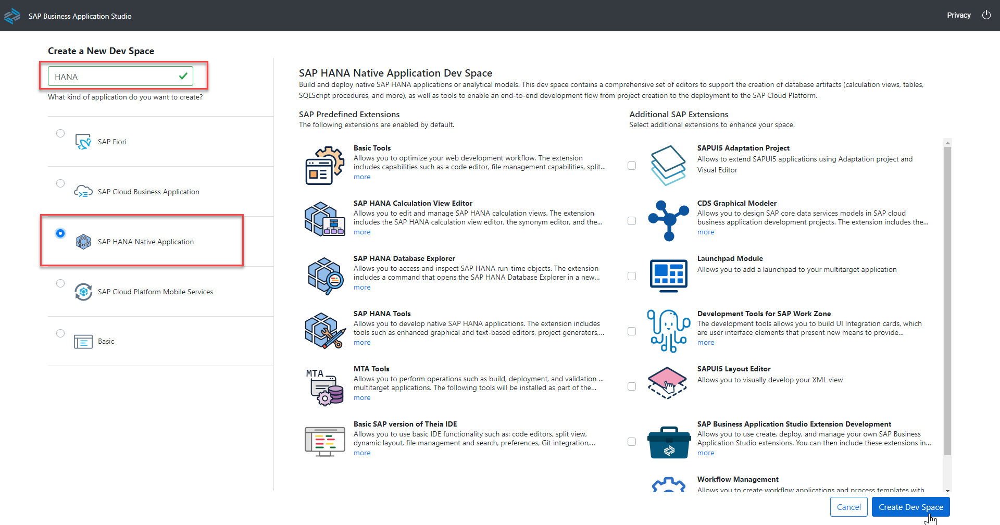

5. The Dev space will automatically be configured with the most common tools you need for the type of application you choose. However you can also choose additional, optional extensions.  

6. Once all selections are completed, press **Create Dev Space**

    !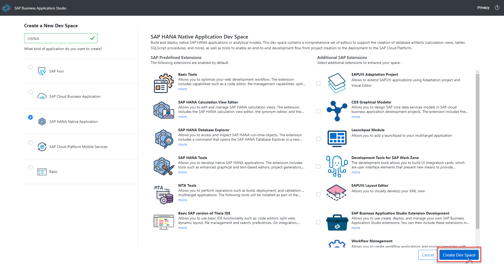

7. The Dev Space will then begin starting and the process will take a minute or so as your cloud environment is being created

    !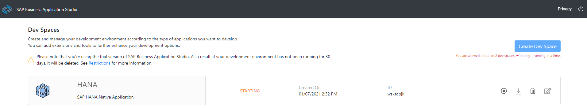

8. Once the Dev Space reaches the green status of **RUNNING**, you can click on the name of the Dev Space and it will load into the editor within your browser

    !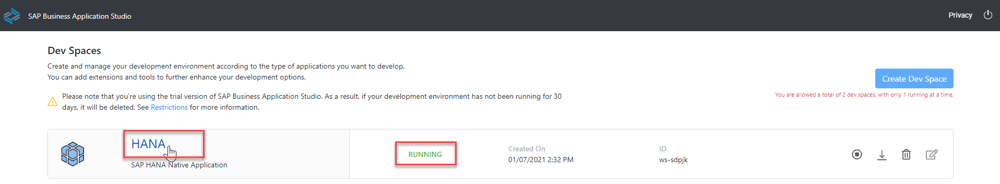

9. You'll be redirected to your newly created SAP Business Application Studio Dev Space. We recommend you bookmark this URL so it's easier for you to access this dev space of your SAP Business Application Studio in the future

    !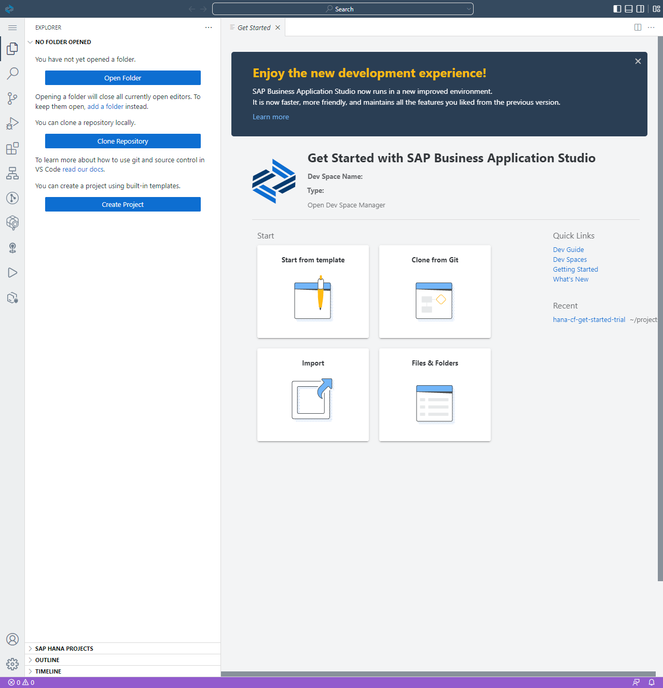

[DONE]
[ACCORDION-END]

[ACCORDION-BEGIN [Step 2: ](Configure dev space)]

[Video Link](https://www.youtube.com/watch?v=8rT-PEUg8Uw&t=526s) 

Before we create our SAP HANA project, we want to do a few more one-time configuration steps to prepare the Dev Space

1. In the left side of the Business Application Studio click on the Cloud Foundry targets icon

    !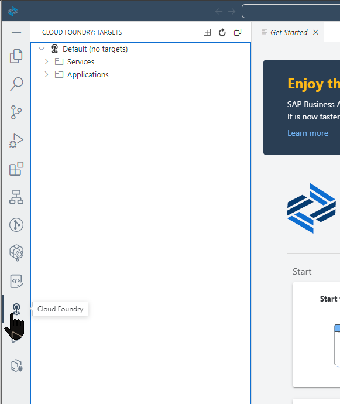

2. Now in the Cloud Foundry Targets window you can expand either Service or Applications and then click on the Logon icon to continue the configuration process

    !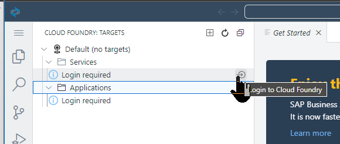

3. The command window will then open at the top of the SAP Business Application Studio. The first input will prompt you for the API endpoint

    !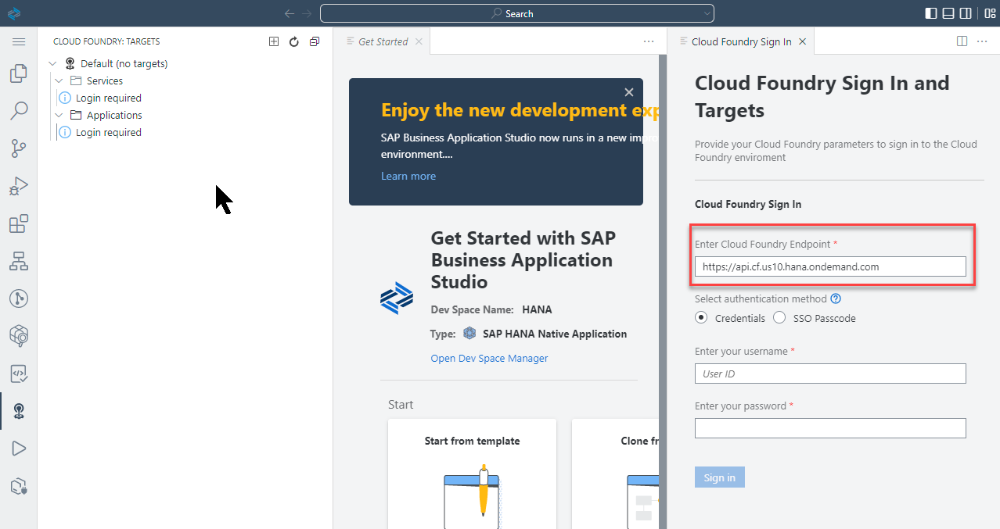

4. The default value proposed is likely the correct value, but if you need to confirm; the value can be found in the SAP BTP cockpit at the Subaccount level

    !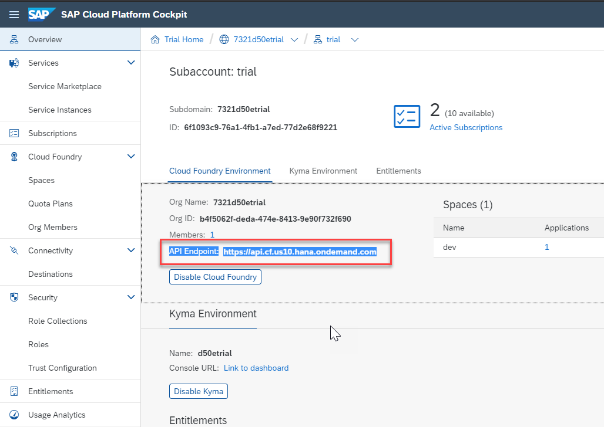

5. Press **Enter** to confirm your input of the API endpoint. The next input field will ask you for the email address you used to create your SAP BTP trial account

    !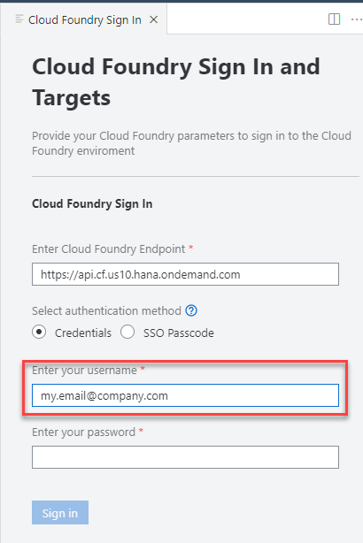

6. The next input will ask you for your SAP BTP trial account password

    !

7. The next input will ask you for your Organization. In most situations you will have a single choice. But like the API endpoint earlier, if you need to confirm the correct value it will be displayed in the top navigation of the SAP BTP cockpit

    !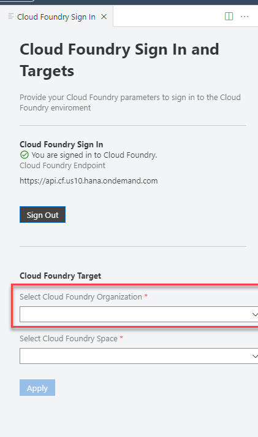

8. The final input will ask you for your Space. If you choose the endpoint API and Organization correctly, then you should have a single option of **dev**

    !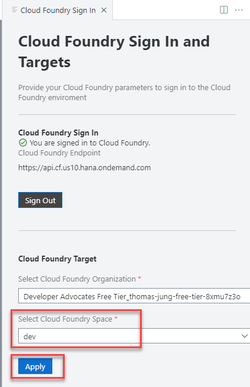

9. Upon completion of all the inputs, you should see that the Organization and Space have been set and you will see any service instances or application instances from the target space.

    !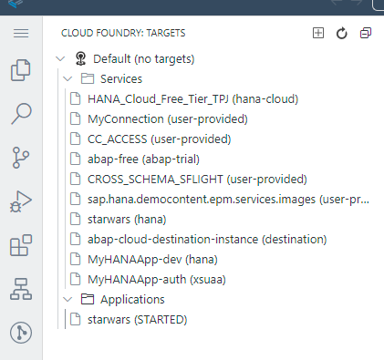

[VALIDATE_1]
[ACCORDION-END]

---

Your HANA instance should be running and you've created a Dev Space and configured it for your needs in the Business Application Studio. You are now ready to begin development.
