# Create a Live Connection Between SAP HANA Cloud and SAP Analytics Cloud
<!-- description --> Set up a live connection between your SAP HANA Cloud database and SAP Analytics Cloud, using two different types of authentication create the connection.

## Prerequisites
- You have access to a production environment of SAP HANA Cloud, SAP HANA database. Else, [register for a trial account of SAP HANA Cloud](https://www.sap.com/cmp/td/sap-hana-cloud-trial.html).
- You have access to a production environment of SAP Analytics Cloud. Else, [register for a trial account of SAP Analytics Cloud](https://www.sap.com/products/cloud-analytics/trial.html).
- You have a calculation view deployed to Cloud Foundry in the SAP HANA database in SAP HANA Cloud.

## You will learn
- How to set up a live connection between SAP HANA Cloud, SAP HANA database and SAP Analytics Cloud
- How to use user credentials method to authenticate users for a live connection
- How to use single sign-on method to authenticate users for a live connection

## Intro
In this tutorial, you will see how to setup a live connection between your SAP HANA Cloud, SAP HANA database and SAP Analytics Cloud. This connection gives SAP Analytics Cloud users access to data within HDI containers inside your SAP HANA Cloud, SAP HANA database. The HDI containers must have a calculation view inside, which determines which subsets of data are made available to SAP Analytics Cloud.

There are two approaches to authenticate users between SAP HANA Cloud, SAP HANA database and SAP Analytics Cloud: user credentials and single sign-on.

You have the option to select the instructions according to the type of authentication you wish to use.

---

### Set up live connection in SAP Analytics Cloud

Follow these steps:

1. Go to your SAP Analytics Cloud tenant and login.

2. On the homepage, click on the burger menu on the top left-hand side of the screen, then click on **Connection**.

3. On the Connection page, click the plus icon to add the new data source.

4. Expand **Connect to Live Data**. You can also filter your options by clicking on Cloud as your data source type.

    <!-- border -->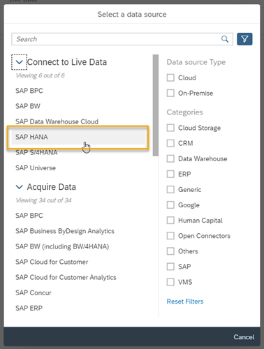

5. Click on **SAP HANA**.

6. Give the connection a name and a description.

7. Under Connection Type, select **SAP HANA Cloud**.

    <!-- border -->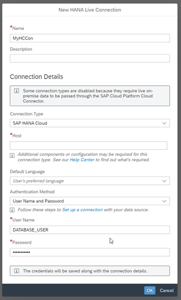

8. Go to the SAP BTP cockpit and access the SAP HANA Cloud Central to get the address of your instance's host. Click on the three dots icon on your instance's line, then click on **Copy**, and finally on **SQL Endpoint**.

9. Go back to SAP Analytics Cloud and paste the URL on the host. Please make sure to remove the port number (443) and the colon symbol.

In the next step, you can decide which authentication method to use after reading through each process.

### Select authentication method

> **For this step, select your preferred connection method by clicking on the options under the step title.**
>
> 

[OPTION BEGIN [Connect with user credentials]]

>This step assumes that you are familiar with SAP Business Technology Platform and have a space that contains an SAP HANA Cloud, SAP HANA database instance. If you would like to become more familiar with SAP HANA Cloud and provisioning instances, check out this [tutorial](hana-cloud-mission-trial-2).

This is the simplest method to create a live connection because you only need to use your credentials to SAP HANA Cloud, SAP HANA database within SAP Analytics Cloud.

> The SAP Analytics Cloud user must have admin privileges to add connections.

Continue with the following steps to complete setting up SAP Analytics Cloud:

1. Next, select **Username and Password** as the Authentication Method.

2. Insert the database username and password that has access to the calculation views within SAP HANA Cloud, SAP HANA database. Please keep in mind that the database user needs to have the authentication method of password, which can be setup in SAP HANA cockpit or when the user is created.

3. Click on **OK**. Your connection will be created.

[OPTION END]
[OPTION BEGIN [Single sign-on]]

> ### Prerequisites
>
> - SAP HANA Cloud, SAP HANA database admin privileges (DBADMIN user)
> - SAP Business Technology Platform Admin & Security Admin privileges
> -	SAP Business Technology Platform Org, Subaccount, Space, & SAP HANA Cloud, SAP HANA database instance running
> -	An HDI container with a calculation view deployed to Cloud Foundry
> - SAP Analytics Cloud admin privileges

With the single sign-on authentication method, you have to setup the single sign-on in SAP HANA Cloud, SAP HANA database while you set up the live connection in SAP Analytics Cloud.

> The SAP Analytics Cloud user must have admin privileges to add connections.

Continue with the following steps to complete setting up SAP Analytics Cloud:

1. Next, select **SAML Single Sign On** as the Authentication Method.

    <!-- border -->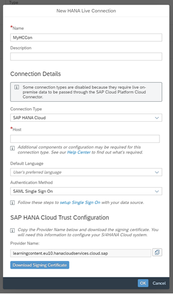

2. Click on the copy icon next to the provider name to copy this address, as you will need it soon.

3. Now click on **Download Signing Certificate**. This will download the certificate on your local machine.

4. Keep SAP Analytics Cloud open and **do not click** on OK to create the connection yet. Leave it as is for the moment.

[OPTION END]

### Set up SAP HANA Cloud, SAP HANA database to connect

[OPTION BEGIN [Connect with user credentials]]

Using user credentials as authentication method means that you do not have to change the setup of your SAP HANA Cloud for establishing a connection with SAC.

[OPTION END]

[OPTION BEGIN [Single sign-on]]

For now, we will switch to the SAP HANA cockpit, as you need to setup the single sign-on on the SAP HANA Cloud side. Please follow the steps below:

1.	Open the SAP HANA cockpit you use with your SAP HANA Cloud, SAP HANA database instance. Go to the SAP BTP cockpit  and, on your instance tile, click on **Open in SAP HANA cockpit**. Under Security and User Management, click on **Certificate Store**.

    <!-- border -->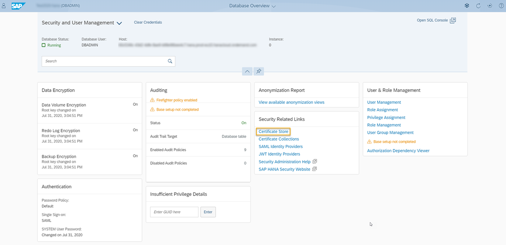

2.	Click on **Import**.

     <!-- border -->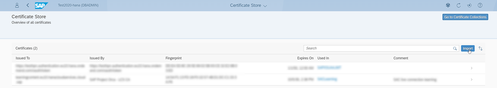

3.	Browse to the certificate file you downloaded from SAP Analytics Cloud and import it. You will see the certificate appear on this list once the import is completed. Now go to the **SAML Identity Providers** area.

    <!-- border -->

4.	Click on **Add Identity Provider**.

    <!-- border -->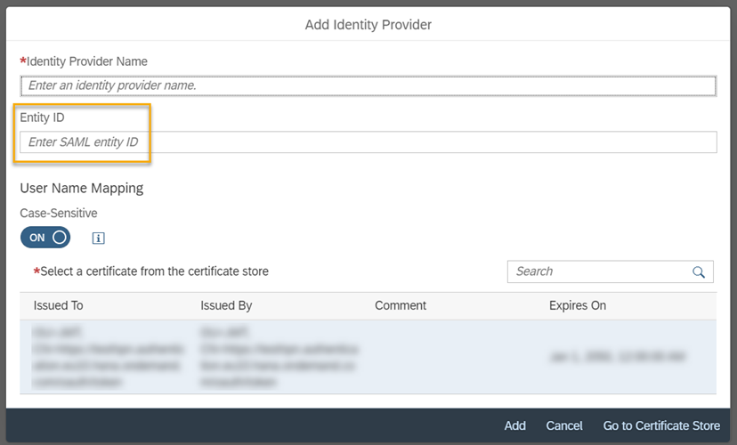

5.	Enter the **Identity Provider Name**. Under the **Entity ID**, please paste the provide name that you copied previously from SAP Analytics Cloud. On the bottom of the pop-up, select the certificate you uploaded previously. Click on **Add**. Your identity provider will be created.

6.	Now go to the **Certificate Collections** in SAP HANA cockpit.

    <!-- border -->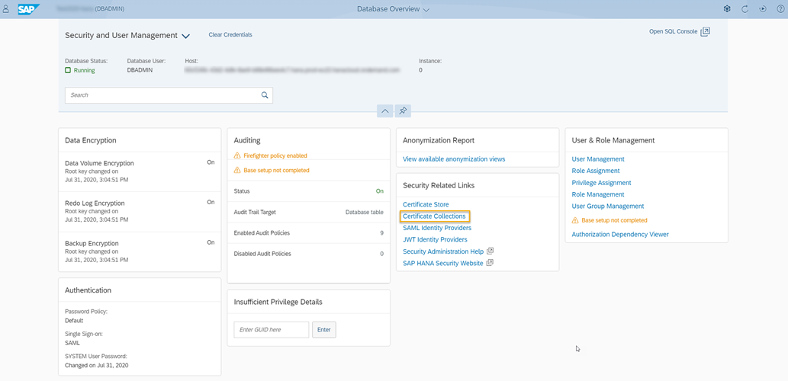

7.	Click on **Add Collection**.

    <!-- border -->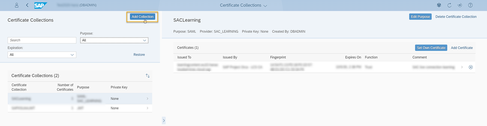

8.	Add a name and click on **OK**. Then click on **Add certificate**. Click on the checkbox next to the correct certificate and click on **OK**.

9.	Now click on the **Edit Purpose** on the top right-hand corner of the screen. Under Purpose, select **SAML**.

     <!-- border -->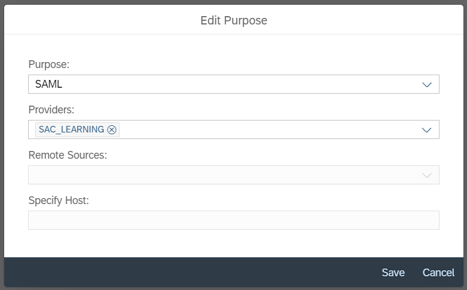

10.	Under Providers, select the **Identity Provider** you recently created. Click on **Save**. Click on **Yes** when you are prompted to confirm the change of purpose.

11.	Next you need to create a database user that is mapped to the SAP Analytics Cloud user creating the connection. Go to **User Management**.

    <!-- border -->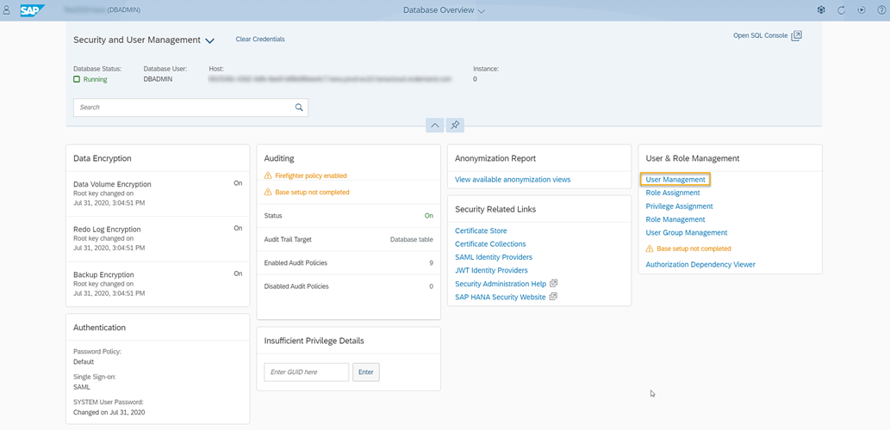

12.	On the left-hand panel, click on the plus icon to create a new user. Then click on **Create User**. Fill out the user creation form and make sure that you include the user email, which must exactly match the email of the user logged into SAP Analytics Cloud.

13.	Make sure as well to select **SAML** as the Authentication Mechanism. Click on **Add SAML Identity**. Select the **Identity Provider** you previously created and keep the automatic mapping by provider **OFF**.

14.	Under External Identity, fill out the user's email.

    <!-- border -->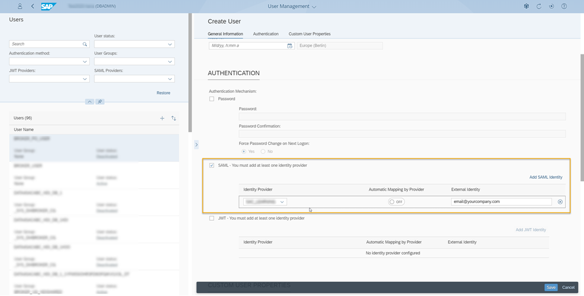

15.	Click on **Save**. Now click on **Assign Roles**. Make sure the user has the correct privileges to access your calculation views on SAP HANA Cloud.

You are done with the changes in SAP HANA cockpit.

**Back to SAP Analytics Cloud**

Now go back to SAP Analytics Cloud and click **OK** on screen to create your connection.

[OPTION END]

You can now use SAP Analytics Cloud to create data models and stories based on the data coming from the new connection. If you are interested to know more about SAP Analytics Cloud, [click here](https://community.sap.com/topics/cloud-analytics).

If you are interested in more details of SAP HANA Cloud, [you can explore other tutorials here](https://developers.sap.com/tutorial-navigator.html?tag=products:technology-platform/sap-hana-cloud-services/sap-hana-cloud).

You have completed the first tutorial of this tutorial group. In the next tutorial, you will learn how to connect a Jupyter Notebook with SAP HANA Cloud and use it for data visualization.

### Test yourself

---
