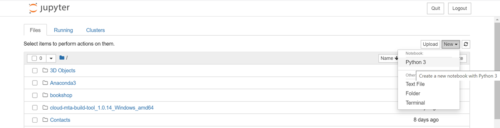
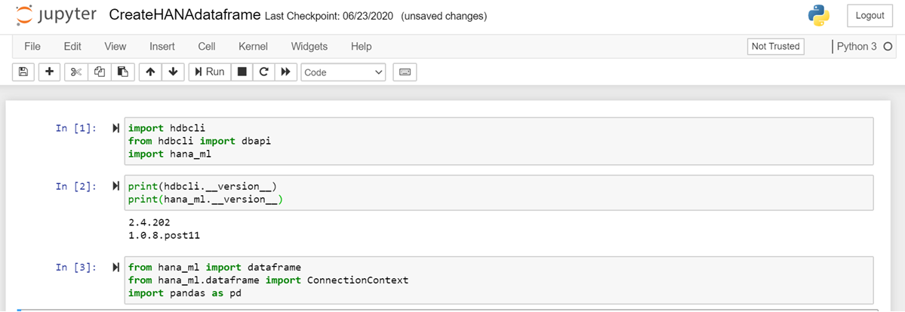
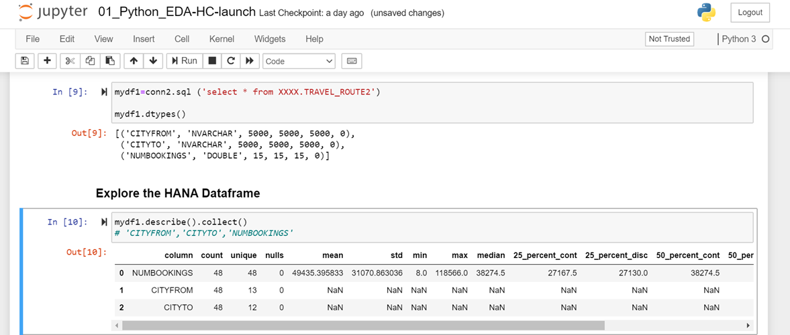
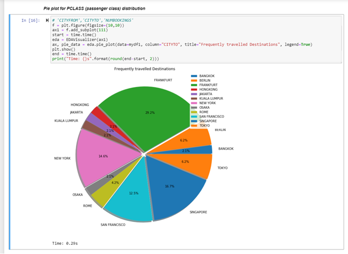

# Visualize Spatial Data in SAP HANA Cloud Using Jupyter Notebook
<!-- description --> Connect your Python script from Jupyter Notebook to SAP HANA Cloud, SAP HANA database, creating a visualization of spatial data in SAP HANA Cloud.

## Prerequisites
- Make sure that you have a **running** SAP HANA database instance in SAP HANA Cloud.
- Download the sample data "[travelroute.zip](https://github.com/SAP-samples/hana-cloud-learning/raw/main/Tutorial%20Connection%20Guide/Visualize%20Spatial%20Data%20in%20SAP%20HANA%20Cloud%20using%20Jupyter%20Notebook/travelroute.zip)" file from GitHub repository


## You will learn
- How to create a connection between Jupyter Notebook and database instance
- How to load CSV data into pandas data-frame
- How to create a table in database instance from pandas data-frame
- How to create data visualizations in SAP HANA Cloud, SAP HANA database


## Intro
There are many data driven applications that can be developed by using the SAP HANA database instance in SAP HANA Cloud with any other development environment, such as Jupyter Notebook.

In this example, we'll focus on creating a Python 3 file on Jupyter Notebook and connect it to our database instance. Once the connection is created, then we can add data to the instance or access data stored in the instance.

> By connecting Python files to your database instance, it also possible to use machine learning capabilities.


---

### Setup the environment for connection


Before you get started, make sure you have Anaconda installed on your system. You can install Anaconda from [here](https://docs.anaconda.com/anaconda/install/).

You can also use Jupyter Notebook from Visual Studio. If you prefer to use Visual Studio with Anaconda, you can install Visual Studio Code from [here](https://code.visualstudio.com/docs/setup/setup-overview).

To work with Jupyter Notebook, you must activate an Anaconda environment in VS Code. To select an environment, use the Python Select Interpreter command from the Command Palette (`Ctrl+Shift+P`). Once the appropriate environment is activated, you can create and open a Jupyter Notebook.

In this tutorial, you will see an example of Jupyter Notebook from Anaconda.


### Install packages 


To get started, install two packages, `hdbcli` and `hana_ml`. The `hdbcli` package is an SAP python driver, which allows a connection to SAP HANA Cloud from a Python application. The `hana_ml` package allows you to create an SAP HANA data-frame, as well as create a connection to your SAP HANA database instance in SAP HANA Cloud.

In addition to this `hana_ml` package can also be used to experience various machine learning capabilities. It is recommended to install `hdbcli` driver version 2.5 and the latest version of `hana_ml` driver. You can install both these packages from [here](https://pypi.org/).

<!-- border -->

Once the packages are installed, launch Jupyter Notebook.


### Import packages for creating a connection


1. Create a new Python 3 notebook.

    <!-- border -->

2. Import the packages using the following lines of code:

    ```Python
import hdbcli
from hdbcli import dbapi
import hana_ml
```

3. To check if the package has been imported correctly, you can check the package version. Just type the following:

    ```Python
print(hdbcli.__version__) #Use two underscores '_''_' for __version__
print(hana_ml.__version__) #Use two underscores '_''_' for __version__
```

4. Next, import the following packages required for this tutorial:

    ```Python
from hana_ml import dataframe
from hana_ml.dataframe import ConnectionContext
import pandas as pd
```

5. From the `hana_ml` package we import data-frame to create an SAP HANA data-frame and `ConnectionContect` to create a connection to the SAP HANA Cloud, SAP HANA database instance. We also import pandas to load data from CSV file into pandas data-frame.


### Create a connection to database instance


To create a connection to the SAP HANA Cloud, SAP HANA database instance, replace in the code below XXXX with your host, port, user and password information. Then run it.


```Python
conn2 = dataframe.ConnectionContext(address='XXXX', port='XXXX', user='XXXX', password='XXXX', encrypt='true', sslValidateCertificate='false')
```


### Load data from a csv into a pandas data-frame


You will be provided with a [zip file](https://github.com/SAP-samples/hana-cloud-learning/raw/main/Tutorial%20Connection%20Guide/Visualize%20Spatial%20Data%20in%20SAP%20HANA%20Cloud%20using%20Jupyter%20Notebook/travelroute.zip). From the zip file, extract `travelroute.csv` file on to your local machine. To load data from CSV file, run the following code and replace the XXXX with the path to the CSV file on your local machine.

```Python
flight_pd = pd.read_csv('XXXX', sep=';', header=0, names=["CITYFROM","CITYTO", "NUMBOOKINGS"])
```


### Create a database table from pandas data-frame


To create a table in the database from pandas data-frame, use the method below from the `hana_ml` package. Make sure to replace the XXXX with your schema name. This is part of the pandas data-frame created above and will generate an SAP HANA data-frame. The SAP HANA data-frame is simply a table hosted in SAP HANA database in SAP HANA Cloud that you can run a select statement from Jupyter notebook.

```Python
flight_hdf = dataframe.create_dataframe_from_pandas(conn2, flight_pd, 'TRAVEL_ROUTE2', 'XXXX', force=True, replace=True)
flight_hdf = conn2.table("TRAVEL_ROUTE2", schema="XXXX")
print(flight_hdf.select_statement)
```


### Access the table from Jupyter Notebook


1. Now that you have a table in your database, to access this table we execute the following lines of code. Replace the XXXX with your schema name and table with your table name.

    ```Python
flight_hdf=conn2.sql ('select * from XXXX.(table) ')
```

2. To check the data types of the table, you can execute the following command:

    ```Python
flight_hdf.dtypes()
```

3. To explore the SAP HANA data-frame, you can execute the following command:

    ```Python
flight_hdf.describe().collect()
```
    <!-- border -->


### Explore data visualizations


1. To add visualizations to your data, import `EDAVisualizer` using the command:

    ```Python
from hana_ml.visualizers.eda import EDAVisualizer
```

2. Next, import the following packages required for this tutorial.

    ```Python
from hana_ml import dataframe
import pandas as pd
import matplotlib.pyplot as plt
import time
import numpy as np
from hana_ml.algorithms.pal import stats
```

    <!-- border -->

3. Now we will create a pie chat using the database table to find the most frequently travelled destination. To create a pie chart using run the following:

    ```Python
f = plt.figure(figsize=(10,10))
ax1 = f.add_subplot(111)
start=time.time()
eda=EDAVisualizer(ax1)
ax, pie_data=eda.pie_plot(data = flight_hdf, column = "CITYTO", title="Frequently travelled Destinations",legend=True)
plt.show()
end=time.time()
print("Time: {}s".format(round(end-start),2))
```

4. As you can see, the most frequently travelled destination is Frankfurt.


You have completed the second tutorial of this tutorial group. In the next tutorial, you will learn how to connect SAP Business Warehouse to SAP HANA Cloud.

> ### Related topics
>
> Connecting to SAP HANA from anywhere: [Blog](https://blogs.sap.com/2018/11/06/connecting-to-sap-hana-service-from-anywhere/)
>
> Set Up Jupyter Notebook and Client Library for Document Classification: [Tutorial](cp-aibus-dc-setup)


### Test yourself


---
