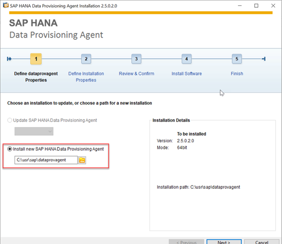
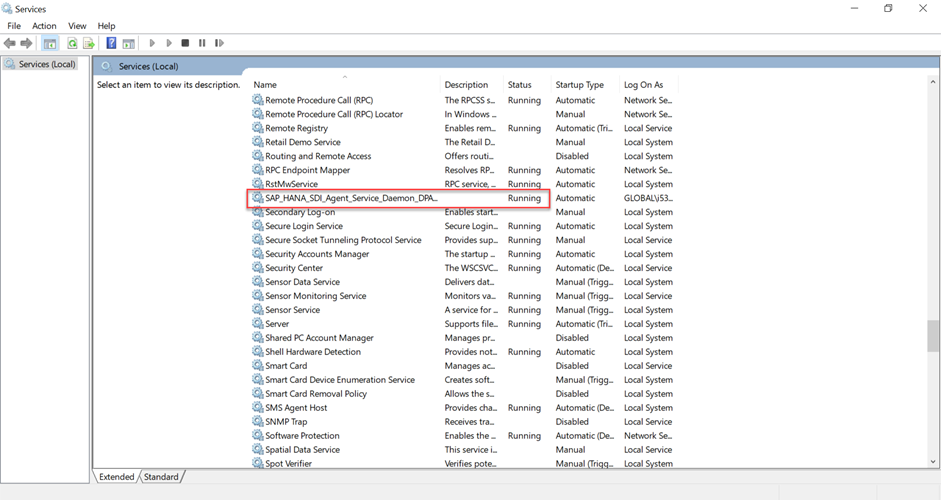
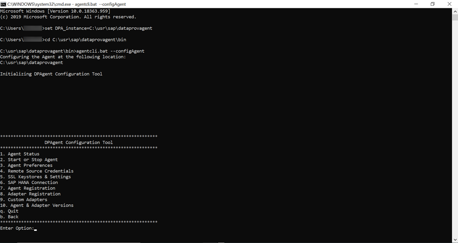
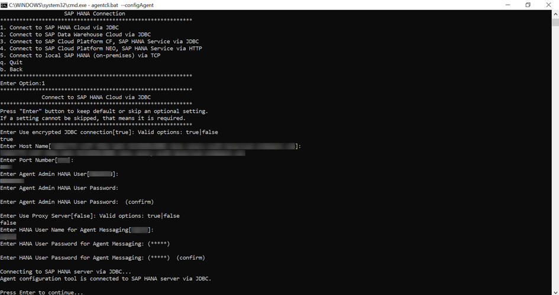
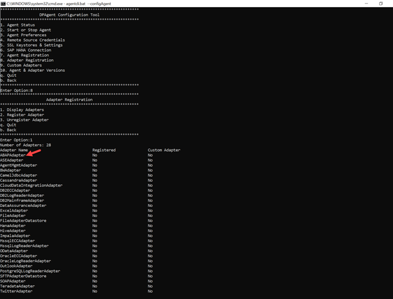
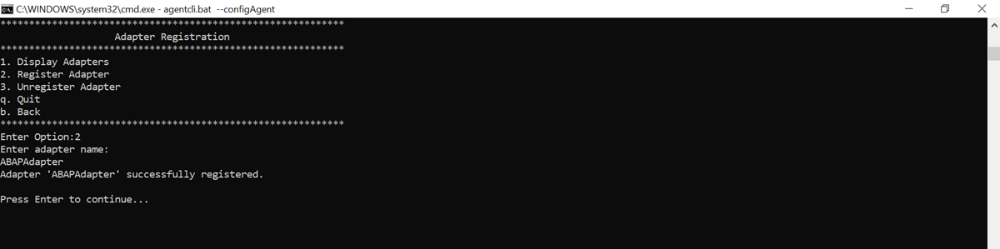
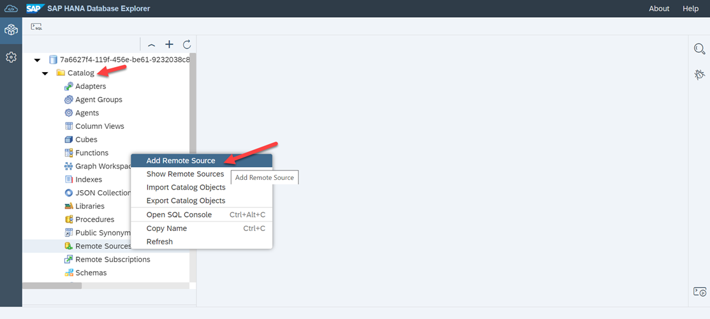
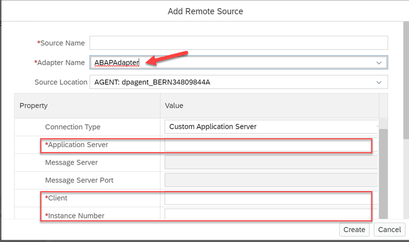

# Connect SAP Business Warehouse to SAP HANA Cloud
<!-- description --> Use the data you have in your SAP Business Warehouse (BW) system by connecting it with SAP HANA Cloud, SAP HANA database.

## Prerequisites
- Make sure you have a **running** SAP HANA database instance in SAP HANA Cloud.
- You must have a **running** SAP BW on SAP HANA or SAP BW/4HANA system.


## You will learn
- How to configure the Data Provisioning Agent for connecting SAP Business Warehouse with SAP HANA Cloud, SAP HANA database
- How to register the Data Provisioning Adapter with SAP HANA Cloud, SAP HANA database
- How to connect SAP Business Warehouse with SAP HANA Cloud, SAP HANA database


## Intro
If your company currently uses SAP Business Warehouse (BW) and you would like to connect it as a source to SAP HANA Cloud, SAP HANA database, you can follow the steps in this tutorial to do so. This will then allow you to use your SAP BW system.

You can use the ABAP Adapter to extract the data from the SAP BW. To do so, you will need to install and configure the Data Provisioning Agent.


---

### Install the Data Provisioning Agent


> ### Prerequisites
>
> - Before you begin installation, make sure you use the Administrator user or a user in the Administrators group.

The Data Provisioning Agent installation package is available in the component SAP HANA SDI (SAP HANA Smart Data Integration) on the [SAP Software Download Center](https://support.sap.com/en/my-support/software-downloads.html).

On the website [SAP Software Download Center](https://support.sap.com/en/my-support/software-downloads.html), the installation package is in the following location:

`SAP Software Download Center` > `Software Downloads` > `Installations & Upgrades` > `By Alphabetical Index (A-Z)` > `H` > `SAP HANA SDI` > `SAP HANA SDI 2.0` > `Comprised Software Component Versions` > `HANA DP AGENT 2.0`

1.	Select the latest release package and download it on your system and extract the zip file.

2.	Navigate to the directory where you extracted the software and open the file.

3.	Then right click on **hdbsetup.exe** and choose **Run as administrator**.

    <!-- border -->

4.	Choose **Install new SAP HANA Data Provisioning Agent** and specify the installation path.

5.	Then specify the unique agent name that identifies the agent instance and must be different from any names already used by other agent instances on the same host system.

6.	Next, specify the username (`<domain>\<username>`) and password to use for the agent service. The user that runs the agent service must have read and write access to the installation directory so configuration files can be updated.

    <!-- border -->

7.	To check if you agent is running, type **services** on the windows search bar and select **Run as Administrator**.


### Configure Data Provisioning Agent for connection 


> ### Prerequisites
>
> - You have allowed the IP address of the agent host system in the SAP HANA Cloud, SAP HANA database instance. In addition to this, your SAP HANA user must have the **AGENT ADMIN** system privilege for connecting to SAP HANA Cloud.


1.	Start the command prompt on your system and type the following command:

    ```Shell/Bash
set DPA_INSTANCE=C:\usr\sap\dataprovagent
```

    The command-line agent configuration tool requires the `DPA_INSTANCE` environment variable to be set to the installation root location.

2.	Then navigate to the `<DPAgent_root>\bin` folder.

3.	Start the command-line agent configuration tool by typing the following command:

    ```Shell/Bash
agentcli.bat –configAgent
```

    <!-- border -->

4.	Select **SAP HANA Connection**.

5.	Next, select **Connect to SAP HANA Cloud via JDBC** and specify true to use an encrypted connection over JDBC.

    <!-- border -->

6.	Then specify the **host name** and **port** for the SAP HANA Cloud instance.

7.	Specify the **Agent Admin SAP HANA User credentials** for SAP HANA Cloud as prompted.

8.	If HTTPS traffic from your agent host is routed through a proxy, specify any required proxy information as prompted.

9.	Then insert the credentials for the SAP HANA User for **Agent Messaging**. Also specify whether to create a new SAP HANA User for Agent Messaging.


### Register data provisioning adapter with SAP HANA Cloud


> ### Prerequisites
>
> - Your SAP HANA user must have the **ADAPTER ADMIN** system privilege to register the `ABAPAdapter` with SAP HANA Cloud, SAP HANA database.

1.	Start the Data Provisioning Agent Configuration tool and connect to SAP HANA (as described above).

2. Then go back and select **Adapter Registration**.


3.	Select **Display Adapters** to view the list of available adapters. Then note the ABAP Adapter name and go back.

    <!-- border -->

4.	Next select **Register Adapter** and type in the adapter name as `ABAPAdapter`.

    <!-- border -->

The selected adapter has been registered with SAP HANA and can be selected when creating a remote source.


### Connect to SAP BW on SAP HANA Cloud


1.	Launch the SAP HANA Database Explorer.

2.	Expand Catalog under your database and right click on **Remote Sources**. Select **Add Remote Source**.

    <!-- border -->

3.	Under Adapter Name select the `ABAPAdapter` that you registered above.

    <!-- border -->

4.	Then enter the **Application Server**, **Client**, and **Instance number** of your SAP BW on SAP HANA or SAP BW/4HANA system.

5.	Click on **Create**.


Using this ABAP Adapter, you can now access data from SAP BW. You can also virtualise some of the data available in your SAP BW system and use it directly from SAP HANA Cloud, SAP HANA database.

You have completed the third tutorial of this tutorial group. In the next tutorial, you will learn how to connect SAP Data Intelligence Cloud to SAP HANA Cloud, SAP HANA database.


### Test yourself


---
