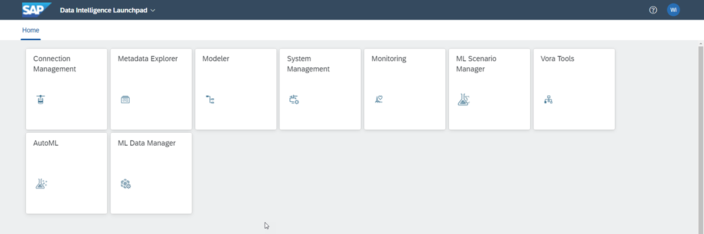
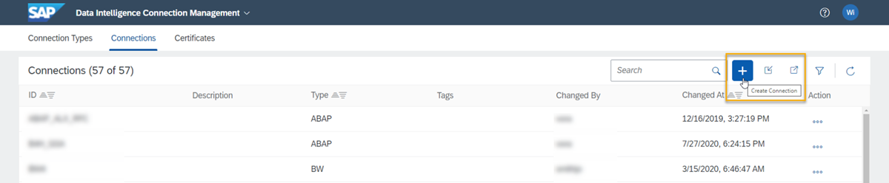
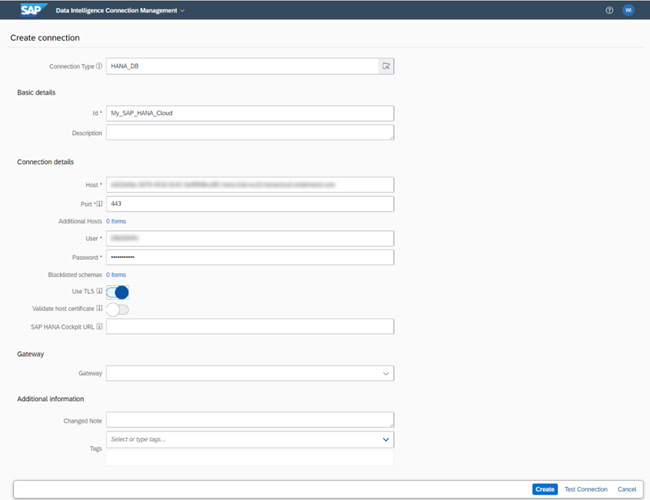

# Connect SAP Data Intelligence Cloud to SAP HANA Cloud
<!-- description --> Use the data you have in your SAP HANA database in SAP HANA Cloud, by connecting it with SAP Data Intelligence Cloud.

## Prerequisites
- Make sure you have a **running** SAP HANA database instance in SAP HANA Cloud.
- You have access to SAP Data Intelligence Cloud.

## You will learn
- How to create a new connection in SAP Data Intelligence Cloud
- How to explore various options for the connection
- How to publish data from the database for use in SAP Data Intelligence Cloud

## Intro
If you are currently using SAP Data Intelligence Cloud and want to use the SAP HANA Cloud, SAP HANA database as a source, you can follow the steps in this tutorial to do so.

---

### Create a new connection in SAP Data Intelligence Cloud

1.	Log in to SAP Data Intelligence Cloud.

2.	On the Data Intelligence launchpad, select **Connection Management**.

    <!-- border -->

3.	Click on the plus icon to create a new connection.

    <!-- border -->

### Select the connection type

Select the connection type as `HANA_DB`. This type of connection allows you to access tables and views on SAP HANA Cloud database.

<!-- border -->

In the section **Basic details** you need to create an ID, which acts as a unique identifier for your connection. You can also enter a description if required, however this is optional.

### Input database instance details

1.	Enter the **host and port details** of your SAP HANA Cloud, SAP HANA database instance. You can find this information on the SAP BTP cockpit, on the SAP HANA Cloud area, where your instance tiles can be seen.

2.	Also enter the **database username and password** for the instance.

### Explore optional settings for the connection

1.	If you want to hide certain schemas from other applications such as the browse and publication tasks in Metadata Explorer, then you can enter the names of these schemas under Blacklisted schemas.

2.	Next, enable **TLS**.

3.	Optionally, you can also enter the **SAP HANA cockpit URL**, which is the base URL for the direct access to the SAP HANA Cloud, SAP HANA database.

### Test and complete connection

1.	Now let's test if the connection is working correctly. On the right-hand corner, on the very bottom of the screen, click on **Test connection**.

2.	Then click on **Create** connection.

### Publish data for use with SAP Data Intelligence Cloud

Now, if you want to start exploring the data you have access to with this new connection, one option is to use the Metadata Explorer within SAP Data Intelligence Cloud.

1.	Click on **Metadata Explorer**.

2.	Then click on **Browse Connections**.

3.	Here you can either scroll down or use the search bar at the top to find the connection you have just created.

4.	Click on the tile for your connection.

5.	Select the schema you wish to work with.

6.	On the left-hand side panel, click on the plus icon under Publications. This will publish the data contained in this schema for use with SAP Data Intelligence Cloud.

And you are done! You can now use your data stored in SAP HANA Cloud, SAP HANA database on SAP Data Intelligence Cloud.

You have completed the third tutorial of this tutorial group. In the next tutorial, you will learn how to connect SAP ERP Central Component (ECC) to SAP HANA Cloud.

### Test yourself

---
