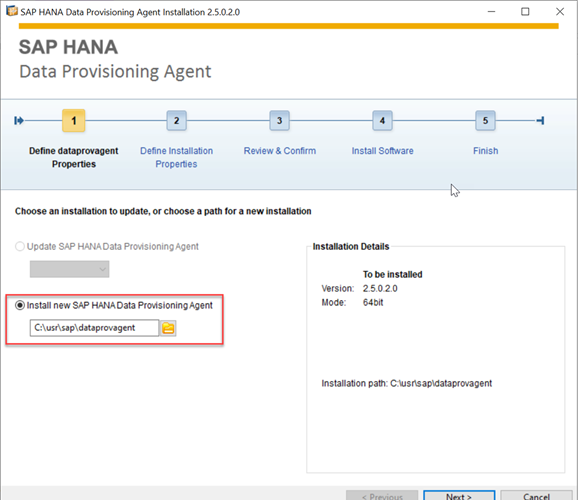
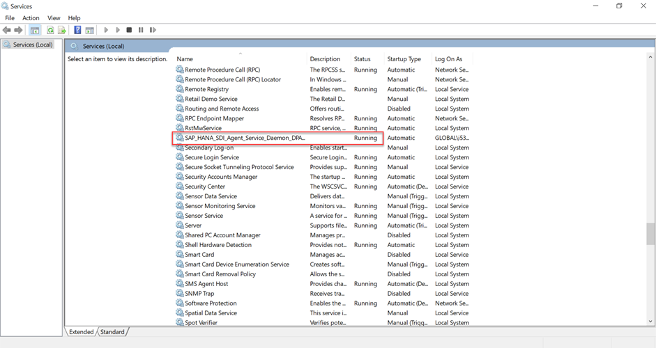
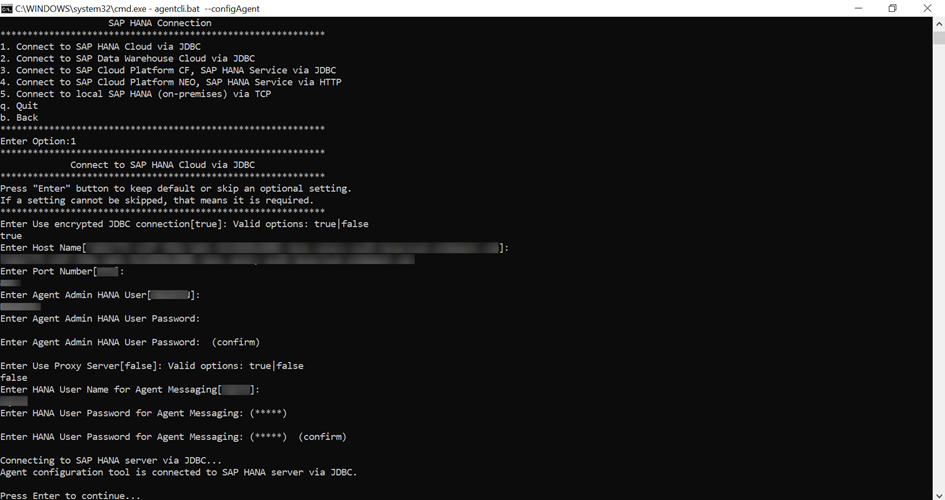
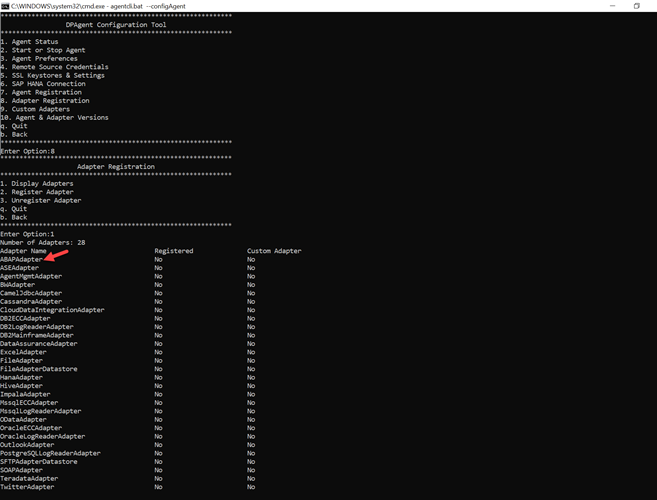
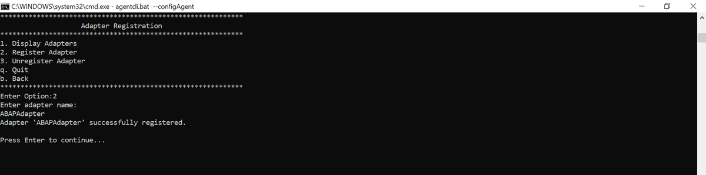
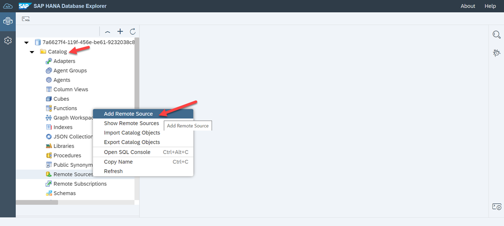
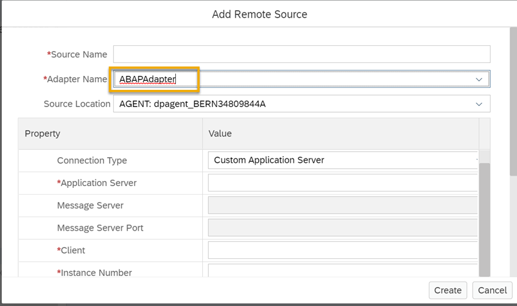

# Connect SAP ERP Central Component to SAP HANA Cloud
<!-- description --> Connect your SAP ERP Central Component (ECC) to SAP HANA Cloud, SAP HANA database.

## Prerequisites
- Make sure you have a **running** SAP HANA database instance in SAP HANA Cloud.
- You have access to SAP ERP Central Component (ECC)


## You will learn
- How to configure the Data Provisioning Agent for connecting SAP ERP Central Component with SAP HANA Cloud, SAP HANA database
- How to register the Data Provisioning Adapter with SAP HANA Cloud, SAP HANA database
- How to connect SAP ERP Central Component with SAP HANA Cloud, SAP HANA database


## Intro
SAP HANA Cloud, SAP HANA database offers a wide range of connection options and one of the main advantages of using it is the ability to access your data from multiple sources from one single source. If you are currently using an SAP ERP Central Component (ECC) system within your company, you can connect this system to SAP HANA Cloud, SAP HANA database and consume data coming from SAP ECC within SAP HANA Cloud.

You can virtualise the data that lives in SAP ERP from SAP HANA Cloud, SAP HANA database and then use these virtual objects in data models, as part of hybrid queries, and also make any subset of this data available to analytical tools, such as SAP Analytics Cloud.

Let's look at the details on how to create the connection.


---

### Install the Data Provisioning Agent 


> ### Prerequisites
>
> - Before you begin installation, make sure you use the administrator user or a user in the administrators group.

The Data Provisioning Agent installation package is available in the component SAP HANA SDI (SAP HANA smart data integration) on the SAP Software Download Center.

On the SAP Software Download Center, the installation package is in the following location:

`SAP Software Download Center` > `Software Downloads` > `Installations & Upgrades` > `By Alphabetical Index (A-Z)` > `H` > `SAP HANA SDI` > `SAP HANA SDI 2.0` > `Comprised Software Component Versions` > `HANA DP AGENT 2.0`

1.	Select the latest release package and download it on your system and extract the zip file.

2.	Navigate to the directory where you extracted the software and open the file.  

3.	Then right click on **hdbsetup.exe** and choose **Run as administrator**.

    <!-- border -->

4.	Choose **Install new SAP HANA Data Provisioning Agent** and specify the installation path.

5.	Then specify the unique agent name that identifies the agent instance and must be different from any names already used by other agent instances on the same host system.

6.	Next, specify the username (`<domain>\<username>`) and password to use for the agent service. The user that runs the agent service must have read and write access to the installation directory so configuration files can be updated.

    <!-- border -->

7.	To check if you agent is running, type services on the windows search bar and select **Run as Administrator**.


### Configure the Data Provisioning Agent for connecting to SAP HANA Cloud 


> ### Prerequisites
>
> - You have allowed the IP address of the agent host system in the SAP HANA Cloud instance. In addition to this, your SAP HANA user must have the **AGENT ADMIN** system privilege for connecting to SAP HANA Cloud, SAP HANA database.


1.	Start the command prompt on your system and type the following command:

    ```Shell/Bash
set DPA_INSTANCE=C:\usr\sap\dataprovagent
```

2.	The command-line agent configuration tool requires the `DPA_INSTANCE` environment variable to be set to the installation root location.

3.	Then navigate to the `<DPAgent_root>\bin` folder.

4.	Start the command-line agent configuration tool by typing the following command:

    ```Shell/Bash
agentcli.bat –configAgent
```
    <!-- border -->

5.	Select **SAP HANA Connection**.

6.	Next, select **Connect to SAP HANA Cloud via JDBC** and specify true to use an encrypted connection over JDBC.

7.	Then specify the **host name** and **port** for the SAP HANA Cloud, SAP HANA database instance.

8.	Specify the **Agent Admin SAP HANA User credentials** for SAP HANA Cloud, SAP HANA database as prompted.

9.	If HTTPS traffic from your agent host is routed through a proxy, specify any required proxy information as prompted.

10.	Then the credentials for the SAP HANA User for Agent Messaging. Also specify whether to create a new SAP HANA User for Agent Messaging.

    <!-- border -->


### Register the Data provisioning adapter with SAP HANA Cloud 


> ### Prerequisites
>
> - Your SAP HANA user must have the **ADAPTER ADMIN** system privilege to register the `ABAPAdapter` with SAP HANA Cloud, SAP HANA database.

1.	Start the Data Provisioning Agent Configuration tool and connect to SAP HANA (as described in the previous section).

2.	Then go back and select **Adapter Registration**.

3.	Select **Display adapter** to view the list of available adapters. Then note the ABAP Adapter name and go back.

    <!-- border -->


4.	Next select **Register Adapters** and type in the adapter name as `ABAPAdapter`.

    <!-- border -->

The selected adapter has been registered with SAP HANA and can be selected when creating a remote source.


### Create a remote source on the database


1.	Launch the **SAP HANA Database Explorer**.

2.	Expand **Catalog** under your database and right click on **Remote Sources**. Select **Add Remote Source**.

    <!-- border -->


3.	Under **Adapter Name** select the `ABAPAdapter` that you registered above.

    <!-- border -->

4.	Then enter the **Application Server**, **Client**, and **Instance number** of your SAP ERP system.


5.	Click on **Create**.

Now you've successfully added a new remote source and established a connection to you SAP ERP (ECC) system.


### Create virtual tables in the database


You can test this connection by creating virtual tables in SAP HANA Cloud, SAP HANA database that point to your SAP ERP system.

1.	In the **SAP HANA Database explorer**, expand **Catalog** in the panel on the left side of the screen.

2.	Then right click on **Remote Sources** and then click on **Show Remote Sources**. All available remote sources are listed in the lower left-hand corner.

3.	Select the remote source you just created. The ABAP adapter exposes the following:

    - Extractors
    - `abap` `cds`
    - `bw` extractors (if connected to a BW system)
    - `hana` information views
    - `bapi` procedures
    - `abap` procedures

4.	Next click on the item you want. Normally, you can do that graphically via the SAP HANA Database Explorer.

5.	Alternative for the last step is, you can map this in SQL as given below:

    ```SQL
create virtual table "TableName" at "RemoteSource"."<NULL>"."<NULL>"."ABAP_CDS.TableName";
select top 100 * from "SchemaName"."TableName";
```

6.	Replace `TableName` with a name that you want to give to your virtual table, `RemoteSource` with the name of your remote source and `SchemaName` with the name of the schema where the virtual table is created.

7.	Now you can either use a regular virtual table or you can use FVT.

8.	To create a snapshot replica, you can enter the following SQL statement:

    ```SQL
alter virtual table "RemoteSource"."TableName" add shared snapshot replica;
```

9.	To toggle federation, for that the `ABAP_CDS` will need to have some annotations and possibly a timestamp to get the deltas from previous load. You will need to do that in the ECC system itself.

Now that your connection is created, you can consume data coming from SAP ERP within SAP HANA Cloud, SAP HANA database.

You have completed the fifth tutorial of this tutorial group. In the next tutorial, you will learn how to connect SAP S/4HANA as data source to SAP HANA Cloud.


### Test yourself


---
