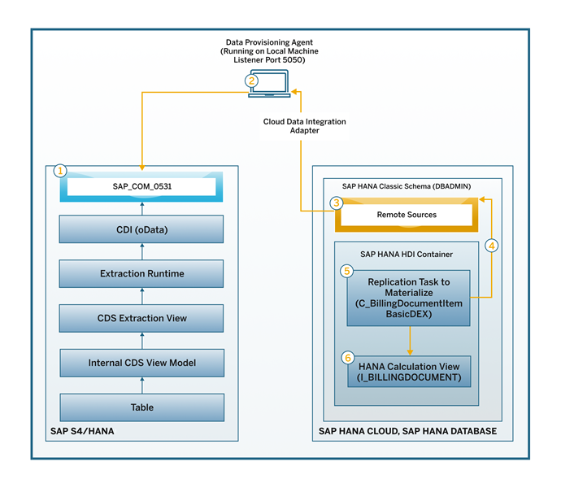

# Connect SAP S/4HANA as Data Source to SAP HANA Cloud
<!-- description --> Connect your SAP S/4HANA as a data source to SAP HANA Cloud, SAP HANA database.

## Prerequisites
- A **running** instance of SAP HANA database in SAP HANA Cloud.
- An SAP HANA Cloud user with the **AGENT ADMIN**, **ADAPTER ADMIN**, and **CREATE REMOTE SOURCE** system privileges to connect to the SAP HANA database in SAP HANA Cloud and register the DP Agent.
- The connection to the IP address of the agent host system in the SAP HANA Cloud, SAP HANA database instance is allowed.


## You will learn
- To prepare SAP S/4HANA system for connection
- To install the Data Provisioning Adapter (DPA)
- To configure the Data Provisioning Agent
- To register the Data Provisioning Agent and adapter
- To connect SAP S/4HANA as a remote source to SAP HANA Cloud, SAP HANA database


## Intro
In this article, you will see the detailed steps to connect an SAP S/4HANA system as a data source to SAP HANA Cloud, SAP HANA database. This will then allow you to access, transform and analyze data coming from SAP S/4HANA with all the power of SAP HANA Cloud - and you can choose if you prefer to replicate or virtualise this data.

These are the overall steps needed to create the connection:

1.	Prepare your SAP S/4HANA system to connect
2.	Install the Data Provisioning Adapter (DPA)
3.	Configure the Data Provisioning Agent to connect to SAP HANA Cloud, SAP HANA database
4.	Register the Data Provisioning Agent with SAP HANA Cloud
5.	Register the adapter
6.	Connect SAP S/4HANA to SAP HANA Cloud

<!-- border -->

---

### Create a Communication User in SAP S/4HANA


Before you create the connection, you need to set up a communication scenario to allow CDS views to be accessed using SAP HANA Cloud, SAP HANA database. There are three main steps to complete this set up. This is the first step. You can also get more information in our [technical documentation](https://help.sap.com/viewer/0f69f8fb28ac4bf48d2b57b9637e81fa/LATEST/en-US/4a006b43551d4cb5aed6399c0ace6b98.html).

1.	Search for and open the **Maintain Communication Users** app in SAP S/4HANA.

2.	Click on **New**.

3.	Enter the **Username**, **Description**, and **Password** for the new user.

4.	Click on **Create**.


### Create a Communication System in SAP S/4HANA


1.	Search for and open the **Communication System** app in SAP S/4HANA.

2.	Click on **New**.

3.	Enter the **System ID**, **System Name**, **Host Name** (can be same as System ID) and add **Inbound and Outbound Users**. The authentication method for Inbound/Outbound is Username and Password.

4.	Click on **Save**.


### Create a Communication Arrangement


1.	Search for and open the **Communication Arrangement** app in SAP S/4HANA.

2.	Click on **New**.

3.	Enter a name for your scenario and a unique Arrangement Name. Then click on **Create**.

4.	Add your **Communication System** that you created the previous step.

5.	Add your **Communication User** that you created in the first step into the Username for the Inbound Communication section. Set the Authentication Method to **User ID and Password**.

6.	Click on **Save**.

7.	Save the Cloud Data Integration Service URL/Service Interface, which looks like this example below:
    - `<Host>/<Service Path>` where in 'Service path' is `/sap/opu/odata4/sap/cdi/default/sap/cdi/0001/`
    - **Host**: cc3-715-api.wdf.sap.corp
    - **Service path**: `/sap/opu/odata4/sap/cdi/default/sap/cdi/0001/`


### Install the Data Provisioning Agent


> ### Prerequisites
>
> -  Before you begin installation, make sure you use the **Administrator** user or a user in the Administrators group in the machine where you are installing the DP Agent.

The Data Provisioning Agent installation package is available in the component SAP HANA SDI (SAP HANA smart data integration) on the [SAP Software Download Center](https://support.sap.com/en/my-support/software-downloads.html).

On the [SAP Software Download Center](https://support.sap.com/en/my-support/software-downloads.html), the installation package is in the following location:

`SAP Software Download Center` > `Software Downloads` > `Installations & Upgrades` > `By Alphabetical Index (A-Z)` > `H` > `SAP HANA SDI` > `SAP HANA SDI 2.0` > `Comprised Software Component Versions` > `HANA DP AGENT 2.0`

Then follow these steps:

1.	Select the latest release package and download it on your local machine. Extract the zip file.

2.	Navigate to the folder where you extracted the software.

3.	Then right-click on **hdbsetup.exe** and choose **Run as administrator**.

4.	Choose **Install new SAP HANA Data Provisioning Agent** and specify the installation path.

5.	Give your agent a unique agent name that identifies the agent instance and is different from any names already used by any other agent instances already installed on the same host system.

6.	Next, specify the username (`<domain>\<username>`) and password to use for the agent service. The user that runs the agent service must have read and write access to the installation directory, because of necessary updates to configuration files.

7.	Check whether your agent is running by typing `services` on the windows search bar and select **Run as Administrator**. Your DP Agent should be listed as one of the services.


### Configure the Data Provisioning Agent to connect to the database


1.	Start the command prompt on your system and type the following command:

    ```Shell/Bash
set DPA_INSTANCE=C:\usr\sap\dataprovagent
```
    The command-line agent configuration tool requires the `DPA_INSTANCE` environment variable to be set to the installation root location.

2.	Then navigate to the `<DPAgent_root>\bin` folder.

3.	Start the command-line agent configuration tool by typing the following command:

    ```Shell/Bash
agentcli.bat –configAgent
```

4.	Select **SAP HANA Connection**.

    <!-- border -->

5.	Next, select **Connect to SAP HANA Cloud via JDBC** and specify true to use an encrypted connection over JDBC.

6.	Then specify the **host name** and **port** for the SAP HANA Cloud instance. You can obtain that in the SAP HANA Cloud Central, by copying the SQL Endpoint to your HANA database instance.

7.	Specify the **Agent Admin HANA User credentials** for SAP HANA Cloud as prompted.

8.	If HTTPS traffic from your agent host is routed through a proxy, specify any required proxy information as prompted.

9.	Then insert the credentials for the HANA User for **Agent Messaging**. In this step, you can also choose to create a new user, if necessary.

10.	Restart your DP Agent.


### Register the Data Provisioning Agent with SAP HANA Cloud


1.	On your command prompt interface, now run the command:

    ```Shell/Bash
 <DPAgent_root>/bin/agentcli.sh –configAgent.
```

2.	Select the option **Register Agent**.

3.	Enter the **name of your agent**, which you just installed.

4.	Enter the **hostname** of the same DP Agent.


### Register the adapter


1.	Now it's time to register the adapter by selecting option 8, which is **Adapter Registration**.

2.	Select option **1. Display Adapters**. Copy the adapter name you want to register and go back to the previous menu.

3.	Select option **2. Register Adapter**.

4.	Paste the adapter you want to register in `Enter adapter name`.

Your adapter is now registered, and you can continue to SAP HANA Database Explorer to create the remote connection.


### Connect SAP S/4HANA to SAP HANA Cloud as a remote source


1.	Launch the **SAP HANA Database Explorer** from SAP HANA Cloud Central.

2.	Expand the **Catalog** under your database and right-click on **Remote Sources**.

3.	Select **Add Remote Source** and, under Adapter Name, select the name of the adapter that you registered above.

4.	Enter the **Source Location**, which is your DP Agent.

5.	In the Configurations setting fill out the necessary values below to connect to SAP S/4HANA:

    - Host (from CDI setup)
    - Protocol: HTTPS
    - Service path (from CDI setup)
    - Require CSRF Header: Yes
    - Authentication: Username and Password
    - Credentials Mode: Technical User
    - Credential (Username and Password): Communication user created in SAP S/4HANA in CDI setup.

6.	Click on **Create**.

And that is it for this connection. You will then be able to use the communication views from your SAP S/4HANA system within SAP HANA Cloud.

> Congratulations! You have completed this tutorial group and learned how to create connections to and from SAP HANA Cloud, SAP HANA database.
>
> If you are interested to learn about how to **use clients to query an SAP HANA database** in SAP HANA Cloud, we recommend [this tutorial mission](mission.hana-cloud-clients).
>
> Follow our tag in the [SAP Community](https://blogs.sap.com/tags/73554900100800002881/) to stay up-to-date on the latest updates and newest content! For more learning materials on SAP HANA Cloud, [click here](https://community.sap.com/topics/hana-cloud).


### Test yourself


---
